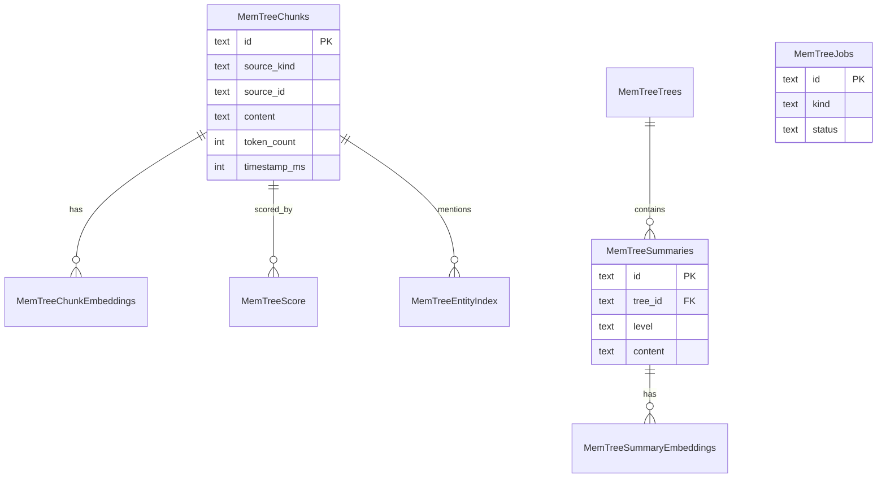

<details>
<summary>相关源文件</summary>

生成本页时使用的主要源文件：

- [src/openhuman/memory_store/chunks/store.rs](../../project-repos/openhuman/src/openhuman/memory_store/chunks/store.rs)
- [src/openhuman/memory_store/unified/init.rs](../../project-repos/openhuman/src/openhuman/memory_store/unified/init.rs)

</details>

# 内存存储与数据库模型

OpenHuman 在 workspace 下使用 **多个 SQLite 库**，而非单一 monolithic DB——按域隔离 WAL 争用与迁移。

## 主要数据库

| 路径 | 核心表 | 用途 |
|------|--------|------|
| `memory_tree/chunks.db` | `mem_tree_chunks`, `mem_tree_summaries`, `mem_tree_jobs`… | Memory Tree 主库 |
| unified memory | `memory_docs`, `vector_chunks`, `episodic_log`… | 对话/向量/图谱 |
| `subconscious/*.db` | `subconscious_tasks`, `subconscious_log`… | 后台任务 |
| `people/` migrations | `people`, `interactions` | 联系人图谱 |

## ER 图（Memory Tree 核心）



实体名 PascalCase 以兼容 Mermaid 8.x；列名保留下划线语义。

## 迁移策略

- `PRAGMA user_version` 驱动 one-shot 迁移（如 legacy embedding → sidecar、global/topic purge）
- `CREATE TABLE IF NOT EXISTS` + 惰性 `with_connection` 首次打开建库
- Foreign keys 在 **每连接** `open_connection()` 设置，而非只在 SCHEMA 一次

**Insight**：chunk upsert 按 `chunk.id` 幂等——同一 raw source 重 ingest 不产生 duplicate，这对 auto-fetch 重复拉取至关重要。

## 相关页面

- [Memory Tree 流水线](memory-tree-pipeline.md)
- [Subconscious 后台思考](subconscious-background.md)
- [代码质量与重构建议](quality-risks-refactor.md)

Sources: [src/openhuman/memory_store/chunks/store.rs:1-80](../../../project-repos/openhuman/src/openhuman/memory_store/chunks/store.rs#L1-L80)

<details class="source-snippets">
<summary>引用源码</summary>

<!-- source-snippets:start -->

#### `src/openhuman/memory_store/chunks/store.rs:1-80`

```rust
//! SQLite-backed persistence for ingested chunks (Phase 1 / issue #707).
//!
//! The store lives at `<workspace>/memory_tree/chunks.db`. Schema is applied
//! lazily on first access via `with_connection`, so the DB is created on
//! demand without an explicit migration step.
//!
//! Upsert semantics: writes are idempotent on `chunk.id` so re-ingesting the
//! same raw source yields no duplicates.
//!
//! ## Connection cache (#2206)
//!
//! `with_connection()` previously opened a new SQLite connection and re-ran
//! the full schema init (8 tables, 15+ indexes, 8+ migrations) on **every**
//! call. With 4 workers polling every 5 s this amounted to ~69K connection
//! opens/day, and a family of WAL/SHM cold-start I/O codes (1546
//! IOERR_TRUNCATE, 4618 IOERR_SHMOPEN, 4874 IOERR_SHMSIZE, 14 CANTOPEN)
//! flooded Sentry with ~19K events in 4 days.
//!
//! Fix: a process-level `ConnectionCache` keyed by DB path. Each entry holds
//! one `parking_lot::Mutex<Connection>` that is initialised once (schema +
//! migrations + legacy-embedding migration) and then reused for all subsequent
//! calls. A per-entry `CircuitBreaker` stops retrying after 3 consecutive
//! init failures for 30 s so a broken install does not busy-loop.

use anyhow::{Context, Result};
use chrono::{DateTime, TimeZone, Utc};
use rusqlite::{params, Connection, OptionalExtension, Transaction};
use std::collections::{HashMap, HashSet};
#[cfg(test)]
use std::sync::Arc;
use std::time::Duration;

use crate::openhuman::config::Config;
use crate::openhuman::memory::util::redact::{self, redact as redact_value};
use crate::openhuman::memory_store::chunks::types::{Chunk, Metadata, SourceKind, SourceRef};
use crate::openhuman::memory_store::content::StagedChunk;

const DB_DIR: &str = "memory_tree";
const DB_FILE: &str = "chunks.db";
const DEFAULT_LIST_LIMIT: usize = 100;
const MAX_LIST_LIMIT: usize = 10_000;
// 15s gives the busy-handler enough headroom that transient write-lock
// contention (4 job workers + scheduler + ingest producers all writing the
// same `memory_tree/chunks.db`) is absorbed inside rusqlite instead of
// surfacing as `SQLITE_BUSY` to callers. Workers still treat busy as a
// soft signal (see `memory_tree::jobs::worker`) so even if this is
// exceeded, the only effect is a one-poll backoff — but 15s is
// comfortably above realistic peer-write durations and shrinks the rate
// at which we have to fall back to that path. The previous 5s was tight
// enough on contended Windows hosts that we were observing avoidable
// busy returns (see OPENHUMAN-TAURI-BP).
const SQLITE_BUSY_TIMEOUT: Duration = Duration::from_secs(15);

/// Chunk lifecycle: freshly persisted, awaiting the async extract job.
pub const CHUNK_STATUS_PENDING_EXTRACTION: &str = "pending_extraction";
/// Chunk lifecycle: extract ran and the chunk passed admission.
pub const CHUNK_STATUS_ADMITTED: &str = "admitted";
/// Chunk lifecycle: appended to the L0 buffer of its source tree.
pub const CHUNK_STATUS_BUFFERED: &str = "buffered";
/// Chunk lifecycle: rolled into a sealed L1 summary.
pub const CHUNK_STATUS_SEALED: &str = "sealed";
/// Chunk lifecycle: rejected by the admission gate (too low signal).
pub const CHUNK_STATUS_DROPPED: &str = "dropped";

// `PRAGMA foreign_keys = ON` is intentionally NOT in SCHEMA — it is
// a connection-local pragma that resets to off on every new
// `Connection::open`. SCHEMA only runs once per DB path (first-init);
// applying foreign_keys here would leak FK-off into every later
// `with_connection()` call that hits the fast path. The pragma is
// set per-connection in `open_connection()` instead.

/// `PRAGMA user_version` value once the one-shot legacy→sidecar embedding
/// migration (#1574 §7) has run. `0` (fresh/legacy DB) triggers the copy on
/// next open; `>= 1` skips it. Bump only for a new one-shot data migration.
const TREE_EMBEDDING_MIGRATION_VERSION: i64 = 1;

/// `PRAGMA user_version` value once the global/topic-tree purge has run.
/// The global (time-axis) and topic (subject-axis) trees were removed; this
/// one-shot migration deletes their rows + on-disk summary folders. `< 2`
/// triggers the purge on next open; `>= 2` skips it.
```

<!-- source-snippets:end -->
</details>
