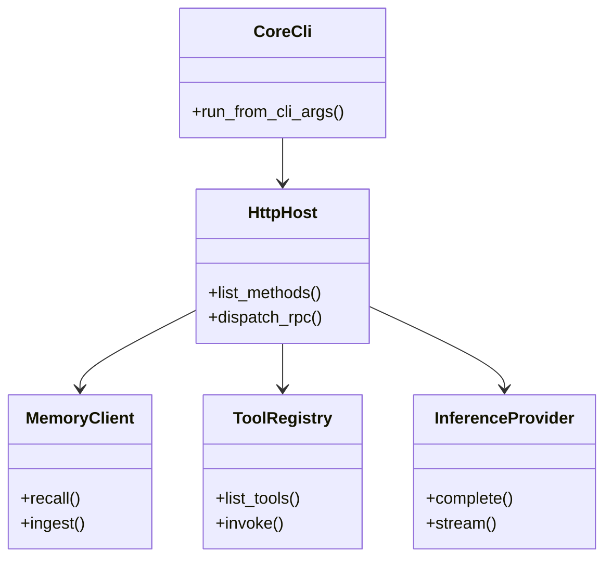

<details>
<summary>相关源文件</summary>

生成本页时使用的主要源文件：

- [src/lib.rs](../../project-repos/openhuman/src/lib.rs)
- [src/openhuman/mod.rs](../../project-repos/openhuman/src/openhuman/mod.rs)
- [Cargo.toml](../../project-repos/openhuman/Cargo.toml)

</details>

# Rust 核心运行时

`openhuman` crate（lib 名 `openhuman_core`）是 **唯一业务权威**。入口 `run_core_from_args` 初始化 keyring master key 后进入 `core::cli`。

## 领域地图（节选）

| 类别 | 模块 | 职责 |
|------|------|------|
| Agent | `agent`, `agent_orchestration`, `agent_tool_policy` | 循环、子 Agent、工具策略 |
| 记忆 | `memory_*`, `memory_tree`, `memory_store` | 分块、同步、检索、图谱 |
| 推理 | `inference`, `routing` | 本地 Ollama + 云端 provider |
| 集成 | `composio`, `integrations`, `memory_sync` | OAuth 工具与定时 sync |
| 通道 | `channels`, `webview_accounts` | 出站/入站消息 |
| 安全 | `security`, `cwd_jail`, `prompt_injection`, `keyring` | 策略、沙箱、密钥 |
| 平台 | `voice`, `meet_agent`, `screen_intelligence` | 语音与会议 Agent |

## 启动路径

1. `openhuman-core` 或 embedded server 启动 `http_host`
2. 加载 workspace config + migrations
3. 注册 RPC controllers、启动 cron/subconscious/memory workers
4. 暴露 health/metrics（Prometheus + OpenTelemetry 可选）

## 核心类结构（概念）



类名为架构抽象；实际 Rust 以 module + trait 组合为主，非 OOP 继承树。

## 相关页面

- [系统架构](system-architecture.md)
- [Agent 编排与循环](agent-orchestration.md)
- [Memory Tree 流水线](memory-tree-pipeline.md)

Sources: [src/lib.rs:1-80](../../../project-repos/openhuman/src/lib.rs#L1-L80)

<details class="source-snippets">
<summary>引用源码</summary>

<!-- source-snippets:start -->

#### `src/lib.rs:1-80`

```rust
//! Core library for the OpenHuman platform.
//!
//! This crate provides the central logic for the OpenHuman core binary, including:
//! - API and RPC handlers for external interactions.
//! - Core system services (CLI, configuration, monitoring).
//! - Domain-specific logic for the OpenHuman agent runtime.

pub mod api;
pub mod core;
pub mod openhuman;
pub mod rpc;

pub use openhuman::config::DaemonConfig;
pub use openhuman::memory_store::{MemoryClient, MemoryState};

/// Runs the core logic based on the provided command-line arguments.
///
/// This is the primary entry point for the OpenHuman binary, delegating to the
/// CLI module for argument parsing and command dispatch.
///
/// # Arguments
///
/// * `args` - A slice of strings containing the command-line arguments.
///
/// # Errors
///
/// Returns an error if command execution fails.
pub fn run_core_from_args(args: &[String]) -> anyhow::Result<()> {
    openhuman::service::apply_startup_restart_delay_from_env();
    openhuman::keyring::init_master_key();
    core::cli::run_from_cli_args(args)
}
```

<!-- source-snippets:end -->
</details>
