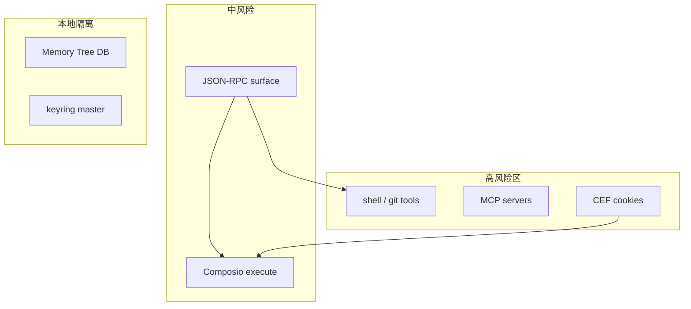

<details>
<summary>相关源文件</summary>

生成本页时使用的主要源文件：

- [docs/SECURITY_AUDIT.md](../../project-repos/openhuman/docs/SECURITY_AUDIT.md)
- [docs/PROMPT_INJECTION_GUARD.md](../../project-repos/openhuman/docs/PROMPT_INJECTION_GUARD.md)
- [src/openhuman/security](../../project-repos/openhuman/src/openhuman/security)
- [src/openhuman/keyring](../../project-repos/openhuman/src/openhuman/keyring)

</details>

# 安全与隐私边界

OpenHuman 的隐私叙事是 **本地 Memory Tree + vault 不上传**，但 **LLM/搜索/Composio 默认走订阅后端**——二次开发必须看清 trust boundary。

## 本地 vs 云端

| 数据 | 位置 |
|------|------|
| chunks.db、wiki md | 本机 workspace |
| 音频缓冲、Ollama 权重 | 本机 |
| LLM prompt/ completion | 默认云端代理 |
| Web search | 云端代理 |
| Composio OAuth token | 后端存储；core 不明文见 token |

## 攻击面（审计摘要）

- JSON-RPC Basic Auth / bearer — 依赖 token 不泄露到 env（桌面）  
- Prompt injection — Rust + 前端 `promptInjectionGuard`  
- Shell 工具 — `security` policy + `cwd_jail`  
- MCP — 第三方 server 等同用户安装代码  

## 风险模块图



**Insight**：keyring master key 在 `run_core_from_args` 最早初始化——任何 RPC 处理前加密域已就绪，避免 half-initialized 窗口写明文凭证。

## 相关页面

- [代码质量与重构建议](quality-risks-refactor.md)
- [工具系统与 MCP](tools-mcp.md)
- [JSON-RPC 通信桥](json-rpc-bridge.md)

Sources: [docs/SECURITY_AUDIT.md:1-80](../../../project-repos/openhuman/docs/SECURITY_AUDIT.md#L1-L80)

<details class="source-snippets">
<summary>引用源码</summary>

<!-- source-snippets:start -->

#### `docs/SECURITY_AUDIT.md:1-80`

````markdown
# OpenHuman Security Audit — Architecture & Data Flow Analysis

> Date: 2026-05-21
> Author: JAYcodr (fork analysis, not an official audit)
> Scope: Architecture overview, trust boundaries, credential flow, attack surface

---

## 1. System Overview

OpenHuman is a desktop AI assistant with a **Rust core** running in-process inside a Tauri desktop host, and a **React/TypeScript frontend**. Communication between frontend and core happens via two channels:

| Channel | Protocol | Auth |
|---|---|---|
| Primary | Socket.IO (bidirectional streaming) | Session-baked connection auth |
| Secondary | HTTP JSON-RPC | Basic Auth (`WWW-Authenticate` realm) |

**No sidecar binary** — core runs as a tokio task inside the Tauri process (`core_process.rs`).

---

## 2. Module Map

### Core (`src/openhuman/`) — 66 domains

| Category | Domains |
|---|---|
| Agent | `agent`, `agent_experience`, `agent_tool_policy` |
| Memory | `memory` (stm_recall, docs), `embeddings`, `learning`, `workspace` |
| Skills | `skills` (metadata-only), `mcp_client`, `mcp_clients`, `mcp_server`, `composio` |
| Channels | `channels` (dispatch), `telegram`, `discord`, `whatsapp_data`, `webview_accounts` |
| Infrastructure | `http_host`, `socket` (Socket.IO server), `runtime_node`, `runtime_python` |
| Business Logic | `billing`, `credentials`, `vault`, `encryption`, `notifications`, `webhooks`, `approval`, `cron`, `meet`, `meet_agent`, `team`, `threads`, `todos` |
| UI-adjacent | `accessibility`, `autocomplete`, `screen_intelligence`, `voice` |
| Other | `config`, `health`, `heartbeat`, `doctor`, `migration`, `update`, `security`, `prompt_injection` |

### Transport (`src/core/`)

| File | Role |
|---|---|
| `src/core/jsonrpc.rs` | JSON-RPC over HTTP, method dispatch |
| `src/core/socketio.rs` | Socket.IO server, `WebChannelEvent` struct for streaming |
| `src/core/auth.rs` | HTTP Basic Auth handler |
| `src/openhuman/http_host/rpc.rs` | JSON-RPC endpoint (`list()` function) |
| `src/openhuman/http_host/auth.rs` | `WWW-Authenticate` header, `unauthorized_response()` |

### Event Bus (`src/core/event_bus/`)

Typed pub/sub + in-process typed request/response:

```text
publish_global(DomainEvent)           → fire-and-forget broadcast
register_native_global(method, handler) → one-to-one typed dispatch
request_native_global(method, req)   → call and wait for response
```

**Domain events:** `agent`, `memory`, `channel`, `skill`, `tool`, `webhook`, `mcp_client`, `system`, `approval`, `cron`, `triage`

---

## 3. Credential & Token Flows

### Core RPC Auth

- HTTP JSON-RPC protected by **HTTP Basic Auth**
- Realm: `"OpenHuman Hosted Directory"`
- Per-launch bearer token, transported differently per deployment shape:
  - **Desktop / Tauri shell**: bearer is generated in `CoreProcessHandle::new()` and held in-memory as `CoreProcessHandle.rpc_token: Arc<String>`, then handed to the embedded server via an internal in-memory handle (`run_server_embedded_with_ready(rpc_token: Some(_))`). **Not** published to the process environment.
  - **Standalone CLI / Docker / cloud**: bearer is read from the `OPENHUMAN_CORE_TOKEN` env var (via `init_rpc_token`) or from the `{workspace}/core.token` file. This is the operator-supplied configuration surface for those deployments and is intentional.
- Frontend obtains bearer via `invoke('core_rpc_token')` Tauri command

### Stored Credentials

- `credentials` domain manages credential storage
- `encryption` domain handles at-rest encryption
- `auth-profiles.json` — auth data referenced by `settings.ai.apiKeysEncrypted` i18n key

### MCP Server Auth

- Composio API key stored via `settings.composio.apiKeyStoredPlaceholder`
````

<!-- source-snippets:end -->
</details>
