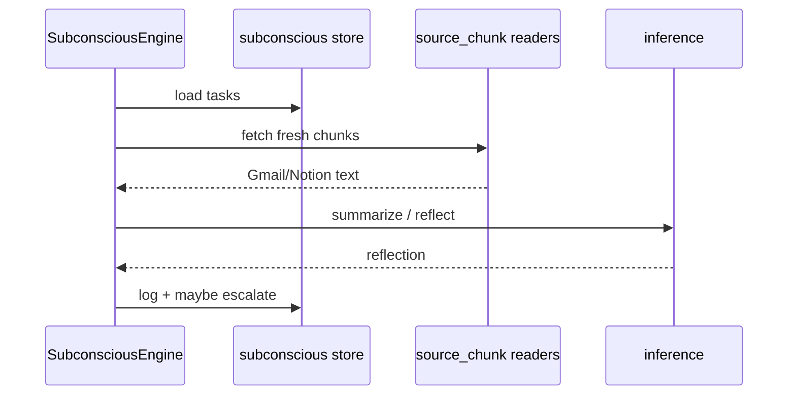

<details>
<summary>相关源文件</summary>

生成本页时使用的主要源文件：

- [src/openhuman/subconscious/mod.rs](../../project-repos/openhuman/src/openhuman/subconscious/mod.rs)
- [src/openhuman/subconscious/store.rs](../../project-repos/openhuman/src/openhuman/subconscious/store.rs)

</details>

# Subconscious 后台思考

Subconscious 是 **用户不输入时的后台认知引擎**：定时 tick、reflection、escalation，把 Gmail/Notion 等 source chunk 合成 situation report 供后续 Agent 使用。

## 数据表（节选）

- `subconscious_tasks` — 周期任务  
- `subconscious_log` — 决策日志  
- `subconscious_escalations` — 需用户Attention  
- `subconscious_reflections` — 反思条目  

`SubconsciousEngine` 与 cron/heartbeat 协同；E2E fixture 在 `tests/fixtures/subconscious/`。

## 时序：Background tick



**Insight**：与 Memory Tree auto-fetch 分工——Memory Tree 偏 **结构化长期记忆**，Subconscious 偏 **主动推理与 escalation**，避免把所有后台 LLM 都塞进 ingest pipeline。

## 相关页面

- [Memory Tree 流水线](memory-tree-pipeline.md)
- [Agent 编排与循环](agent-orchestration.md)
- [推理与模型路由](inference-routing.md)

Sources: [src/openhuman/subconscious/mod.rs:1-80](../../../project-repos/openhuman/src/openhuman/subconscious/mod.rs#L1-L80)

<details class="source-snippets">
<summary>引用源码</summary>

<!-- source-snippets:start -->

#### `src/openhuman/subconscious/mod.rs:1-80`

```rust
pub mod engine;
pub mod executor;
pub mod global;
pub mod prompt;
pub mod reflection;
pub mod reflection_store;
mod schemas;
pub mod situation_report;
pub mod source_chunk;
pub mod store;
pub mod types;

// Keep decision_log for potential future dedup queries against the log table.
pub mod decision_log;

#[cfg(test)]
mod integration_tests;

pub use engine::SubconsciousEngine;
pub use reflection::{Reflection, ReflectionKind, MAX_REFLECTIONS_PER_TICK};
pub use schemas::{
    all_controller_schemas as all_subconscious_controller_schemas,
    all_registered_controllers as all_subconscious_registered_controllers,
};
pub use source_chunk::SourceChunk;
pub use types::{
    Escalation, EscalationStatus, SubconsciousLogEntry, SubconsciousStatus, SubconsciousTask,
    TaskRecurrence, TaskSource, TickDecision, TickResult,
};
```

<!-- source-snippets:end -->
</details>
