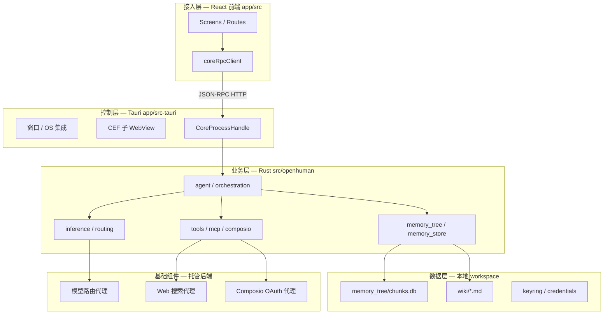
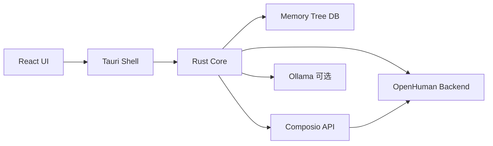

<details>
<summary>相关源文件</summary>

生成本页时使用的主要源文件：

- [gitbooks/developing/architecture/README.zh-CN.md](../../project-repos/openhuman/gitbooks/developing/architecture/README.zh-CN.md)
- [src/lib.rs](../../project-repos/openhuman/src/lib.rs)
- [docs/SECURITY_AUDIT.md](../../project-repos/openhuman/docs/SECURITY_AUDIT.md)

</details>

# 系统架构

OpenHuman 采用 **Presentation → Shell → Core** 三层架构，业务权威集中在 Rust `openhuman` crate，前端与 Tauri 只做交付与 IPC。

**关键设计决策**：核心不再以独立 sidecar 二进制为主路径——在桌面形态下，tokio 任务嵌入 Tauri 进程（见 `docs/SECURITY_AUDIT.md`），JSON-RPC 与 Socket.IO 双通道供 UI 流式交互。

## 分层架构图



上图把 **UI 无业务逻辑** 的约束可视化：`app/src` 通过 `coreRpcClient` 调用方法名如 `openhuman.*`、`inference.*`，不在前端复刻 Memory Tree 或工具执行。

## 架构模式判定

| 维度 | 判定 | 依据 |
|------|------|------|
| 整体 | 桌面单体 + 领域模块化 | 单 crate 100+ `pub mod`，非微服务 |
| UI | SPA + 路由 | React Router，Provider 注入 |
| 通信 | JSON-RPC 2.0 + Socket.IO | `src/core/jsonrpc.rs`, `socket` |
| 数据 | 本地 SQLite 多库 + 文件 vault | `chunks.db`, unified memory store |
| 扩展 | 工具注册表 + MCP + Skills 元数据 | `tool_registry`, `mcp_registry` |

## 模块职责边界

**Rust 核心**（`src/openhuman/mod.rs`）按领域拆分：配置/凭证、Agent 运行时、记忆子系统、通道、推理、安全沙箱（`cwd_jail`）、语音/Meet 等。`src/core/` 提供 CLI、JSON-RPC 分发、事件总线。

**Tauri 壳层**负责 sidecar/embedded core 生命周期、CEF 集成账号 WebView、系统托盘与更新。

**React 前端**（`app/src/`）组织 screens、channels 配置 UI、Memory Tree 浏览；`utils/tauriCommands/*` 按域封装 RPC。

## 优缺点与选型合理性

**优势**：本地记忆与 vault 降低隐私顾虑；Rust 统一工具/记忆/推理减少跨语言一致性 bug；TokenJuice 与 auto-fetch 针对 token 成本与冷启动两大痛点。

**局限**：默认依赖托管后端（模型/搜索/Composio），完全离线需自备密钥与基础设施；GPLv3 许可证影响商业闭源衍生；Early Beta 下 API 与 schema 仍在快速演进。

## 服务依赖调用图



边只连具体节点：Composio 默认经托管代理，direct mode 可直连 Composio API key。

## 相关页面

- [Tauri 桌面壳层](tauri-shell.md)
- [Rust 核心运行时](rust-core-runtime.md)
- [JSON-RPC 通信桥](json-rpc-bridge.md)
- [Memory Tree 流水线](memory-tree-pipeline.md)

Sources: [gitbooks/developing/architecture/README.zh-CN.md:1-80](../../../project-repos/openhuman/gitbooks/developing/architecture/README.zh-CN.md#L1-L80)

<details class="source-snippets">
<summary>引用源码</summary>

<!-- source-snippets:start -->

#### `gitbooks/developing/architecture/README.zh-CN.md:1-80`

````markdown
---
description: >-
  OpenHuman 系统的高层轮廓（桌面壳层、Rust 核心、Memory Tree、Agent 循环）。指向仓库中的深度开发者架构文档。
icon: code-branch
lang: zh-CN
---

# 架构

OpenHuman 基于 GNU GPL3 开源。本页是系统的高层轮廓；深度开发者架构参考位于仓库中的 [深度架构文档](../architecture.zh-CN.md)。

## 系统形态

OpenHuman 是一款 **React + Tauri v2 桌面应用**，搭配一个承担重活的 **Rust 核心**。

```text
┌──────────────────────────────────────────────────┐
│ Tauri 壳层 (app/src-tauri/)                      │
│ • 窗口管理、OS 集成、sidecar 生命周期            │
│ • 用于集成提供商的 CEF 子 WebView                │
└──────────────────────────────────────────────────┘
 │ JSON-RPC (HTTP) ↕
┌──────────────────────────────────────────────────┐
│ Rust 核心 (openhuman 二进制, src/)               │
│ • Memory Tree 流水线                             │
│ • 集成适配器 + 自动获取调度器                    │
│ • 提供商路由器（模型路由）                       │
│ • TokenJuice 压缩                              │
│ • 原生工具（搜索、获取、文件系统、git…）         │
│ • 语音（STT 输入、TTS 输出、Meet Agent）         │
└──────────────────────────────────────────────────┘
 │
┌──────────────────────────────────────────────────┐
│ React 前端 (app/src/)                            │
│ • 页面、导航                                     │
│ • 通过 coreRpcClient 与核心通信                  │
│ • 无业务逻辑 —— 仅负责展示                       │
└──────────────────────────────────────────────────┘
```

**逻辑归属：**

* **Rust 核心**。所有业务逻辑。Memory Tree、集成、模型路由、工具、语音。具有权威性。
* **Tauri 壳层**。窗口管理、进程生命周期、IPC。是交付载体，不是功能的栖身之所。
* **React 前端**。UI 与编排。通过 JSON-RPC 调用核心。

## 数据流

1. **连接**。通过 OAuth 接入[集成](../../features/integrations/README.zh-CN.md)。后端保存 token；核心永远不会以明文形式看到它。
2. **自动获取**。每二十分钟，[调度器](../../features/obsidian-wiki/auto-fetch.zh-CN.md)会遍历每个活跃连接，并要求每个原生提供商进行同步。
3. **规范化**。提供商输出（邮件页面、GitHub diff、Slack 频道转储）被归一化为带来源标签的 Markdown。
4. **分块**。Markdown 被拆分为 ≤3k token 的确定性块。
5. **存储**。块存入 SQLite (`<workspace>/memory_tree/chunks.db`)，并以 `.md` 文件形式存入 `<workspace>/wiki/`。
6. **评分**。后台工作线程运行嵌入、实体提取、热度评分。
7. **摘要**。从块池中构建并刷新来源 / 主题 / 全局摘要树。
8. **检索**。当你提问时，Agent 查询 Memory Tree（搜索 / 钻取 / 主题 / 全局 / 获取）。
9. **压缩**。工具输出和大型源数据在进入 LLM 上下文前经过 [TokenJuice](../../features/token-compression.zh-CN.md) 处理。
10. **路由**。[路由器](../../features/model-routing/) 根据任务提示选择合适的提供商 + 模型。

## 隐私边界

留在你机器上的数据：

* Memory Tree SQLite 数据库。
* Obsidian Markdown 仓库。
* 音频捕获缓冲区和任何本地模型状态。

经过 OpenHuman 后端的数据（在一个订阅下）：

* LLM 调用（模型提供商）。
* 网页搜索智能体。
* 集成 OAuth 和工具智能体。
* TTS 流。

完整图景请参阅 [隐私与安全](../../features/privacy-and-security.zh-CN.md)。

## 开源

* **仓库：** [github.com/tinyhumansai/openhuman](https://github.com/tinyhumansai/openhuman)。GNU GPL3。
* 欢迎提交 **Issue 和 PR**。项目处于早期测试阶段。
````

<!-- source-snippets:end -->
</details>
