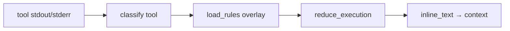

<details>
<summary>相关源文件</summary>

生成本页时使用的主要源文件：

- [src/openhuman/tokenjuice/mod.rs](../../project-repos/openhuman/src/openhuman/tokenjuice/mod.rs)
- [gitbooks/features/token-compression.md](../../project-repos/openhuman/gitbooks/features/token-compression.md)

</details>

# TokenJuice 压缩

TokenJuice 是 **工具输出进入 LLM 前的 compaction 引擎**（Rust 移植自 vincentkoc/tokenjuice）。

## 三层规则叠加

1. **Builtin** — `include_str!` 嵌入 JSON 规则  
2. **User** — `~/.config/tokenjuice/rules/`  
3. **Project** — `.tokenjuice/rules/`（cwd 相对）  

同 `id` 规则高优先级覆盖低优先级。

## 处理管线



`compact_tool_output` 在 agent loop 调用，统计 `CompactionStats` 可观测节省比例。HTML→Markdown、URL 缩短等对 scrape/email 类工具尤为关键（Cargo.toml 注释：弃用 html2md 因 10KB 邮件 HTML 峰值堆 ~894MB）。

**Insight**：CJK/emoji 按 grapheme 保留——压缩不是简单截断字节，避免多语言用户上下文被 silently 破坏。

## 相关页面

- [Memory Tree 流水线](memory-tree-pipeline.md)
- [Agent 编排与循环](agent-orchestration.md)
- [推理与模型路由](inference-routing.md)

Sources: [src/openhuman/tokenjuice/mod.rs:1-80](../../../project-repos/openhuman/src/openhuman/tokenjuice/mod.rs#L1-L80)

<details class="source-snippets">
<summary>引用源码</summary>

<!-- source-snippets:start -->

#### `src/openhuman/tokenjuice/mod.rs:1-80`

````rust
//! # TokenJuice — terminal-output compaction engine
//!
//! Rust port of [vincentkoc/tokenjuice](https://github.com/vincentkoc/tokenjuice).
//!
//! Compacts verbose tool output (git, npm, cargo, docker, …) using
//! JSON-configured rules before it enters an LLM context window.
//!
//! ## Quick start
//!
//! ```rust
//! use openhuman_core::openhuman::tokenjuice::{
//!     reduce::reduce_execution_with_rules,
//!     rules::load_builtin_rules,
//!     types::{ReduceOptions, ToolExecutionInput},
//! };
//!
//! let rules = load_builtin_rules();
//! let input = ToolExecutionInput {
//!     tool_name: "bash".to_owned(),
//!     argv: Some(vec!["git".to_owned(), "status".to_owned()]),
//!     stdout: Some("On branch main\n\tmodified:   src/lib.rs\n".to_owned()),
//!     ..Default::default()
//! };
//! let result = reduce_execution_with_rules(input, &rules, &ReduceOptions::default());
//! println!("{}", result.inline_text);
//! // → "M: src/lib.rs"
//! ```
//!
//! ## Scope (v1 — library only)
//!
//! This module is purely a library.  It has no JSON-RPC surface, no CLI, and
//! no artifact store.  Those surfaces can be layered on later when a caller
//! inside `openhuman` needs them.
//!
//! ## Three-layer rule overlay
//!
//! Rules are loaded from three sources in ascending priority order:
//! 1. **Builtin** — vendored JSON files embedded via `include_str!`.
//! 2. **User** — `~/.config/tokenjuice/rules/` (loaded from disk).
//! 3. **Project** — `.tokenjuice/rules/` relative to `cwd` (loaded from disk).
//!
//! When two layers define the same rule `id`, the higher-priority layer wins.

pub mod classify;
pub mod reduce;
pub mod rules;
pub mod text;
pub mod tool_integration;
pub mod types;

#[cfg(test)]
#[path = "text_tests.rs"]
mod text_tests;

pub use reduce::reduce_execution_with_rules;
pub use rules::{load_builtin_rules, load_rules, LoadRuleOptions};
pub use tool_integration::{compact_tool_output, CompactionStats};
pub use types::{CompactResult, ReduceOptions, ToolExecutionInput};
````

<!-- source-snippets:end -->
</details>
