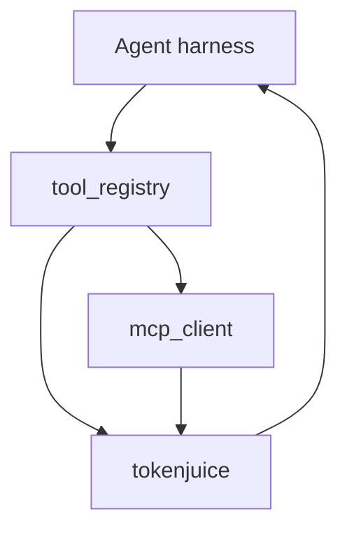

<details>
<summary>相关源文件</summary>

生成本页时使用的主要源文件：

- [src/openhuman/tool_registry/ops.rs](../../project-repos/openhuman/src/openhuman/tool_registry/ops.rs)
- [src/openhuman/mcp_registry](../../project-repos/openhuman/src/openhuman/mcp_registry)
- [docs/MCP_SETUP_AGENT.md](../../project-repos/openhuman/docs/MCP_SETUP_AGENT.md)

</details>

# 工具系统与 MCP

工具面由 **tool_registry**（内置 JsonRpc 工具）+ **MCP client/registry**（用户安装的服务器）+ **Composio**（SaaS 集成）三层组成。

## 工具注册

`ToolRegistryTransport::JsonRpc` 标记可通过 core RPC 调度的内置工具：web_search、filesystem、git、lint 等。`list_tools` 过滤 transport 供 Agent harness 构建 tool schema。

## MCP 架构

| 组件 | 职责 |
|------|------|
| `mcp_registry` |  catalog、安装态 |
| `mcp_client` | stdio/SSE 连接 |
| `mcp_server` | OpenHuman 对外暴露 MCP |
| UI `McpCatalogBrowser` | 用户安装向导 |

前端 `components/channels/mcp/*` 与 E2E `mcp_setup_e2e` 覆盖安装流。

## 工具调用数据流



**Insight**：`cwd_jail` + Landlock/bubblewrap（feature flag）限制 shell 工具可见目录——工具能力越大，沙箱越不能省。

## 相关页面

- [Agent 编排与循环](agent-orchestration.md)
- [集成与 Composio](integrations-composio.md)
- [安全与隐私边界](security-privacy.md)

Sources: [src/openhuman/tool_registry/ops.rs:1-80](../../../project-repos/openhuman/src/openhuman/tool_registry/ops.rs#L1-L80)

<details class="source-snippets">
<summary>引用源码</summary>

<!-- source-snippets:start -->

#### `src/openhuman/tool_registry/ops.rs:1-80`

```rust
use std::collections::{BTreeMap, BTreeSet};

use serde_json::{json, Map, Value};

use crate::core::all;
use crate::core::{ControllerSchema, FieldSchema, TypeSchema};
use crate::openhuman::config::Config;
use crate::openhuman::mcp_server::McpToolSpec;
use crate::openhuman::memory_store::chunks::store as chunk_store;
use crate::rpc::RpcOutcome;

use super::providers::capability_provider_diagnostics;
use super::types::{
    McpAllowlistDiagnostics, McpServerAllowlistSummary, McpWriteAuditHealth, ToolPolicyDiagnostics,
    ToolPolicyPosture, ToolRegistryEntry, ToolRegistryHealth, ToolRegistryList,
    ToolRegistryTransport,
};

const REGISTRY_ENTRY_VERSION: &str = env!("CARGO_PKG_VERSION");
const POLICY_SURFACES: &[&str] = &[
    "security.policy_info",
    "approval.list_pending",
    "approval.list_recent_decisions",
    "approval.decide",
    "tool_registry.list",
    "tool_registry.get",
    "tool_registry.diagnostics",
];

/// Return the current read-only tool registry snapshot.
pub fn list_tools() -> RpcOutcome<ToolRegistryList> {
    let tools = registry_entries();
    log::debug!(
        "[tool_registry] list_tools completed entries={}",
        tools.len()
    );
    RpcOutcome::new(ToolRegistryList { tools }, vec![])
}

/// Return redacted diagnostics for policy/tool visibility reviews.
pub async fn diagnostics() -> Result<RpcOutcome<ToolPolicyDiagnostics>, String> {
    log::debug!("[tool_registry] diagnostics loading_config");
    let config = Config::load_or_init().await.map_err(|err| {
        log::warn!("[tool_registry] diagnostics config_load_failed error={err}");
        format!("failed to load config for tool registry diagnostics: {err}")
    })?;
    Ok(diagnostics_for_config(&config))
}

/// Return redacted diagnostics using a specific config snapshot.
pub fn diagnostics_for_config(config: &Config) -> RpcOutcome<ToolPolicyDiagnostics> {
    log::debug!("[tool_registry] diagnostics_for_config start");

    let tools = registry_entries();
    let total_tools = tools.len();
    let enabled_tools = tools.iter().filter(|entry| entry.enabled).count();
    let mcp_stdio_tools = tools
        .iter()
        .filter(|entry| entry.transport == ToolRegistryTransport::McpStdio)
        .count();
    let json_rpc_tools = tools
        .iter()
        .filter(|entry| entry.transport == ToolRegistryTransport::JsonRpc)
        .count();
    let possible_write_surfaces = tools
        .iter()
        .filter(|entry| looks_write_capable(&entry.tool_id))
        .map(|entry| entry.tool_id.clone())
        .collect::<Vec<_>>();
    let policy_surfaces = policy_surface_ids();
    let posture = posture_from_config(config);
    let mcp_allowlists = mcp_allowlists_from_config(config);
    let mcp_write_audit = mcp_write_audit_health(config);
    let recent_denials = super::denials::list(25);
    let capability_providers = capability_provider_diagnostics(config);

    log::trace!(
        "[tool_registry] diagnostics_for_config counted total_tools={} enabled_tools={} mcp_stdio_tools={} json_rpc_tools={} possible_write_surfaces={} policy_surfaces={}",
        total_tools,
        enabled_tools,
```

<!-- source-snippets:end -->
</details>
