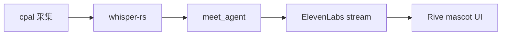

相关源文件

生成本页时使用的主要源文件：

- [src/openhuman/voice](../../project-repos/openhuman/src/openhuman/voice)
- [src/openhuman/meet_agent](../../project-repos/openhuman/src/openhuman/meet_agent)
- [gitbooks/features/mascot/README.md](../../project-repos/openhuman/gitbooks/features/mascot/README.md)

# 语音与 Meet Agent

语音栈在 `inference/voice/` 与顶层 `voice`、`meet`、`meet_agent` 协作：**Whisper STT**（macOS Metal 加速）+ **ElevenLabs TTS** + mascot lip-sync + **Google Meet 真实参会 Agent**。

## 组件关系

Meet Agent 作为会议参与者，依赖 screen_intelligence / 视觉模型 tier。

**Insight**：`whisper-rs-sys` 使用 tinyhumansai fork patch 修复 Windows MSVC CRT `/MD` vs `/MT` LNK2038——原生语音是跨平台发布硬门槛。

## 相关页面

- [推理与模型路由](inference-routing.md)
- [React 前端](react-frontend.md)
- [系统架构](system-architecture.md)

Sources: [src/openhuman/voice:1-80](../../../project-repos/openhuman/src/openhuman/voice#L1-L80)

引用源码

<!-- source-snippets:start -->

#### `src/openhuman/voice:1-80`

> 引用目标是目录，无法展开源码片段：`src/openhuman/voice`

<!-- source-snippets:end -->

