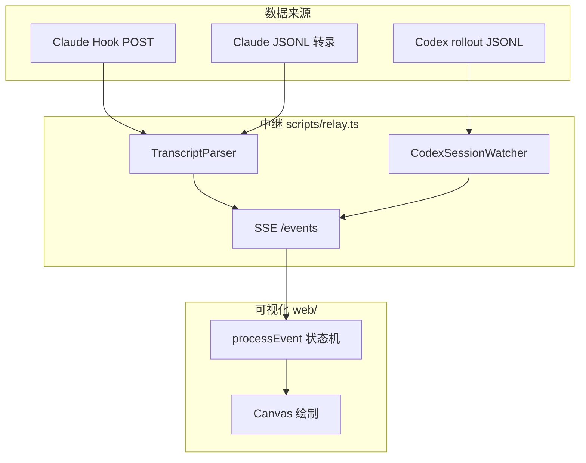
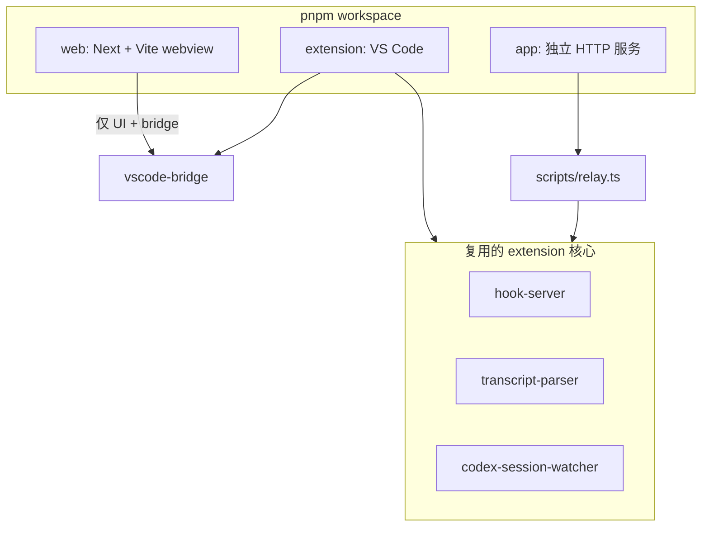
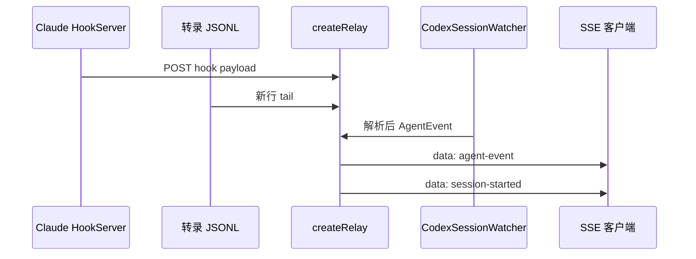
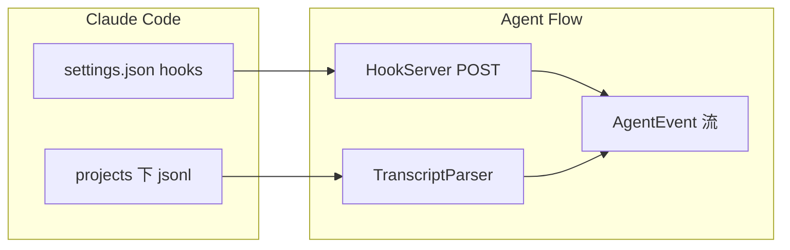
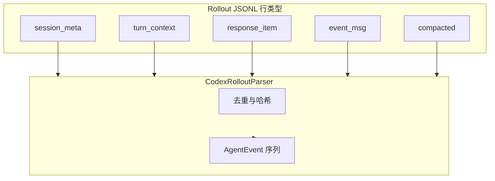
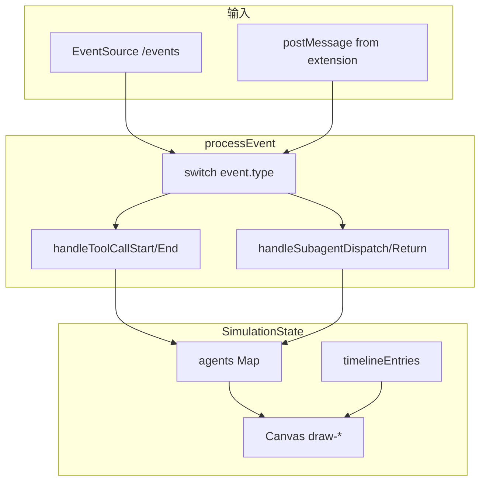
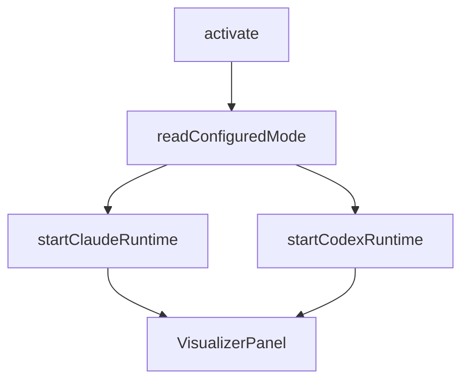
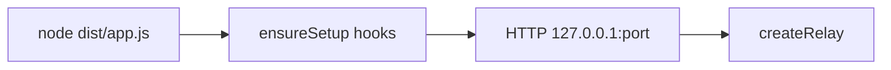
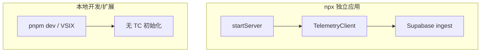
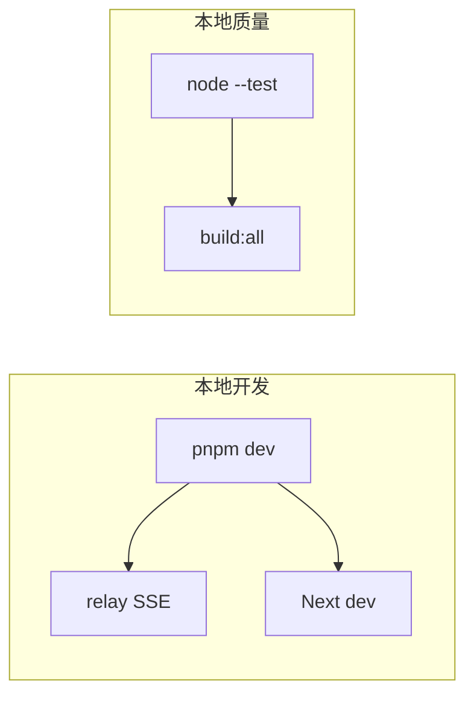

# Agent Flow DeepWiki — 全文导出

**仓库：** https://github.com/patoles/agent-flow

**Commit：** `59ccf4e3c5134a3cc56580ca0babd71f201ac47c`

## 目录

- [项目概览](#overview)
- [系统架构与仓库布局](#system-architecture)
- [中继层与 SSE 流](#event-relay-and-sse)
- [Claude Code：Hooks 与 JSONL 转录](#claude-hooks-and-transcripts)
- [Codex：Rollout JSONL 解析](#codex-rollout)
- [可视化前端与仿真状态机](#visualization-ui)
- [VS Code / Cursor 扩展](#vscode-extension)
- [独立应用与 npx 分发](#standalone-npx-app)
- [遥测、隐私与安全边界](#telemetry-security)
- [开发、构建与测试](#development-quality)

---

相关源文件

生成本页时使用的主要源文件：

- [README.md](../../../project-repos/agent-flow/README.md)
- [extension/src/session-runtime.ts](../../../project-repos/agent-flow/extension/src/session-runtime.ts)
- [scripts/relay.ts](../../../project-repos/agent-flow/scripts/relay.ts)
- [extension/src/extension.ts](../../../project-repos/agent-flow/extension/src/extension.ts)

# 项目概览

CraftMyGame 一类「多代理驱动产品」里，调试成本往往不在模型回答质量，而在**编排不可见**：主代理何时派生子代理、工具链如何分支、哪一步拖慢了整体。Agent Flow 直接把 Claude Code 的 Hook 事件与 JSONL 转录、以及 Codex 的 `rollout-*.jsonl` 权威事件流，收敛成同一套 `AgentEvent`，再用画布与时间线渲染出来。

**双运行时**是设计的轴心：`session-runtime.ts` 把「每种 CLI」抽象成 `AgentSessionWatcher`：统一的 `onEvent`、`onSessionLifecycle`、重放进面板；扩展里用 `startClaudeRuntime` 与 `startCodexRuntime` 并行挂载，`agentVisualizer.runtime` 或 `AGENT_FLOW_RUNTIME` 可收窄只监听一方。

**核心价值**可以概括为三条：低延迟（Hook POST 直达本地 HTTP 服务）、可回放（缓冲 + SSE 重放）、可对齐（Codex parser 明确写出去重策略，避免 mirror 事件刷屏）。

上图把「三路输入、一套事件、一个 UI」的空间关系压成一张图：Relay 负责聚合，前端只消费归一化事件。

**能力快照**

- **实时节点图**：`agent_spawn`、`tool_call_*`、`subagent_*` 等事件驱动仿真状态（见 `process-event.ts`）。
- **Claude 零侵入观察**：Hook Server 固定 `200` 空 body，避免阻断 Claude Code 自己的 schema 解析（`hook-server.ts`）。
- **Codex 权威 token**：rollout 里的 `event_msg.token_count` 等进入同一套 `context_update` 语义。
- **三入口一致**：VS Code 扩展、`pnpm run dev`、`npx agent-flow-app` 复用 `createRelay` 核心路径。

**技术栈（可量化）**：根 `package.json` 仅列 `concurrently`、`esbuild`、`tsx`；`web` 为 Next.js + Vite webview 双构建；`extension` 独立 esbuild；`app` 发布 `agent-flow-app` **0.8.1**（`app/package.json`）。

**阅读路线**

- 先要**端到端数据路径**：→ [中继层与 SSE 流](event-relay-and-sse.md)
- 关心 **Claude 侧**：→ [Claude Hooks 与 JSONL 转录](claude-hooks-and-transcripts.md)
- 关心 **Codex 侧**：→ [Codex：Rollout JSONL 解析](codex-rollout.md)
- 深入 **UI 状态机**：→ [可视化前端与仿真状态机](visualization-ui.md)

Sources: [README.md:1-17](../../../project-repos/exports/README.md#L1-L17), [extension/src/session-runtime.ts:1-48](../../../project-repos/exports/extension/src/session-runtime.ts#L1-L48), [extension/src/extension.ts:28-44](../../../project-repos/exports/extension/src/extension.ts#L28-L44)

引用源码

<!-- source-snippets:start -->

#### `README.md:1-17`

> 未找到引用文件：`README.md`

#### `extension/src/session-runtime.ts:1-48`

> 未找到引用文件：`extension/src/session-runtime.ts`

#### `extension/src/extension.ts:28-44`

> 未找到引用文件：`extension/src/extension.ts`

<!-- source-snippets:end -->

## 相关页面

- [系统架构与仓库布局](system-architecture.md)
- [中继层与 SSE 流](event-relay-and-sse.md)
- [可视化前端与仿真状态机](visualization-ui.md)

---

相关源文件

生成本页时使用的主要源文件：

- [pnpm-workspace.yaml](../../../project-repos/agent-flow/pnpm-workspace.yaml)
- [package.json](../../../project-repos/agent-flow/package.json)
- [web/package.json](../../../project-repos/agent-flow/web/package.json)
- [extension/package.json](../../../project-repos/agent-flow/extension/package.json)
- [app/src/server.ts](../../../project-repos/agent-flow/app/src/server.ts)

# 系统架构与仓库布局

Agent Flow 用 **pnpm workspace** 把三件产物绑在同一颗「事件内核」上：扩展宿主、浏览器里的可视化、以及可发布的 Node 二进制。重复逻辑刻意集中在 `extension/src/*`（Hook、Parser、Watcher），`scripts/relay.ts` 在扩展之外直接 `import` 这些模块——避免维护两套解析器。

**包边界**一眼能看清：`agent-flow-web` 管 Next + webview 资源；`agent-flow` 是 VS Code 扩展包名；`app` 负责把所有静态产物 + relay 打成一个可 `npx` 的 CLI。根 `package.json` 的 `dev` 用 `concurrently` 并行起 relay 与 web，契合「本地一站调试」。

**依赖方向**：UI 不反向依赖 Node 的 `fs` 实现细节；所有文件系统扫描在 extension 或 relay 进程里完成，浏览器只收 SSE / postMessage。

**独立应用的服务模型**：`startServer` 创建单一 `http.Server`：`GET /events` 走 `relay.handleSSE`，其余 `GET` 交给 `serveStatic`（`app/src/server.ts`）。这与 VS Code 里「扩展进程持有 HTTP server、webview 只聊消息」形成对照，但 SSE payload 形状保持一致（`protocol.ts` 里的 union）。

Sources: [pnpm-workspace.yaml:1-15](../../../project-repos/exports/pnpm-workspace.yaml#L1-L15), [package.json:1-16](../../../project-repos/exports/package.json#L1-L16), [app/src/server.ts:31-46](../../../project-repos/exports/app/src/server.ts#L31-L46)

引用源码

<!-- source-snippets:start -->

#### `pnpm-workspace.yaml:1-15`

> 未找到引用文件：`pnpm-workspace.yaml`

#### `package.json:1-16`

> 未找到引用文件：`package.json`

#### `app/src/server.ts:31-46`

> 未找到引用文件：`app/src/server.ts`

<!-- source-snippets:end -->

## 相关页面

- [项目概览](overview.md)
- [中继层与 SSE 流](event-relay-and-sse.md)
- [VS Code / Cursor 扩展](vscode-extension.md)

---

相关源文件

生成本页时使用的主要源文件：

- [scripts/relay.ts](../../../project-repos/agent-flow/scripts/relay.ts)
- [app/src/server.ts](../../../project-repos/agent-flow/app/src/server.ts)
- [extension/src/protocol.ts](../../../project-repos/agent-flow/extension/src/protocol.ts)

# 中继层与 SSE 流

`createRelay` 是 Agent Flow 的「汇流排」：一侧接住 Claude 的 Hook 与转录增量，一侧挂上 `CodexSessionWatcher`，向外只暴露 **`broadcast(JSON.stringify({ type: 'agent-event', event }))`** 这一种实时语义，外加 `session-started` 等生命周期帧。前端或 CLI 浏览器只要连上 `/events`，就与扩展里的 Webview 看到同源事件。

**SSE 客户端管理**：`sseClients` 是 `Set<ServerResponse>`；`sendSSE` 写 `data: ${JSON.stringify(...)}\n\n`，断开时从 Set 剔除。**事件缓冲**按 `sessionId` 保留最近 `MAX_EVENT_BUFFER`（5000）条，新客户端连接时把「最近活跃会话」的缓冲批量 `agent-event-batch` 推过去，实现面板刷新后的快速追赶。

**Claude 路径摘要**：`TranscriptParser` 构造时注入 `emitEvent`、`broadcastSessionLifecycle`、`emitContextUpdate` 等委托，与扩展内 SessionWatcher 行为对齐。`watchSession` 为每个 jsonl 注册文件 watcher + poll 兜底，并用 `INACTIVITY_TIMEOUT_MS` 把长时间无写盘的会话标为 complete。

**Codex 路径摘要**：当 `AGENT_FLOW_RUNTIME` 允许 codex 时，`CodexSessionWatcher` 单独 `onEvent` 进 `broadcastEvent`；代码注释明确：不在外层再订阅 `onSessionDetected`，否则 `session-started` 会双重广播。

**Telemetry 挂钩**：relay 进程启动时 `telemetry.emit(session_start)`，`dispose` 时带上 `event_count`、`models`、`runtimes` 发 `session_end`（`relay.ts` dispose 分支）。这与 README 中「仅聚合遥测」的说明相互印证。

Sources: [scripts/relay.ts:60-101](../../../project-repos/exports/scripts/relay.ts#L60-L101), [scripts/relay.ts:466-510](../../../project-repos/exports/scripts/relay.ts#L466-L510), [scripts/relay.ts:420-434](../../../project-repos/exports/scripts/relay.ts#L420-L434), [app/src/server.ts:31-36](../../../project-repos/exports/app/src/server.ts#L31-L36)

引用源码

<!-- source-snippets:start -->

#### `scripts/relay.ts:60-101`

> 未找到引用文件：`scripts/relay.ts`

#### `scripts/relay.ts:466-510`

> 未找到引用文件：`scripts/relay.ts`

#### `scripts/relay.ts:420-434`

> 未找到引用文件：`scripts/relay.ts`

#### `app/src/server.ts:31-36`

> 未找到引用文件：`app/src/server.ts`

<!-- source-snippets:end -->

## 相关页面

- [Claude Code：Hooks 与 JSONL 转录](claude-hooks-and-transcripts.md)
- [Codex：Rollout JSONL 解析](codex-rollout.md)
- [独立应用与 npx 分发](standalone-npx-app.md)

---

相关源文件

生成本页时使用的主要源文件：

- [extension/src/hook-server.ts](../../../project-repos/agent-flow/extension/src/hook-server.ts)
- [extension/src/hooks-config.ts](../../../project-repos/agent-flow/extension/src/hooks-config.ts)
- [extension/src/transcript-parser.ts](../../../project-repos/agent-flow/extension/src/transcript-parser.ts)
- [scripts/relay.ts](../../../project-repos/agent-flow/scripts/relay.ts)

# Claude Code：Hooks 与 JSONL 转录

Claude Code 的 Hook 机制让 Agent Flow 能在**不拦截工具执行**的前提下拿到实时信号。`HookServer` 在扩展进程里起一个极简 `http.Server`：只接受 `POST`，解析 `session_id` + `hook_event_name`，把 `PreToolUse` / `SubagentStart` 等映射成 `AgentEvent`；响应永远是 `200` 且**空 body**——注释写得很直白：返回 JSON 会触发 Claude Code 的 schema 解析，反而坏事。

**配置策略**：`configureClaudeHooks` 读取 `~/.claude/settings.json`，把 `SessionStart`、`PreToolUse`、`PostToolUse`、`SubagentStart/Stop`、`Stop`、`SessionEnd` 等键 merge 进去；通过 `HOOK_COMMAND_MARKER` 识别旧条目并替换，支持遗留的 HTTP URL hook。工作区级的 `.claude/settings.local.json` 也会被探测。

**转录解析**：`TranscriptParser` 从 SessionWatcher 抽离出来，专职 JSONL 行的语义：工具块、thinking、redacted thinking 的占位符、子代理 `emitSubagentSpawn` 等。Relay 里复用同一 parser，保证「Hook 先到、转录用同一 ID 补齐」时不分裂两套逻辑。

**洞察**：Port 冲突时 HookServer 选择 `HOOK_SERVER_NOT_STARTED` 而不是随机换端口——否则「没有任何人往新端口 POST」，靠 JSONL 仍能跑通全链路；这是防御性设计而非炫技。

Sources: [extension/src/hook-server.ts:16-100](../../../project-repos/exports/extension/src/hook-server.ts#L16-L100), [extension/src/hooks-config.ts:75-91](../../../project-repos/exports/extension/src/hooks-config.ts#L75-L91), [extension/src/transcript-parser.ts:1-37](../../../project-repos/exports/extension/src/transcript-parser.ts#L1-L37)

引用源码

<!-- source-snippets:start -->

#### `extension/src/hook-server.ts:16-100`

> 未找到引用文件：`extension/src/hook-server.ts`

#### `extension/src/hooks-config.ts:75-91`

> 未找到引用文件：`extension/src/hooks-config.ts`

#### `extension/src/transcript-parser.ts:1-37`

> 未找到引用文件：`extension/src/transcript-parser.ts`

<!-- source-snippets:end -->

## 相关页面

- [中继层与 SSE 流](event-relay-and-sse.md)
- [VS Code / Cursor 扩展](vscode-extension.md)
- [可视化前端与仿真状态机](visualization-ui.md)

---

相关源文件

生成本页时使用的主要源文件：

- [extension/src/codex-rollout-parser.ts](../../../project-repos/agent-flow/extension/src/codex-rollout-parser.ts)
- [scripts/relay.ts](../../../project-repos/agent-flow/scripts/relay.ts)
- [extension/test/codex-rollout-parser.test.ts](../../../project-repos/agent-flow/extension/test/codex-rollout-parser.test.ts)

# Codex：Rollout JSONL 解析

Codex 不写与 Claude 同构的 Hook payload，而是把权威叙事放在 `~/.codex/sessions/**/rollout-*.jsonl`。`codex-rollout-parser.ts` 顶层注释把五种 record 类型拆开：`session_meta`、`turn_context`、`response_item`、`event_msg`、`compacted`，并写明**去重策略**：例如 message 只从 `response_item.message` 发射，`event_msg` 里的镜像行跳过；reasoning 只认 `agent_reasoning` 明文，encrypted `response_item` 侧直接视为不可展示。

**与 Claude 的差异**：子代理章节写明「Codex 当前不暴露 spawn 语义」——parser 只发一个 orchestrator；未来若 `spawn_agent` 进协议，再集中改这一文件。**Token 权威**：`lastReportedTokens`、`reportedContextWindow` 等字段紧跟 `event_msg.token_count`，这类数字进入 UI 的 context 条，比估算更有说服力。

**测试锚点**：`extension/test/codex-rollout-parser.test.ts` + `fixtures/codex-rollout-sample.jsonl` 给后续改动提供回归网——这在「事件顺序敏感」的 parser 里尤其值钱。

Sources: [extension/src/codex-rollout-parser.ts:1-32](../../../project-repos/exports/extension/src/codex-rollout-parser.ts#L1-L32), [extension/src/codex-rollout-parser.ts:88-100](../../../project-repos/exports/extension/src/codex-rollout-parser.ts#L88-L100)

引用源码

<!-- source-snippets:start -->

#### `extension/src/codex-rollout-parser.ts:1-32`

> 未找到引用文件：`extension/src/codex-rollout-parser.ts`

#### `extension/src/codex-rollout-parser.ts:88-100`

> 未找到引用文件：`extension/src/codex-rollout-parser.ts`

<!-- source-snippets:end -->

## 相关页面

- [中继层与 SSE 流](event-relay-and-sse.md)
- [项目概览](overview.md)

---

相关源文件

生成本页时使用的主要源文件：

- [web/hooks/simulation/process-event.ts](../../../project-repos/agent-flow/web/hooks/simulation/process-event.ts)
- [web/lib/vscode-bridge.ts](../../../project-repos/agent-flow/web/lib/vscode-bridge.ts)
- [web/components/agent-visualizer/canvas.tsx](../../../project-repos/agent-flow/web/components/agent-visualizer/canvas.tsx)

# 可视化前端与仿真状态机

Web 层的核心不是 React 组件树本身，而是 **`processEvent`**：它把异步到达的 `AgentEvent` 归约成 `SimulationState`——`agents`、`toolCalls`、`edges`、`timelineEntries`、`fileAttention` 等 Map / 数组。每个事件类型在 switch 中委派到 `handle-agent-events`、`handle-tool-events` 等模块；返回前用 `mapsEqual` **稳定引用**，避免无关 Map 复制触发整棵组件树的 O(n) 重算。

**VS Code Bridge**：`vscode-bridge.ts` 监听 `window.postMessage`。收到 `__vscode-bridge-init` 后置位 `_isVSCode = true` 并向扩展回 `ready`；`agent-event` 与 `agent-event-batch` 分发给订阅者。Standalone 模式下这些监听器存在但永远收不到 init —— UI 改走 SSE fetch，同构事件形状靠 relay 保证。

**Canvas**：`canvas.tsx` 与各 `draw-*.ts` 把状态投影到 2D：代理气泡、工具卡片、边、粒子特效、成本可视化等分层绘制，和 `use-canvas-camera` 的视口变换解耦。

Sources: [web/hooks/simulation/process-event.ts:61-98](../../../project-repos/exports/web/hooks/simulation/process-event.ts#L61-L98), [web/lib/vscode-bridge.ts:35-59](../../../project-repos/exports/web/lib/vscode-bridge.ts#L35-L59)

引用源码

<!-- source-snippets:start -->

#### `web/hooks/simulation/process-event.ts:61-98`

> 未找到引用文件：`web/hooks/simulation/process-event.ts`

#### `web/lib/vscode-bridge.ts:35-59`

> 未找到引用文件：`web/lib/vscode-bridge.ts`

<!-- source-snippets:end -->

## 相关页面

- [中继层与 SSE 流](event-relay-and-sse.md)
- [VS Code / Cursor 扩展](vscode-extension.md)

---

相关源文件

生成本页时使用的主要源文件：

- [extension/src/extension.ts](../../../project-repos/agent-flow/extension/src/extension.ts)
- [extension/src/session-runtime.ts](../../../project-repos/agent-flow/extension/src/session-runtime.ts)
- [extension/src/webview-provider.ts](../../../project-repos/agent-flow/extension/src/webview-provider.ts)

# VS Code / Cursor 扩展

扩展激活时第一件事是读 `agentVisualizer.runtime`：`auto` 会 **顺序尝试** 启动 Claude 与 Codex runtime；任一失败会记入 `failures` 数组，若两者都挂则弹 `showWarningMessage`，避免用户面对空白面板却不知道 hook 没起来。

**命令面**：`agentVisualizer.open` / `openToSide` 创建 `VisualizerPanel` 并 `wirePanel`；钩子配置走 `promptHookSetupIfNeededForClaude`。Runtime 启动与面板打开解耦——意味着即使暂不打开 UI，后台 watcher 也可先吸附会话。

**会话桥接**：`wireWatcherToPanel`（`session-runtime.ts`）把 watcher 的三路事件统一翻译成 `panel.sendEvent` / `postMessage`。Codex 路径若需要 event transform，可在 options 注入，Claude 路径则直接透传。

**与 Web 共享代码**：扩展构建把 webview 资产打进 VSIX；开发时 `pnpm run dev:extension` watch extension，而 UI 仍由 `web` 包产出。协议字段增减必须同时改 `protocol.ts` 与 `vscode-bridge.ts` 的分支，否则会出现「扩展发了新 type，React 侧静默丢弃」类的漂移。

Sources: [extension/src/extension.ts:18-44](../../../project-repos/exports/extension/src/extension.ts#L18-L44), [extension/src/extension.ts:47-64](../../../project-repos/exports/extension/src/extension.ts#L47-L64), [extension/src/session-runtime.ts:67-116](../../../project-repos/exports/extension/src/session-runtime.ts#L67-L116)

引用源码

<!-- source-snippets:start -->

#### `extension/src/extension.ts:18-44`

> 未找到引用文件：`extension/src/extension.ts`

#### `extension/src/extension.ts:47-64`

> 未找到引用文件：`extension/src/extension.ts`

#### `extension/src/session-runtime.ts:67-116`

> 未找到引用文件：`extension/src/session-runtime.ts`

<!-- source-snippets:end -->

## 相关页面

- [Claude Code：Hooks 与 JSONL 转录](claude-hooks-and-transcripts.md)
- [可视化前端与仿真状态机](visualization-ui.md)

---

相关源文件

生成本页时使用的主要源文件：

- [app/src/app.ts](../../../project-repos/agent-flow/app/src/app.ts)
- [app/src/server.ts](../../../project-repos/agent-flow/app/src/server.ts)
- [app/package.json](../../../project-repos/agent-flow/app/package.json)

# 独立应用与 npx 分发

`npx agent-flow-app`（包名 `@agent-flow/app`，npm 上二进制的-friendly 名称是 `agent-flow`）在 `app.ts` 里完成四步：**解析参数** → **`ensureSetup()`** 写 Claude hooks → **`startServer()`** 绑定本机 HTTP → 可选 `open` 浏览器。与 README 的 Quick Start 一致：用户不需要先开 VS Code。

**服务器行为**：只监听 `127.0.0.1`，减小暴露面；`/events` 专用于 SSE；`SIGINT` / `SIGTERM` / `SIGHUP` 都挂载同一 `cleanup`，注释强调重复信号不会双发 `session_end`、也不会和 telemetry flush 竞态。

**与工作区的语义**：`createRelay({ workspace: process.cwd() })` 把当前 shell 目录当作会话扫描锚点；在 monorepo 子目录启动时，只会高亮「与 cwd 匹配」的 Codex / Claude 会话，这一行为与 README 里「另开终端跑 Claude」的心智模型吻合。

**版本号**：`app/package.json` 当前 **0.8.1**；与 README 中遥测 schema 说明交叉引用。

Sources: [app/src/app.ts:12-29](../../../project-repos/exports/app/src/app.ts#L12-L29), [app/src/server.ts:21-75](../../../project-repos/exports/app/src/server.ts#L21-L75), [app/package.json:1-26](../../../project-repos/exports/app/package.json#L1-L26)

引用源码

<!-- source-snippets:start -->

#### `app/src/app.ts:12-29`

> 未找到引用文件：`app/src/app.ts`

#### `app/src/server.ts:21-75`

> 未找到引用文件：`app/src/server.ts`

#### `app/package.json:1-26`

> 未找到引用文件：`app/package.json`

<!-- source-snippets:end -->

## 相关页面

- [中继层与 SSE 流](event-relay-and-sse.md)
- [遥测、隐私与安全边界](telemetry-security.md)

---

相关源文件

生成本页时使用的主要源文件：

- [scripts/telemetry.ts](../../../project-repos/agent-flow/scripts/telemetry.ts)
- [README.md](../../../project-repos/agent-flow/README.md)
- [app/src/server.ts](../../../project-repos/agent-flow/app/src/server.ts)

# 遥测、隐私与安全边界

Telemetry **默认仅出现在发布的 `npx agent-flow-app` 路径**：`startServer` 在 `~/.agent-flow` 下初始化 `TelemetryClient`，而 README 明确 `pnpm run dev` 与扩展**不发送**。实现上 `TelemetryEvent` 只含 session 级聚合字段（时长、事件数、OS/arch、版本、观察到的 model id 列表、所 watch 的 runtime 组合、错误类名），**显式不包含** prompt、路径、工具入参。

**禁用开关**：`AGENT_FLOW_TELEMETRY=false` 或 `DO_NOT_TRACK=1` 走 falsy 集合判断；禁用时不写 `~/.agent-flow` 状态目录。用户可 `cat ~/.agent-flow/telemetry/events.jsonl` 自查落盘内容。

**网络栈**：`telemetry.ts` 顶部写死 Supabase endpoint 与 publishable key，注释说明 fork 若改名需自行替换常量；sync 采用渐进定时器（2s、2min、3min、之后每 5min）平衡短会话与长任务。

**安全心智**：Hook Server 与 relay 都运行在用户本机，不把原始 POST body 转发到 telemetry；这与「只观察不阻断」的产品定位一致。

Sources: [scripts/telemetry.ts:1-77](../../../project-repos/exports/scripts/telemetry.ts#L1-L77), [README.md:144-157](../../../project-repos/exports/README.md#L144-L157), [app/src/server.ts:24-30](../../../project-repos/exports/app/src/server.ts#L24-L30)

引用源码

<!-- source-snippets:start -->

#### `scripts/telemetry.ts:1-77`

> 未找到引用文件：`scripts/telemetry.ts`

#### `README.md:144-157`

> 未找到引用文件：`README.md`

#### `app/src/server.ts:24-30`

> 未找到引用文件：`app/src/server.ts`

<!-- source-snippets:end -->

## 相关页面

- [独立应用与 npx 分发](standalone-npx-app.md)
- [项目概览](overview.md)

---

相关源文件

生成本页时使用的主要源文件：

- [package.json](../../../project-repos/agent-flow/package.json)
- [web/package.json](../../../project-repos/agent-flow/web/package.json)
- [CONTRIBUTING.md](../../../project-repos/agent-flow/CONTRIBUTING.md)

# 开发、构建与测试

日常闭环在根 `package.json`：`pnpm i` → `pnpm run setup`（Claude hooks）→ `pnpm run dev` 并行 relay + web。单测入口是 Node 原生 `node --import tsx --test`，覆盖 `scripts/**/*.test.ts` 与 `app/src/**/*.test.ts`。

**常用脚本速查**

| 脚本 | 作用 |
|------|------|
| `dev:relay` | 构建并跑开发 relay |
| `dev:web` | Next dev |
| `dev:demo` | `NEXT_PUBLIC_DEMO=1` 只看 UI |
| `build:all` | webview + extension 生产包 |
| `build:web` / `build:extension` / `build:webview` | 拆分构建 |
| `build:app` | 打 `app` 发行物 |

**扩展侧**：`extension/package.json` 自有 `esbuild.js` pipeline；测试含 `codex-rollout-parser`、`fs-utils` 等。**贡献流程**细节见 `CONTRIBUTING.md`（行为准则、PR 期望）。

Sources: [package.json:1-16](../../../project-repos/exports/package.json#L1-L16)

引用源码

<!-- source-snippets:start -->

#### `package.json:1-16`

> 未找到引用文件：`package.json`

<!-- source-snippets:end -->

## 相关页面

- [系统架构与仓库布局](system-architecture.md)
- [VS Code / Cursor 扩展](vscode-extension.md)

---

