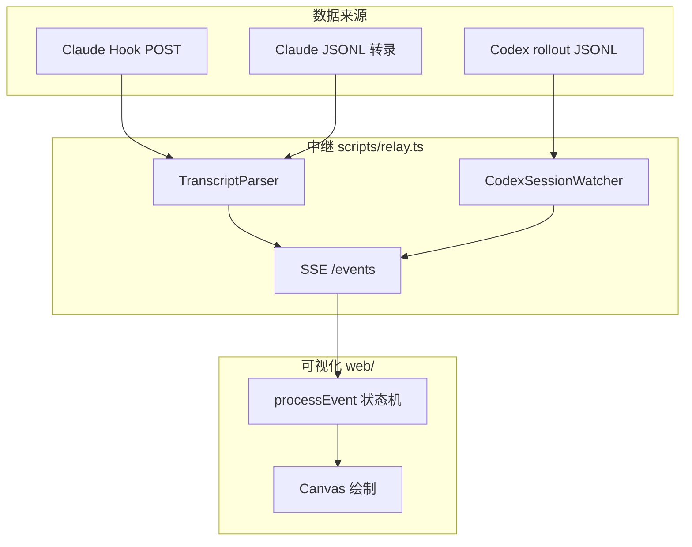
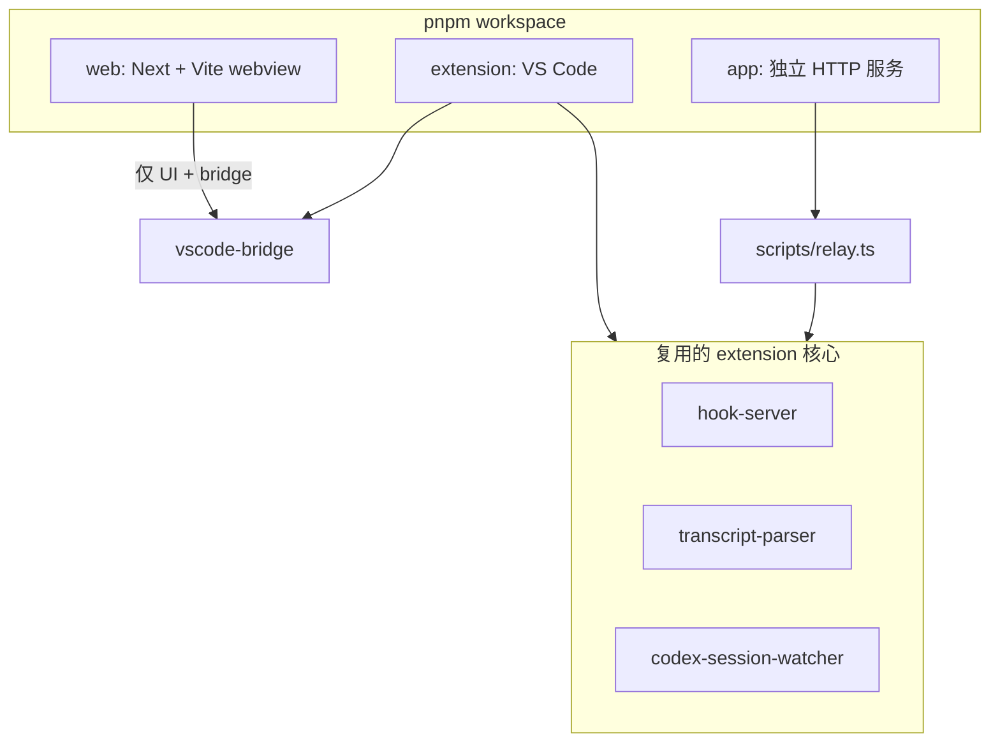
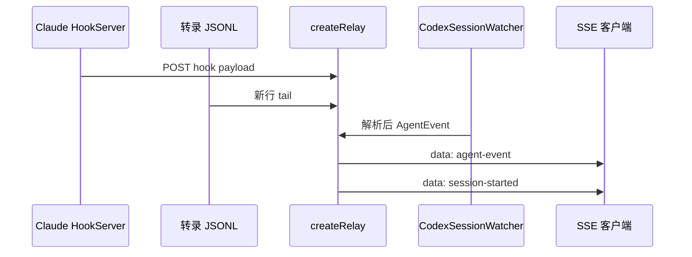
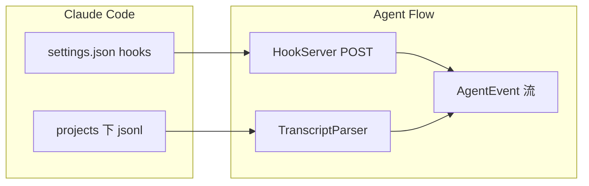
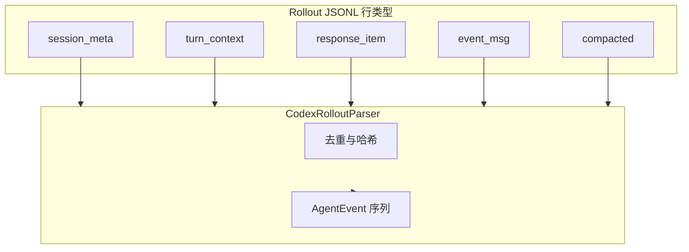
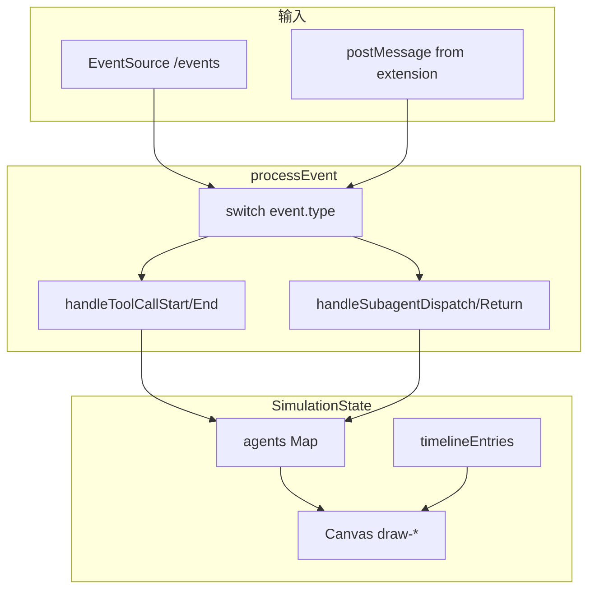
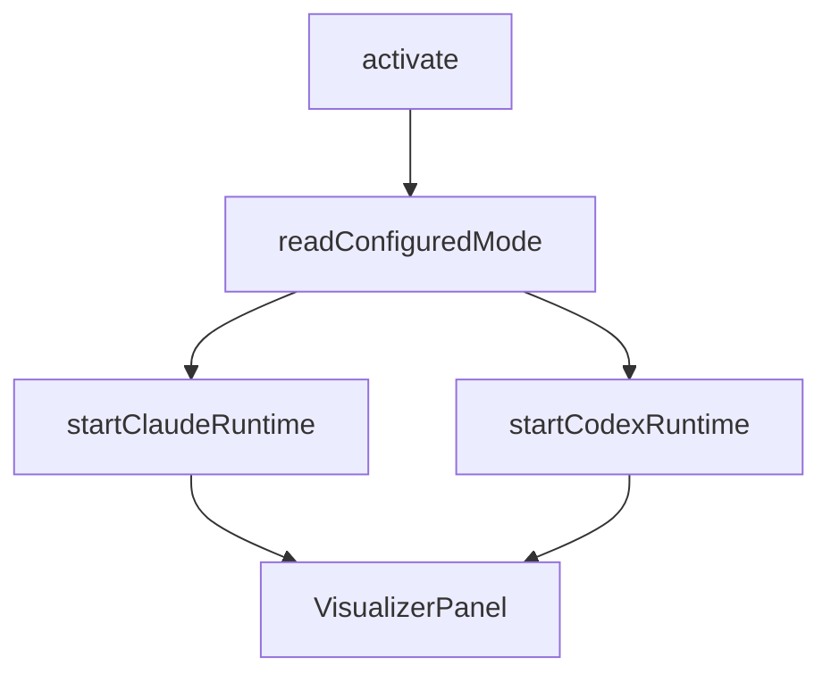
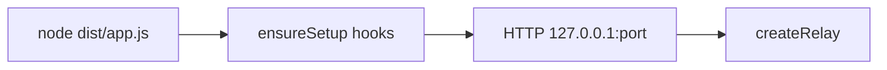
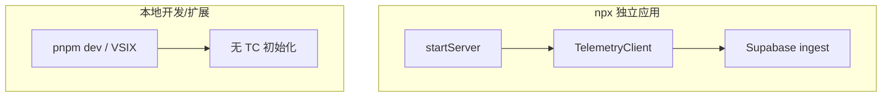
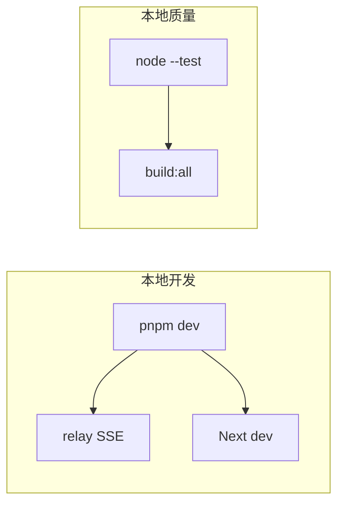

# Agent Flow DeepWiki — 全文导出

**仓库：** https://github.com/patoles/agent-flow

**Commit：** `59ccf4e3c5134a3cc56580ca0babd71f201ac47c`

## 目录

- [项目概览](#overview)
- [系统架构与仓库布局](#system-architecture)
- [中继层与 SSE 流](#event-relay-and-sse)
- [Claude Code：Hooks 与 JSONL 转录](#claude-hooks-and-transcripts)
- [Codex：Rollout JSONL 解析](#codex-rollout)
- [可视化前端与仿真状态机](#visualization-ui)
- [VS Code / Cursor 扩展](#vscode-extension)
- [独立应用与 npx 分发](#standalone-npx-app)
- [遥测、隐私与安全边界](#telemetry-security)
- [开发、构建与测试](#development-quality)

---

<details>
<summary>相关源文件</summary>

生成本页时使用的主要源文件：

- [README.md](../../../project-repos/agent-flow/README.md)
- [extension/src/session-runtime.ts](../../../project-repos/agent-flow/extension/src/session-runtime.ts)
- [scripts/relay.ts](../../../project-repos/agent-flow/scripts/relay.ts)
- [extension/src/extension.ts](../../../project-repos/agent-flow/extension/src/extension.ts)

</details>

# 项目概览

CraftMyGame 一类「多代理驱动产品」里，调试成本往往不在模型回答质量，而在**编排不可见**：主代理何时派生子代理、工具链如何分支、哪一步拖慢了整体。Agent Flow 直接把 Claude Code 的 Hook 事件与 JSONL 转录、以及 Codex 的 `rollout-*.jsonl` 权威事件流，收敛成同一套 `AgentEvent`，再用画布与时间线渲染出来。

**双运行时**是设计的轴心：`session-runtime.ts` 把「每种 CLI」抽象成 `AgentSessionWatcher`：统一的 `onEvent`、`onSessionLifecycle`、重放进面板；扩展里用 `startClaudeRuntime` 与 `startCodexRuntime` 并行挂载，`agentVisualizer.runtime` 或 `AGENT_FLOW_RUNTIME` 可收窄只监听一方。

**核心价值**可以概括为三条：低延迟（Hook POST 直达本地 HTTP 服务）、可回放（缓冲 + SSE 重放）、可对齐（Codex parser 明确写出去重策略，避免 mirror 事件刷屏）。



上图把「三路输入、一套事件、一个 UI」的空间关系压成一张图：Relay 负责聚合，前端只消费归一化事件。

**能力快照**

- **实时节点图**：`agent_spawn`、`tool_call_*`、`subagent_*` 等事件驱动仿真状态（见 `process-event.ts`）。
- **Claude 零侵入观察**：Hook Server 固定 `200` 空 body，避免阻断 Claude Code 自己的 schema 解析（`hook-server.ts`）。
- **Codex 权威 token**：rollout 里的 `event_msg.token_count` 等进入同一套 `context_update` 语义。
- **三入口一致**：VS Code 扩展、`pnpm run dev`、`npx agent-flow-app` 复用 `createRelay` 核心路径。

**技术栈（可量化）**：根 `package.json` 仅列 `concurrently`、`esbuild`、`tsx`；`web` 为 Next.js + Vite webview 双构建；`extension` 独立 esbuild；`app` 发布 `agent-flow-app` **0.8.1**（`app/package.json`）。

**阅读路线**

- 先要**端到端数据路径**：→ [中继层与 SSE 流](event-relay-and-sse.md)
- 关心 **Claude 侧**：→ [Claude Hooks 与 JSONL 转录](claude-hooks-and-transcripts.md)
- 关心 **Codex 侧**：→ [Codex：Rollout JSONL 解析](codex-rollout.md)
- 深入 **UI 状态机**：→ [可视化前端与仿真状态机](visualization-ui.md)

Sources: [README.md:1-17](../../../project-repos/patoles-agent-flow/README.md#L1-L17), [extension/src/session-runtime.ts:1-48](../../../project-repos/patoles-agent-flow/extension/src/session-runtime.ts#L1-L48), [extension/src/extension.ts:28-44](../../../project-repos/patoles-agent-flow/extension/src/extension.ts#L28-L44)

<details class="source-snippets">
<summary>引用源码</summary>

<!-- source-snippets:start -->

#### `README.md:1-17`

```markdown
# Agent Flow

Real-time visualization of Claude Code and Codex agent orchestration. Watch your agents think, branch, and coordinate as they work. [Demo video here](https://www.youtube.com/watch?v=Ud6eDrFN-TA). 


## Why Agent Flow?

I built Agent Flow while developing [CraftMyGame](https://craftmygame.com), a game creation platform driven by AI agents. Debugging agent behavior was painful, so we made it visual. Now we're sharing it.

Claude Code is powerful, but its execution is a black box — you see the final result, not the journey. Agent Flow makes the invisible visible:

- **Understand agent behavior** — See how Claude breaks down problems, which tools it reaches for, and how subagents coordinate
- **Debug tool call chains** — When something goes wrong, trace the exact sequence of decisions and tool calls that led there
- **See where time is spent** — Identify slow tool calls, unnecessary branching, or redundant work at a glance
- **Learn by watching** — Build intuition for how to write better prompts by observing how Claude interprets and executes them

```

#### `extension/src/session-runtime.ts:1-48`

```typescript
/**
 * Runtime abstraction for agent session watchers.
 *
 * Each supported agent tool (Claude Code, Codex, ...) implements
 * AgentSessionWatcher and is started via a runtime factory in extension.ts.
 * The interface deliberately matches what the visualizer needs to render
 * live activity: an event stream, session lifecycle, and replay on panel
 * open. Runtime-specific concerns (hook servers, SQLite lookups, etc.)
 * live inside each runtime's startXxxRuntime() factory, not here.
 */

import * as vscode from 'vscode'
import type { AgentEvent, SessionInfo } from './protocol'
import { VisualizerPanel } from './webview-provider'
import { SESSION_ID_DISPLAY, STATUS_MESSAGE_DURATION_MS } from './constants'
import type { TypedDisposable, TypedEvent } from './typed-event-emitter'

export type AgentRuntimeMode = 'claude' | 'codex'

export interface SessionLifecycleEvent {
  type: 'started' | 'ended' | 'updated'
  sessionId: string
  label: string
}

/** Interface every runtime's watcher implements. Uses portable typed-event
 *  types (not vscode.Event) so watchers can run in the relay/CLI too. */
export interface AgentSessionWatcher extends TypedDisposable {
  readonly onEvent: TypedEvent<AgentEvent>
  readonly onSessionDetected: TypedEvent<string>
  readonly onSessionLifecycle: TypedEvent<SessionLifecycleEvent>
  start(): void
  isActive(): boolean
  isSessionActive(sessionId: string): boolean
  getActiveSessions(): SessionInfo[]
  replaySessionStart(sessionIds?: string[]): void
}

/** A running runtime: its watcher, a status line describing its connection,
 *  and a disposer for runtime-specific resources beyond the watcher itself
 *  (e.g. the Claude hook server and discovery file). */
export interface AgentRuntime {
  readonly mode: AgentRuntimeMode
  readonly watcher: AgentSessionWatcher
  /** Human-readable connection status for the webview. May change over time. */
  connectionStatus(): string
  dispose(): void
}
```

#### `extension/src/extension.ts:28-44`

```typescript
async function startRuntimes(
  mode: ConfiguredRuntimeMode,
  context: vscode.ExtensionContext,
): Promise<StartRuntimesResult> {
  const runtimes: AgentRuntime[] = []
  const failures: AgentRuntimeMode[] = []
  if (mode === 'claude' || mode === 'auto') {
    log.info('Starting Claude runtime...')
    try { runtimes.push(await startClaudeRuntime(context)) }
    catch (err) { log.error('Claude runtime failed to start:', err); failures.push('claude') }
  }
  if (mode === 'codex' || mode === 'auto') {
    log.info('Starting Codex runtime...')
    try { runtimes.push(startCodexRuntime(context)) }
    catch (err) { log.error('Codex runtime failed to start:', err); failures.push('codex') }
  }
  return { runtimes, failures }
```

<!-- source-snippets:end -->
</details>
## 相关页面

- [系统架构与仓库布局](system-architecture.md)
- [中继层与 SSE 流](event-relay-and-sse.md)
- [可视化前端与仿真状态机](visualization-ui.md)


---

<details>
<summary>相关源文件</summary>

生成本页时使用的主要源文件：

- [pnpm-workspace.yaml](../../../project-repos/agent-flow/pnpm-workspace.yaml)
- [package.json](../../../project-repos/agent-flow/package.json)
- [web/package.json](../../../project-repos/agent-flow/web/package.json)
- [extension/package.json](../../../project-repos/agent-flow/extension/package.json)
- [app/src/server.ts](../../../project-repos/agent-flow/app/src/server.ts)

</details>

# 系统架构与仓库布局

Agent Flow 用 **pnpm workspace** 把三件产物绑在同一颗「事件内核」上：扩展宿主、浏览器里的可视化、以及可发布的 Node 二进制。重复逻辑刻意集中在 `extension/src/*`（Hook、Parser、Watcher），`scripts/relay.ts` 在扩展之外直接 `import` 这些模块——避免维护两套解析器。

**包边界**一眼能看清：`agent-flow-web` 管 Next + webview 资源；`agent-flow` 是 VS Code 扩展包名；`app` 负责把所有静态产物 + relay 打成一个可 `npx` 的 CLI。根 `package.json` 的 `dev` 用 `concurrently` 并行起 relay 与 web，契合「本地一站调试」。



**依赖方向**：UI 不反向依赖 Node 的 `fs` 实现细节；所有文件系统扫描在 extension 或 relay 进程里完成，浏览器只收 SSE / postMessage。

**独立应用的服务模型**：`startServer` 创建单一 `http.Server`：`GET /events` 走 `relay.handleSSE`，其余 `GET` 交给 `serveStatic`（`app/src/server.ts`）。这与 VS Code 里「扩展进程持有 HTTP server、webview 只聊消息」形成对照，但 SSE payload 形状保持一致（`protocol.ts` 里的 union）。

Sources: [pnpm-workspace.yaml:1-15](../../../project-repos/patoles-agent-flow/pnpm-workspace.yaml#L1-L15), [package.json:1-16](../../../project-repos/patoles-agent-flow/package.json#L1-L16), [app/src/server.ts:31-46](../../../project-repos/patoles-agent-flow/app/src/server.ts#L31-L46)

<details class="source-snippets">
<summary>引用源码</summary>

<!-- source-snippets:start -->

#### `pnpm-workspace.yaml:1-15`

```yaml
packages:
  - extension
  - web
```

#### `package.json:1-16`

```json
{
  "private": true,
  "scripts": {
    "setup": "node scripts/setup.js",
    "dev": "NEXT_PUBLIC_DEMO=0 NEXT_PUBLIC_RELAY_PORT=3001 concurrently -n relay,web -c blue,green \"pnpm run dev:relay\" \"pnpm run dev:web\"",
    "dev:relay": "node scripts/build-relay.js && node scripts/.dev-relay.js",
    "dev:demo": "NEXT_PUBLIC_DEMO=1 pnpm run dev:web",
    "dev:web": "pnpm --filter agent-flow-web run dev",
    "dev:extension": "pnpm --filter agent-flow run watch",
    "build:extension": "pnpm --filter agent-flow run build",
    "build:web": "pnpm --filter agent-flow-web run build",
    "build:webview": "pnpm --filter agent-flow-web run build:webview",
    "build:all": "pnpm run build:webview && pnpm run build:extension",
    "build:app": "node app/build.js",
    "test": "node --import tsx --test \"scripts/**/*.test.ts\" \"app/src/**/*.test.ts\""
  },
```

#### `app/src/server.ts:31-46`

```typescript
  const relay = await createRelay({ workspace, verbose: options.verbose, telemetry })

  const server = http.createServer((req, res) => {
    // SSE endpoint
    if (req.url === '/events') {
      return relay.handleSSE(req, res)
    }

    // Static files (UI)
    if (req.method === 'GET') {
      return serveStatic(req, res)
    }

    res.writeHead(404)
    res.end('Not found')
  })
```

<!-- source-snippets:end -->
</details>
## 相关页面

- [项目概览](overview.md)
- [中继层与 SSE 流](event-relay-and-sse.md)
- [VS Code / Cursor 扩展](vscode-extension.md)


---

<details>
<summary>相关源文件</summary>

生成本页时使用的主要源文件：

- [scripts/relay.ts](../../../project-repos/agent-flow/scripts/relay.ts)
- [app/src/server.ts](../../../project-repos/agent-flow/app/src/server.ts)
- [extension/src/protocol.ts](../../../project-repos/agent-flow/extension/src/protocol.ts)

</details>

# 中继层与 SSE 流

`createRelay` 是 Agent Flow 的「汇流排」：一侧接住 Claude 的 Hook 与转录增量，一侧挂上 `CodexSessionWatcher`，向外只暴露 **`broadcast(JSON.stringify({ type: 'agent-event', event }))`** 这一种实时语义，外加 `session-started` 等生命周期帧。前端或 CLI 浏览器只要连上 `/events`，就与扩展里的 Webview 看到同源事件。

**SSE 客户端管理**：`sseClients` 是 `Set<ServerResponse>`；`sendSSE` 写 `data: ${JSON.stringify(...)}\n\n`，断开时从 Set 剔除。**事件缓冲**按 `sessionId` 保留最近 `MAX_EVENT_BUFFER`（5000）条，新客户端连接时把「最近活跃会话」的缓冲批量 `agent-event-batch` 推过去，实现面板刷新后的快速追赶。

**Claude 路径摘要**：`TranscriptParser` 构造时注入 `emitEvent`、`broadcastSessionLifecycle`、`emitContextUpdate` 等委托，与扩展内 SessionWatcher 行为对齐。`watchSession` 为每个 jsonl 注册文件 watcher + poll 兜底，并用 `INACTIVITY_TIMEOUT_MS` 把长时间无写盘的会话标为 complete。

**Codex 路径摘要**：当 `AGENT_FLOW_RUNTIME` 允许 codex 时，`CodexSessionWatcher` 单独 `onEvent` 进 `broadcastEvent`；代码注释明确：不在外层再订阅 `onSessionDetected`，否则 `session-started` 会双重广播。



**Telemetry 挂钩**：relay 进程启动时 `telemetry.emit(session_start)`，`dispose` 时带上 `event_count`、`models`、`runtimes` 发 `session_end`（`relay.ts` dispose 分支）。这与 README 中「仅聚合遥测」的说明相互印证。

Sources: [scripts/relay.ts:60-101](../../../project-repos/patoles-agent-flow/scripts/relay.ts#L60-L101), [scripts/relay.ts:466-510](../../../project-repos/patoles-agent-flow/scripts/relay.ts#L466-L510), [scripts/relay.ts:420-434](../../../project-repos/patoles-agent-flow/scripts/relay.ts#L420-L434), [app/src/server.ts:31-36](../../../project-repos/patoles-agent-flow/app/src/server.ts#L31-L36)

<details class="source-snippets">
<summary>引用源码</summary>

<!-- source-snippets:start -->

#### `scripts/relay.ts:60-101`

```typescript
// ─── SSE client management ──────────────────────────────────────────────────

const sseClients = new Set<http.ServerResponse>()

function sendSSE(res: http.ServerResponse, data: unknown) {
  try { res.write(`data: ${JSON.stringify(data)}\n\n`) } catch {
    sseClients.delete(res)
  }
}

function broadcast(data: string) {
  for (const res of sseClients) {
    try { res.write(`data: ${data}\n\n`) } catch {
      sseClients.delete(res)
    }
  }
}

// ─── Event buffering ────────────────────────────────────────────────────────

const eventBuffer = new Map<string, AgentEvent[]>()

function broadcastEvent(event: AgentEvent) {
  sessionEventCount++
  if (event.type === 'model_detected') {
    const m = (event.payload as { model?: unknown } | undefined)?.model
    if (typeof m === 'string' && m.length > 0) observedModels.add(m)
  }
  const sid = event.sessionId?.slice(0, SESSION_ID_DISPLAY) || '?'
  log(`[event] ${event.type} (session ${sid})`)

  if (event.sessionId) {
    let buf = eventBuffer.get(event.sessionId) || []
    buf.push(event)
    if (buf.length > MAX_EVENT_BUFFER) {
      buf = buf.slice(buf.length - MAX_EVENT_BUFFER)
    }
    eventBuffer.set(event.sessionId, buf)
  }

  broadcast(JSON.stringify({ type: 'agent-event', event }))
}
```

#### `scripts/relay.ts:466-510`

```typescript
  return {
    handleSSE(req: http.IncomingMessage, res: http.ServerResponse) {
      res.writeHead(200, {
        'Content-Type': 'text/event-stream',
        'Cache-Control': 'no-cache',
        'Connection': 'keep-alive',
      })

      sseClients.add(res)
      log(`[sse] Client connected (${sseClients.size} total)`)

      req.on('close', () => {
        sseClients.delete(res)
        log(`[sse] Client disconnected (${sseClients.size} total)`)
      })

      // Send current session list (Claude + Codex)
      const sessionList: SessionInfo[] = []
      for (const session of sessions.values()) {
        if (!session.sessionDetected) continue
        sessionList.push({
          id: session.sessionId, label: session.label,
          status: session.sessionCompleted ? 'completed' : 'active',
          startTime: session.sessionStartTime, lastActivityTime: session.lastActivityTime,
        })
      }
      if (codexWatcher) sessionList.push(...codexWatcher.getActiveSessions())
      if (sessionList.length > 0) {
        sendSSE(res, { type: 'session-list', sessions: sessionList })
      }

      // Replay buffered events for the most recent active session
      const sorted = [...sessionList].sort((a, b) => {
        const aActive = a.status === 'active' ? 1 : 0
        const bActive = b.status === 'active' ? 1 : 0
        if (aActive !== bActive) return bActive - aActive
        return b.lastActivityTime - a.lastActivityTime
      })
      if (sorted.length > 0) {
        const buffered = eventBuffer.get(sorted[0].id)
        if (buffered) {
          sendSSE(res, { type: 'agent-event-batch', events: buffered })
        }
      }
    },
```

#### `scripts/relay.ts:420-434`

```typescript
  // ─── Codex runtime ────────────────────────────────────────────────────────
  // Watch Codex rollouts in parallel. No-op if ~/.codex/sessions doesn't
  // exist or no sessions match the current workspace.
  // We don't subscribe to onSessionDetected — it fires together with the
  // lifecycle 'started' event in CodexSessionWatcher.attachSession, so
  // wiring both would double-broadcast session-started to SSE clients.
  let codexWatcher: CodexSessionWatcher | null = null
  if (wantCodex) {
    codexWatcher = new CodexSessionWatcher(workspace)
    codexWatcher.onEvent((event) => broadcastEvent(event))
    codexWatcher.onSessionLifecycle((lifecycle) => {
      broadcastSessionLifecycle(lifecycle.type, lifecycle.sessionId, lifecycle.label)
    })
    codexWatcher.start()
  }
```

#### `app/src/server.ts:31-36`

```typescript
  const relay = await createRelay({ workspace, verbose: options.verbose, telemetry })

  const server = http.createServer((req, res) => {
    // SSE endpoint
    if (req.url === '/events') {
      return relay.handleSSE(req, res)
```

<!-- source-snippets:end -->
</details>
## 相关页面

- [Claude Code：Hooks 与 JSONL 转录](claude-hooks-and-transcripts.md)
- [Codex：Rollout JSONL 解析](codex-rollout.md)
- [独立应用与 npx 分发](standalone-npx-app.md)


---

<details>
<summary>相关源文件</summary>

生成本页时使用的主要源文件：

- [extension/src/hook-server.ts](../../../project-repos/agent-flow/extension/src/hook-server.ts)
- [extension/src/hooks-config.ts](../../../project-repos/agent-flow/extension/src/hooks-config.ts)
- [extension/src/transcript-parser.ts](../../../project-repos/agent-flow/extension/src/transcript-parser.ts)
- [scripts/relay.ts](../../../project-repos/agent-flow/scripts/relay.ts)

</details>

# Claude Code：Hooks 与 JSONL 转录

Claude Code 的 Hook 机制让 Agent Flow 能在**不拦截工具执行**的前提下拿到实时信号。`HookServer` 在扩展进程里起一个极简 `http.Server`：只接受 `POST`，解析 `session_id` + `hook_event_name`，把 `PreToolUse` / `SubagentStart` 等映射成 `AgentEvent`；响应永远是 `200` 且**空 body**——注释写得很直白：返回 JSON 会触发 Claude Code 的 schema 解析，反而坏事。

**配置策略**：`configureClaudeHooks` 读取 `~/.claude/settings.json`，把 `SessionStart`、`PreToolUse`、`PostToolUse`、`SubagentStart/Stop`、`Stop`、`SessionEnd` 等键 merge 进去；通过 `HOOK_COMMAND_MARKER` 识别旧条目并替换，支持遗留的 HTTP URL hook。工作区级的 `.claude/settings.local.json` 也会被探测。

**转录解析**：`TranscriptParser` 从 SessionWatcher 抽离出来，专职 JSONL 行的语义：工具块、thinking、redacted thinking 的占位符、子代理 `emitSubagentSpawn` 等。Relay 里复用同一 parser，保证「Hook 先到、转录用同一 ID 补齐」时不分裂两套逻辑。



**洞察**：Port 冲突时 HookServer 选择 `HOOK_SERVER_NOT_STARTED` 而不是随机换端口——否则「没有任何人往新端口 POST」，靠 JSONL 仍能跑通全链路；这是防御性设计而非炫技。

Sources: [extension/src/hook-server.ts:16-100](../../../project-repos/patoles-agent-flow/extension/src/hook-server.ts#L16-L100), [extension/src/hooks-config.ts:75-91](../../../project-repos/patoles-agent-flow/extension/src/hooks-config.ts#L75-L91), [extension/src/transcript-parser.ts:1-37](../../../project-repos/patoles-agent-flow/extension/src/transcript-parser.ts#L1-L37)

<details class="source-snippets">
<summary>引用源码</summary>

<!-- source-snippets:start -->

#### `extension/src/hook-server.ts:16-100`

```typescript
/**
 * Lightweight HTTP server that receives Claude Code hook events.
 *
 * Claude Code hooks POST JSON payloads for events like PreToolUse, PostToolUse,
 * SubagentStart, SubagentStop, SessionStart, Stop, etc.
 *
 * We transform these into AgentEvent format and emit them.
 */

/** Port 0 = let OS assign a random available port */

interface HookPayload {
  session_id: string
  transcript_path?: string
  cwd?: string
  hook_event_name: string
  // PreToolUse / PostToolUse
  tool_name?: string
  tool_input?: Record<string, unknown>
  tool_use_id?: string
  tool_response?: string | { content: string } | Array<{ text?: string }>
  // SubagentStart / SubagentStop
  agent_id?: string
  agent_type?: string
  agent_transcript_path?: string
  // Notification
  notification_type?: string
  message?: string
  title?: string
  // Generic
  [key: string]: unknown
}

export class HookServer implements vscode.Disposable {
  private server: http.Server | null = null
  private port: number
  /** Per-session state — cleaned up on SessionEnd/Stop to prevent unbounded growth */
  private sessionState = new Map<string, {
    startTime: number
    agentNames: Map<string, string> // agent_id → friendly name
  }>()

  private readonly _onEvent = new vscode.EventEmitter<AgentEvent>()

  readonly onEvent = this._onEvent.event

  constructor(port?: number) {
    this.port = port ?? 0
  }

  async start(): Promise<number> {
    return new Promise((resolve, reject) => {
      this.server = http.createServer((req, res) => {
        if (req.method === 'POST') {
          let body = ''
          let oversized = false
          req.on('data', (chunk: Buffer) => {
            if (oversized) return
            body += chunk.toString()
            if (body.length > HOOK_MAX_BODY_SIZE) {
              oversized = true
              body = ''
              log.warn('Request body exceeded size limit, discarding')
            }
          })
          req.on('end', () => {
            if (!oversized) {
              try {
                const parsed: unknown = JSON.parse(body)
                if (!parsed || typeof parsed !== 'object' || !('session_id' in parsed) || !('hook_event_name' in parsed)
                    || typeof (parsed as HookPayload).session_id !== 'string'
                    || typeof (parsed as HookPayload).hook_event_name !== 'string') {
                  log.warn('Invalid hook payload: missing session_id or hook_event_name')
                } else {
                  this.handleHook(parsed as HookPayload)
                }
              } catch (e) {
                log.error('Failed to parse payload:', e)
              }
            }
            // Always return 200 with empty body — we're observing, not blocking.
            // Empty body = "success, no output" per Claude Code docs.
            // Returning JSON (even '{}') triggers schema parsing which can cause issues.
            res.writeHead(200)
            res.end()
```

#### `extension/src/hooks-config.ts:75-91`

```typescript
export async function configureClaudeHooks(): Promise<void> {
  ensureHookScript()

  const hookCommand = getHookCommand()
  const hookEntry = { hooks: [{ type: 'command', command: hookCommand, timeout: HOOK_TIMEOUT_S }] }

  const hooksConfig = {
    SessionStart: [hookEntry],
    PreToolUse: [hookEntry],
    PostToolUse: [hookEntry],
    PostToolUseFailure: [hookEntry],
    SubagentStart: [hookEntry],
    SubagentStop: [hookEntry],
    Notification: [hookEntry],
    Stop: [hookEntry],
    SessionEnd: [hookEntry],
  }
```

#### `extension/src/transcript-parser.ts:1-37`

```typescript
/**
 * Transcript parsing logic extracted from SessionWatcher.
 *
 * Parses JSONL transcript lines and emits AgentEvents via a delegate,
 * keeping the parsing logic decoupled from file-watching concerns.
 */

import {
  AgentEvent, PendingToolCall, WatchedSession,
  TranscriptEntry, ToolUseBlock, ToolResultBlock,
  emitSubagentSpawn,
} from './protocol'
import { readFileChunk } from './fs-utils'
import {
  PREVIEW_MAX, ARGS_MAX, RESULT_MAX, MESSAGE_MAX,
  SESSION_LABEL_MAX, SESSION_LABEL_TRUNCATED,
  CHILD_NAME_MAX,
  HASH_PREFIX_MAX,
  ORCHESTRATOR_NAME,
  FAILED_RESULT_MAX,
  SYSTEM_CONTENT_PREFIXES,
  generateSubagentFallbackName,
  resolveSubagentChildName,
} from './constants'
import { summarizeInput, summarizeResult, extractInputData, detectError, buildDiscovery } from './tool-summarizer'
import { estimateTokensFromContent, estimateTokensFromText } from './token-estimator'
import { createLogger } from './logger'

const log = createLogger('TranscriptParser')

export interface TranscriptParserDelegate {
  emit(event: AgentEvent, sessionId?: string): void
  elapsed(sessionId?: string): number
  getSession(sessionId: string): WatchedSession | undefined
  fireSessionLifecycle(event: { type: 'started' | 'ended' | 'updated'; sessionId: string; label: string }): void
  emitContextUpdate(agentName: string, session: WatchedSession, sessionId?: string): void
}
```

<!-- source-snippets:end -->
</details>
## 相关页面

- [中继层与 SSE 流](event-relay-and-sse.md)
- [VS Code / Cursor 扩展](vscode-extension.md)
- [可视化前端与仿真状态机](visualization-ui.md)


---

<details>
<summary>相关源文件</summary>

生成本页时使用的主要源文件：

- [extension/src/codex-rollout-parser.ts](../../../project-repos/agent-flow/extension/src/codex-rollout-parser.ts)
- [scripts/relay.ts](../../../project-repos/agent-flow/scripts/relay.ts)
- [extension/test/codex-rollout-parser.test.ts](../../../project-repos/agent-flow/extension/test/codex-rollout-parser.test.ts)

</details>

# Codex：Rollout JSONL 解析

Codex 不写与 Claude 同构的 Hook payload，而是把权威叙事放在 `~/.codex/sessions/**/rollout-*.jsonl`。`codex-rollout-parser.ts` 顶层注释把五种 record 类型拆开：`session_meta`、`turn_context`、`response_item`、`event_msg`、`compacted`，并写明**去重策略**：例如 message 只从 `response_item.message` 发射，`event_msg` 里的镜像行跳过；reasoning 只认 `agent_reasoning` 明文，encrypted `response_item` 侧直接视为不可展示。

**与 Claude 的差异**：子代理章节写明「Codex 当前不暴露 spawn 语义」——parser 只发一个 orchestrator；未来若 `spawn_agent` 进协议，再集中改这一文件。**Token 权威**：`lastReportedTokens`、`reportedContextWindow` 等字段紧跟 `event_msg.token_count`，这类数字进入 UI 的 context 条，比估算更有说服力。



**测试锚点**：`extension/test/codex-rollout-parser.test.ts` + `fixtures/codex-rollout-sample.jsonl` 给后续改动提供回归网——这在「事件顺序敏感」的 parser 里尤其值钱。

Sources: [extension/src/codex-rollout-parser.ts:1-32](../../../project-repos/patoles-agent-flow/extension/src/codex-rollout-parser.ts#L1-L32), [extension/src/codex-rollout-parser.ts:88-100](../../../project-repos/patoles-agent-flow/extension/src/codex-rollout-parser.ts#L88-L100)

<details class="source-snippets">
<summary>引用源码</summary>

<!-- source-snippets:start -->

#### `extension/src/codex-rollout-parser.ts:1-32`

```typescript
/**
 * Parser for Codex rollout JSONL files at ~/.codex/sessions/YYYY/MM/DD/rollout-*.jsonl
 *
 * Codex writes five top-level record types. This parser handles all of them:
 *
 *   session_meta  — first line; carries cwd, cli_version, session id, base
 *                   instructions (system prompt)
 *   turn_context  — per turn; carries the authoritative model id for that turn
 *                   plus approval/sandbox policy. May change mid-session.
 *   response_item — OpenAI Responses API-shaped turn data: messages, function
 *                   calls, function call outputs, custom tool calls, reasoning
 *   event_msg     — Codex lifecycle events: task_started/complete, token_count,
 *                   agent_reasoning (plaintext thinking), exec_command_end, etc.
 *   compacted     — auto-compaction marker with replacement_history
 *
 * Dedup strategy:
 *   Messages     — emitted from response_item.message only. event_msg's
 *                   agent_message / user_message are mirrors of the response_item
 *                   content (sometimes imperfect for user messages) and are
 *                   skipped. System-injected user content (IDE context,
 *                   subagent notifications) is filtered.
 *   Reasoning    — emitted from event_msg.agent_reasoning only. response_item's
 *                   reasoning payload carries encrypted_content + summary[] and
 *                   isn't useful for display.
 *   Tool results — emitted from function_call_output / custom_tool_call_output
 *                   only. event_msg.exec_command_end / patch_apply_end are
 *                   parallel signals and are skipped.
 *
 * Subagents: Codex does not currently expose subagent spawning in rollouts.
 * The parser emits a single orchestrator; if Codex adds spawn_agent / wait_agent
 * in future, add mapping here.
 */
```

#### `extension/src/codex-rollout-parser.ts:88-100`

```typescript
export function createCodexRolloutState(): CodexRolloutState {
  return {
    model: null,
    cwd: null,
    label: null,
    pendingToolCalls: new Map(),
    seenMessageHashes: new Set(),
    contextBreakdown: {
      systemPrompt: SYSTEM_PROMPT_BASE_TOKENS,
      userMessages: 0,
      toolResults: 0,
      reasoning: 0,
      subagentResults: 0,
```

<!-- source-snippets:end -->
</details>
## 相关页面

- [中继层与 SSE 流](event-relay-and-sse.md)
- [项目概览](overview.md)


---

<details>
<summary>相关源文件</summary>

生成本页时使用的主要源文件：

- [web/hooks/simulation/process-event.ts](../../../project-repos/agent-flow/web/hooks/simulation/process-event.ts)
- [web/lib/vscode-bridge.ts](../../../project-repos/agent-flow/web/lib/vscode-bridge.ts)
- [web/components/agent-visualizer/canvas.tsx](../../../project-repos/agent-flow/web/components/agent-visualizer/canvas.tsx)

</details>

# 可视化前端与仿真状态机

Web 层的核心不是 React 组件树本身，而是 **`processEvent`**：它把异步到达的 `AgentEvent` 归约成 `SimulationState`——`agents`、`toolCalls`、`edges`、`timelineEntries`、`fileAttention` 等 Map / 数组。每个事件类型在 switch 中委派到 `handle-agent-events`、`handle-tool-events` 等模块；返回前用 `mapsEqual` **稳定引用**，避免无关 Map 复制触发整棵组件树的 O(n) 重算。

**VS Code Bridge**：`vscode-bridge.ts` 监听 `window.postMessage`。收到 `__vscode-bridge-init` 后置位 `_isVSCode = true` 并向扩展回 `ready`；`agent-event` 与 `agent-event-batch` 分发给订阅者。Standalone 模式下这些监听器存在但永远收不到 init —— UI 改走 SSE fetch，同构事件形状靠 relay 保证。



**Canvas**：`canvas.tsx` 与各 `draw-*.ts` 把状态投影到 2D：代理气泡、工具卡片、边、粒子特效、成本可视化等分层绘制，和 `use-canvas-camera` 的视口变换解耦。

Sources: [web/hooks/simulation/process-event.ts:61-98](../../../project-repos/patoles-agent-flow/web/hooks/simulation/process-event.ts#L61-L98), [web/lib/vscode-bridge.ts:35-59](../../../project-repos/patoles-agent-flow/web/lib/vscode-bridge.ts#L35-L59)

<details class="source-snippets">
<summary>引用源码</summary>

<!-- source-snippets:start -->

#### `web/hooks/simulation/process-event.ts:61-98`

```typescript
export function processEvent(event: SimulationEvent, prev: SimulationState, ctx: ProcessEventContext): SimulationState {
      const state: MutableEventState = {
        agents: new Map(prev.agents),
        toolCalls: new Map(prev.toolCalls),
        particles: [...prev.particles],
        edges: [...prev.edges],
        discoveries: [...prev.discoveries],
        fileAttention: new Map(prev.fileAttention),
        timelineEntries: new Map(prev.timelineEntries),
        conversations: new Map(prev.conversations),
      }

      switch (event.type) {
        case 'agent_spawn':       handleAgentSpawn(event.payload, prev.currentTime, state, ctx); break
        case 'agent_complete':    handleAgentComplete(event.payload, prev.currentTime, state, ctx); break
        case 'agent_idle':        handleAgentIdle(event.payload, state); break
        case 'model_detected':    handleModelDetected(event.payload, state, ctx); break
        case 'tool_call_start':   handleToolCallStart(event.payload, prev.currentTime, state, ctx); break
        case 'tool_call_end':     handleToolCallEnd(event.payload, prev.currentTime, state, ctx); break
        case 'message':           handleMessage(event.payload, prev.currentTime, state); break
        case 'context_update':    handleContextUpdate(event.payload, state); break
        case 'subagent_dispatch': handleSubagentDispatch(event.payload, prev.currentTime, state); break
        case 'subagent_return':   handleSubagentReturn(event.payload, prev.currentTime, state); break
        case 'permission_requested': handlePermissionRequested(event.payload, prev.currentTime, state, ctx); break
      }

      // Stabilize references for unchanged collections to prevent
      // downstream React useMemo/re-render cascades (O(n log n) sorts etc.)
      return {
        ...prev,
        agents: state.agents, toolCalls: state.toolCalls,
        particles: state.particles, edges: state.edges,
        discoveries: state.discoveries,
        fileAttention: mapsEqual(prev.fileAttention, state.fileAttention) ? prev.fileAttention : state.fileAttention,
        timelineEntries: mapsEqual(prev.timelineEntries, state.timelineEntries) ? prev.timelineEntries : state.timelineEntries,
        conversations: mapsEqual(prev.conversations, state.conversations) ? prev.conversations : state.conversations,
      }
}
```

#### `web/lib/vscode-bridge.ts:35-59`

```typescript
  private handleMessage = (e: MessageEvent) => {
    const data = e.data
    if (!data || typeof data.type !== 'string') { return }

    switch (data.type) {
      case '__vscode-bridge-init':
        this._isVSCode = true
        this.postToExtension({ type: 'ready' })
        for (const cb of this.initListeners) cb()
        this.initListeners = [] // one-shot: no need to keep listeners after init
        break

      case 'agent-event':
        for (const cb of this.eventListeners) {
          cb(data.event)
        }
        break

      case 'agent-event-batch':
        for (const event of data.events) {
          for (const cb of this.eventListeners) {
            cb(event)
          }
        }
        break
```

<!-- source-snippets:end -->
</details>
## 相关页面

- [中继层与 SSE 流](event-relay-and-sse.md)
- [VS Code / Cursor 扩展](vscode-extension.md)


---

<details>
<summary>相关源文件</summary>

生成本页时使用的主要源文件：

- [extension/src/extension.ts](../../../project-repos/agent-flow/extension/src/extension.ts)
- [extension/src/session-runtime.ts](../../../project-repos/agent-flow/extension/src/session-runtime.ts)
- [extension/src/webview-provider.ts](../../../project-repos/agent-flow/extension/src/webview-provider.ts)

</details>

# VS Code / Cursor 扩展

扩展激活时第一件事是读 `agentVisualizer.runtime`：`auto` 会 **顺序尝试** 启动 Claude 与 Codex runtime；任一失败会记入 `failures` 数组，若两者都挂则弹 `showWarningMessage`，避免用户面对空白面板却不知道 hook 没起来。

**命令面**：`agentVisualizer.open` / `openToSide` 创建 `VisualizerPanel` 并 `wirePanel`；钩子配置走 `promptHookSetupIfNeededForClaude`。Runtime 启动与面板打开解耦——意味着即使暂不打开 UI，后台 watcher 也可先吸附会话。

**会话桥接**：`wireWatcherToPanel`（`session-runtime.ts`）把 watcher 的三路事件统一翻译成 `panel.sendEvent` / `postMessage`。Codex 路径若需要 event transform，可在 options 注入，Claude 路径则直接透传。



**与 Web 共享代码**：扩展构建把 webview 资产打进 VSIX；开发时 `pnpm run dev:extension` watch extension，而 UI 仍由 `web` 包产出。协议字段增减必须同时改 `protocol.ts` 与 `vscode-bridge.ts` 的分支，否则会出现「扩展发了新 type，React 侧静默丢弃」类的漂移。

Sources: [extension/src/extension.ts:18-44](../../../project-repos/patoles-agent-flow/extension/src/extension.ts#L18-L44), [extension/src/extension.ts:47-64](../../../project-repos/patoles-agent-flow/extension/src/extension.ts#L47-L64), [extension/src/session-runtime.ts:67-116](../../../project-repos/patoles-agent-flow/extension/src/session-runtime.ts#L67-L116)

<details class="source-snippets">
<summary>引用源码</summary>

<!-- source-snippets:start -->

#### `extension/src/extension.ts:18-44`

```typescript
function readConfiguredMode(): ConfiguredRuntimeMode {
  const raw = vscode.workspace.getConfiguration('agentVisualizer').get<string>('runtime', 'auto')
  return raw === 'claude' || raw === 'codex' ? raw : 'auto'
}

interface StartRuntimesResult {
  runtimes: AgentRuntime[]
  failures: AgentRuntimeMode[]
}

async function startRuntimes(
  mode: ConfiguredRuntimeMode,
  context: vscode.ExtensionContext,
): Promise<StartRuntimesResult> {
  const runtimes: AgentRuntime[] = []
  const failures: AgentRuntimeMode[] = []
  if (mode === 'claude' || mode === 'auto') {
    log.info('Starting Claude runtime...')
    try { runtimes.push(await startClaudeRuntime(context)) }
    catch (err) { log.error('Claude runtime failed to start:', err); failures.push('claude') }
  }
  if (mode === 'codex' || mode === 'auto') {
    log.info('Starting Codex runtime...')
    try { runtimes.push(startCodexRuntime(context)) }
    catch (err) { log.error('Codex runtime failed to start:', err); failures.push('codex') }
  }
  return { runtimes, failures }
```

#### `extension/src/extension.ts:47-64`

```typescript
export async function activate(context: vscode.ExtensionContext) {
  log.info('Extension activated')

  const mode = readConfiguredMode()
  log.info(`Runtime mode: ${mode}`)
  const { runtimes: started, failures } = await startRuntimes(mode, context)
  runtimes = started
  log.info(`Active runtimes: ${runtimes.map(r => r.mode).join(', ') || 'none'}`)

  // Surface startup failures to the user — the log-only path leaves them
  // staring at a "disconnected" visualizer with no explanation.
  if (runtimes.length === 0 && failures.length > 0) {
    vscode.window.showWarningMessage(
      `Agent Visualizer: ${failures.join(' and ')} runtime${failures.length > 1 ? 's' : ''} failed to start. See the Output panel for details.`,
    )
  } else if (failures.length > 0) {
    log.info(`Partial startup — ${failures.join(', ')} failed but ${runtimes.map(r => r.mode).join(', ')} active`)
  }
```

#### `extension/src/session-runtime.ts:67-116`

```typescript
export function wireWatcherToPanel(
  watcher: AgentSessionWatcher,
  options: WatchPanelWiringOptions,
): TypedDisposable {
  const subs: TypedDisposable[] = []

  subs.push(watcher.onEvent((event) => {
    const panel = VisualizerPanel.getCurrent()
    if (!panel || !panel.isReady) return
    const transformed = options.transformEvent ? options.transformEvent(event) : event
    if (transformed) panel.sendEvent(transformed)
  }))

  subs.push(watcher.onSessionDetected((sessionId) => {
    const panel = VisualizerPanel.getCurrent()
    if (panel) {
      const sessionCount = watcher.getActiveSessions().length
      panel.setConnectionStatus('watching', sessionCount > 1
        ? `${sessionCount} ${options.sessionLabelPrefix} sessions`
        : `${options.sessionLabelPrefix} ${sessionId.slice(0, SESSION_ID_DISPLAY)}`)
    }
    vscode.window.setStatusBarMessage(
      `Agent Visualizer: watching ${options.sessionLabelPrefix} session ${sessionId.slice(0, SESSION_ID_DISPLAY)}`,
      STATUS_MESSAGE_DURATION_MS,
    )
  }))

  subs.push(watcher.onSessionLifecycle((lifecycle) => {
    const panel = VisualizerPanel.getCurrent()
    if (!panel) return
    if (lifecycle.type === 'started') {
      panel.postMessage({
        type: 'session-started',
        session: {
          id: lifecycle.sessionId,
          label: lifecycle.label,
          status: 'active',
          startTime: Date.now(),
          lastActivityTime: Date.now(),
        },
      })
    } else if (lifecycle.type === 'updated') {
      panel.postMessage({ type: 'session-updated', sessionId: lifecycle.sessionId, label: lifecycle.label })
    } else {
      panel.postMessage({ type: 'session-ended', sessionId: lifecycle.sessionId })
    }
  }))

  return { dispose: () => { for (const s of subs) s.dispose() } }
}
```

<!-- source-snippets:end -->
</details>
## 相关页面

- [Claude Code：Hooks 与 JSONL 转录](claude-hooks-and-transcripts.md)
- [可视化前端与仿真状态机](visualization-ui.md)


---

<details>
<summary>相关源文件</summary>

生成本页时使用的主要源文件：

- [app/src/app.ts](../../../project-repos/agent-flow/app/src/app.ts)
- [app/src/server.ts](../../../project-repos/agent-flow/app/src/server.ts)
- [app/package.json](../../../project-repos/agent-flow/app/package.json)

</details>

# 独立应用与 npx 分发

`npx agent-flow-app`（包名 `@agent-flow/app`，npm 上二进制的-friendly 名称是 `agent-flow`）在 `app.ts` 里完成四步：**解析参数** → **`ensureSetup()`** 写 Claude hooks → **`startServer()`** 绑定本机 HTTP → 可选 `open` 浏览器。与 README 的 Quick Start 一致：用户不需要先开 VS Code。

**服务器行为**：只监听 `127.0.0.1`，减小暴露面；`/events` 专用于 SSE；`SIGINT` / `SIGTERM` / `SIGHUP` 都挂载同一 `cleanup`，注释强调重复信号不会双发 `session_end`、也不会和 telemetry flush 竞态。

**与工作区的语义**：`createRelay({ workspace: process.cwd() })` 把当前 shell 目录当作会话扫描锚点；在 monorepo 子目录启动时，只会高亮「与 cwd 匹配」的 Codex / Claude 会话，这一行为与 README 里「另开终端跑 Claude」的心智模型吻合。



**版本号**：`app/package.json` 当前 **0.8.1**；与 README 中遥测 schema 说明交叉引用。

Sources: [app/src/app.ts:12-29](../../../project-repos/patoles-agent-flow/app/src/app.ts#L12-L29), [app/src/server.ts:21-75](../../../project-repos/patoles-agent-flow/app/src/server.ts#L21-L75), [app/package.json:1-26](../../../project-repos/patoles-agent-flow/app/package.json#L1-L26)

<details class="source-snippets">
<summary>引用源码</summary>

<!-- source-snippets:start -->

#### `app/src/app.ts:12-29`

```typescript
import { parseArgs } from './args'
import { ensureSetup } from '../../scripts/setup'
import { startServer } from './server'

const args = parseArgs(process.argv.slice(2))

console.log('Agent Flow\n')

// Ensure hooks are configured
ensureSetup()

// Start the server
startServer({
  port: args.port,
  openBrowser: args.open,
  workspace: process.cwd(),
  verbose: args.verbose,
})
```

#### `app/src/server.ts:21-75`

```typescript
export async function startServer(options: ServerOptions) {
  const { port, openBrowser, workspace } = options

  const configDir = path.join(os.homedir(), '.agent-flow')
  const telemetry = createTelemetryClient({
    logDir: path.join(configDir, 'telemetry'),
    installIdPath: path.join(configDir, 'installation-id'),
  })
  await telemetry.init()

  const relay = await createRelay({ workspace, verbose: options.verbose, telemetry })

  const server = http.createServer((req, res) => {
    // SSE endpoint
    if (req.url === '/events') {
      return relay.handleSSE(req, res)
    }

    // Static files (UI)
    if (req.method === 'GET') {
      return serveStatic(req, res)
    }

    res.writeHead(404)
    res.end('Not found')
  })

  server.listen(port, '127.0.0.1', () => {
    const url = `http://127.0.0.1:${port}`
    console.log(`Server running at ${url}`)
    console.log('Waiting for agent events...\n')

    if (openBrowser) {
      openURL(url)
    }
  })

  // Cleanup on exit. Idempotent — repeat signals (Ctrl+C spam, SIGTERM+SIGHUP,
  // etc.) would otherwise emit duplicate session_end events and race the
  // telemetry sync loop against itself.
  let shuttingDown = false
  function cleanup() {
    if (shuttingDown) return
    shuttingDown = true
    server.close()
    relay.dispose()
    void telemetry.dispose().finally(() => process.exit(0))
  }
  process.on('SIGINT', cleanup)
  process.on('SIGTERM', cleanup)
  // SIGHUP fires when the controlling terminal closes (SSH session drops, tmux
  // pane killed). Without a handler, Node's default behavior is to terminate
  // without running cleanup — so session_end never flushes.
  process.on('SIGHUP', cleanup)
}
```

#### `app/package.json:1-26`

```json
{
  "name": "agent-flow-app",
  "version": "0.8.1",
  "description": "Real-time visualization of AI agent orchestration — standalone web app",
  "bin": {
    "agent-flow": "dist/app.js"
  },
  "files": [
    "dist/"
  ],
  "license": "Apache-2.0",
  "engines": {
    "node": ">=18"
  },
  "repository": {
    "type": "git",
    "url": "https://github.com/patoles/agent-flow"
  },
  "keywords": [
    "agent",
    "visualization",
    "ai",
    "llm",
    "agent-flow"
  ]
}
```

<!-- source-snippets:end -->
</details>
## 相关页面

- [中继层与 SSE 流](event-relay-and-sse.md)
- [遥测、隐私与安全边界](telemetry-security.md)


---

<details>
<summary>相关源文件</summary>

生成本页时使用的主要源文件：

- [scripts/telemetry.ts](../../../project-repos/agent-flow/scripts/telemetry.ts)
- [README.md](../../../project-repos/agent-flow/README.md)
- [app/src/server.ts](../../../project-repos/agent-flow/app/src/server.ts)

</details>

# 遥测、隐私与安全边界

Telemetry **默认仅出现在发布的 `npx agent-flow-app` 路径**：`startServer` 在 `~/.agent-flow` 下初始化 `TelemetryClient`，而 README 明确 `pnpm run dev` 与扩展**不发送**。实现上 `TelemetryEvent` 只含 session 级聚合字段（时长、事件数、OS/arch、版本、观察到的 model id 列表、所 watch 的 runtime 组合、错误类名），**显式不包含** prompt、路径、工具入参。

**禁用开关**：`AGENT_FLOW_TELEMETRY=false` 或 `DO_NOT_TRACK=1` 走 falsy 集合判断；禁用时不写 `~/.agent-flow` 状态目录。用户可 `cat ~/.agent-flow/telemetry/events.jsonl` 自查落盘内容。

**网络栈**：`telemetry.ts` 顶部写死 Supabase endpoint 与 publishable key，注释说明 fork 若改名需自行替换常量；sync 采用渐进定时器（2s、2min、3min、之后每 5min）平衡短会话与长任务。



**安全心智**：Hook Server 与 relay 都运行在用户本机，不把原始 POST body 转发到 telemetry；这与「只观察不阻断」的产品定位一致。

Sources: [scripts/telemetry.ts:1-77](../../../project-repos/patoles-agent-flow/scripts/telemetry.ts#L1-L77), [README.md:144-157](../../../project-repos/patoles-agent-flow/README.md#L144-L157), [app/src/server.ts:24-30](../../../project-repos/patoles-agent-flow/app/src/server.ts#L24-L30)

<details class="source-snippets">
<summary>引用源码</summary>

<!-- source-snippets:start -->

#### `scripts/telemetry.ts:1-77`

```typescript
import * as fs from 'fs'
import * as path from 'path'
import { getOrCreateInstallId } from './telemetry/install-id'
import { sanitizeString } from './telemetry/sanitize'
import { syncOnce } from './telemetry/sync'

/**
 * Hardcoded telemetry endpoint + publishable key.
 *
 * These ship inside every published binary. No env var override, no runtime
 * fallback. All enabled installs send events to Agent Flow's Supabase project.
 * Forks that republish under a different name must edit these constants and
 * rebuild.
 *
 * Safe to commit: publishable keys are designed to be public. Postgres RLS
 * denies the anon role everything; the only write path is the telemetry-ingest
 * edge function, which runs under the secret key and validates every event.
 */
export const TELEMETRY_ENDPOINT = 'https://dxwtgqdkyunfhbywqmrz.supabase.co'
export const TELEMETRY_PUBLISHABLE_KEY = 'sb_publishable_AgJ_DIUH9zm8E0yHC9KsRw_WsIv4qc8'

/**
 * Progressive sync schedule. After init(), fire syncs at these offsets:
 *   - 2s (captures session_start that the relay emits right after init)
 *   - +2min
 *   - +3min
 *   - then every 5min
 *
 * Short sessions get flushed quickly; long sessions settle into steady cadence.
 */
const FIRST_SYNC_DELAY_MS = 2 * 1000
const SYNC_SCHEDULE_MS = [2 * 60 * 1000, 3 * 60 * 1000]
const SYNC_REPEAT_MS = 5 * 60 * 1000

const FALSY_VALUES = new Set(['false', '0', 'disabled', ''])

export interface TelemetryEvent {
  event_type: 'session_start' | 'session_end' | 'error'
  session_id: string
  agent_flow_version: string
  os: string
  arch: string
  source?: string
  duration_s?: number
  event_count?: number
  error_class?: string
  /** Comma-separated distinct model IDs observed during the session
   *  (e.g., `"claude-opus-4-7,gpt-5"`). session_end only. */
  models?: string
  /** Which runtimes were being watched: `"claude"`, `"codex"`, or `"claude,codex"`.
   *  session_end only. */
  runtimes?: string
}

export interface TelemetryClientOptions {
  /** Directory for events.jsonl and .cursor. Usually `~/.agent-flow/telemetry`. */
  logDir: string
  /** Path to the stable install UUID. Usually `~/.agent-flow/installation-id`. */
  installIdPath: string
  /** Override for tests. Defaults to `process.env`. */
  env?: NodeJS.ProcessEnv
  /** Override the endpoint for tests. Defaults to the hardcoded constant. */
  endpoint?: string
  /** Override the key for tests. Defaults to the hardcoded constant. */
  apiKey?: string
}

export interface TelemetryClient {
  /** Resolve install ID and start the sync timer when telemetry is enabled. */
  init(): Promise<void>
  /** Append an event to the JSONL log. No-op when disabled. */
  emit(event: TelemetryEvent): void
  /** Current enabled state. Re-evaluated from env on every call. */
  isEnabled(): boolean
  /** Stop the sync timer and do a final flush. */
  dispose(): Promise<void>
}
```

#### `README.md:144-157`

```markdown
## Privacy & Telemetry

Agent Flow ships **opt-out** anonymous usage telemetry, enabled by default only
in the published `npx agent-flow-app` binary. `pnpm run dev` and the VS Code
extension emit nothing. Only aggregate events are sent — session count,
duration, event count, OS/arch, Agent Flow version, distinct model IDs
observed, which runtimes were watched, and error class names. Prompts, file
paths, tool calls, user info, and environment variables are never sent.

- **Turn off:** `export AGENT_FLOW_TELEMETRY=false` or `export DO_NOT_TRACK=1`
  (disabled installs write zero state to disk — no `~/.agent-flow/` directory)
- **Inspect the payload:** `cat ~/.agent-flow/telemetry/events.jsonl`
- **Full schema + exact fields:** see the v0.8.1 entry in
  [extension/CHANGELOG.md](extension/CHANGELOG.md) or the `serialize()` function
```

#### `app/src/server.ts:24-30`

```typescript
  const configDir = path.join(os.homedir(), '.agent-flow')
  const telemetry = createTelemetryClient({
    logDir: path.join(configDir, 'telemetry'),
    installIdPath: path.join(configDir, 'installation-id'),
  })
  await telemetry.init()

```

<!-- source-snippets:end -->
</details>
## 相关页面

- [独立应用与 npx 分发](standalone-npx-app.md)
- [项目概览](overview.md)


---

<details>
<summary>相关源文件</summary>

生成本页时使用的主要源文件：

- [package.json](../../../project-repos/agent-flow/package.json)
- [web/package.json](../../../project-repos/agent-flow/web/package.json)
- [CONTRIBUTING.md](../../../project-repos/agent-flow/CONTRIBUTING.md)

</details>

# 开发、构建与测试

日常闭环在根 `package.json`：`pnpm i` → `pnpm run setup`（Claude hooks）→ `pnpm run dev` 并行 relay + web。单测入口是 Node 原生 `node --import tsx --test`，覆盖 `scripts/**/*.test.ts` 与 `app/src/**/*.test.ts`。

**常用脚本速查**

| 脚本 | 作用 |
|------|------|
| `dev:relay` | 构建并跑开发 relay |
| `dev:web` | Next dev |
| `dev:demo` | `NEXT_PUBLIC_DEMO=1` 只看 UI |
| `build:all` | webview + extension 生产包 |
| `build:web` / `build:extension` / `build:webview` | 拆分构建 |
| `build:app` | 打 `app` 发行物 |

**扩展侧**：`extension/package.json` 自有 `esbuild.js` pipeline；测试含 `codex-rollout-parser`、`fs-utils` 等。**贡献流程**细节见 `CONTRIBUTING.md`（行为准则、PR 期望）。



Sources: [package.json:1-16](../../../project-repos/patoles-agent-flow/package.json#L1-L16)

<details class="source-snippets">
<summary>引用源码</summary>

<!-- source-snippets:start -->

#### `package.json:1-16`

```json
{
  "private": true,
  "scripts": {
    "setup": "node scripts/setup.js",
    "dev": "NEXT_PUBLIC_DEMO=0 NEXT_PUBLIC_RELAY_PORT=3001 concurrently -n relay,web -c blue,green \"pnpm run dev:relay\" \"pnpm run dev:web\"",
    "dev:relay": "node scripts/build-relay.js && node scripts/.dev-relay.js",
    "dev:demo": "NEXT_PUBLIC_DEMO=1 pnpm run dev:web",
    "dev:web": "pnpm --filter agent-flow-web run dev",
    "dev:extension": "pnpm --filter agent-flow run watch",
    "build:extension": "pnpm --filter agent-flow run build",
    "build:web": "pnpm --filter agent-flow-web run build",
    "build:webview": "pnpm --filter agent-flow-web run build:webview",
    "build:all": "pnpm run build:webview && pnpm run build:extension",
    "build:app": "node app/build.js",
    "test": "node --import tsx --test \"scripts/**/*.test.ts\" \"app/src/**/*.test.ts\""
  },
```

<!-- source-snippets:end -->
</details>
## 相关页面

- [系统架构与仓库布局](system-architecture.md)
- [VS Code / Cursor 扩展](vscode-extension.md)


---

