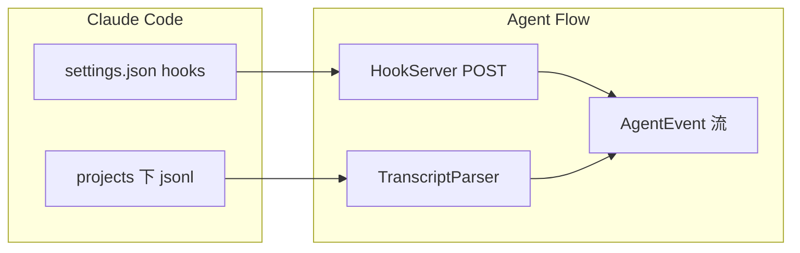

<details>
<summary>相关源文件</summary>

生成本页时使用的主要源文件：

- [extension/src/hook-server.ts](../../../project-repos/agent-flow/extension/src/hook-server.ts)
- [extension/src/hooks-config.ts](../../../project-repos/agent-flow/extension/src/hooks-config.ts)
- [extension/src/transcript-parser.ts](../../../project-repos/agent-flow/extension/src/transcript-parser.ts)
- [scripts/relay.ts](../../../project-repos/agent-flow/scripts/relay.ts)

</details>

# Claude Code：Hooks 与 JSONL 转录

Claude Code 的 Hook 机制让 Agent Flow 能在**不拦截工具执行**的前提下拿到实时信号。`HookServer` 在扩展进程里起一个极简 `http.Server`：只接受 `POST`，解析 `session_id` + `hook_event_name`，把 `PreToolUse` / `SubagentStart` 等映射成 `AgentEvent`；响应永远是 `200` 且**空 body**——注释写得很直白：返回 JSON 会触发 Claude Code 的 schema 解析，反而坏事。

**配置策略**：`configureClaudeHooks` 读取 `~/.claude/settings.json`，把 `SessionStart`、`PreToolUse`、`PostToolUse`、`SubagentStart/Stop`、`Stop`、`SessionEnd` 等键 merge 进去；通过 `HOOK_COMMAND_MARKER` 识别旧条目并替换，支持遗留的 HTTP URL hook。工作区级的 `.claude/settings.local.json` 也会被探测。

**转录解析**：`TranscriptParser` 从 SessionWatcher 抽离出来，专职 JSONL 行的语义：工具块、thinking、redacted thinking 的占位符、子代理 `emitSubagentSpawn` 等。Relay 里复用同一 parser，保证「Hook 先到、转录用同一 ID 补齐」时不分裂两套逻辑。



**洞察**：Port 冲突时 HookServer 选择 `HOOK_SERVER_NOT_STARTED` 而不是随机换端口——否则「没有任何人往新端口 POST」，靠 JSONL 仍能跑通全链路；这是防御性设计而非炫技。

Sources: [extension/src/hook-server.ts:16-100](../../../project-repos/patoles-agent-flow/extension/src/hook-server.ts#L16-L100), [extension/src/hooks-config.ts:75-91](../../../project-repos/patoles-agent-flow/extension/src/hooks-config.ts#L75-L91), [extension/src/transcript-parser.ts:1-37](../../../project-repos/patoles-agent-flow/extension/src/transcript-parser.ts#L1-L37)

<details class="source-snippets">
<summary>引用源码</summary>

<!-- source-snippets:start -->

#### `extension/src/hook-server.ts:16-100`

```typescript
/**
 * Lightweight HTTP server that receives Claude Code hook events.
 *
 * Claude Code hooks POST JSON payloads for events like PreToolUse, PostToolUse,
 * SubagentStart, SubagentStop, SessionStart, Stop, etc.
 *
 * We transform these into AgentEvent format and emit them.
 */

/** Port 0 = let OS assign a random available port */

interface HookPayload {
  session_id: string
  transcript_path?: string
  cwd?: string
  hook_event_name: string
  // PreToolUse / PostToolUse
  tool_name?: string
  tool_input?: Record<string, unknown>
  tool_use_id?: string
  tool_response?: string | { content: string } | Array<{ text?: string }>
  // SubagentStart / SubagentStop
  agent_id?: string
  agent_type?: string
  agent_transcript_path?: string
  // Notification
  notification_type?: string
  message?: string
  title?: string
  // Generic
  [key: string]: unknown
}

export class HookServer implements vscode.Disposable {
  private server: http.Server | null = null
  private port: number
  /** Per-session state — cleaned up on SessionEnd/Stop to prevent unbounded growth */
  private sessionState = new Map<string, {
    startTime: number
    agentNames: Map<string, string> // agent_id → friendly name
  }>()

  private readonly _onEvent = new vscode.EventEmitter<AgentEvent>()

  readonly onEvent = this._onEvent.event

  constructor(port?: number) {
    this.port = port ?? 0
  }

  async start(): Promise<number> {
    return new Promise((resolve, reject) => {
      this.server = http.createServer((req, res) => {
        if (req.method === 'POST') {
          let body = ''
          let oversized = false
          req.on('data', (chunk: Buffer) => {
            if (oversized) return
            body += chunk.toString()
            if (body.length > HOOK_MAX_BODY_SIZE) {
              oversized = true
              body = ''
              log.warn('Request body exceeded size limit, discarding')
            }
          })
          req.on('end', () => {
            if (!oversized) {
              try {
                const parsed: unknown = JSON.parse(body)
                if (!parsed || typeof parsed !== 'object' || !('session_id' in parsed) || !('hook_event_name' in parsed)
                    || typeof (parsed as HookPayload).session_id !== 'string'
                    || typeof (parsed as HookPayload).hook_event_name !== 'string') {
                  log.warn('Invalid hook payload: missing session_id or hook_event_name')
                } else {
                  this.handleHook(parsed as HookPayload)
                }
              } catch (e) {
                log.error('Failed to parse payload:', e)
              }
            }
            // Always return 200 with empty body — we're observing, not blocking.
            // Empty body = "success, no output" per Claude Code docs.
            // Returning JSON (even '{}') triggers schema parsing which can cause issues.
            res.writeHead(200)
            res.end()
```

#### `extension/src/hooks-config.ts:75-91`

```typescript
export async function configureClaudeHooks(): Promise<void> {
  ensureHookScript()

  const hookCommand = getHookCommand()
  const hookEntry = { hooks: [{ type: 'command', command: hookCommand, timeout: HOOK_TIMEOUT_S }] }

  const hooksConfig = {
    SessionStart: [hookEntry],
    PreToolUse: [hookEntry],
    PostToolUse: [hookEntry],
    PostToolUseFailure: [hookEntry],
    SubagentStart: [hookEntry],
    SubagentStop: [hookEntry],
    Notification: [hookEntry],
    Stop: [hookEntry],
    SessionEnd: [hookEntry],
  }
```

#### `extension/src/transcript-parser.ts:1-37`

```typescript
/**
 * Transcript parsing logic extracted from SessionWatcher.
 *
 * Parses JSONL transcript lines and emits AgentEvents via a delegate,
 * keeping the parsing logic decoupled from file-watching concerns.
 */

import {
  AgentEvent, PendingToolCall, WatchedSession,
  TranscriptEntry, ToolUseBlock, ToolResultBlock,
  emitSubagentSpawn,
} from './protocol'
import { readFileChunk } from './fs-utils'
import {
  PREVIEW_MAX, ARGS_MAX, RESULT_MAX, MESSAGE_MAX,
  SESSION_LABEL_MAX, SESSION_LABEL_TRUNCATED,
  CHILD_NAME_MAX,
  HASH_PREFIX_MAX,
  ORCHESTRATOR_NAME,
  FAILED_RESULT_MAX,
  SYSTEM_CONTENT_PREFIXES,
  generateSubagentFallbackName,
  resolveSubagentChildName,
} from './constants'
import { summarizeInput, summarizeResult, extractInputData, detectError, buildDiscovery } from './tool-summarizer'
import { estimateTokensFromContent, estimateTokensFromText } from './token-estimator'
import { createLogger } from './logger'

const log = createLogger('TranscriptParser')

export interface TranscriptParserDelegate {
  emit(event: AgentEvent, sessionId?: string): void
  elapsed(sessionId?: string): number
  getSession(sessionId: string): WatchedSession | undefined
  fireSessionLifecycle(event: { type: 'started' | 'ended' | 'updated'; sessionId: string; label: string }): void
  emitContextUpdate(agentName: string, session: WatchedSession, sessionId?: string): void
}
```

<!-- source-snippets:end -->
</details>
## 相关页面

- [中继层与 SSE 流](event-relay-and-sse.md)
- [VS Code / Cursor 扩展](vscode-extension.md)
- [可视化前端与仿真状态机](visualization-ui.md)
