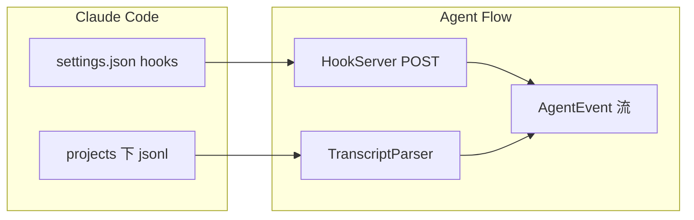

相关源文件

生成本页时使用的主要源文件：

- [extension/src/hook-server.ts](../../../project-repos/agent-flow/extension/src/hook-server.ts)
- [extension/src/hooks-config.ts](../../../project-repos/agent-flow/extension/src/hooks-config.ts)
- [extension/src/transcript-parser.ts](../../../project-repos/agent-flow/extension/src/transcript-parser.ts)
- [scripts/relay.ts](../../../project-repos/agent-flow/scripts/relay.ts)

# Claude Code：Hooks 与 JSONL 转录

Claude Code 的 Hook 机制让 Agent Flow 能在**不拦截工具执行**的前提下拿到实时信号。`HookServer` 在扩展进程里起一个极简 `http.Server`：只接受 `POST`，解析 `session_id` + `hook_event_name`，把 `PreToolUse` / `SubagentStart` 等映射成 `AgentEvent`；响应永远是 `200` 且**空 body**——注释写得很直白：返回 JSON 会触发 Claude Code 的 schema 解析，反而坏事。

**配置策略**：`configureClaudeHooks` 读取 `~/.claude/settings.json`，把 `SessionStart`、`PreToolUse`、`PostToolUse`、`SubagentStart/Stop`、`Stop`、`SessionEnd` 等键 merge 进去；通过 `HOOK_COMMAND_MARKER` 识别旧条目并替换，支持遗留的 HTTP URL hook。工作区级的 `.claude/settings.local.json` 也会被探测。

**转录解析**：`TranscriptParser` 从 SessionWatcher 抽离出来，专职 JSONL 行的语义：工具块、thinking、redacted thinking 的占位符、子代理 `emitSubagentSpawn` 等。Relay 里复用同一 parser，保证「Hook 先到、转录用同一 ID 补齐」时不分裂两套逻辑。

**洞察**：Port 冲突时 HookServer 选择 `HOOK_SERVER_NOT_STARTED` 而不是随机换端口——否则「没有任何人往新端口 POST」，靠 JSONL 仍能跑通全链路；这是防御性设计而非炫技。

Sources: [extension/src/hook-server.ts:16-100](../../../project-repos/pages/extension/src/hook-server.ts#L16-L100), [extension/src/hooks-config.ts:75-91](../../../project-repos/pages/extension/src/hooks-config.ts#L75-L91), [extension/src/transcript-parser.ts:1-37](../../../project-repos/pages/extension/src/transcript-parser.ts#L1-L37)

引用源码

<!-- source-snippets:start -->

#### `extension/src/hook-server.ts:16-100`

> 未找到引用文件：`extension/src/hook-server.ts`

#### `extension/src/hooks-config.ts:75-91`

> 未找到引用文件：`extension/src/hooks-config.ts`

#### `extension/src/transcript-parser.ts:1-37`

> 未找到引用文件：`extension/src/transcript-parser.ts`

<!-- source-snippets:end -->

## 相关页面

- [中继层与 SSE 流](event-relay-and-sse.md)
- [VS Code / Cursor 扩展](vscode-extension.md)
- [可视化前端与仿真状态机](visualization-ui.md)
