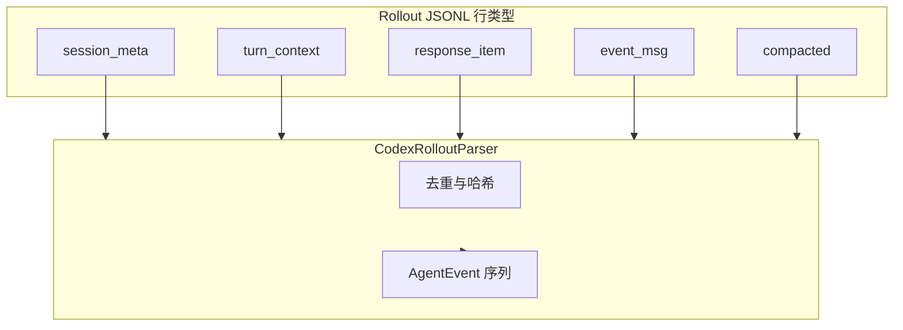

相关源文件

生成本页时使用的主要源文件：

- [extension/src/codex-rollout-parser.ts](../../../project-repos/agent-flow/extension/src/codex-rollout-parser.ts)
- [scripts/relay.ts](../../../project-repos/agent-flow/scripts/relay.ts)
- [extension/test/codex-rollout-parser.test.ts](../../../project-repos/agent-flow/extension/test/codex-rollout-parser.test.ts)

# Codex：Rollout JSONL 解析

Codex 不写与 Claude 同构的 Hook payload，而是把权威叙事放在 `~/.codex/sessions/**/rollout-*.jsonl`。`codex-rollout-parser.ts` 顶层注释把五种 record 类型拆开：`session_meta`、`turn_context`、`response_item`、`event_msg`、`compacted`，并写明**去重策略**：例如 message 只从 `response_item.message` 发射，`event_msg` 里的镜像行跳过；reasoning 只认 `agent_reasoning` 明文，encrypted `response_item` 侧直接视为不可展示。

**与 Claude 的差异**：子代理章节写明「Codex 当前不暴露 spawn 语义」——parser 只发一个 orchestrator；未来若 `spawn_agent` 进协议，再集中改这一文件。**Token 权威**：`lastReportedTokens`、`reportedContextWindow` 等字段紧跟 `event_msg.token_count`，这类数字进入 UI 的 context 条，比估算更有说服力。

**测试锚点**：`extension/test/codex-rollout-parser.test.ts` + `fixtures/codex-rollout-sample.jsonl` 给后续改动提供回归网——这在「事件顺序敏感」的 parser 里尤其值钱。

Sources: [extension/src/codex-rollout-parser.ts:1-32](../../../project-repos/pages/extension/src/codex-rollout-parser.ts#L1-L32), [extension/src/codex-rollout-parser.ts:88-100](../../../project-repos/pages/extension/src/codex-rollout-parser.ts#L88-L100)

引用源码

<!-- source-snippets:start -->

#### `extension/src/codex-rollout-parser.ts:1-32`

> 未找到引用文件：`extension/src/codex-rollout-parser.ts`

#### `extension/src/codex-rollout-parser.ts:88-100`

> 未找到引用文件：`extension/src/codex-rollout-parser.ts`

<!-- source-snippets:end -->

## 相关页面

- [中继层与 SSE 流](event-relay-and-sse.md)
- [项目概览](overview.md)
