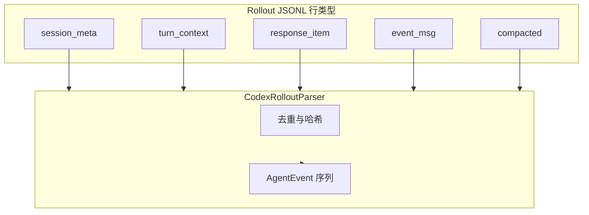

<details>
<summary>相关源文件</summary>

生成本页时使用的主要源文件：

- [extension/src/codex-rollout-parser.ts](../../../project-repos/agent-flow/extension/src/codex-rollout-parser.ts)
- [scripts/relay.ts](../../../project-repos/agent-flow/scripts/relay.ts)
- [extension/test/codex-rollout-parser.test.ts](../../../project-repos/agent-flow/extension/test/codex-rollout-parser.test.ts)

</details>

# Codex：Rollout JSONL 解析

Codex 不写与 Claude 同构的 Hook payload，而是把权威叙事放在 `~/.codex/sessions/**/rollout-*.jsonl`。`codex-rollout-parser.ts` 顶层注释把五种 record 类型拆开：`session_meta`、`turn_context`、`response_item`、`event_msg`、`compacted`，并写明**去重策略**：例如 message 只从 `response_item.message` 发射，`event_msg` 里的镜像行跳过；reasoning 只认 `agent_reasoning` 明文，encrypted `response_item` 侧直接视为不可展示。

**与 Claude 的差异**：子代理章节写明「Codex 当前不暴露 spawn 语义」——parser 只发一个 orchestrator；未来若 `spawn_agent` 进协议，再集中改这一文件。**Token 权威**：`lastReportedTokens`、`reportedContextWindow` 等字段紧跟 `event_msg.token_count`，这类数字进入 UI 的 context 条，比估算更有说服力。



**测试锚点**：`extension/test/codex-rollout-parser.test.ts` + `fixtures/codex-rollout-sample.jsonl` 给后续改动提供回归网——这在「事件顺序敏感」的 parser 里尤其值钱。

Sources: [extension/src/codex-rollout-parser.ts:1-32](../../../project-repos/patoles-agent-flow/extension/src/codex-rollout-parser.ts#L1-L32), [extension/src/codex-rollout-parser.ts:88-100](../../../project-repos/patoles-agent-flow/extension/src/codex-rollout-parser.ts#L88-L100)

<details class="source-snippets">
<summary>引用源码</summary>

<!-- source-snippets:start -->

#### `extension/src/codex-rollout-parser.ts:1-32`

```typescript
/**
 * Parser for Codex rollout JSONL files at ~/.codex/sessions/YYYY/MM/DD/rollout-*.jsonl
 *
 * Codex writes five top-level record types. This parser handles all of them:
 *
 *   session_meta  — first line; carries cwd, cli_version, session id, base
 *                   instructions (system prompt)
 *   turn_context  — per turn; carries the authoritative model id for that turn
 *                   plus approval/sandbox policy. May change mid-session.
 *   response_item — OpenAI Responses API-shaped turn data: messages, function
 *                   calls, function call outputs, custom tool calls, reasoning
 *   event_msg     — Codex lifecycle events: task_started/complete, token_count,
 *                   agent_reasoning (plaintext thinking), exec_command_end, etc.
 *   compacted     — auto-compaction marker with replacement_history
 *
 * Dedup strategy:
 *   Messages     — emitted from response_item.message only. event_msg's
 *                   agent_message / user_message are mirrors of the response_item
 *                   content (sometimes imperfect for user messages) and are
 *                   skipped. System-injected user content (IDE context,
 *                   subagent notifications) is filtered.
 *   Reasoning    — emitted from event_msg.agent_reasoning only. response_item's
 *                   reasoning payload carries encrypted_content + summary[] and
 *                   isn't useful for display.
 *   Tool results — emitted from function_call_output / custom_tool_call_output
 *                   only. event_msg.exec_command_end / patch_apply_end are
 *                   parallel signals and are skipped.
 *
 * Subagents: Codex does not currently expose subagent spawning in rollouts.
 * The parser emits a single orchestrator; if Codex adds spawn_agent / wait_agent
 * in future, add mapping here.
 */
```

#### `extension/src/codex-rollout-parser.ts:88-100`

```typescript
export function createCodexRolloutState(): CodexRolloutState {
  return {
    model: null,
    cwd: null,
    label: null,
    pendingToolCalls: new Map(),
    seenMessageHashes: new Set(),
    contextBreakdown: {
      systemPrompt: SYSTEM_PROMPT_BASE_TOKENS,
      userMessages: 0,
      toolResults: 0,
      reasoning: 0,
      subagentResults: 0,
```

<!-- source-snippets:end -->
</details>
## 相关页面

- [中继层与 SSE 流](event-relay-and-sse.md)
- [项目概览](overview.md)
