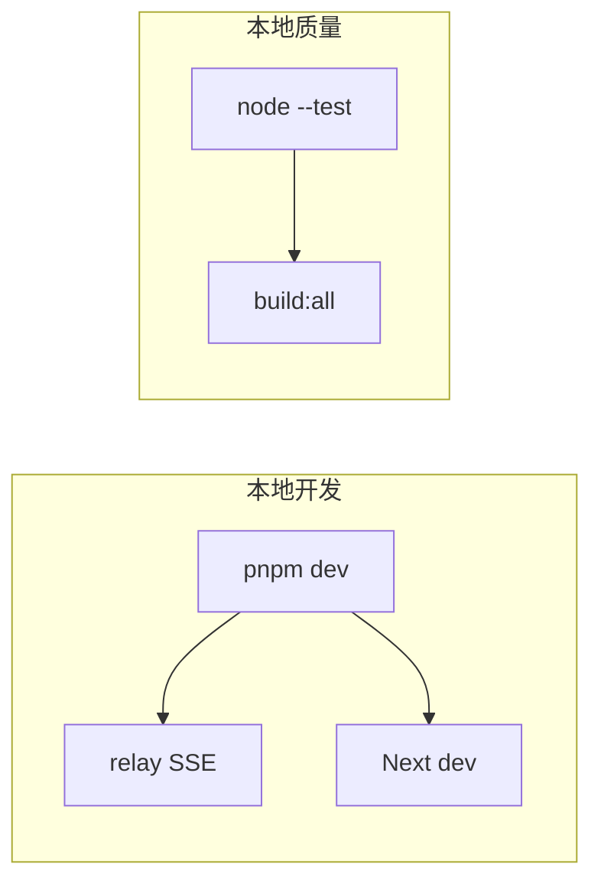

相关源文件

生成本页时使用的主要源文件：

- [package.json](../../../project-repos/agent-flow/package.json)
- [web/package.json](../../../project-repos/agent-flow/web/package.json)
- [CONTRIBUTING.md](../../../project-repos/agent-flow/CONTRIBUTING.md)

# 开发、构建与测试

日常闭环在根 `package.json`：`pnpm i` → `pnpm run setup`（Claude hooks）→ `pnpm run dev` 并行 relay + web。单测入口是 Node 原生 `node --import tsx --test`，覆盖 `scripts/**/*.test.ts` 与 `app/src/**/*.test.ts`。

**常用脚本速查**

| 脚本 | 作用 |
|------|------|
| `dev:relay` | 构建并跑开发 relay |
| `dev:web` | Next dev |
| `dev:demo` | `NEXT_PUBLIC_DEMO=1` 只看 UI |
| `build:all` | webview + extension 生产包 |
| `build:web` / `build:extension` / `build:webview` | 拆分构建 |
| `build:app` | 打 `app` 发行物 |

**扩展侧**：`extension/package.json` 自有 `esbuild.js` pipeline；测试含 `codex-rollout-parser`、`fs-utils` 等。**贡献流程**细节见 `CONTRIBUTING.md`（行为准则、PR 期望）。

Sources: [package.json:1-16](../../../project-repos/pages/package.json#L1-L16)

引用源码

<!-- source-snippets:start -->

#### `package.json:1-16`

> 未找到引用文件：`package.json`

<!-- source-snippets:end -->

## 相关页面

- [系统架构与仓库布局](system-architecture.md)
- [VS Code / Cursor 扩展](vscode-extension.md)
