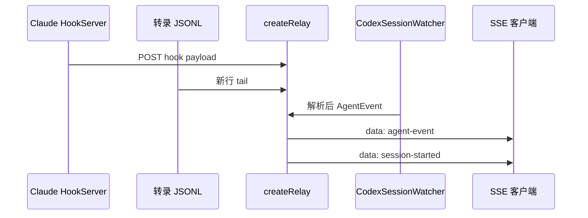

相关源文件

生成本页时使用的主要源文件：

- [scripts/relay.ts](../../../project-repos/agent-flow/scripts/relay.ts)
- [app/src/server.ts](../../../project-repos/agent-flow/app/src/server.ts)
- [extension/src/protocol.ts](../../../project-repos/agent-flow/extension/src/protocol.ts)

# 中继层与 SSE 流

`createRelay` 是 Agent Flow 的「汇流排」：一侧接住 Claude 的 Hook 与转录增量，一侧挂上 `CodexSessionWatcher`，向外只暴露 **`broadcast(JSON.stringify({ type: 'agent-event', event }))`** 这一种实时语义，外加 `session-started` 等生命周期帧。前端或 CLI 浏览器只要连上 `/events`，就与扩展里的 Webview 看到同源事件。

**SSE 客户端管理**：`sseClients` 是 `Set<ServerResponse>`；`sendSSE` 写 `data: ${JSON.stringify(...)}\n\n`，断开时从 Set 剔除。**事件缓冲**按 `sessionId` 保留最近 `MAX_EVENT_BUFFER`（5000）条，新客户端连接时把「最近活跃会话」的缓冲批量 `agent-event-batch` 推过去，实现面板刷新后的快速追赶。

**Claude 路径摘要**：`TranscriptParser` 构造时注入 `emitEvent`、`broadcastSessionLifecycle`、`emitContextUpdate` 等委托，与扩展内 SessionWatcher 行为对齐。`watchSession` 为每个 jsonl 注册文件 watcher + poll 兜底，并用 `INACTIVITY_TIMEOUT_MS` 把长时间无写盘的会话标为 complete。

**Codex 路径摘要**：当 `AGENT_FLOW_RUNTIME` 允许 codex 时，`CodexSessionWatcher` 单独 `onEvent` 进 `broadcastEvent`；代码注释明确：不在外层再订阅 `onSessionDetected`，否则 `session-started` 会双重广播。

**Telemetry 挂钩**：relay 进程启动时 `telemetry.emit(session_start)`，`dispose` 时带上 `event_count`、`models`、`runtimes` 发 `session_end`（`relay.ts` dispose 分支）。这与 README 中「仅聚合遥测」的说明相互印证。

Sources: [scripts/relay.ts:60-101](../../../project-repos/pages/scripts/relay.ts#L60-L101), [scripts/relay.ts:466-510](../../../project-repos/pages/scripts/relay.ts#L466-L510), [scripts/relay.ts:420-434](../../../project-repos/pages/scripts/relay.ts#L420-L434), [app/src/server.ts:31-36](../../../project-repos/pages/app/src/server.ts#L31-L36)

引用源码

<!-- source-snippets:start -->

#### `scripts/relay.ts:60-101`

> 未找到引用文件：`scripts/relay.ts`

#### `scripts/relay.ts:466-510`

> 未找到引用文件：`scripts/relay.ts`

#### `scripts/relay.ts:420-434`

> 未找到引用文件：`scripts/relay.ts`

#### `app/src/server.ts:31-36`

> 未找到引用文件：`app/src/server.ts`

<!-- source-snippets:end -->

## 相关页面

- [Claude Code：Hooks 与 JSONL 转录](claude-hooks-and-transcripts.md)
- [Codex：Rollout JSONL 解析](codex-rollout.md)
- [独立应用与 npx 分发](standalone-npx-app.md)
