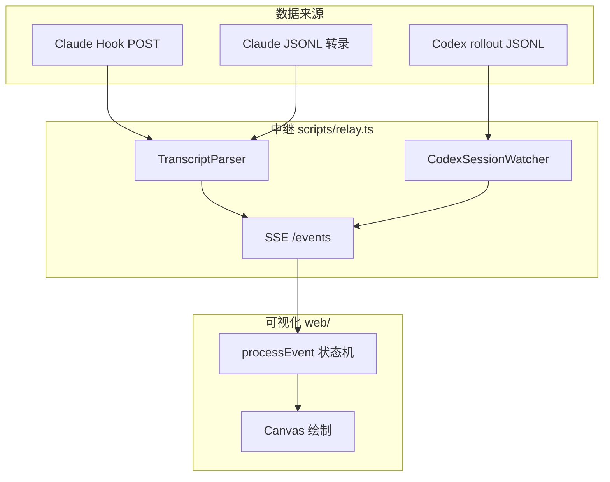

<details>
<summary>相关源文件</summary>

生成本页时使用的主要源文件：

- [README.md](../../../project-repos/agent-flow/README.md)
- [extension/src/session-runtime.ts](../../../project-repos/agent-flow/extension/src/session-runtime.ts)
- [scripts/relay.ts](../../../project-repos/agent-flow/scripts/relay.ts)
- [extension/src/extension.ts](../../../project-repos/agent-flow/extension/src/extension.ts)

</details>

# 项目概览

CraftMyGame 一类「多代理驱动产品」里，调试成本往往不在模型回答质量，而在**编排不可见**：主代理何时派生子代理、工具链如何分支、哪一步拖慢了整体。Agent Flow 直接把 Claude Code 的 Hook 事件与 JSONL 转录、以及 Codex 的 `rollout-*.jsonl` 权威事件流，收敛成同一套 `AgentEvent`，再用画布与时间线渲染出来。

**双运行时**是设计的轴心：`session-runtime.ts` 把「每种 CLI」抽象成 `AgentSessionWatcher`：统一的 `onEvent`、`onSessionLifecycle`、重放进面板；扩展里用 `startClaudeRuntime` 与 `startCodexRuntime` 并行挂载，`agentVisualizer.runtime` 或 `AGENT_FLOW_RUNTIME` 可收窄只监听一方。

**核心价值**可以概括为三条：低延迟（Hook POST 直达本地 HTTP 服务）、可回放（缓冲 + SSE 重放）、可对齐（Codex parser 明确写出去重策略，避免 mirror 事件刷屏）。



上图把「三路输入、一套事件、一个 UI」的空间关系压成一张图：Relay 负责聚合，前端只消费归一化事件。

**能力快照**

- **实时节点图**：`agent_spawn`、`tool_call_*`、`subagent_*` 等事件驱动仿真状态（见 `process-event.ts`）。
- **Claude 零侵入观察**：Hook Server 固定 `200` 空 body，避免阻断 Claude Code 自己的 schema 解析（`hook-server.ts`）。
- **Codex 权威 token**：rollout 里的 `event_msg.token_count` 等进入同一套 `context_update` 语义。
- **三入口一致**：VS Code 扩展、`pnpm run dev`、`npx agent-flow-app` 复用 `createRelay` 核心路径。

**技术栈（可量化）**：根 `package.json` 仅列 `concurrently`、`esbuild`、`tsx`；`web` 为 Next.js + Vite webview 双构建；`extension` 独立 esbuild；`app` 发布 `agent-flow-app` **0.8.1**（`app/package.json`）。

**阅读路线**

- 先要**端到端数据路径**：→ [中继层与 SSE 流](event-relay-and-sse.md)
- 关心 **Claude 侧**：→ [Claude Hooks 与 JSONL 转录](claude-hooks-and-transcripts.md)
- 关心 **Codex 侧**：→ [Codex：Rollout JSONL 解析](codex-rollout.md)
- 深入 **UI 状态机**：→ [可视化前端与仿真状态机](visualization-ui.md)

Sources: [README.md:1-17](../../../project-repos/patoles-agent-flow/README.md#L1-L17), [extension/src/session-runtime.ts:1-48](../../../project-repos/patoles-agent-flow/extension/src/session-runtime.ts#L1-L48), [extension/src/extension.ts:28-44](../../../project-repos/patoles-agent-flow/extension/src/extension.ts#L28-L44)

<details class="source-snippets">
<summary>引用源码</summary>

<!-- source-snippets:start -->

#### `README.md:1-17`

```markdown
# Agent Flow

Real-time visualization of Claude Code and Codex agent orchestration. Watch your agents think, branch, and coordinate as they work. [Demo video here](https://www.youtube.com/watch?v=Ud6eDrFN-TA). 


## Why Agent Flow?

I built Agent Flow while developing [CraftMyGame](https://craftmygame.com), a game creation platform driven by AI agents. Debugging agent behavior was painful, so we made it visual. Now we're sharing it.

Claude Code is powerful, but its execution is a black box — you see the final result, not the journey. Agent Flow makes the invisible visible:

- **Understand agent behavior** — See how Claude breaks down problems, which tools it reaches for, and how subagents coordinate
- **Debug tool call chains** — When something goes wrong, trace the exact sequence of decisions and tool calls that led there
- **See where time is spent** — Identify slow tool calls, unnecessary branching, or redundant work at a glance
- **Learn by watching** — Build intuition for how to write better prompts by observing how Claude interprets and executes them

```

#### `extension/src/session-runtime.ts:1-48`

```typescript
/**
 * Runtime abstraction for agent session watchers.
 *
 * Each supported agent tool (Claude Code, Codex, ...) implements
 * AgentSessionWatcher and is started via a runtime factory in extension.ts.
 * The interface deliberately matches what the visualizer needs to render
 * live activity: an event stream, session lifecycle, and replay on panel
 * open. Runtime-specific concerns (hook servers, SQLite lookups, etc.)
 * live inside each runtime's startXxxRuntime() factory, not here.
 */

import * as vscode from 'vscode'
import type { AgentEvent, SessionInfo } from './protocol'
import { VisualizerPanel } from './webview-provider'
import { SESSION_ID_DISPLAY, STATUS_MESSAGE_DURATION_MS } from './constants'
import type { TypedDisposable, TypedEvent } from './typed-event-emitter'

export type AgentRuntimeMode = 'claude' | 'codex'

export interface SessionLifecycleEvent {
  type: 'started' | 'ended' | 'updated'
  sessionId: string
  label: string
}

/** Interface every runtime's watcher implements. Uses portable typed-event
 *  types (not vscode.Event) so watchers can run in the relay/CLI too. */
export interface AgentSessionWatcher extends TypedDisposable {
  readonly onEvent: TypedEvent<AgentEvent>
  readonly onSessionDetected: TypedEvent<string>
  readonly onSessionLifecycle: TypedEvent<SessionLifecycleEvent>
  start(): void
  isActive(): boolean
  isSessionActive(sessionId: string): boolean
  getActiveSessions(): SessionInfo[]
  replaySessionStart(sessionIds?: string[]): void
}

/** A running runtime: its watcher, a status line describing its connection,
 *  and a disposer for runtime-specific resources beyond the watcher itself
 *  (e.g. the Claude hook server and discovery file). */
export interface AgentRuntime {
  readonly mode: AgentRuntimeMode
  readonly watcher: AgentSessionWatcher
  /** Human-readable connection status for the webview. May change over time. */
  connectionStatus(): string
  dispose(): void
}
```

#### `extension/src/extension.ts:28-44`

```typescript
async function startRuntimes(
  mode: ConfiguredRuntimeMode,
  context: vscode.ExtensionContext,
): Promise<StartRuntimesResult> {
  const runtimes: AgentRuntime[] = []
  const failures: AgentRuntimeMode[] = []
  if (mode === 'claude' || mode === 'auto') {
    log.info('Starting Claude runtime...')
    try { runtimes.push(await startClaudeRuntime(context)) }
    catch (err) { log.error('Claude runtime failed to start:', err); failures.push('claude') }
  }
  if (mode === 'codex' || mode === 'auto') {
    log.info('Starting Codex runtime...')
    try { runtimes.push(startCodexRuntime(context)) }
    catch (err) { log.error('Codex runtime failed to start:', err); failures.push('codex') }
  }
  return { runtimes, failures }
```

<!-- source-snippets:end -->
</details>
## 相关页面

- [系统架构与仓库布局](system-architecture.md)
- [中继层与 SSE 流](event-relay-and-sse.md)
- [可视化前端与仿真状态机](visualization-ui.md)
