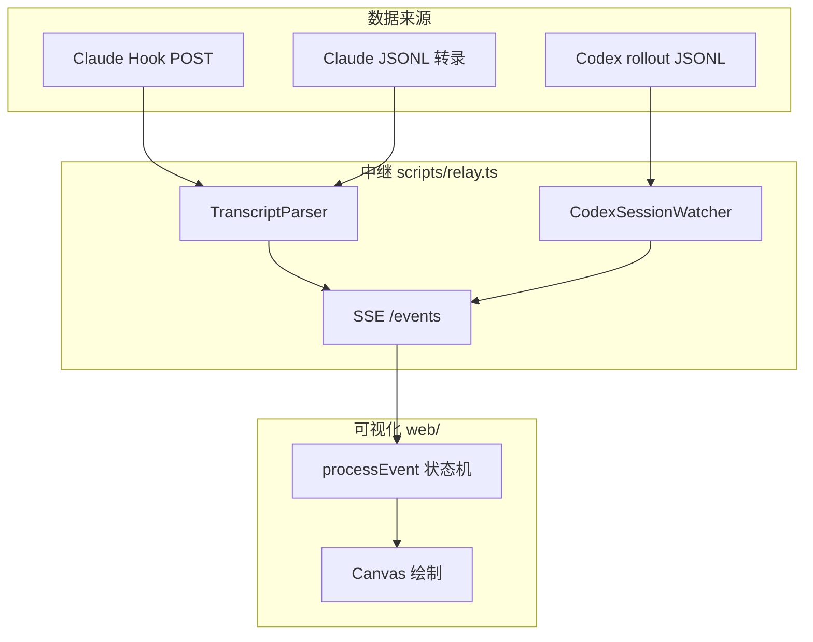

相关源文件

生成本页时使用的主要源文件：

- [README.md](../../../project-repos/agent-flow/README.md)
- [extension/src/session-runtime.ts](../../../project-repos/agent-flow/extension/src/session-runtime.ts)
- [scripts/relay.ts](../../../project-repos/agent-flow/scripts/relay.ts)
- [extension/src/extension.ts](../../../project-repos/agent-flow/extension/src/extension.ts)

# 项目概览

CraftMyGame 一类「多代理驱动产品」里，调试成本往往不在模型回答质量，而在**编排不可见**：主代理何时派生子代理、工具链如何分支、哪一步拖慢了整体。Agent Flow 直接把 Claude Code 的 Hook 事件与 JSONL 转录、以及 Codex 的 `rollout-*.jsonl` 权威事件流，收敛成同一套 `AgentEvent`，再用画布与时间线渲染出来。

**双运行时**是设计的轴心：`session-runtime.ts` 把「每种 CLI」抽象成 `AgentSessionWatcher`：统一的 `onEvent`、`onSessionLifecycle`、重放进面板；扩展里用 `startClaudeRuntime` 与 `startCodexRuntime` 并行挂载，`agentVisualizer.runtime` 或 `AGENT_FLOW_RUNTIME` 可收窄只监听一方。

**核心价值**可以概括为三条：低延迟（Hook POST 直达本地 HTTP 服务）、可回放（缓冲 + SSE 重放）、可对齐（Codex parser 明确写出去重策略，避免 mirror 事件刷屏）。

上图把「三路输入、一套事件、一个 UI」的空间关系压成一张图：Relay 负责聚合，前端只消费归一化事件。

**能力快照**

- **实时节点图**：`agent_spawn`、`tool_call_*`、`subagent_*` 等事件驱动仿真状态（见 `process-event.ts`）。
- **Claude 零侵入观察**：Hook Server 固定 `200` 空 body，避免阻断 Claude Code 自己的 schema 解析（`hook-server.ts`）。
- **Codex 权威 token**：rollout 里的 `event_msg.token_count` 等进入同一套 `context_update` 语义。
- **三入口一致**：VS Code 扩展、`pnpm run dev`、`npx agent-flow-app` 复用 `createRelay` 核心路径。

**技术栈（可量化）**：根 `package.json` 仅列 `concurrently`、`esbuild`、`tsx`；`web` 为 Next.js + Vite webview 双构建；`extension` 独立 esbuild；`app` 发布 `agent-flow-app` **0.8.1**（`app/package.json`）。

**阅读路线**

- 先要**端到端数据路径**：→ [中继层与 SSE 流](event-relay-and-sse.md)
- 关心 **Claude 侧**：→ [Claude Hooks 与 JSONL 转录](claude-hooks-and-transcripts.md)
- 关心 **Codex 侧**：→ [Codex：Rollout JSONL 解析](codex-rollout.md)
- 深入 **UI 状态机**：→ [可视化前端与仿真状态机](visualization-ui.md)

Sources: [README.md:1-17](../../../project-repos/pages/README.md#L1-L17), [extension/src/session-runtime.ts:1-48](../../../project-repos/pages/extension/src/session-runtime.ts#L1-L48), [extension/src/extension.ts:28-44](../../../project-repos/pages/extension/src/extension.ts#L28-L44)

引用源码

<!-- source-snippets:start -->

#### `README.md:1-17`

> 未找到引用文件：`README.md`

#### `extension/src/session-runtime.ts:1-48`

> 未找到引用文件：`extension/src/session-runtime.ts`

#### `extension/src/extension.ts:28-44`

> 未找到引用文件：`extension/src/extension.ts`

<!-- source-snippets:end -->

## 相关页面

- [系统架构与仓库布局](system-architecture.md)
- [中继层与 SSE 流](event-relay-and-sse.md)
- [可视化前端与仿真状态机](visualization-ui.md)
