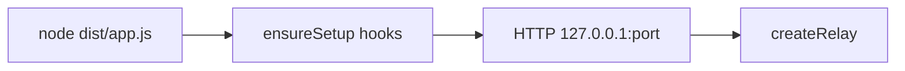

相关源文件

生成本页时使用的主要源文件：

- [app/src/app.ts](../../../project-repos/agent-flow/app/src/app.ts)
- [app/src/server.ts](../../../project-repos/agent-flow/app/src/server.ts)
- [app/package.json](../../../project-repos/agent-flow/app/package.json)

# 独立应用与 npx 分发

`npx agent-flow-app`（包名 `@agent-flow/app`，npm 上二进制的-friendly 名称是 `agent-flow`）在 `app.ts` 里完成四步：**解析参数** → **`ensureSetup()`** 写 Claude hooks → **`startServer()`** 绑定本机 HTTP → 可选 `open` 浏览器。与 README 的 Quick Start 一致：用户不需要先开 VS Code。

**服务器行为**：只监听 `127.0.0.1`，减小暴露面；`/events` 专用于 SSE；`SIGINT` / `SIGTERM` / `SIGHUP` 都挂载同一 `cleanup`，注释强调重复信号不会双发 `session_end`、也不会和 telemetry flush 竞态。

**与工作区的语义**：`createRelay({ workspace: process.cwd() })` 把当前 shell 目录当作会话扫描锚点；在 monorepo 子目录启动时，只会高亮「与 cwd 匹配」的 Codex / Claude 会话，这一行为与 README 里「另开终端跑 Claude」的心智模型吻合。

**版本号**：`app/package.json` 当前 **0.8.1**；与 README 中遥测 schema 说明交叉引用。

Sources: [app/src/app.ts:12-29](../../../project-repos/pages/app/src/app.ts#L12-L29), [app/src/server.ts:21-75](../../../project-repos/pages/app/src/server.ts#L21-L75), [app/package.json:1-26](../../../project-repos/pages/app/package.json#L1-L26)

引用源码

<!-- source-snippets:start -->

#### `app/src/app.ts:12-29`

> 未找到引用文件：`app/src/app.ts`

#### `app/src/server.ts:21-75`

> 未找到引用文件：`app/src/server.ts`

#### `app/package.json:1-26`

> 未找到引用文件：`app/package.json`

<!-- source-snippets:end -->

## 相关页面

- [中继层与 SSE 流](event-relay-and-sse.md)
- [遥测、隐私与安全边界](telemetry-security.md)
