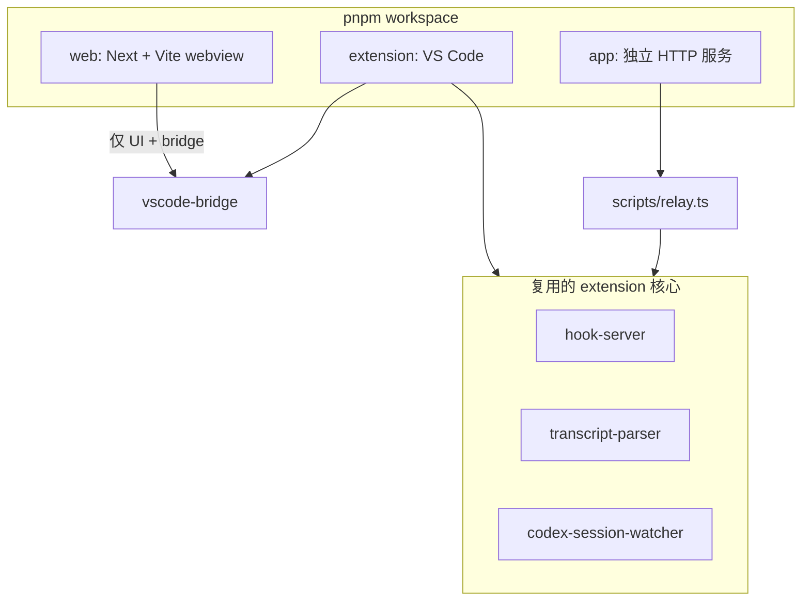

<details>
<summary>相关源文件</summary>

生成本页时使用的主要源文件：

- [pnpm-workspace.yaml](../../../project-repos/agent-flow/pnpm-workspace.yaml)
- [package.json](../../../project-repos/agent-flow/package.json)
- [web/package.json](../../../project-repos/agent-flow/web/package.json)
- [extension/package.json](../../../project-repos/agent-flow/extension/package.json)
- [app/src/server.ts](../../../project-repos/agent-flow/app/src/server.ts)

</details>

# 系统架构与仓库布局

Agent Flow 用 **pnpm workspace** 把三件产物绑在同一颗「事件内核」上：扩展宿主、浏览器里的可视化、以及可发布的 Node 二进制。重复逻辑刻意集中在 `extension/src/*`（Hook、Parser、Watcher），`scripts/relay.ts` 在扩展之外直接 `import` 这些模块——避免维护两套解析器。

**包边界**一眼能看清：`agent-flow-web` 管 Next + webview 资源；`agent-flow` 是 VS Code 扩展包名；`app` 负责把所有静态产物 + relay 打成一个可 `npx` 的 CLI。根 `package.json` 的 `dev` 用 `concurrently` 并行起 relay 与 web，契合「本地一站调试」。



**依赖方向**：UI 不反向依赖 Node 的 `fs` 实现细节；所有文件系统扫描在 extension 或 relay 进程里完成，浏览器只收 SSE / postMessage。

**独立应用的服务模型**：`startServer` 创建单一 `http.Server`：`GET /events` 走 `relay.handleSSE`，其余 `GET` 交给 `serveStatic`（`app/src/server.ts`）。这与 VS Code 里「扩展进程持有 HTTP server、webview 只聊消息」形成对照，但 SSE payload 形状保持一致（`protocol.ts` 里的 union）。

Sources: [pnpm-workspace.yaml:1-15](../../../project-repos/patoles-agent-flow/pnpm-workspace.yaml#L1-L15), [package.json:1-16](../../../project-repos/patoles-agent-flow/package.json#L1-L16), [app/src/server.ts:31-46](../../../project-repos/patoles-agent-flow/app/src/server.ts#L31-L46)

<details class="source-snippets">
<summary>引用源码</summary>

<!-- source-snippets:start -->

#### `pnpm-workspace.yaml:1-15`

```yaml
packages:
  - extension
  - web
```

#### `package.json:1-16`

```json
{
  "private": true,
  "scripts": {
    "setup": "node scripts/setup.js",
    "dev": "NEXT_PUBLIC_DEMO=0 NEXT_PUBLIC_RELAY_PORT=3001 concurrently -n relay,web -c blue,green \"pnpm run dev:relay\" \"pnpm run dev:web\"",
    "dev:relay": "node scripts/build-relay.js && node scripts/.dev-relay.js",
    "dev:demo": "NEXT_PUBLIC_DEMO=1 pnpm run dev:web",
    "dev:web": "pnpm --filter agent-flow-web run dev",
    "dev:extension": "pnpm --filter agent-flow run watch",
    "build:extension": "pnpm --filter agent-flow run build",
    "build:web": "pnpm --filter agent-flow-web run build",
    "build:webview": "pnpm --filter agent-flow-web run build:webview",
    "build:all": "pnpm run build:webview && pnpm run build:extension",
    "build:app": "node app/build.js",
    "test": "node --import tsx --test \"scripts/**/*.test.ts\" \"app/src/**/*.test.ts\""
  },
```

#### `app/src/server.ts:31-46`

```typescript
  const relay = await createRelay({ workspace, verbose: options.verbose, telemetry })

  const server = http.createServer((req, res) => {
    // SSE endpoint
    if (req.url === '/events') {
      return relay.handleSSE(req, res)
    }

    // Static files (UI)
    if (req.method === 'GET') {
      return serveStatic(req, res)
    }

    res.writeHead(404)
    res.end('Not found')
  })
```

<!-- source-snippets:end -->
</details>
## 相关页面

- [项目概览](overview.md)
- [中继层与 SSE 流](event-relay-and-sse.md)
- [VS Code / Cursor 扩展](vscode-extension.md)
