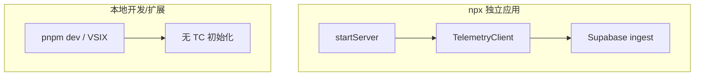

<details>
<summary>相关源文件</summary>

生成本页时使用的主要源文件：

- [scripts/telemetry.ts](../../../project-repos/agent-flow/scripts/telemetry.ts)
- [README.md](../../../project-repos/agent-flow/README.md)
- [app/src/server.ts](../../../project-repos/agent-flow/app/src/server.ts)

</details>

# 遥测、隐私与安全边界

Telemetry **默认仅出现在发布的 `npx agent-flow-app` 路径**：`startServer` 在 `~/.agent-flow` 下初始化 `TelemetryClient`，而 README 明确 `pnpm run dev` 与扩展**不发送**。实现上 `TelemetryEvent` 只含 session 级聚合字段（时长、事件数、OS/arch、版本、观察到的 model id 列表、所 watch 的 runtime 组合、错误类名），**显式不包含** prompt、路径、工具入参。

**禁用开关**：`AGENT_FLOW_TELEMETRY=false` 或 `DO_NOT_TRACK=1` 走 falsy 集合判断；禁用时不写 `~/.agent-flow` 状态目录。用户可 `cat ~/.agent-flow/telemetry/events.jsonl` 自查落盘内容。

**网络栈**：`telemetry.ts` 顶部写死 Supabase endpoint 与 publishable key，注释说明 fork 若改名需自行替换常量；sync 采用渐进定时器（2s、2min、3min、之后每 5min）平衡短会话与长任务。



**安全心智**：Hook Server 与 relay 都运行在用户本机，不把原始 POST body 转发到 telemetry；这与「只观察不阻断」的产品定位一致。

Sources: [scripts/telemetry.ts:1-77](../../../project-repos/patoles-agent-flow/scripts/telemetry.ts#L1-L77), [README.md:144-157](../../../project-repos/patoles-agent-flow/README.md#L144-L157), [app/src/server.ts:24-30](../../../project-repos/patoles-agent-flow/app/src/server.ts#L24-L30)

<details class="source-snippets">
<summary>引用源码</summary>

<!-- source-snippets:start -->

#### `scripts/telemetry.ts:1-77`

```typescript
import * as fs from 'fs'
import * as path from 'path'
import { getOrCreateInstallId } from './telemetry/install-id'
import { sanitizeString } from './telemetry/sanitize'
import { syncOnce } from './telemetry/sync'

/**
 * Hardcoded telemetry endpoint + publishable key.
 *
 * These ship inside every published binary. No env var override, no runtime
 * fallback. All enabled installs send events to Agent Flow's Supabase project.
 * Forks that republish under a different name must edit these constants and
 * rebuild.
 *
 * Safe to commit: publishable keys are designed to be public. Postgres RLS
 * denies the anon role everything; the only write path is the telemetry-ingest
 * edge function, which runs under the secret key and validates every event.
 */
export const TELEMETRY_ENDPOINT = 'https://dxwtgqdkyunfhbywqmrz.supabase.co'
export const TELEMETRY_PUBLISHABLE_KEY = 'sb_publishable_AgJ_DIUH9zm8E0yHC9KsRw_WsIv4qc8'

/**
 * Progressive sync schedule. After init(), fire syncs at these offsets:
 *   - 2s (captures session_start that the relay emits right after init)
 *   - +2min
 *   - +3min
 *   - then every 5min
 *
 * Short sessions get flushed quickly; long sessions settle into steady cadence.
 */
const FIRST_SYNC_DELAY_MS = 2 * 1000
const SYNC_SCHEDULE_MS = [2 * 60 * 1000, 3 * 60 * 1000]
const SYNC_REPEAT_MS = 5 * 60 * 1000

const FALSY_VALUES = new Set(['false', '0', 'disabled', ''])

export interface TelemetryEvent {
  event_type: 'session_start' | 'session_end' | 'error'
  session_id: string
  agent_flow_version: string
  os: string
  arch: string
  source?: string
  duration_s?: number
  event_count?: number
  error_class?: string
  /** Comma-separated distinct model IDs observed during the session
   *  (e.g., `"claude-opus-4-7,gpt-5"`). session_end only. */
  models?: string
  /** Which runtimes were being watched: `"claude"`, `"codex"`, or `"claude,codex"`.
   *  session_end only. */
  runtimes?: string
}

export interface TelemetryClientOptions {
  /** Directory for events.jsonl and .cursor. Usually `~/.agent-flow/telemetry`. */
  logDir: string
  /** Path to the stable install UUID. Usually `~/.agent-flow/installation-id`. */
  installIdPath: string
  /** Override for tests. Defaults to `process.env`. */
  env?: NodeJS.ProcessEnv
  /** Override the endpoint for tests. Defaults to the hardcoded constant. */
  endpoint?: string
  /** Override the key for tests. Defaults to the hardcoded constant. */
  apiKey?: string
}

export interface TelemetryClient {
  /** Resolve install ID and start the sync timer when telemetry is enabled. */
  init(): Promise<void>
  /** Append an event to the JSONL log. No-op when disabled. */
  emit(event: TelemetryEvent): void
  /** Current enabled state. Re-evaluated from env on every call. */
  isEnabled(): boolean
  /** Stop the sync timer and do a final flush. */
  dispose(): Promise<void>
}
```

#### `README.md:144-157`

```markdown
## Privacy & Telemetry

Agent Flow ships **opt-out** anonymous usage telemetry, enabled by default only
in the published `npx agent-flow-app` binary. `pnpm run dev` and the VS Code
extension emit nothing. Only aggregate events are sent — session count,
duration, event count, OS/arch, Agent Flow version, distinct model IDs
observed, which runtimes were watched, and error class names. Prompts, file
paths, tool calls, user info, and environment variables are never sent.

- **Turn off:** `export AGENT_FLOW_TELEMETRY=false` or `export DO_NOT_TRACK=1`
  (disabled installs write zero state to disk — no `~/.agent-flow/` directory)
- **Inspect the payload:** `cat ~/.agent-flow/telemetry/events.jsonl`
- **Full schema + exact fields:** see the v0.8.1 entry in
  [extension/CHANGELOG.md](extension/CHANGELOG.md) or the `serialize()` function
```

#### `app/src/server.ts:24-30`

```typescript
  const configDir = path.join(os.homedir(), '.agent-flow')
  const telemetry = createTelemetryClient({
    logDir: path.join(configDir, 'telemetry'),
    installIdPath: path.join(configDir, 'installation-id'),
  })
  await telemetry.init()

```

<!-- source-snippets:end -->
</details>
## 相关页面

- [独立应用与 npx 分发](standalone-npx-app.md)
- [项目概览](overview.md)
