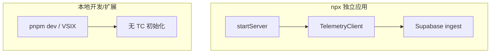

相关源文件

生成本页时使用的主要源文件：

- [scripts/telemetry.ts](../../../project-repos/agent-flow/scripts/telemetry.ts)
- [README.md](../../../project-repos/agent-flow/README.md)
- [app/src/server.ts](../../../project-repos/agent-flow/app/src/server.ts)

# 遥测、隐私与安全边界

Telemetry **默认仅出现在发布的 `npx agent-flow-app` 路径**：`startServer` 在 `~/.agent-flow` 下初始化 `TelemetryClient`，而 README 明确 `pnpm run dev` 与扩展**不发送**。实现上 `TelemetryEvent` 只含 session 级聚合字段（时长、事件数、OS/arch、版本、观察到的 model id 列表、所 watch 的 runtime 组合、错误类名），**显式不包含** prompt、路径、工具入参。

**禁用开关**：`AGENT_FLOW_TELEMETRY=false` 或 `DO_NOT_TRACK=1` 走 falsy 集合判断；禁用时不写 `~/.agent-flow` 状态目录。用户可 `cat ~/.agent-flow/telemetry/events.jsonl` 自查落盘内容。

**网络栈**：`telemetry.ts` 顶部写死 Supabase endpoint 与 publishable key，注释说明 fork 若改名需自行替换常量；sync 采用渐进定时器（2s、2min、3min、之后每 5min）平衡短会话与长任务。

**安全心智**：Hook Server 与 relay 都运行在用户本机，不把原始 POST body 转发到 telemetry；这与「只观察不阻断」的产品定位一致。

Sources: [scripts/telemetry.ts:1-77](../../../project-repos/pages/scripts/telemetry.ts#L1-L77), [README.md:144-157](../../../project-repos/pages/README.md#L144-L157), [app/src/server.ts:24-30](../../../project-repos/pages/app/src/server.ts#L24-L30)

引用源码

<!-- source-snippets:start -->

#### `scripts/telemetry.ts:1-77`

> 未找到引用文件：`scripts/telemetry.ts`

#### `README.md:144-157`

> 未找到引用文件：`README.md`

#### `app/src/server.ts:24-30`

> 未找到引用文件：`app/src/server.ts`

<!-- source-snippets:end -->

## 相关页面

- [独立应用与 npx 分发](standalone-npx-app.md)
- [项目概览](overview.md)
