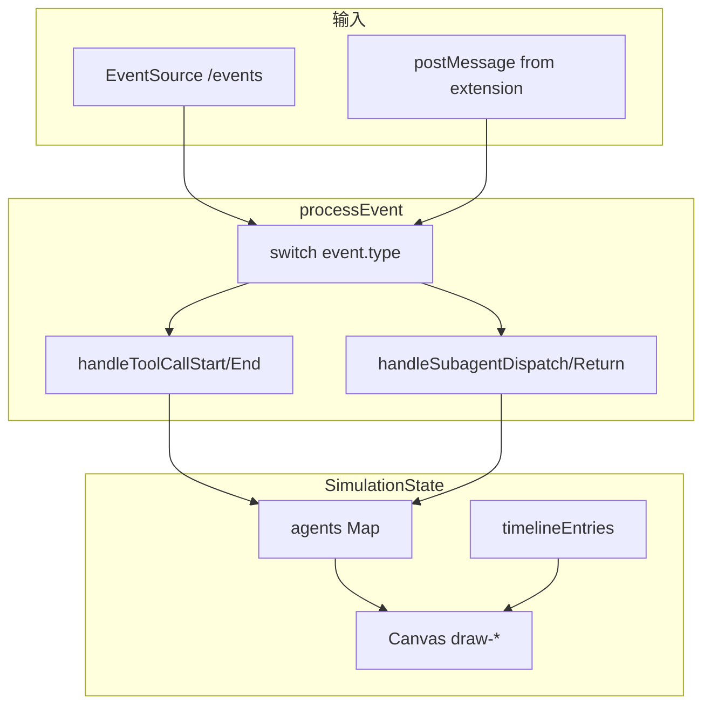

<details>
<summary>相关源文件</summary>

生成本页时使用的主要源文件：

- [web/hooks/simulation/process-event.ts](../../../project-repos/agent-flow/web/hooks/simulation/process-event.ts)
- [web/lib/vscode-bridge.ts](../../../project-repos/agent-flow/web/lib/vscode-bridge.ts)
- [web/components/agent-visualizer/canvas.tsx](../../../project-repos/agent-flow/web/components/agent-visualizer/canvas.tsx)

</details>

# 可视化前端与仿真状态机

Web 层的核心不是 React 组件树本身，而是 **`processEvent`**：它把异步到达的 `AgentEvent` 归约成 `SimulationState`——`agents`、`toolCalls`、`edges`、`timelineEntries`、`fileAttention` 等 Map / 数组。每个事件类型在 switch 中委派到 `handle-agent-events`、`handle-tool-events` 等模块；返回前用 `mapsEqual` **稳定引用**，避免无关 Map 复制触发整棵组件树的 O(n) 重算。

**VS Code Bridge**：`vscode-bridge.ts` 监听 `window.postMessage`。收到 `__vscode-bridge-init` 后置位 `_isVSCode = true` 并向扩展回 `ready`；`agent-event` 与 `agent-event-batch` 分发给订阅者。Standalone 模式下这些监听器存在但永远收不到 init —— UI 改走 SSE fetch，同构事件形状靠 relay 保证。



**Canvas**：`canvas.tsx` 与各 `draw-*.ts` 把状态投影到 2D：代理气泡、工具卡片、边、粒子特效、成本可视化等分层绘制，和 `use-canvas-camera` 的视口变换解耦。

Sources: [web/hooks/simulation/process-event.ts:61-98](../../../project-repos/patoles-agent-flow/web/hooks/simulation/process-event.ts#L61-L98), [web/lib/vscode-bridge.ts:35-59](../../../project-repos/patoles-agent-flow/web/lib/vscode-bridge.ts#L35-L59)

<details class="source-snippets">
<summary>引用源码</summary>

<!-- source-snippets:start -->

#### `web/hooks/simulation/process-event.ts:61-98`

```typescript
export function processEvent(event: SimulationEvent, prev: SimulationState, ctx: ProcessEventContext): SimulationState {
      const state: MutableEventState = {
        agents: new Map(prev.agents),
        toolCalls: new Map(prev.toolCalls),
        particles: [...prev.particles],
        edges: [...prev.edges],
        discoveries: [...prev.discoveries],
        fileAttention: new Map(prev.fileAttention),
        timelineEntries: new Map(prev.timelineEntries),
        conversations: new Map(prev.conversations),
      }

      switch (event.type) {
        case 'agent_spawn':       handleAgentSpawn(event.payload, prev.currentTime, state, ctx); break
        case 'agent_complete':    handleAgentComplete(event.payload, prev.currentTime, state, ctx); break
        case 'agent_idle':        handleAgentIdle(event.payload, state); break
        case 'model_detected':    handleModelDetected(event.payload, state, ctx); break
        case 'tool_call_start':   handleToolCallStart(event.payload, prev.currentTime, state, ctx); break
        case 'tool_call_end':     handleToolCallEnd(event.payload, prev.currentTime, state, ctx); break
        case 'message':           handleMessage(event.payload, prev.currentTime, state); break
        case 'context_update':    handleContextUpdate(event.payload, state); break
        case 'subagent_dispatch': handleSubagentDispatch(event.payload, prev.currentTime, state); break
        case 'subagent_return':   handleSubagentReturn(event.payload, prev.currentTime, state); break
        case 'permission_requested': handlePermissionRequested(event.payload, prev.currentTime, state, ctx); break
      }

      // Stabilize references for unchanged collections to prevent
      // downstream React useMemo/re-render cascades (O(n log n) sorts etc.)
      return {
        ...prev,
        agents: state.agents, toolCalls: state.toolCalls,
        particles: state.particles, edges: state.edges,
        discoveries: state.discoveries,
        fileAttention: mapsEqual(prev.fileAttention, state.fileAttention) ? prev.fileAttention : state.fileAttention,
        timelineEntries: mapsEqual(prev.timelineEntries, state.timelineEntries) ? prev.timelineEntries : state.timelineEntries,
        conversations: mapsEqual(prev.conversations, state.conversations) ? prev.conversations : state.conversations,
      }
}
```

#### `web/lib/vscode-bridge.ts:35-59`

```typescript
  private handleMessage = (e: MessageEvent) => {
    const data = e.data
    if (!data || typeof data.type !== 'string') { return }

    switch (data.type) {
      case '__vscode-bridge-init':
        this._isVSCode = true
        this.postToExtension({ type: 'ready' })
        for (const cb of this.initListeners) cb()
        this.initListeners = [] // one-shot: no need to keep listeners after init
        break

      case 'agent-event':
        for (const cb of this.eventListeners) {
          cb(data.event)
        }
        break

      case 'agent-event-batch':
        for (const event of data.events) {
          for (const cb of this.eventListeners) {
            cb(event)
          }
        }
        break
```

<!-- source-snippets:end -->
</details>
## 相关页面

- [中继层与 SSE 流](event-relay-and-sse.md)
- [VS Code / Cursor 扩展](vscode-extension.md)
