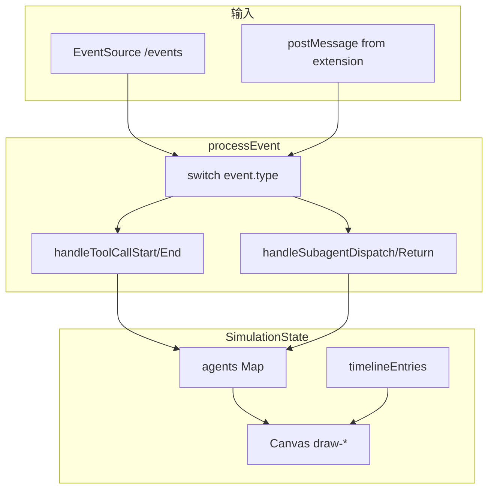

相关源文件

生成本页时使用的主要源文件：

- [web/hooks/simulation/process-event.ts](../../../project-repos/agent-flow/web/hooks/simulation/process-event.ts)
- [web/lib/vscode-bridge.ts](../../../project-repos/agent-flow/web/lib/vscode-bridge.ts)
- [web/components/agent-visualizer/canvas.tsx](../../../project-repos/agent-flow/web/components/agent-visualizer/canvas.tsx)

# 可视化前端与仿真状态机

Web 层的核心不是 React 组件树本身，而是 **`processEvent`**：它把异步到达的 `AgentEvent` 归约成 `SimulationState`——`agents`、`toolCalls`、`edges`、`timelineEntries`、`fileAttention` 等 Map / 数组。每个事件类型在 switch 中委派到 `handle-agent-events`、`handle-tool-events` 等模块；返回前用 `mapsEqual` **稳定引用**，避免无关 Map 复制触发整棵组件树的 O(n) 重算。

**VS Code Bridge**：`vscode-bridge.ts` 监听 `window.postMessage`。收到 `__vscode-bridge-init` 后置位 `_isVSCode = true` 并向扩展回 `ready`；`agent-event` 与 `agent-event-batch` 分发给订阅者。Standalone 模式下这些监听器存在但永远收不到 init —— UI 改走 SSE fetch，同构事件形状靠 relay 保证。

**Canvas**：`canvas.tsx` 与各 `draw-*.ts` 把状态投影到 2D：代理气泡、工具卡片、边、粒子特效、成本可视化等分层绘制，和 `use-canvas-camera` 的视口变换解耦。

Sources: [web/hooks/simulation/process-event.ts:61-98](../../../project-repos/pages/web/hooks/simulation/process-event.ts#L61-L98), [web/lib/vscode-bridge.ts:35-59](../../../project-repos/pages/web/lib/vscode-bridge.ts#L35-L59)

引用源码

<!-- source-snippets:start -->

#### `web/hooks/simulation/process-event.ts:61-98`

> 未找到引用文件：`web/hooks/simulation/process-event.ts`

#### `web/lib/vscode-bridge.ts:35-59`

> 未找到引用文件：`web/lib/vscode-bridge.ts`

<!-- source-snippets:end -->

## 相关页面

- [中继层与 SSE 流](event-relay-and-sse.md)
- [VS Code / Cursor 扩展](vscode-extension.md)
