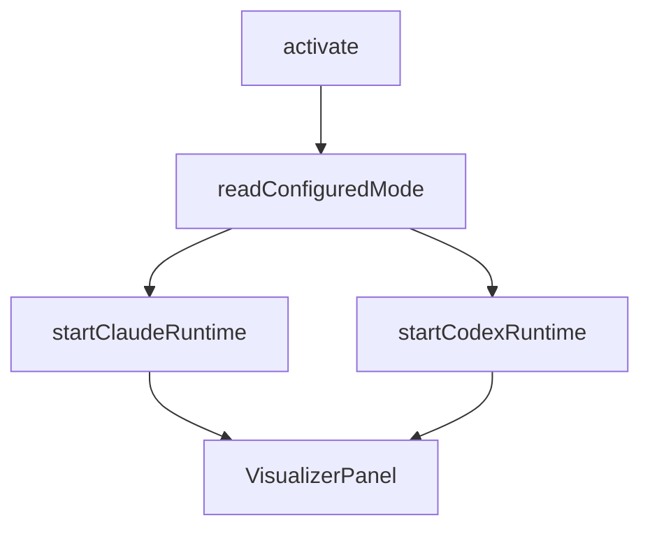

<details>
<summary>相关源文件</summary>

生成本页时使用的主要源文件：

- [extension/src/extension.ts](../../../project-repos/agent-flow/extension/src/extension.ts)
- [extension/src/session-runtime.ts](../../../project-repos/agent-flow/extension/src/session-runtime.ts)
- [extension/src/webview-provider.ts](../../../project-repos/agent-flow/extension/src/webview-provider.ts)

</details>

# VS Code / Cursor 扩展

扩展激活时第一件事是读 `agentVisualizer.runtime`：`auto` 会 **顺序尝试** 启动 Claude 与 Codex runtime；任一失败会记入 `failures` 数组，若两者都挂则弹 `showWarningMessage`，避免用户面对空白面板却不知道 hook 没起来。

**命令面**：`agentVisualizer.open` / `openToSide` 创建 `VisualizerPanel` 并 `wirePanel`；钩子配置走 `promptHookSetupIfNeededForClaude`。Runtime 启动与面板打开解耦——意味着即使暂不打开 UI，后台 watcher 也可先吸附会话。

**会话桥接**：`wireWatcherToPanel`（`session-runtime.ts`）把 watcher 的三路事件统一翻译成 `panel.sendEvent` / `postMessage`。Codex 路径若需要 event transform，可在 options 注入，Claude 路径则直接透传。



**与 Web 共享代码**：扩展构建把 webview 资产打进 VSIX；开发时 `pnpm run dev:extension` watch extension，而 UI 仍由 `web` 包产出。协议字段增减必须同时改 `protocol.ts` 与 `vscode-bridge.ts` 的分支，否则会出现「扩展发了新 type，React 侧静默丢弃」类的漂移。

Sources: [extension/src/extension.ts:18-44](../../../project-repos/patoles-agent-flow/extension/src/extension.ts#L18-L44), [extension/src/extension.ts:47-64](../../../project-repos/patoles-agent-flow/extension/src/extension.ts#L47-L64), [extension/src/session-runtime.ts:67-116](../../../project-repos/patoles-agent-flow/extension/src/session-runtime.ts#L67-L116)

<details class="source-snippets">
<summary>引用源码</summary>

<!-- source-snippets:start -->

#### `extension/src/extension.ts:18-44`

```typescript
function readConfiguredMode(): ConfiguredRuntimeMode {
  const raw = vscode.workspace.getConfiguration('agentVisualizer').get<string>('runtime', 'auto')
  return raw === 'claude' || raw === 'codex' ? raw : 'auto'
}

interface StartRuntimesResult {
  runtimes: AgentRuntime[]
  failures: AgentRuntimeMode[]
}

async function startRuntimes(
  mode: ConfiguredRuntimeMode,
  context: vscode.ExtensionContext,
): Promise<StartRuntimesResult> {
  const runtimes: AgentRuntime[] = []
  const failures: AgentRuntimeMode[] = []
  if (mode === 'claude' || mode === 'auto') {
    log.info('Starting Claude runtime...')
    try { runtimes.push(await startClaudeRuntime(context)) }
    catch (err) { log.error('Claude runtime failed to start:', err); failures.push('claude') }
  }
  if (mode === 'codex' || mode === 'auto') {
    log.info('Starting Codex runtime...')
    try { runtimes.push(startCodexRuntime(context)) }
    catch (err) { log.error('Codex runtime failed to start:', err); failures.push('codex') }
  }
  return { runtimes, failures }
```

#### `extension/src/extension.ts:47-64`

```typescript
export async function activate(context: vscode.ExtensionContext) {
  log.info('Extension activated')

  const mode = readConfiguredMode()
  log.info(`Runtime mode: ${mode}`)
  const { runtimes: started, failures } = await startRuntimes(mode, context)
  runtimes = started
  log.info(`Active runtimes: ${runtimes.map(r => r.mode).join(', ') || 'none'}`)

  // Surface startup failures to the user — the log-only path leaves them
  // staring at a "disconnected" visualizer with no explanation.
  if (runtimes.length === 0 && failures.length > 0) {
    vscode.window.showWarningMessage(
      `Agent Visualizer: ${failures.join(' and ')} runtime${failures.length > 1 ? 's' : ''} failed to start. See the Output panel for details.`,
    )
  } else if (failures.length > 0) {
    log.info(`Partial startup — ${failures.join(', ')} failed but ${runtimes.map(r => r.mode).join(', ')} active`)
  }
```

#### `extension/src/session-runtime.ts:67-116`

```typescript
export function wireWatcherToPanel(
  watcher: AgentSessionWatcher,
  options: WatchPanelWiringOptions,
): TypedDisposable {
  const subs: TypedDisposable[] = []

  subs.push(watcher.onEvent((event) => {
    const panel = VisualizerPanel.getCurrent()
    if (!panel || !panel.isReady) return
    const transformed = options.transformEvent ? options.transformEvent(event) : event
    if (transformed) panel.sendEvent(transformed)
  }))

  subs.push(watcher.onSessionDetected((sessionId) => {
    const panel = VisualizerPanel.getCurrent()
    if (panel) {
      const sessionCount = watcher.getActiveSessions().length
      panel.setConnectionStatus('watching', sessionCount > 1
        ? `${sessionCount} ${options.sessionLabelPrefix} sessions`
        : `${options.sessionLabelPrefix} ${sessionId.slice(0, SESSION_ID_DISPLAY)}`)
    }
    vscode.window.setStatusBarMessage(
      `Agent Visualizer: watching ${options.sessionLabelPrefix} session ${sessionId.slice(0, SESSION_ID_DISPLAY)}`,
      STATUS_MESSAGE_DURATION_MS,
    )
  }))

  subs.push(watcher.onSessionLifecycle((lifecycle) => {
    const panel = VisualizerPanel.getCurrent()
    if (!panel) return
    if (lifecycle.type === 'started') {
      panel.postMessage({
        type: 'session-started',
        session: {
          id: lifecycle.sessionId,
          label: lifecycle.label,
          status: 'active',
          startTime: Date.now(),
          lastActivityTime: Date.now(),
        },
      })
    } else if (lifecycle.type === 'updated') {
      panel.postMessage({ type: 'session-updated', sessionId: lifecycle.sessionId, label: lifecycle.label })
    } else {
      panel.postMessage({ type: 'session-ended', sessionId: lifecycle.sessionId })
    }
  }))

  return { dispose: () => { for (const s of subs) s.dispose() } }
}
```

<!-- source-snippets:end -->
</details>
## 相关页面

- [Claude Code：Hooks 与 JSONL 转录](claude-hooks-and-transcripts.md)
- [可视化前端与仿真状态机](visualization-ui.md)
