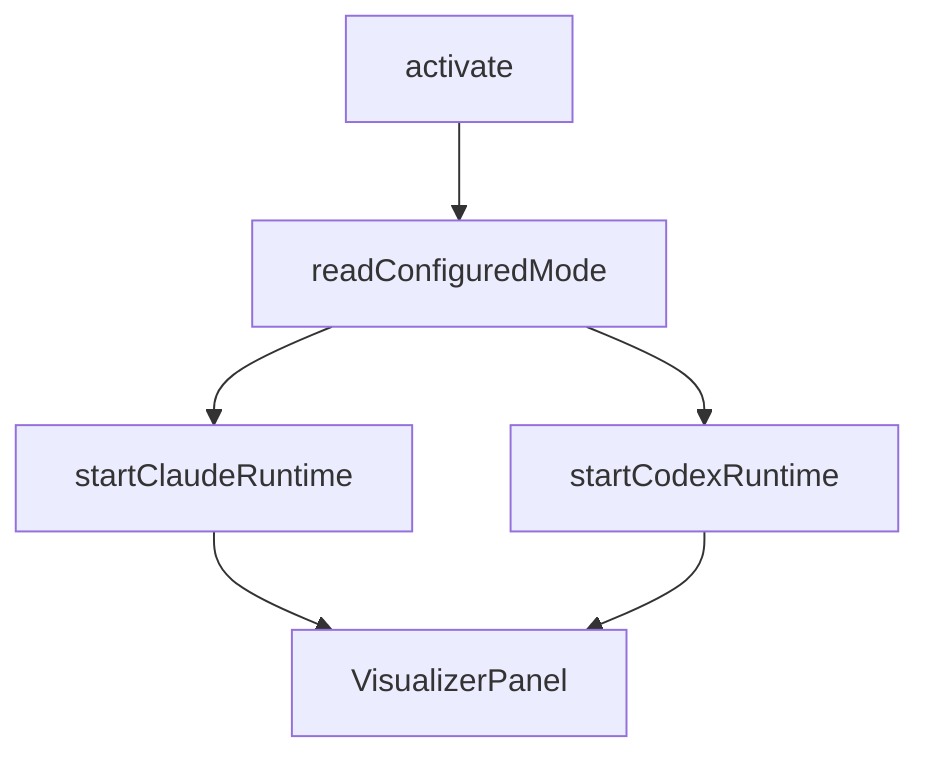

相关源文件

生成本页时使用的主要源文件：

- [extension/src/extension.ts](../../../project-repos/agent-flow/extension/src/extension.ts)
- [extension/src/session-runtime.ts](../../../project-repos/agent-flow/extension/src/session-runtime.ts)
- [extension/src/webview-provider.ts](../../../project-repos/agent-flow/extension/src/webview-provider.ts)

# VS Code / Cursor 扩展

扩展激活时第一件事是读 `agentVisualizer.runtime`：`auto` 会 **顺序尝试** 启动 Claude 与 Codex runtime；任一失败会记入 `failures` 数组，若两者都挂则弹 `showWarningMessage`，避免用户面对空白面板却不知道 hook 没起来。

**命令面**：`agentVisualizer.open` / `openToSide` 创建 `VisualizerPanel` 并 `wirePanel`；钩子配置走 `promptHookSetupIfNeededForClaude`。Runtime 启动与面板打开解耦——意味着即使暂不打开 UI，后台 watcher 也可先吸附会话。

**会话桥接**：`wireWatcherToPanel`（`session-runtime.ts`）把 watcher 的三路事件统一翻译成 `panel.sendEvent` / `postMessage`。Codex 路径若需要 event transform，可在 options 注入，Claude 路径则直接透传。

**与 Web 共享代码**：扩展构建把 webview 资产打进 VSIX；开发时 `pnpm run dev:extension` watch extension，而 UI 仍由 `web` 包产出。协议字段增减必须同时改 `protocol.ts` 与 `vscode-bridge.ts` 的分支，否则会出现「扩展发了新 type，React 侧静默丢弃」类的漂移。

Sources: [extension/src/extension.ts:18-44](../../../project-repos/pages/extension/src/extension.ts#L18-L44), [extension/src/extension.ts:47-64](../../../project-repos/pages/extension/src/extension.ts#L47-L64), [extension/src/session-runtime.ts:67-116](../../../project-repos/pages/extension/src/session-runtime.ts#L67-L116)

引用源码

<!-- source-snippets:start -->

#### `extension/src/extension.ts:18-44`

> 未找到引用文件：`extension/src/extension.ts`

#### `extension/src/extension.ts:47-64`

> 未找到引用文件：`extension/src/extension.ts`

#### `extension/src/session-runtime.ts:67-116`

> 未找到引用文件：`extension/src/session-runtime.ts`

<!-- source-snippets:end -->

## 相关页面

- [Claude Code：Hooks 与 JSONL 转录](claude-hooks-and-transcripts.md)
- [可视化前端与仿真状态机](visualization-ui.md)
