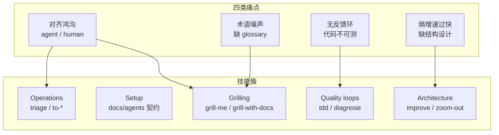
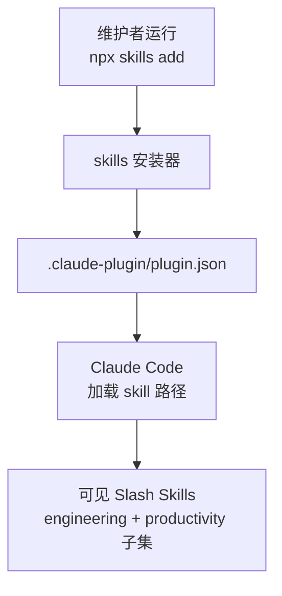
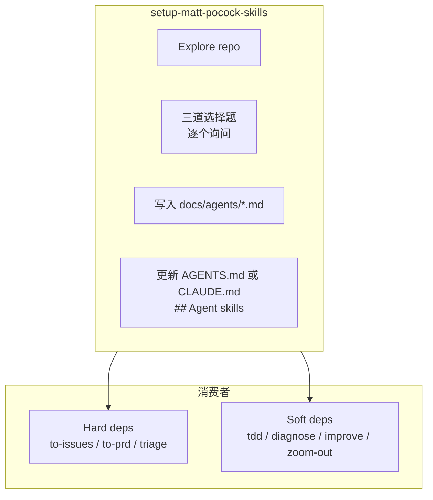
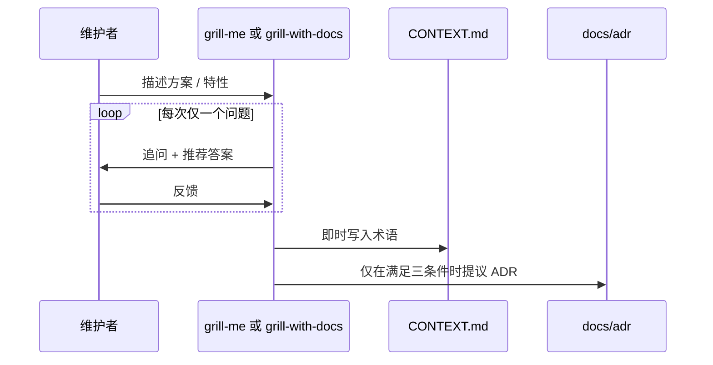
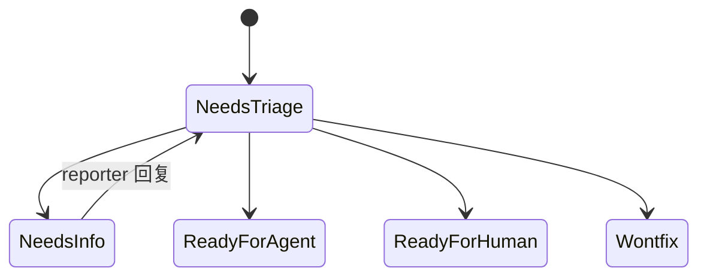
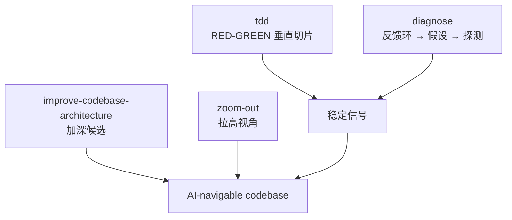
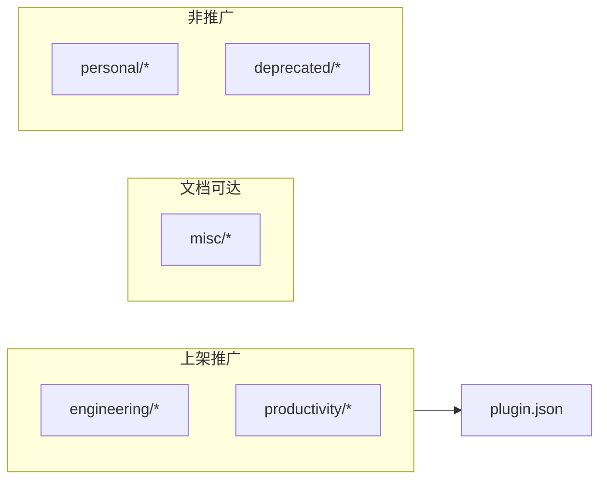

# Matt Pocock Skills — DeepWiki 合并导出

**源码**：https://github.com/mattpocock/skills @ b843cb5ea74b1fe5e58a0fc23cddef9e66076fb8

---


---

<details>
<summary>相关源文件</summary>

生成本页时使用的主要源文件：

- [README.md](../../../project-repos/skills/README.md)
- [CLAUDE.md](../../../project-repos/skills/CLAUDE.md)

</details>

# 项目概览

Coding Agent 最常见的翻车并不是模型笨，而是**对齐失败、术语漂移、缺少反馈环**，以及在超速产出代码的同时把系统设计当成可有可无的装饰。Matt Pocock 把这四类痛点写成四条叙事主线：用 grilling（拷问式访谈）消灭含糊需求；用 `CONTEXT.md`+ADR 把共享语言落到纸上；用测试 / 浏览器 / 类型构造稳定的 RED/GREEN 信号；再用专门的架构问诊技能对抗「泥球增速过快」。整套方案的措辞很明确：**这些是写给还在掌控交付的工程负责人的**，不是另一条包办全流程的对话脚本。

仓库把所有 Skill 丢进 `skills/` 下的几个 bucket：`engineering/` 绑定代码，`productivity/` 面向协作，`misc/` 低频，`personal/` 作者自用，`deprecated/` 弃用。`CLAUDE.md` 规定了上架边界：**凡是放进 engineering/productivity/misc 的技能都必须出现在顶层 README，并被 `.claude-plugin/plugin.json` 索引（personal 与 deprecated 除外）**。这解释了读者第一眼看到的是小而锋利的 curated list，而不是目录里的几十个子文件夹全集。



上图不是运行时拓扑，而是**心智地图**：左边四类痛点触发右边的若干 Skill 簇；同一问题往往需要 grilling（对齐）、setup（把 tracker label 映射写下来）、再通过质量或分流 Skill 收尾。

## 能力快照（面向 Maintainer）

| 能力簇 | 代表 Slash Skill | 价值一句话 |
|--------|------------------|-----------|
| 对齐 | `grill-me`, `grill-with-docs` | 在进入编码之前穷尽决策树，并让术语落到文档 |
| 运行契约 | `setup-matt-pocock-skills` | 为每台仓库生成 issue tracker、triage label、`CONTEXT`/ADR 消费约定 |
| 交付拆分 | `to-prd`, `to-issues` | PRD 进 backlog；再把方案切成 tracer-bullet Issue |
| 分流运营 | `triage` | 五阶段 label state machine + agent brief |
| 反馈回路 | `tdd`, `diagnose` | 垂直 RED/GREEN；强约束的诊断闭环 |
| 结构性 refactor | `improve-codebase-architecture`, `zoom-out` | 用语义一致的加深术语解剖 shallow module |

## 技术栈与规模事实

- **载体**：Markdown Skill（YAML frontmatter + 正文指令）；插件边界由一个 `.claude-plugin/plugin.json` 枚举对外 Skills。
- **规模**：盘点脚本登记 **57** 份追踪文件（顶层目录：`skills/`、`scripts/`、`docs/`、`.claude-plugin/`、`.out-of-scope/`）。
- **CI / 测试**：仓库不提供自动化测试或流水线——知识体系主要靠 Markdown 与实践可复制脚本 (`scripts/*.sh`)。

## 阅读路线

| 读者目标 | 推荐阅读顺序 |
|----------|----------------|
| 只想弄明白这套方法与 BMAD / Spec-Kit 的差别 | 本页 → [对齐会话与共享语言](grilling-and-domain-language.md) |
| 准备在自有仓库启用 Skills | [安装与 Claude 插件清单](installation-and-manifest.md) → [每仓库配置与硬软依赖](per-repo-setup.md) |
| 想把 backlog / PRD / Triage 串起来 | [规划、Issue 切片与分流](planning-issues-triage.md) |
| 想把工程质量拉回正轨 | [质量回路、诊断与架构加深](quality-architecture-feedback.md) |

Sources: [README.md:11-138](../../../project-repos/skills/README.md#L11-L138), [CLAUDE.md:1-13](../../../project-repos/skills/CLAUDE.md#L1-L13)

<details class="source-snippets">
<summary>引用源码</summary>

<!-- source-snippets:start -->

#### `README.md:11-138`

````markdown
# Skills For Real Engineers

My agent skills that I use every day to do real engineering - not vibe coding.

Developing real applications is hard. Approaches like GSD, BMAD, and Spec-Kit try to help by owning the process. But while doing so, they take away your control and make bugs in the process hard to resolve.

These skills are designed to be small, easy to adapt, and composable. They work with any model. They're based on decades of engineering experience. Hack around with them. Make them your own. Enjoy.

If you want to keep up with changes to these skills, and any new ones I create, you can join ~60,000 other devs on my newsletter:

[Sign Up To The Newsletter](https://www.aihero.dev/s/skills-newsletter)

## Quickstart (30-second setup)

1. Run the skills.sh installer:

```bash
npx skills@latest add mattpocock/skills
```

2. Pick the skills you want, and which coding agents you want to install them on. **Make sure you select `/setup-matt-pocock-skills`**.

3. Run `/setup-matt-pocock-skills` in your agent. It will:
   - Ask you which issue tracker you want to use (GitHub, Linear, or local files)
   - Ask you what labels you apply to ticks when you triage them (`/triage` uses labels)
   - Ask you where you want to save any docs we create

4. Bam - you're ready to go.

## Why These Skills Exist

I built these skills as a way to fix common failure modes I see with Claude Code, Codex, and other coding agents.

### #1: The Agent Didn't Do What I Want

> "No-one knows exactly what they want"
>
> David Thomas & Andrew Hunt, [The Pragmatic Programmer](https://www.amazon.co.uk/Pragmatic-Programmer-Anniversary-Journey-Mastery/dp/B0833F1T3V)

**The Problem**. The most common failure mode in software development is misalignment. You think the dev knows what you want. Then you see what they've built - and you realize it didn't understand you at all.

This is just the same in the AI age. There is a communication gap between you and the agent. The fix for this is a **grilling session** - getting the agent to ask you detailed questions about what you're building.

**The Fix** is to use:

- [`/grill-me`](./skills/productivity/grill-me/SKILL.md) - for non-code uses
- [`/grill-with-docs`](./skills/engineering/grill-with-docs/SKILL.md) - same as [`/grill-me`](./skills/productivity/grill-me/SKILL.md), but adds more goodies (see below)

These are my most popular skills. They help you align with the agent before you get started, and think deeply about the change you're making. Use them _every_ time you want to make a change.

### #2: The Agent Is Way Too Verbose

> With a ubiquitous language, conversations among developers and expressions of the code are all derived from the same domain model.
>
> Eric Evans, [Domain-Driven-Design](https://www.amazon.co.uk/Domain-Driven-Design-Tackling-Complexity-Software/dp/0321125215)

**The Problem**: At the start of a project, devs and the people they're building the software for (the domain experts) are usually speaking different languages.

I felt the same tension with my agents. Agents are usually dropped into a project and asked to figure out the jargon as they go. So they use 20 words where 1 will do.

**The Fix** for this is a shared language. It's a document that helps agents decode the jargon used in the project.

<details>
<summary>
Example
</summary>

Here's an example [`CONTEXT.md`](https://github.com/mattpocock/course-video-manager/blob/076a5a7a182db0fe1e62971dd7a68bcadf010f1c/CONTEXT.md), from my `course-video-manager` repo. Which one is easier to read?

- **BEFORE**: "There's a problem when a lesson inside a section of a course is made 'real' (i.e. given a spot in the file system)"
- **AFTER**: "There's a problem with the materialization cascade"

This concision pays off session after session.

</details>

This is built into [`/grill-with-docs`](./skills/engineering/grill-with-docs/SKILL.md). It's a grilling session, but that helps you build a shared language with the AI, and document hard-to-explain decisions in ADR's.

It's hard to explain how powerful this is. It might be the single coolest technique in this repo. Try it, and see.

> [!TIP]
> A shared language has many other benefits than reducing verbosity:
>
> - **Variables, functions and files are named consistently**, using the shared language
> - As a result, the **codebase is easier to navigate** for the agent
> - The agent also **spends fewer tokens on thinking**, because it has access to a more concise language

### #3: The Code Doesn't Work

> "Always take small, deliberate steps. The rate of feedback is your speed limit. Never take on a task that’s too big."
>
> David Thomas & Andrew Hunt, [The Pragmatic Programmer](https://www.amazon.co.uk/Pragmatic-Programmer-Anniversary-Journey-Mastery/dp/B0833F1T3V)

**The Problem**: Let's say that you and the agent are aligned on what to build. What happens when the agent _still_ produces crap?

It's time to look at your feedback loops. Without feedback on how the code it produces actually runs, the agent will be flying blind.

**The Fix**: You need the usual tranche of feedback loops: static types, browser access, and automated tests.

For automated tests, a red-green-refactor loop is critical. This is where the agent writes a failing test first, then fixes the test. This helps give the agent a consistent level of feedback that results in far better code.

I've built a **[`/tdd`](./skills/engineering/tdd/SKILL.md) skill** you can slot into any project. It encourages red-green-refactor and gives the agent plenty of guidance on what makes good and bad tests.

For debugging, I've also built a **[`/diagnose`](./skills/engineering/diagnose/SKILL.md)** skill that wraps best debugging practices into a simple loop.

### #4: We Built A Ball Of Mud

> "Invest in the design of the system _every day_."
>
> Kent Beck, [Extreme Programming Explained](https://www.amazon.co.uk/Extreme-Programming-Explained-Embrace-Change/dp/0321278658)

> "The best modules are deep. They allow a lot of functionality to be accessed through a simple interface."
>
> John Ousterhout, [A Philosophy Of Software Design](https://www.amazon.co.uk/Philosophy-Software-Design-2nd/dp/173210221X)

**The Problem**: Most apps built with agents are complex and hard to change. Because agents can radically speed up coding, they also accelerate software entropy. Codebases get more complex at an unprecedented rate.

**The Fix** for this is a radical new approach to AI-powered development: caring about the design of the code.

This is built in to every layer of these skills:
... snippet truncated ...
````

#### `CLAUDE.md:1-13`

```markdown
Skills are organized into bucket folders under `skills/`:

- `engineering/` — daily code work
- `productivity/` — daily non-code workflow tools
- `misc/` — kept around but rarely used
- `personal/` — tied to my own setup, not promoted
- `deprecated/` — no longer used

Every skill in `engineering/`, `productivity/`, or `misc/` must have a reference in the top-level `README.md` and an entry in `.claude-plugin/plugin.json`. Skills in `personal/` and `deprecated/` must not appear in either.

Each skill entry in the top-level `README.md` must link the skill name to its `SKILL.md`.

Each bucket folder has a `README.md` that lists every skill in the bucket with a one-line description, with the skill name linked to its `SKILL.md`.
```

<!-- source-snippets:end -->
</details>

## 相关页面

- [安装与 Claude 插件清单](installation-and-manifest.md) — 如何把 curated Skills 写入 Claude Code  
- [对齐会话与共享语言](grilling-and-domain-language.md) — README 宣称的首要武器  

---

<details>
<summary>相关源文件</summary>

生成本页时使用的主要源文件：

- [README.md](../../../project-repos/skills/README.md)
- [.claude-plugin/plugin.json](../../../project-repos/skills/.claude-plugin/plugin.json)
- [CLAUDE.md](../../../project-repos/skills/CLAUDE.md)

</details>

# 安装与 Claude 插件清单

README 期望的安装心智模型只有两步：`npx skills@latest add mattpocock/skills` 选对 agent，然后务必勾选 `/setup-matt-pocock-skills`。插件清单 (`plugin.json`) 则进一步钉死「哪些 Skill 会在 Claude Code UI 里露出」——它是 curated surface area，而不是整个 `skills/` 目录的镜像。



Claude Code 通过插件声明 skills 数组；数组里的每一项指向 `./skills/...` 目录而非单个 Markdown。于是 manifest 成为事实上的「上架列表」，任何位于 `misc/`、`personal/`、`deprecated/` 的技能都不会出现在数组里——这与 `CLAUDE.md` 的约束一致。

## `plugin.json` 的上架集合

当前 manifest（提交 `b843cb5`）枚举 **11** 条路径：engineering 下 9 个（`diagnose`、`grill-with-docs`、`triage`、`improve-codebase-architecture`、`setup-matt-pocock-skills`、`tdd`、`to-issues`、`to-prd`、`zoom-out`），productivity 下 3 个（`caveman`、`grill-me`、`write-a-skill`）。这与 README 「Reference」段落公开的 curated list 对齐。

## Insight：上架列表 ≠ 仓库全集

**Insight**：README 仍会为 `misc/` skills（例如 git guardrails、pre-commit）撰写条目，但它们刻意缺席 `plugin.json`。这意味着「文档层面的可达」与「工具默认加载」被刻意拆开：`misc` 技能更像是可随时复制的 playbook，而不是 Matt 日常的 Claude Code 默认托盘。

Sources: [README.md:23-38](../../../project-repos/skills/README.md#L23-L38), [claude-plugin/plugin.json:1-17](../../../project-repos/skills/.claude-plugin/plugin.json#L1-L17), [CLAUDE.md:1-13](../../../project-repos/skills/CLAUDE.md#L1-L13)

<details class="source-snippets">
<summary>引用源码</summary>

<!-- source-snippets:start -->

#### `README.md:23-38`

````markdown
## Quickstart (30-second setup)

1. Run the skills.sh installer:

```bash
npx skills@latest add mattpocock/skills
```

2. Pick the skills you want, and which coding agents you want to install them on. **Make sure you select `/setup-matt-pocock-skills`**.

3. Run `/setup-matt-pocock-skills` in your agent. It will:
   - Ask you which issue tracker you want to use (GitHub, Linear, or local files)
   - Ask you what labels you apply to ticks when you triage them (`/triage` uses labels)
   - Ask you where you want to save any docs we create

4. Bam - you're ready to go.
````

#### `claude-plugin/plugin.json:1-17`

```json
{
  "name": "mattpocock-skills",
  "skills": [
    "./skills/engineering/diagnose",
    "./skills/engineering/grill-with-docs",
    "./skills/engineering/triage",
    "./skills/engineering/improve-codebase-architecture",
    "./skills/engineering/setup-matt-pocock-skills",
    "./skills/engineering/tdd",
    "./skills/engineering/to-issues",
    "./skills/engineering/to-prd",
    "./skills/engineering/zoom-out",
    "./skills/productivity/caveman",
    "./skills/productivity/grill-me",
    "./skills/productivity/write-a-skill"
  ]
}
```

#### `CLAUDE.md:1-13`

```markdown
Skills are organized into bucket folders under `skills/`:

- `engineering/` — daily code work
- `productivity/` — daily non-code workflow tools
- `misc/` — kept around but rarely used
- `personal/` — tied to my own setup, not promoted
- `deprecated/` — no longer used

Every skill in `engineering/`, `productivity/`, or `misc/` must have a reference in the top-level `README.md` and an entry in `.claude-plugin/plugin.json`. Skills in `personal/` and `deprecated/` must not appear in either.

Each skill entry in the top-level `README.md` must link the skill name to its `SKILL.md`.

Each bucket folder has a `README.md` that lists every skill in the bucket with a one-line description, with the skill name linked to its `SKILL.md`.
```

<!-- source-snippets:end -->
</details>

## 相关页面

- [项目概览](overview.md) — 为何要 curated composable skills  
- [每仓库配置与硬软依赖](per-repo-setup.md) — 安装后仍需写入 `docs/agents/`  

---

<details>
<summary>相关源文件</summary>

生成本页时使用的主要源文件：

- [skills/engineering/setup-matt-pocock-skills/SKILL.md](../../../project-repos/skills/skills/engineering/setup-matt-pocock-skills/SKILL.md)
- [docs/adr/0001-explicit-setup-pointer-only-for-hard-dependencies.md](../../../project-repos/skills/docs/adr/0001-explicit-setup-pointer-only-for-hard-dependencies.md)

</details>

# 每仓库配置与硬软依赖

`/setup-matt-pocock-skills` 是唯一真正「写文件」的 onboarding Skill：它读取远端信息（`git remote`）、既有 `AGENTS.md`/`CLAUDE.md`，然后在 `docs/agents/` 生成 issue tracker、triage label、domain layout 三份说明，并把摘要块嵌回单一入口 Markdown。ADR 0001 随后解释：**并非所有 engineering skill 都需要在同一句提示里绑架用户去 setup**——只有会把错误 label 写进真实 backlog 的技能才算硬依赖。



**硬依赖**三类：`to-issues`、`to-prd`、`triage`——它们直接把 canonical label 字符串映射到外部系统；缺映射会产生错误输出而不是含糊。**软依赖**四类：`diagnose`、`tdd`、`improve-codebase-architecture`、`zoom-out`——它们只在 prose 里提及 glossary / ADR，缺失时 Skill 仍可运行，只是少了锐利度。

## Setup 流程中的关键约束

- Skill 明确写成「prompt-driven」，即必须先 explore + 与用户确认，而不是幻想某个脚本一键写完。
- 写入 `## Agent skills` 时遵循：`CLAUDE.md` 优先于 `AGENTS.md`；二者不可并存新建。
- Issue tracker 选项覆盖 GitHub / GitLab / 本地 `.scratch/` markdown / 其它（自由文本 workflow）。

Sources: [skills/engineering/setup-matt-pocock-skills/SKILL.md:7-115](../../../project-repos/skills/skills/engineering/setup-matt-pocock-skills/SKILL.md#L7-L115), [docs/adr/0001-explicit-setup-pointer-only-for-hard-dependencies.md:1-11](../../../project-repos/skills/docs/adr/0001-explicit-setup-pointer-only-for-hard-dependencies.md#L1-L11)

<details class="source-snippets">
<summary>引用源码</summary>

<!-- source-snippets:start -->

#### `skills/engineering/setup-matt-pocock-skills/SKILL.md:7-115`

````markdown
# Setup Matt Pocock's Skills

Scaffold the per-repo configuration that the engineering skills assume:

- **Issue tracker** — where issues live (GitHub by default; local markdown is also supported out of the box)
- **Triage labels** — the strings used for the five canonical triage roles
- **Domain docs** — where `CONTEXT.md` and ADRs live, and the consumer rules for reading them

This is a prompt-driven skill, not a deterministic script. Explore, present what you found, confirm with the user, then write.

## Process

### 1. Explore

Look at the current repo to understand its starting state. Read whatever exists; don't assume:

- `git remote -v` and `.git/config` — is this a GitHub repo? Which one?
- `AGENTS.md` and `CLAUDE.md` at the repo root — does either exist? Is there already an `## Agent skills` section in either?
- `CONTEXT.md` and `CONTEXT-MAP.md` at the repo root
- `docs/adr/` and any `src/*/docs/adr/` directories
- `docs/agents/` — does this skill's prior output already exist?
- `.scratch/` — sign that a local-markdown issue tracker convention is already in use

### 2. Present findings and ask

Summarise what's present and what's missing. Then walk the user through the three decisions **one at a time** — present a section, get the user's answer, then move to the next. Don't dump all three at once.

Assume the user does not know what these terms mean. Each section starts with a short explainer (what it is, why these skills need it, what changes if they pick differently). Then show the choices and the default.

**Section A — Issue tracker.**

> Explainer: The "issue tracker" is where issues live for this repo. Skills like `to-issues`, `triage`, `to-prd`, and `qa` read from and write to it — they need to know whether to call `gh issue create`, write a markdown file under `.scratch/`, or follow some other workflow you describe. Pick the place you actually track work for this repo.

Default posture: these skills were designed for GitHub. If a `git remote` points at GitHub, propose that. If a `git remote` points at GitLab (`gitlab.com` or a self-hosted host), propose GitLab. Otherwise (or if the user prefers), offer:

- **GitHub** — issues live in the repo's GitHub Issues (uses the `gh` CLI)
- **GitLab** — issues live in the repo's GitLab Issues (uses the [`glab`](https://gitlab.com/gitlab-org/cli) CLI)
- **Local markdown** — issues live as files under `.scratch/<feature>/` in this repo (good for solo projects or repos without a remote)
- **Other** (Jira, Linear, etc.) — ask the user to describe the workflow in one paragraph; the skill will record it as freeform prose

**Section B — Triage label vocabulary.**

> Explainer: When the `triage` skill processes an incoming issue, it moves it through a state machine — needs evaluation, waiting on reporter, ready for an AFK agent to pick up, ready for a human, or won't fix. To do that, it needs to apply labels (or the equivalent in your issue tracker) that match strings *you've actually configured*. If your repo already uses different label names (e.g. `bug:triage` instead of `needs-triage`), map them here so the skill applies the right ones instead of creating duplicates.

The five canonical roles:

- `needs-triage` — maintainer needs to evaluate
- `needs-info` — waiting on reporter
- `ready-for-agent` — fully specified, AFK-ready (an agent can pick it up with no human context)
- `ready-for-human` — needs human implementation
- `wontfix` — will not be actioned

Default: each role's string equals its name. Ask the user if they want to override any. If their issue tracker has no existing labels, the defaults are fine.

**Section C — Domain docs.**

> Explainer: Some skills (`improve-codebase-architecture`, `diagnose`, `tdd`) read a `CONTEXT.md` file to learn the project's domain language, and `docs/adr/` for past architectural decisions. They need to know whether the repo has one global context or multiple (e.g. a monorepo with separate frontend/backend contexts) so they look in the right place.

Confirm the layout:

- **Single-context** — one `CONTEXT.md` + `docs/adr/` at the repo root. Most repos are this.
- **Multi-context** — `CONTEXT-MAP.md` at the root pointing to per-context `CONTEXT.md` files (typically a monorepo).

### 3. Confirm and edit

Show the user a draft of:

- The `## Agent skills` block to add to whichever of `CLAUDE.md` / `AGENTS.md` is being edited (see step 4 for selection rules)
- The contents of `docs/agents/issue-tracker.md`, `docs/agents/triage-labels.md`, `docs/agents/domain.md`

Let them edit before writing.

### 4. Write

**Pick the file to edit:**

- If `CLAUDE.md` exists, edit it.
- Else if `AGENTS.md` exists, edit it.
- If neither exists, ask the user which one to create — don't pick for them.

Never create `AGENTS.md` when `CLAUDE.md` already exists (or vice versa) — always edit the one that's already there.

If an `## Agent skills` block already exists in the chosen file, update its contents in-place rather than appending a duplicate. Don't overwrite user edits to the surrounding sections.

The block:

```markdown
## Agent skills

### Issue tracker

[one-line summary of where issues are tracked]. See `docs/agents/issue-tracker.md`.

### Triage labels

[one-line summary of the label vocabulary]. See `docs/agents/triage-labels.md`.

### Domain docs

[one-line summary of layout — "single-context" or "multi-context"]. See `docs/agents/domain.md`.
```

Then write the three docs files using the seed templates in this skill folder as a starting point:

- [issue-tracker-github.md](./issue-tracker-github.md) — GitHub issue tracker
- [issue-tracker-gitlab.md](./issue-tracker-gitlab.md) — GitLab issue tracker
- [issue-tracker-local.md](./issue-tracker-local.md) — local-markdown issue tracker
- [triage-labels.md](./triage-labels.md) — label mapping
- [domain.md](./domain.md) — domain doc consumer rules + layout
````

#### `docs/adr/0001-explicit-setup-pointer-only-for-hard-dependencies.md:1-11`

```markdown
# Explicit `/setup-matt-pocock-skills` pointer only for hard dependencies

Engineering skills depend on per-repo config (issue tracker, triage label vocabulary, domain doc layout) seeded by `/setup-matt-pocock-skills`. Some skills cannot meaningfully function without that config — they have to publish to a specific issue tracker or apply a specific label string. Others only use it to sharpen output (vocabulary, ADR awareness) and degrade gracefully without it.

We split these into **hard-dependency** and **soft-dependency** skills:

- **Hard dependency** (`to-issues`, `to-prd`, `triage`) — include an explicit one-liner: _"… should have been provided to you — run `/setup-matt-pocock-skills` if not."_ Without the mapping, output is wrong, not just fuzzy.
- **Soft dependency** (`diagnose`, `tdd`, `improve-codebase-architecture`, `zoom-out`) — reference "the project's domain glossary" and "ADRs in the area you're touching" in vague prose only. If the docs aren't there, the skill still works; output is just less sharp.

The split keeps soft-dependency skills token-light and avoids cargo-culting the setup pointer into places where it isn't load-bearing.
```

<!-- source-snippets:end -->
</details>

## 相关页面

- [安装与 Claude 插件清单](installation-and-manifest.md) — manifest 与 README 的分工  
- [规划、Issue 切片与分流](planning-issues-triage.md) — 硬依赖技能怎样消费 triage 映射  

---

<details>
<summary>相关源文件</summary>

生成本页时使用的主要源文件：

- [skills/productivity/grill-me/SKILL.md](../../../project-repos/skills/skills/productivity/grill-me/SKILL.md)
- [skills/engineering/grill-with-docs/SKILL.md](../../../project-repos/skills/skills/engineering/grill-with-docs/SKILL.md)
- [CONTEXT.md](../../../project-repos/skills/CONTEXT.md)

</details>

# 对齐会话与共享语言

README 把 `/grill-me` 与 `/grill-with-docs` 描述为解决 misalignment 的主力：**前者是纯问答；后者在同一流程里把术语刻进 `CONTEXT.md`，必要时写入 ADR**。这与 Eric Evans 的 ubiquitous language 引用相呼应——Matt 关心的不是引用名人，而是让 Agent 停止用泛化的散文堆砌推断。



`grill-with-docs` 正文强调：**术语冲突必须当场点名**；遇到含糊词汇要把 canonical term 提出来；还要用具体场景压力测试边界。这与仓库根目录 `CONTEXT.md`（演示性质的 glossary）形成对照：`CONTEXT.md` 示例定义 Issue tracker / Issue / Triage role，并明确要避免的旧词（如 backlog 语义漂移）。

## ADR 触发门槛（防泛滥）

只有在「难以回滚」「缺乏上下文会惊讶」「确实有备选方案权衡」三者皆满足时才创建 ADR；否则保持口头结论或在 `CONTEXT.md` 记录即可——这是对 AI 文档膨胀的手术刀式约束。

Sources: [skills/productivity/grill-me/SKILL.md:6-11](../../../project-repos/skills/skills/productivity/grill-me/SKILL.md#L6-L11), [skills/engineering/grill-with-docs/SKILL.md:18-86](../../../project-repos/skills/skills/engineering/grill-with-docs/SKILL.md#L18-L86), [CONTEXT.md:5-26](../../../project-repos/skills/CONTEXT.md#L5-L26)

<details class="source-snippets">
<summary>引用源码</summary>

<!-- source-snippets:start -->

#### `skills/productivity/grill-me/SKILL.md:6-11`

```markdown
Interview me relentlessly about every aspect of this plan until we reach a shared understanding. Walk down each branch of the design tree, resolving dependencies between decisions one-by-one. For each question, provide your recommended answer.

Ask the questions one at a time.

If a question can be answered by exploring the codebase, explore the codebase instead.
```

#### `skills/engineering/grill-with-docs/SKILL.md:18-86`

````markdown
## Domain awareness

During codebase exploration, also look for existing documentation:

### File structure

Most repos have a single context:

```
/
├── CONTEXT.md
├── docs/
│   └── adr/
│       ├── 0001-event-sourced-orders.md
│       └── 0002-postgres-for-write-model.md
└── src/
```

If a `CONTEXT-MAP.md` exists at the root, the repo has multiple contexts. The map points to where each one lives:

```
/
├── CONTEXT-MAP.md
├── docs/
│   └── adr/                          ← system-wide decisions
├── src/
│   ├── ordering/
│   │   ├── CONTEXT.md
│   │   └── docs/adr/                 ← context-specific decisions
│   └── billing/
│       ├── CONTEXT.md
│       └── docs/adr/
```

Create files lazily — only when you have something to write. If no `CONTEXT.md` exists, create one when the first term is resolved. If no `docs/adr/` exists, create it when the first ADR is needed.

## During the session

### Challenge against the glossary

When the user uses a term that conflicts with the existing language in `CONTEXT.md`, call it out immediately. "Your glossary defines 'cancellation' as X, but you seem to mean Y — which is it?"

### Sharpen fuzzy language

When the user uses vague or overloaded terms, propose a precise canonical term. "You're saying 'account' — do you mean the Customer or the User? Those are different things."

### Discuss concrete scenarios

When domain relationships are being discussed, stress-test them with specific scenarios. Invent scenarios that probe edge cases and force the user to be precise about the boundaries between concepts.

### Cross-reference with code

When the user states how something works, check whether the code agrees. If you find a contradiction, surface it: "Your code cancels entire Orders, but you just said partial cancellation is possible — which is right?"

### Update CONTEXT.md inline

When a term is resolved, update `CONTEXT.md` right there. Don't batch these up — capture them as they happen. Use the format in [CONTEXT-FORMAT.md](./CONTEXT-FORMAT.md).

Don't couple `CONTEXT.md` to implementation details. Only include terms that are meaningful to domain experts.

### Offer ADRs sparingly

Only offer to create an ADR when all three are true:

1. **Hard to reverse** — the cost of changing your mind later is meaningful
2. **Surprising without context** — a future reader will wonder "why did they do it this way?"
3. **The result of a real trade-off** — there were genuine alternatives and you picked one for specific reasons

If any of the three is missing, skip the ADR. Use the format in [ADR-FORMAT.md](./ADR-FORMAT.md).
````

#### `CONTEXT.md:5-26`

```markdown
## Language

**Issue tracker**:
The tool that hosts a repo's issues — GitHub Issues, Linear, a local `.scratch/` markdown convention, or similar. Skills like `to-issues`, `to-prd`, `triage`, and `qa` read from and write to it.
_Avoid_: backlog manager, backlog backend, issue host

**Issue**:
A single tracked unit of work inside an **Issue tracker** — a bug, task, PRD, or slice produced by `to-issues`.
_Avoid_: ticket (use only when quoting external systems that call them tickets)

**Triage role**:
A canonical state-machine label applied to an **Issue** during triage (e.g. `needs-triage`, `ready-for-afk`). Each role maps to a real label string in the **Issue tracker** via `docs/agents/triage-labels.md`.

## Relationships

- An **Issue tracker** holds many **Issues**
- An **Issue** carries one **Triage role** at a time

## Flagged ambiguities

- "backlog" was previously used to mean both the *tool* hosting issues and the *body of work* inside it — resolved: the tool is the **Issue tracker**; "backlog" is no longer used as a domain term.
- "backlog backend" / "backlog manager" — resolved: collapsed into **Issue tracker**.
```

<!-- source-snippets:end -->
</details>

## 相关页面

- [项目概览](overview.md) — README 如何把这列为第一痛点  
- [质量回路、诊断与架构加深](quality-architecture-feedback.md) — glossary 如何反哺测试与架构 Skill  

---

<details>
<summary>相关源文件</summary>

生成本页时使用的主要源文件：

- [skills/engineering/to-prd/SKILL.md](../../../project-repos/skills/skills/engineering/to-prd/SKILL.md)
- [skills/engineering/to-issues/SKILL.md](../../../project-repos/skills/skills/engineering/to-issues/SKILL.md)
- [skills/engineering/triage/SKILL.md](../../../project-repos/skills/skills/engineering/triage/SKILL.md)

</details>

# 规划、Issue 切片与分流

三条 Skill 共用同一个外部「Issue tracker」，但角色不同：`to-prd` 把会话上下文沉淀成 PRD Issue；`to-issues` 把任意规格拆成 tracer-bullet Issue；`triage` 则维持 category + state 双标签状态机，并在需要时调用 `/grill-with-docs`。**三者都被 ADR 0001 归为硬依赖**——若缺少 label 映射字符串，Agent 可能把标签写到错误字段。



上图简化自 `triage` Skill：`bug`/`enhancement` 描述类别，`needs-*`/`ready-*` 描述流程阶段；每条 Issue 必须恰好携带一个类别角色与一个状态角色——冲突时必须先停下询问 maintainer。

## `to-prd`：零访谈合成

与 grilling 相反，`to-prd` **禁止再访谈用户**：它假定上下文已在会话里展开，Agent 只需探索代码、对齐 glossary，然后一次性产出 PRD 模板并附带 `needs-triage` label，让条目进入正常 triage。

## `to-issues`：垂直切片 vs 水平切片

Skill 明确反对「按层拆 ticket」（horizontal）。每个 Issue 必须是 tracer bullet：贯通 schema/API/UI/tests 的窄切片，可演示或可验证；切片标记 `HITL`（需要人类介入）或 `AFK`（Agent 可独立完成）。

## Triage 的执行纪律

- 所有 triage 评论需带声明：`> *This was generated by AI during triage.*`
- 处理 bug 时要先尝试 repro，再决定是否进入 grilling。
- `wontfix` enhancement 需要写入 `.out-of-scope/` 并链接——避免 silent rejection。

Sources: [skills/engineering/to-prd/SKILL.md:6-21](../../../project-repos/skills/skills/engineering/to-prd/SKILL.md#L6-L21), [skills/engineering/to-issues/SKILL.md:8-54](../../../project-repos/skills/skills/engineering/to-issues/SKILL.md#L8-L54), [skills/engineering/triage/SKILL.md:8-77](../../../project-repos/skills/skills/engineering/triage/SKILL.md#L8-L77)

<details class="source-snippets">
<summary>引用源码</summary>

<!-- source-snippets:start -->

#### `skills/engineering/to-prd/SKILL.md:6-21`

```markdown
This skill takes the current conversation context and codebase understanding and produces a PRD. Do NOT interview the user — just synthesize what you already know.

The issue tracker and triage label vocabulary should have been provided to you — run `/setup-matt-pocock-skills` if not.

## Process

1. Explore the repo to understand the current state of the codebase, if you haven't already. Use the project's domain glossary vocabulary throughout the PRD, and respect any ADRs in the area you're touching.

2. Sketch out the major modules you will need to build or modify to complete the implementation. Actively look for opportunities to extract deep modules that can be tested in isolation.

A deep module (as opposed to a shallow module) is one which encapsulates a lot of functionality in a simple, testable interface which rarely changes.

Check with the user that these modules match their expectations. Check with the user which modules they want tests written for.

3. Write the PRD using the template below, then publish it to the project issue tracker. Apply the `needs-triage` triage label so it enters the normal triage flow.

```

#### `skills/engineering/to-issues/SKILL.md:8-54`

```markdown
Break a plan into independently-grabbable issues using vertical slices (tracer bullets).

The issue tracker and triage label vocabulary should have been provided to you — run `/setup-matt-pocock-skills` if not.

## Process

### 1. Gather context

Work from whatever is already in the conversation context. If the user passes an issue reference (issue number, URL, or path) as an argument, fetch it from the issue tracker and read its full body and comments.

### 2. Explore the codebase (optional)

If you have not already explored the codebase, do so to understand the current state of the code. Issue titles and descriptions should use the project's domain glossary vocabulary, and respect ADRs in the area you're touching.

### 3. Draft vertical slices

Break the plan into **tracer bullet** issues. Each issue is a thin vertical slice that cuts through ALL integration layers end-to-end, NOT a horizontal slice of one layer.

Slices may be 'HITL' or 'AFK'. HITL slices require human interaction, such as an architectural decision or a design review. AFK slices can be implemented and merged without human interaction. Prefer AFK over HITL where possible.

<vertical-slice-rules>
- Each slice delivers a narrow but COMPLETE path through every layer (schema, API, UI, tests)
- A completed slice is demoable or verifiable on its own
- Prefer many thin slices over few thick ones
</vertical-slice-rules>

### 4. Quiz the user

Present the proposed breakdown as a numbered list. For each slice, show:

- **Title**: short descriptive name
- **Type**: HITL / AFK
- **Blocked by**: which other slices (if any) must complete first
- **User stories covered**: which user stories this addresses (if the source material has them)

Ask the user:

- Does the granularity feel right? (too coarse / too fine)
- Are the dependency relationships correct?
- Should any slices be merged or split further?
- Are the correct slices marked as HITL and AFK?

Iterate until the user approves the breakdown.

### 5. Publish the issues to the issue tracker

For each approved slice, publish a new issue to the issue tracker. Use the issue body template below. Apply the `needs-triage` triage label so each issue enters the normal triage flow.
```

#### `skills/engineering/triage/SKILL.md:8-77`

````markdown
Move issues on the project issue tracker through a small state machine of triage roles.

Every comment or issue posted to the issue tracker during triage **must** start with this disclaimer:

```
> *This was generated by AI during triage.*
```

## Reference docs

- [AGENT-BRIEF.md](AGENT-BRIEF.md) — how to write durable agent briefs
- [OUT-OF-SCOPE.md](OUT-OF-SCOPE.md) — how the `.out-of-scope/` knowledge base works

## Roles

Two **category** roles:

- `bug` — something is broken
- `enhancement` — new feature or improvement

Five **state** roles:

- `needs-triage` — maintainer needs to evaluate
- `needs-info` — waiting on reporter for more information
- `ready-for-agent` — fully specified, ready for an AFK agent
- `ready-for-human` — needs human implementation
- `wontfix` — will not be actioned

Every triaged issue should carry exactly one category role and one state role. If state roles conflict, flag it and ask the maintainer before doing anything else.

These are canonical role names — the actual label strings used in the issue tracker may differ. The mapping should have been provided to you - run `/setup-matt-pocock-skills` if not.

State transitions: an unlabeled issue normally goes to `needs-triage` first; from there it moves to `needs-info`, `ready-for-agent`, `ready-for-human`, or `wontfix`. `needs-info` returns to `needs-triage` once the reporter replies. The maintainer can override at any time — flag transitions that look unusual and ask before proceeding.

## Invocation

The maintainer invokes `/triage` and describes what they want in natural language. Interpret the request and act. Examples:

- "Show me anything that needs my attention"
- "Let's look at #42"
- "Move #42 to ready-for-agent"
- "What's ready for agents to pick up?"

## Show what needs attention

Query the issue tracker and present three buckets, oldest first:

1. **Unlabeled** — never triaged.
2. **`needs-triage`** — evaluation in progress.
3. **`needs-info` with reporter activity since the last triage notes** — needs re-evaluation.

Show counts and a one-line summary per issue. Let the maintainer pick.

## Triage a specific issue

1. **Gather context.** Read the full issue (body, comments, labels, reporter, dates). Parse any prior triage notes so you don't re-ask resolved questions. Explore the codebase using the project's domain glossary, respecting ADRs in the area. Read `.out-of-scope/*.md` and surface any prior rejection that resembles this issue.

2. **Recommend.** Tell the maintainer your category and state recommendation with reasoning, plus a brief codebase summary relevant to the issue. Wait for direction.

3. **Reproduce (bugs only).** Before any grilling, attempt reproduction: read the reporter's steps, trace the relevant code, run tests or commands. Report what happened — successful repro with code path, failed repro, or insufficient detail (a strong `needs-info` signal). A confirmed repro makes a much stronger agent brief.

4. **Grill (if needed).** If the issue needs fleshing out, run a `/grill-with-docs` session.

5. **Apply the outcome:**
   - `ready-for-agent` — post an agent brief comment ([AGENT-BRIEF.md](AGENT-BRIEF.md)).
   - `ready-for-human` — same structure as an agent brief, but note why it can't be delegated (judgment calls, external access, design decisions, manual testing).
   - `needs-info` — post triage notes (template below).
   - `wontfix` (bug) — polite explanation, then close.
   - `wontfix` (enhancement) — write to `.out-of-scope/`, link to it from a comment, then close ([OUT-OF-SCOPE.md](OUT-OF-SCOPE.md)).
   - `needs-triage` — apply the role. Optional comment if there's partial progress.
````

<!-- source-snippets:end -->
</details>

## 相关页面

- [每仓库配置与硬软依赖](per-repo-setup.md) — label 映射从何而来  
- [质量回路、诊断与架构加深](quality-architecture-feedback.md) — agent brief 之后的实现纪律  

---

<details>
<summary>相关源文件</summary>

生成本页时使用的主要源文件：

- [skills/engineering/tdd/SKILL.md](../../../project-repos/skills/skills/engineering/tdd/SKILL.md)
- [skills/engineering/diagnose/SKILL.md](../../../project-repos/skills/skills/engineering/diagnose/SKILL.md)
- [skills/engineering/improve-codebase-architecture/SKILL.md](../../../project-repos/skills/skills/engineering/improve-codebase-architecture/SKILL.md)
- [skills/engineering/zoom-out/SKILL.md](../../../project-repos/skills/skills/engineering/zoom-out/SKILL.md)

</details>

# 质量回路、诊断与架构加深

README 把第三类痛点概括为「代码仍旧不行」——根因通常是反馈回路薄弱。`tdd` Skill 用「vertical tracer bullets」对抗一次性堆测试；`diagnose` 把 **构造可自动化 pass/fail signal** 当成 Phase 1 的全部意义；`improve-codebase-architecture` 则借用 John Ousterhout 式「deep module」语言，要求 Agent 统一使用 Module / Interface / Seam 等术语以免漂移。



## `tdd`：禁止 horizontal slicing

Skill 把「先写完全部测试再写实现」标记为反模式：批量想象的测试无法捕获真实行为，还会在 refactor 时误报。正确节奏是「一条测试 → 刚好让测试通过的实现 → 重复」，最后在 GREEN 全局时才 refactor。

## `diagnose`：信号优先于直觉

Phase 1 列出十种构造 loop 的手段（单测、curl、CLI、Playwright、回放 trace、临时 harness、fuzz、`git bisect` run、差分、最后才是 HITL 脚本模板）。若 loop 不存在，Skill 要求明确停下来索要更多外部线索，而不是「继续猜」。

## `improve-codebase-architecture`：统一术语的 refactor 评审

Skill 开头声明 glossary：`Module`、`Interface`（不仅是类型签名，还包含不变式）、`Depth`、`Seam`、`Adapter` 等；流程要求先读 domain glossary 与相关 ADR，再用 Explore subagent 记下摩擦点，并对 shallow module 运行 deletion test。

## `zoom-out`

文件极短：触发词是让 Agent **跳出局部 diff**，给出系统级上下文——适合 onboarding 陌生目录。

Sources: [skills/engineering/tdd/SKILL.md:8-88](../../../project-repos/skills/skills/engineering/tdd/SKILL.md#L8-L88), [skills/engineering/diagnose/SKILL.md:8-51](../../../project-repos/skills/skills/engineering/diagnose/SKILL.md#L8-L51), [skills/engineering/improve-codebase-architecture/SKILL.md:6-45](../../../project-repos/skills/skills/engineering/improve-codebase-architecture/SKILL.md#L6-L45), [skills/engineering/zoom-out/SKILL.md:1-7](../../../project-repos/skills/skills/engineering/zoom-out/SKILL.md#L1-L7)

<details class="source-snippets">
<summary>引用源码</summary>

<!-- source-snippets:start -->

#### `skills/engineering/tdd/SKILL.md:8-88`

````markdown
## Philosophy

**Core principle**: Tests should verify behavior through public interfaces, not implementation details. Code can change entirely; tests shouldn't.

**Good tests** are integration-style: they exercise real code paths through public APIs. They describe _what_ the system does, not _how_ it does it. A good test reads like a specification - "user can checkout with valid cart" tells you exactly what capability exists. These tests survive refactors because they don't care about internal structure.

**Bad tests** are coupled to implementation. They mock internal collaborators, test private methods, or verify through external means (like querying a database directly instead of using the interface). The warning sign: your test breaks when you refactor, but behavior hasn't changed. If you rename an internal function and tests fail, those tests were testing implementation, not behavior.

See [tests.md](tests.md) for examples and [mocking.md](mocking.md) for mocking guidelines.

## Anti-Pattern: Horizontal Slices

**DO NOT write all tests first, then all implementation.** This is "horizontal slicing" - treating RED as "write all tests" and GREEN as "write all code."

This produces **crap tests**:

- Tests written in bulk test _imagined_ behavior, not _actual_ behavior
- You end up testing the _shape_ of things (data structures, function signatures) rather than user-facing behavior
- Tests become insensitive to real changes - they pass when behavior breaks, fail when behavior is fine
- You outrun your headlights, committing to test structure before understanding the implementation

**Correct approach**: Vertical slices via tracer bullets. One test → one implementation → repeat. Each test responds to what you learned from the previous cycle. Because you just wrote the code, you know exactly what behavior matters and how to verify it.

```
WRONG (horizontal):
  RED:   test1, test2, test3, test4, test5
  GREEN: impl1, impl2, impl3, impl4, impl5

RIGHT (vertical):
  RED→GREEN: test1→impl1
  RED→GREEN: test2→impl2
  RED→GREEN: test3→impl3
  ...
```

## Workflow

### 1. Planning

When exploring the codebase, use the project's domain glossary so that test names and interface vocabulary match the project's language, and respect ADRs in the area you're touching.

Before writing any code:

- [ ] Confirm with user what interface changes are needed
- [ ] Confirm with user which behaviors to test (prioritize)
- [ ] Identify opportunities for [deep modules](deep-modules.md) (small interface, deep implementation)
- [ ] Design interfaces for [testability](interface-design.md)
- [ ] List the behaviors to test (not implementation steps)
- [ ] Get user approval on the plan

Ask: "What should the public interface look like? Which behaviors are most important to test?"

**You can't test everything.** Confirm with the user exactly which behaviors matter most. Focus testing effort on critical paths and complex logic, not every possible edge case.

### 2. Tracer Bullet

Write ONE test that confirms ONE thing about the system:

```
RED:   Write test for first behavior → test fails
GREEN: Write minimal code to pass → test passes
```

This is your tracer bullet - proves the path works end-to-end.

### 3. Incremental Loop

For each remaining behavior:

```
RED:   Write next test → fails
GREEN: Minimal code to pass → passes
```

Rules:

- One test at a time
- Only enough code to pass current test
- Don't anticipate future tests
- Keep tests focused on observable behavior

````

#### `skills/engineering/diagnose/SKILL.md:8-51`

```markdown
A discipline for hard bugs. Skip phases only when explicitly justified.

When exploring the codebase, use the project's domain glossary to get a clear mental model of the relevant modules, and check ADRs in the area you're touching.

## Phase 1 — Build a feedback loop

**This is the skill.** Everything else is mechanical. If you have a fast, deterministic, agent-runnable pass/fail signal for the bug, you will find the cause — bisection, hypothesis-testing, and instrumentation all just consume that signal. If you don't have one, no amount of staring at code will save you.

Spend disproportionate effort here. **Be aggressive. Be creative. Refuse to give up.**

### Ways to construct one — try them in roughly this order

1. **Failing test** at whatever seam reaches the bug — unit, integration, e2e.
2. **Curl / HTTP script** against a running dev server.
3. **CLI invocation** with a fixture input, diffing stdout against a known-good snapshot.
4. **Headless browser script** (Playwright / Puppeteer) — drives the UI, asserts on DOM/console/network.
5. **Replay a captured trace.** Save a real network request / payload / event log to disk; replay it through the code path in isolation.
6. **Throwaway harness.** Spin up a minimal subset of the system (one service, mocked deps) that exercises the bug code path with a single function call.
7. **Property / fuzz loop.** If the bug is "sometimes wrong output", run 1000 random inputs and look for the failure mode.
8. **Bisection harness.** If the bug appeared between two known states (commit, dataset, version), automate "boot at state X, check, repeat" so you can `git bisect run` it.
9. **Differential loop.** Run the same input through old-version vs new-version (or two configs) and diff outputs.
10. **HITL bash script.** Last resort. If a human must click, drive _them_ with `scripts/hitl-loop.template.sh` so the loop is still structured. Captured output feeds back to you.

Build the right feedback loop, and the bug is 90% fixed.

### Iterate on the loop itself

Treat the loop as a product. Once you have _a_ loop, ask:

- Can I make it faster? (Cache setup, skip unrelated init, narrow the test scope.)
- Can I make the signal sharper? (Assert on the specific symptom, not "didn't crash".)
- Can I make it more deterministic? (Pin time, seed RNG, isolate filesystem, freeze network.)

A 30-second flaky loop is barely better than no loop. A 2-second deterministic loop is a debugging superpower.

### Non-deterministic bugs

The goal is not a clean repro but a **higher reproduction rate**. Loop the trigger 100×, parallelise, add stress, narrow timing windows, inject sleeps. A 50%-flake bug is debuggable; 1% is not — keep raising the rate until it's debuggable.

### When you genuinely cannot build a loop

Stop and say so explicitly. List what you tried. Ask the user for: (a) access to whatever environment reproduces it, (b) a captured artifact (HAR file, log dump, core dump, screen recording with timestamps), or (c) permission to add temporary production instrumentation. Do **not** proceed to hypothesise without a loop.

Do not proceed to Phase 2 until you have a loop you believe in.
```

#### `skills/engineering/improve-codebase-architecture/SKILL.md:6-45`

```markdown
# Improve Codebase Architecture

Surface architectural friction and propose **deepening opportunities** — refactors that turn shallow modules into deep ones. The aim is testability and AI-navigability.

## Glossary

Use these terms exactly in every suggestion. Consistent language is the point — don't drift into "component," "service," "API," or "boundary." Full definitions in [LANGUAGE.md](LANGUAGE.md).

- **Module** — anything with an interface and an implementation (function, class, package, slice).
- **Interface** — everything a caller must know to use the module: types, invariants, error modes, ordering, config. Not just the type signature.
- **Implementation** — the code inside.
- **Depth** — leverage at the interface: a lot of behaviour behind a small interface. **Deep** = high leverage. **Shallow** = interface nearly as complex as the implementation.
- **Seam** — where an interface lives; a place behaviour can be altered without editing in place. (Use this, not "boundary.")
- **Adapter** — a concrete thing satisfying an interface at a seam.
- **Leverage** — what callers get from depth.
- **Locality** — what maintainers get from depth: change, bugs, knowledge concentrated in one place.

Key principles (see [LANGUAGE.md](LANGUAGE.md) for the full list):

- **Deletion test**: imagine deleting the module. If complexity vanishes, it was a pass-through. If complexity reappears across N callers, it was earning its keep.
- **The interface is the test surface.**
- **One adapter = hypothetical seam. Two adapters = real seam.**

This skill is _informed_ by the project's domain model. The domain language gives names to good seams; ADRs record decisions the skill should not re-litigate.

## Process

### 1. Explore

Read the project's domain glossary and any ADRs in the area you're touching first.

Then use the Agent tool with `subagent_type=Explore` to walk the codebase. Don't follow rigid heuristics — explore organically and note where you experience friction:

- Where does understanding one concept require bouncing between many small modules?
- Where are modules **shallow** — interface nearly as complex as the implementation?
- Where have pure functions been extracted just for testability, but the real bugs hide in how they're called (no **locality**)?
- Where do tightly-coupled modules leak across their seams?
- Which parts of the codebase are untested, or hard to test through their current interface?

Apply the **deletion test** to anything you suspect is shallow: would deleting it concentrate complexity, or just move it? A "yes, concentrates" is the signal you want.
```

#### `skills/engineering/zoom-out/SKILL.md:1-7`

```markdown
---
name: zoom-out
description: Tell the agent to zoom out and give broader context or a higher-level perspective. Use when you're unfamiliar with a section of code or need to understand how it fits into the bigger picture.
disable-model-invocation: true
---

I don't know this area of code well. Go up a layer of abstraction. Give me a map of all the relevant modules and callers, using the project's domain glossary vocabulary.
```

<!-- source-snippets:end -->
</details>

## 相关页面

- [对齐会话与共享语言](grilling-and-domain-language.md) — glossary 的来源  
- [规划、Issue 切片与分流](planning-issues-triage.md) — PRD / Issue 之后的执行入口  

---

<details>
<summary>相关源文件</summary>

生成本页时使用的主要源文件：

- [skills/productivity/caveman/SKILL.md](../../../project-repos/skills/skills/productivity/caveman/SKILL.md)
- [skills/productivity/write-a-skill/SKILL.md](../../../project-repos/skills/skills/productivity/write-a-skill/SKILL.md)
- [scripts/link-skills.sh](../../../project-repos/skills/scripts/link-skills.sh)
- [skills/engineering/triage/OUT-OF-SCOPE.md](../../../project-repos/skills/skills/engineering/triage/OUT-OF-SCOPE.md)

</details>

# 扩展目录、脚本与个人技能

并非每个 Skill 都享有插件级别的曝光：`misc/`（git guardrails、migrate-to-shoehorn、scaffold-exercises、setup-pre-commit）仍可在 README 中获得一句话索引，但不会被 `.claude-plugin/plugin.json` 自动装载；`personal/`（edit-article、obsidian-vault）标注为作者自用；`deprecated/` 目录保留历史 Skill，README 亦不再推介。



## 生产力补充：`caveman` 与 `write-a-skill`

`caveman` 定位 ultra-compressed communication mode（自称可砍下约 75% token filler）；`write-a-skill` 则给出新建 Skill 的脚手架流程（超过 500 行就拆 reference、需要确定性步骤就放 scripts）。

## 本地脚本：`link-skills.sh`

脚本遍历仓库内全部 `SKILL.md`，以 skill 文件夹 basename 为名创建指向 `~/.claude/skills` 的 symlink，便于在未走 `npx skills` 管线时本地调试。实现里特意防范「`~/.claude/skills` 已是指向本仓库的 symlink」——否则会把自己链接回工作树造成污染。

## `.out-of-scope/` 与 triage 的闭环

`triage` Skill 引用 `OUT-OF-SCOPE.md`：当 enhancement 被判 `wontfix` 时需要写入 `.out-of-scope/*.md` 记录决策，以防 backlog 反复撞同一 reject reason。

Sources: [skills/productivity/caveman/SKILL.md:1-49](../../../project-repos/skills/skills/productivity/caveman/SKILL.md#L1-L49), [skills/productivity/write-a-skill/SKILL.md:8-35](../../../project-repos/skills/skills/productivity/write-a-skill/SKILL.md#L8-L35), [scripts/link-skills.sh:7-38](../../../project-repos/skills/scripts/link-skills.sh#L7-L38), [skills/engineering/triage/SKILL.md:18-19](../../../project-repos/skills/skills/engineering/triage/SKILL.md#L18-L19)

<details class="source-snippets">
<summary>引用源码</summary>

<!-- source-snippets:start -->

#### `skills/productivity/caveman/SKILL.md:1-49`

````markdown
---
name: caveman
description: >
  Ultra-compressed communication mode. Cuts token usage ~75% by dropping
  filler, articles, and pleasantries while keeping full technical accuracy.
  Use when user says "caveman mode", "talk like caveman", "use caveman",
  "less tokens", "be brief", or invokes /caveman.
---

Respond terse like smart caveman. All technical substance stay. Only fluff die.

## Persistence

ACTIVE EVERY RESPONSE once triggered. No revert after many turns. No filler drift. Still active if unsure. Off only when user says "stop caveman" or "normal mode".

## Rules

Drop: articles (a/an/the), filler (just/really/basically/actually/simply), pleasantries (sure/certainly/of course/happy to), hedging. Fragments OK. Short synonyms (big not extensive, fix not "implement a solution for"). Abbreviate common terms (DB/auth/config/req/res/fn/impl). Strip conjunctions. Use arrows for causality (X -> Y). One word when one word enough.

Technical terms stay exact. Code blocks unchanged. Errors quoted exact.

Pattern: `[thing] [action] [reason]. [next step].`

Not: "Sure! I'd be happy to help you with that. The issue you're experiencing is likely caused by..."
Yes: "Bug in auth middleware. Token expiry check use `<` not `<=`. Fix:"

### Examples

**"Why React component re-render?"**

> Inline obj prop -> new ref -> re-render. `useMemo`.

**"Explain database connection pooling."**

> Pool = reuse DB conn. Skip handshake -> fast under load.

## Auto-Clarity Exception

Drop caveman temporarily for: security warnings, irreversible action confirmations, multi-step sequences where fragment order risks misread, user asks to clarify or repeats question. Resume caveman after clear part done.

Example -- destructive op:

> **Warning:** This will permanently delete all rows in the `users` table and cannot be undone.
>
> ```sql
> DROP TABLE users;
> ```
>
> Caveman resume. Verify backup exist first.
````

#### `skills/productivity/write-a-skill/SKILL.md:8-35`

````markdown
## Process

1. **Gather requirements** - ask user about:
   - What task/domain does the skill cover?
   - What specific use cases should it handle?
   - Does it need executable scripts or just instructions?
   - Any reference materials to include?

2. **Draft the skill** - create:
   - SKILL.md with concise instructions
   - Additional reference files if content exceeds 500 lines
   - Utility scripts if deterministic operations needed

3. **Review with user** - present draft and ask:
   - Does this cover your use cases?
   - Anything missing or unclear?
   - Should any section be more/less detailed?

## Skill Structure

```
skill-name/
├── SKILL.md           # Main instructions (required)
├── REFERENCE.md       # Detailed docs (if needed)
├── EXAMPLES.md        # Usage examples (if needed)
└── scripts/           # Utility scripts (if needed)
    └── helper.js
```
````

#### `scripts/link-skills.sh:7-38`

```bash
REPO="$(cd "$(dirname "$0")/.." && pwd)"
DEST="$HOME/.claude/skills"

# If ~/.claude/skills is a symlink that resolves into this repo, we'd end up
# writing the per-skill symlinks back into the repo's own skills/ tree. Detect
# and bail out instead of polluting the working copy.
if [ -L "$DEST" ]; then
  resolved="$(readlink -f "$DEST")"
  case "$resolved" in
    "$REPO"|"$REPO"/*)
      echo "error: $DEST is a symlink into this repo ($resolved)." >&2
      echo "Remove it (rm \"$DEST\") and re-run; the script will recreate it as a real dir." >&2
      exit 1
      ;;
  esac
fi

mkdir -p "$DEST"

find "$REPO/skills" -name SKILL.md -not -path '*/node_modules/*' -print0 |
while IFS= read -r -d '' skill_md; do
  src="$(dirname "$skill_md")"
  name="$(basename "$src")"
  target="$DEST/$name"

  if [ -e "$target" ] && [ ! -L "$target" ]; then
    rm -rf "$target"
  fi

  ln -sfn "$src" "$target"
  echo "linked $name -> $src"
done
```

#### `skills/engineering/triage/SKILL.md:18-19`

```markdown
- [AGENT-BRIEF.md](AGENT-BRIEF.md) — how to write durable agent briefs
- [OUT-OF-SCOPE.md](OUT-OF-SCOPE.md) — how the `.out-of-scope/` knowledge base works
```

<!-- source-snippets:end -->
</details>

## 相关页面

- [安装与 Claude 插件清单](installation-and-manifest.md) — curated vs 目录全集  
- [项目概览](overview.md) — bucket 分层的设计动机  
