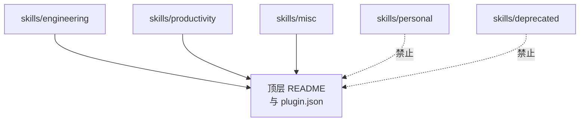

<details>
<summary>相关源文件</summary>

生成本页时使用的主要源文件：

- [CLAUDE.md](../../../project-repos/skills/CLAUDE.md)
- [skills/deprecated/README.md](../../../project-repos/skills/skills/deprecated/README.md)
- [skills/personal/README.md](../../../project-repos/skills/skills/personal/README.md)
- [skills/engineering/triage/OUT-OF-SCOPE.md](../../../project-repos/skills/skills/engineering/triage/OUT-OF-SCOPE.md)

</details>

# 目录桶策略与治理边界

`CLAUDE.md` 把目录桶定义成五条语义边界：`engineering`（日常编码）、`productivity`（非编码工作流）、`misc`（少用工具）、`personal`（与作者个人绑定，不晋升）、`deprecated`（停止使用）。唯一能进入「对外承诺面」（README + `.claude-plugin`）的只有前三类；这既保护用户预期，也给作者留了私人实验的沙盒。

`triage` 技能携带的 `OUT-OF-SCOPE.md` 进一步解释 **consumer 仓库** 根目录 `.out-of-scope/` 知识库的形态：「一概念一文件」，把拒绝理由写成轻量设计短文，从而在关闭 Issue 后不丢失上下文，并在新问题到来时先去重。**这不是本仓库的实现代码**，却是 engineering 技能对「开源维护」场景的强约束。



Sources: [CLAUDE.md:1-13](../../../project-repos/skills/CLAUDE.md#L1-L13), [skills/personal/README.md:1-6](../../../project-repos/skills/skills/personal/README.md#L1-L6), [skills/deprecated/README.md:1-8](../../../project-repos/skills/skills/deprecated/README.md#L1-L8), [skills/engineering/triage/OUT-OF-SCOPE.md:1-18](../../../project-repos/skills/skills/engineering/triage/OUT-OF-SCOPE.md#L1-L18)

<details class="source-snippets">
<summary>引用源码</summary>

<!-- source-snippets:start -->

#### `CLAUDE.md:1-13`

```markdown
Skills are organized into bucket folders under `skills/`:

- `engineering/` — daily code work
- `productivity/` — daily non-code workflow tools
- `misc/` — kept around but rarely used
- `personal/` — tied to my own setup, not promoted
- `deprecated/` — no longer used

Every skill in `engineering/`, `productivity/`, or `misc/` must have a reference in the top-level `README.md` and an entry in `.claude-plugin/plugin.json`. Skills in `personal/` and `deprecated/` must not appear in either.

Each skill entry in the top-level `README.md` must link the skill name to its `SKILL.md`.

Each bucket folder has a `README.md` that lists every skill in the bucket with a one-line description, with the skill name linked to its `SKILL.md`.
```

#### `skills/personal/README.md:1-6`

```markdown
# Personal

Skills tied to my own setup, not promoted in the plugin.

- **[edit-article](./edit-article/SKILL.md)** — Edit and improve articles by restructuring sections, improving clarity, and tightening prose.
- **[obsidian-vault](./obsidian-vault/SKILL.md)** — Search, create, and manage notes in an Obsidian vault with wikilinks and index notes.
```

#### `skills/deprecated/README.md:1-8`

```markdown
# Deprecated

Skills I no longer use.

- **[design-an-interface](./design-an-interface/SKILL.md)** — Generate multiple radically different interface designs for a module using parallel sub-agents.
- **[qa](./qa/SKILL.md)** — Interactive QA session where user reports bugs conversationally and the agent files GitHub issues.
- **[request-refactor-plan](./request-refactor-plan/SKILL.md)** — Create a detailed refactor plan with tiny commits via user interview, then file it as a GitHub issue.
- **[ubiquitous-language](./ubiquitous-language/SKILL.md)** — Extract a DDD-style ubiquitous language glossary from the current conversation.
```

#### `skills/engineering/triage/OUT-OF-SCOPE.md:1-18`

````markdown
# Out-of-Scope Knowledge Base

The `.out-of-scope/` directory in a repo stores persistent records of rejected feature requests. It serves two purposes:

1. **Institutional memory** — why a feature was rejected, so the reasoning isn't lost when the issue is closed
2. **Deduplication** — when a new issue comes in that matches a prior rejection, the skill can surface the previous decision instead of re-litigating it

## Directory structure

```
.out-of-scope/
├── dark-mode.md
├── plugin-system.md
└── graphql-api.md
```

One file per **concept**, not per issue. Multiple issues requesting the same thing are grouped under one file.

````

<!-- source-snippets:end -->
</details>

## 相关页面

- [发布面与插件清单](publishing-surface.md) — misc 是否在插件清单内的差异
- [Engineering 技能矩阵](engineering-skills-matrix.md) — triage 与 `.out-of-scope/` 的互动
