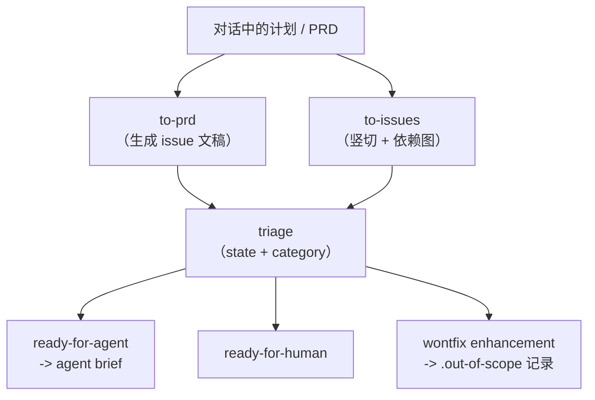

<details>
<summary>相关源文件</summary>

生成本页时使用的主要源文件：

- [skills/engineering/README.md](../../../project-repos/skills/skills/engineering/README.md)
- [skills/engineering/to-issues/SKILL.md](../../../project-repos/skills/skills/engineering/to-issues/SKILL.md)
- [skills/engineering/triage/SKILL.md](../../../project-repos/skills/skills/engineering/triage/SKILL.md)
- [skills/engineering/to-prd/SKILL.md](../../../project-repos/skills/skills/engineering/to-prd/SKILL.md)

</details>

# Engineering 技能矩阵

`skills/engineering/README.md` 用一句话概括了 9 个日常技能各自的「可交付物」：从诊断循环、到 grilling+文档、Issue 状态机、架构深化、setup、TDD、拆单、生成 PRD issue、以及 zoom-out 阅读法。阅读技巧是 **按数据面（Issue tracker）与控制面（triage 状态机）先分层**，再看质量技能（`tdd`、`diagnose`、`improve-codebase-architecture`）如何挂载在这张网上。

`to-issues` 把任何计划拆成 **tracer bullet** 竖切：每个 issue 必须窄、但要穿过所有集成层，可演示或可验证；同时在模板里要求写清 parent、验收标准、依赖关系，并在发布时统一打上 `needs-triage` 以进入 triage 技能定义的工作流。它还硬编码了 **HITL vs AFK** 分类，用来表达「哪些切片必须等人拍板」。

`triage` 把维护者语言译成 **两个 category 角色（bug/enhancement）+ 五个 state 角色**，并规定 triage 期间所有外发内容都要带固定免责声明，避免把机器生成意见伪装成人类结论。它还要求读 `.out-of-scope/*.md`，在 `wontfix` 场景把机构记忆写回知识库，从而让重复请求被快速对齐到历史决定。



Sources: [skills/engineering/README.md:1-13](../../../project-repos/skills/skills/engineering/README.md#L1-L13), [skills/engineering/to-issues/SKILL.md:1-79](../../../project-repos/skills/skills/engineering/to-issues/SKILL.md#L1-L79), [skills/engineering/triage/SKILL.md:1-78](../../../project-repos/skills/skills/engineering/triage/SKILL.md#L1-L78)

<details class="source-snippets">
<summary>引用源码</summary>

<!-- source-snippets:start -->

#### `skills/engineering/README.md:1-13`

```markdown
# Engineering

Skills I use daily for code work.

- **[diagnose](./diagnose/SKILL.md)** — Disciplined diagnosis loop for hard bugs and performance regressions: reproduce → minimise → hypothesise → instrument → fix → regression-test.
- **[grill-with-docs](./grill-with-docs/SKILL.md)** — Grilling session that challenges your plan against the existing domain model, sharpens terminology, and updates `CONTEXT.md` and ADRs inline.
- **[triage](./triage/SKILL.md)** — Triage issues through a state machine of triage roles.
- **[improve-codebase-architecture](./improve-codebase-architecture/SKILL.md)** — Find deepening opportunities in a codebase, informed by the domain language in `CONTEXT.md` and the decisions in `docs/adr/`.
- **[setup-matt-pocock-skills](./setup-matt-pocock-skills/SKILL.md)** — Scaffold the per-repo config (issue tracker, triage label vocabulary, domain doc layout) that the other engineering skills consume.
- **[tdd](./tdd/SKILL.md)** — Test-driven development with a red-green-refactor loop. Builds features or fixes bugs one vertical slice at a time.
- **[to-issues](./to-issues/SKILL.md)** — Break any plan, spec, or PRD into independently-grabbable GitHub issues using vertical slices.
- **[to-prd](./to-prd/SKILL.md)** — Turn the current conversation context into a PRD and submit it as a GitHub issue.
- **[zoom-out](./zoom-out/SKILL.md)** — Tell the agent to zoom out and give broader context or a higher-level perspective on an unfamiliar section of code.
```

#### `skills/engineering/to-issues/SKILL.md:1-79`

```markdown
---
name: to-issues
description: Break a plan, spec, or PRD into independently-grabbable issues on the project issue tracker using tracer-bullet vertical slices. Use when user wants to convert a plan into issues, create implementation tickets, or break down work into issues.
---

# To Issues

Break a plan into independently-grabbable issues using vertical slices (tracer bullets).

The issue tracker and triage label vocabulary should have been provided to you — run `/setup-matt-pocock-skills` if not.

## Process

### 1. Gather context

Work from whatever is already in the conversation context. If the user passes an issue reference (issue number, URL, or path) as an argument, fetch it from the issue tracker and read its full body and comments.

### 2. Explore the codebase (optional)

If you have not already explored the codebase, do so to understand the current state of the code. Issue titles and descriptions should use the project's domain glossary vocabulary, and respect ADRs in the area you're touching.

### 3. Draft vertical slices

Break the plan into **tracer bullet** issues. Each issue is a thin vertical slice that cuts through ALL integration layers end-to-end, NOT a horizontal slice of one layer.

Slices may be 'HITL' or 'AFK'. HITL slices require human interaction, such as an architectural decision or a design review. AFK slices can be implemented and merged without human interaction. Prefer AFK over HITL where possible.

<vertical-slice-rules>
- Each slice delivers a narrow but COMPLETE path through every layer (schema, API, UI, tests)
- A completed slice is demoable or verifiable on its own
- Prefer many thin slices over few thick ones
</vertical-slice-rules>

### 4. Quiz the user

Present the proposed breakdown as a numbered list. For each slice, show:

- **Title**: short descriptive name
- **Type**: HITL / AFK
- **Blocked by**: which other slices (if any) must complete first
- **User stories covered**: which user stories this addresses (if the source material has them)

Ask the user:

- Does the granularity feel right? (too coarse / too fine)
- Are the dependency relationships correct?
- Should any slices be merged or split further?
- Are the correct slices marked as HITL and AFK?

Iterate until the user approves the breakdown.

### 5. Publish the issues to the issue tracker

For each approved slice, publish a new issue to the issue tracker. Use the issue body template below. Apply the `needs-triage` triage label so each issue enters the normal triage flow.

Publish issues in dependency order (blockers first) so you can reference real issue identifiers in the "Blocked by" field.

<issue-template>
## Parent

A reference to the parent issue on the issue tracker (if the source was an existing issue, otherwise omit this section).

## What to build

A concise description of this vertical slice. Describe the end-to-end behavior, not layer-by-layer implementation.

## Acceptance criteria

- [ ] Criterion 1
- [ ] Criterion 2
- [ ] Criterion 3

## Blocked by

- A reference to the blocking ticket (if any)

Or "None - can start immediately" if no blockers.

</issue-template>
```

#### `skills/engineering/triage/SKILL.md:1-78`

````markdown
---
name: triage
description: Triage issues through a state machine driven by triage roles. Use when user wants to create an issue, triage issues, review incoming bugs or feature requests, prepare issues for an AFK agent, or manage issue workflow.
---

# Triage

Move issues on the project issue tracker through a small state machine of triage roles.

Every comment or issue posted to the issue tracker during triage **must** start with this disclaimer:

```
> *This was generated by AI during triage.*
```

## Reference docs

- [AGENT-BRIEF.md](AGENT-BRIEF.md) — how to write durable agent briefs
- [OUT-OF-SCOPE.md](OUT-OF-SCOPE.md) — how the `.out-of-scope/` knowledge base works

## Roles

Two **category** roles:

- `bug` — something is broken
- `enhancement` — new feature or improvement

Five **state** roles:

- `needs-triage` — maintainer needs to evaluate
- `needs-info` — waiting on reporter for more information
- `ready-for-agent` — fully specified, ready for an AFK agent
- `ready-for-human` — needs human implementation
- `wontfix` — will not be actioned

Every triaged issue should carry exactly one category role and one state role. If state roles conflict, flag it and ask the maintainer before doing anything else.

These are canonical role names — the actual label strings used in the issue tracker may differ. The mapping should have been provided to you - run `/setup-matt-pocock-skills` if not.

State transitions: an unlabeled issue normally goes to `needs-triage` first; from there it moves to `needs-info`, `ready-for-agent`, `ready-for-human`, or `wontfix`. `needs-info` returns to `needs-triage` once the reporter replies. The maintainer can override at any time — flag transitions that look unusual and ask before proceeding.

## Invocation

The maintainer invokes `/triage` and describes what they want in natural language. Interpret the request and act. Examples:

- "Show me anything that needs my attention"
- "Let's look at #42"
- "Move #42 to ready-for-agent"
- "What's ready for agents to pick up?"

## Show what needs attention

Query the issue tracker and present three buckets, oldest first:

1. **Unlabeled** — never triaged.
2. **`needs-triage`** — evaluation in progress.
3. **`needs-info` with reporter activity since the last triage notes** — needs re-evaluation.

Show counts and a one-line summary per issue. Let the maintainer pick.

## Triage a specific issue

1. **Gather context.** Read the full issue (body, comments, labels, reporter, dates). Parse any prior triage notes so you don't re-ask resolved questions. Explore the codebase using the project's domain glossary, respecting ADRs in the area. Read `.out-of-scope/*.md` and surface any prior rejection that resembles this issue.

2. **Recommend.** Tell the maintainer your category and state recommendation with reasoning, plus a brief codebase summary relevant to the issue. Wait for direction.

3. **Reproduce (bugs only).** Before any grilling, attempt reproduction: read the reporter's steps, trace the relevant code, run tests or commands. Report what happened — successful repro with code path, failed repro, or insufficient detail (a strong `needs-info` signal). A confirmed repro makes a much stronger agent brief.

4. **Grill (if needed).** If the issue needs fleshing out, run a `/grill-with-docs` session.

5. **Apply the outcome:**
   - `ready-for-agent` — post an agent brief comment ([AGENT-BRIEF.md](AGENT-BRIEF.md)).
   - `ready-for-human` — same structure as an agent brief, but note why it can't be delegated (judgment calls, external access, design decisions, manual testing).
   - `needs-info` — post triage notes (template below).
   - `wontfix` (bug) — polite explanation, then close.
   - `wontfix` (enhancement) — write to `.out-of-scope/`, link to it from a comment, then close ([OUT-OF-SCOPE.md](OUT-OF-SCOPE.md)).
   - `needs-triage` — apply the role. Optional comment if there's partial progress.

````

<!-- source-snippets:end -->
</details>

## 相关页面

- [每仓配置与领域契约](setup-and-domain-contract.md) — Issue 与 label 映射从何而来
- [Productivity 与 Misc 技能](productivity-and-tooling-skills.md) — `/grill-*` 如何支援 triage
- [失败模式与工程价值观](failure-modes-and-values.md) — 这些技能的叙事起点
