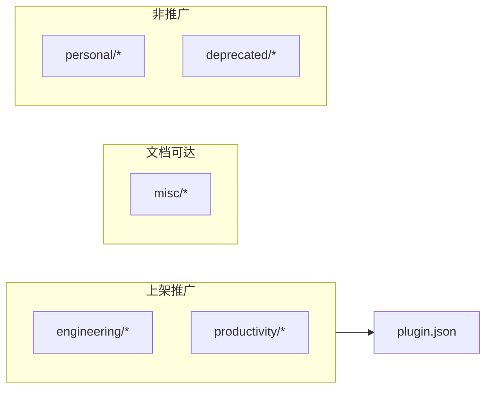

<details>
<summary>相关源文件</summary>

生成本页时使用的主要源文件：

- [skills/productivity/caveman/SKILL.md](../../../project-repos/skills/skills/productivity/caveman/SKILL.md)
- [skills/productivity/write-a-skill/SKILL.md](../../../project-repos/skills/skills/productivity/write-a-skill/SKILL.md)
- [scripts/link-skills.sh](../../../project-repos/skills/scripts/link-skills.sh)
- [skills/engineering/triage/OUT-OF-SCOPE.md](../../../project-repos/skills/skills/engineering/triage/OUT-OF-SCOPE.md)

</details>

# 扩展目录、脚本与个人技能

并非每个 Skill 都享有插件级别的曝光：`misc/`（git guardrails、migrate-to-shoehorn、scaffold-exercises、setup-pre-commit）仍可在 README 中获得一句话索引，但不会被 `.claude-plugin/plugin.json` 自动装载；`personal/`（edit-article、obsidian-vault）标注为作者自用；`deprecated/` 目录保留历史 Skill，README 亦不再推介。



## 生产力补充：`caveman` 与 `write-a-skill`

`caveman` 定位 ultra-compressed communication mode（自称可砍下约 75% token filler）；`write-a-skill` 则给出新建 Skill 的脚手架流程（超过 500 行就拆 reference、需要确定性步骤就放 scripts）。

## 本地脚本：`link-skills.sh`

脚本遍历仓库内全部 `SKILL.md`，以 skill 文件夹 basename 为名创建指向 `~/.claude/skills` 的 symlink，便于在未走 `npx skills` 管线时本地调试。实现里特意防范「`~/.claude/skills` 已是指向本仓库的 symlink」——否则会把自己链接回工作树造成污染。

## `.out-of-scope/` 与 triage 的闭环

`triage` Skill 引用 `OUT-OF-SCOPE.md`：当 enhancement 被判 `wontfix` 时需要写入 `.out-of-scope/*.md` 记录决策，以防 backlog 反复撞同一 reject reason。

Sources: [skills/productivity/caveman/SKILL.md:1-49](../../../project-repos/skills/skills/productivity/caveman/SKILL.md#L1-L49), [skills/productivity/write-a-skill/SKILL.md:8-35](../../../project-repos/skills/skills/productivity/write-a-skill/SKILL.md#L8-L35), [scripts/link-skills.sh:7-38](../../../project-repos/skills/scripts/link-skills.sh#L7-L38), [skills/engineering/triage/SKILL.md:18-19](../../../project-repos/skills/skills/engineering/triage/SKILL.md#L18-L19)

<details class="source-snippets">
<summary>引用源码</summary>

<!-- source-snippets:start -->

#### `skills/productivity/caveman/SKILL.md:1-49`

````markdown
---
name: caveman
description: >
  Ultra-compressed communication mode. Cuts token usage ~75% by dropping
  filler, articles, and pleasantries while keeping full technical accuracy.
  Use when user says "caveman mode", "talk like caveman", "use caveman",
  "less tokens", "be brief", or invokes /caveman.
---

Respond terse like smart caveman. All technical substance stay. Only fluff die.

## Persistence

ACTIVE EVERY RESPONSE once triggered. No revert after many turns. No filler drift. Still active if unsure. Off only when user says "stop caveman" or "normal mode".

## Rules

Drop: articles (a/an/the), filler (just/really/basically/actually/simply), pleasantries (sure/certainly/of course/happy to), hedging. Fragments OK. Short synonyms (big not extensive, fix not "implement a solution for"). Abbreviate common terms (DB/auth/config/req/res/fn/impl). Strip conjunctions. Use arrows for causality (X -> Y). One word when one word enough.

Technical terms stay exact. Code blocks unchanged. Errors quoted exact.

Pattern: `[thing] [action] [reason]. [next step].`

Not: "Sure! I'd be happy to help you with that. The issue you're experiencing is likely caused by..."
Yes: "Bug in auth middleware. Token expiry check use `<` not `<=`. Fix:"

### Examples

**"Why React component re-render?"**

> Inline obj prop -> new ref -> re-render. `useMemo`.

**"Explain database connection pooling."**

> Pool = reuse DB conn. Skip handshake -> fast under load.

## Auto-Clarity Exception

Drop caveman temporarily for: security warnings, irreversible action confirmations, multi-step sequences where fragment order risks misread, user asks to clarify or repeats question. Resume caveman after clear part done.

Example -- destructive op:

> **Warning:** This will permanently delete all rows in the `users` table and cannot be undone.
>
> ```sql
> DROP TABLE users;
> ```
>
> Caveman resume. Verify backup exist first.
````

#### `skills/productivity/write-a-skill/SKILL.md:8-35`

````markdown
## Process

1. **Gather requirements** - ask user about:
   - What task/domain does the skill cover?
   - What specific use cases should it handle?
   - Does it need executable scripts or just instructions?
   - Any reference materials to include?

2. **Draft the skill** - create:
   - SKILL.md with concise instructions
   - Additional reference files if content exceeds 500 lines
   - Utility scripts if deterministic operations needed

3. **Review with user** - present draft and ask:
   - Does this cover your use cases?
   - Anything missing or unclear?
   - Should any section be more/less detailed?

## Skill Structure

```
skill-name/
├── SKILL.md           # Main instructions (required)
├── REFERENCE.md       # Detailed docs (if needed)
├── EXAMPLES.md        # Usage examples (if needed)
└── scripts/           # Utility scripts (if needed)
    └── helper.js
```
````

#### `scripts/link-skills.sh:7-38`

```bash
REPO="$(cd "$(dirname "$0")/.." && pwd)"
DEST="$HOME/.claude/skills"

# If ~/.claude/skills is a symlink that resolves into this repo, we'd end up
# writing the per-skill symlinks back into the repo's own skills/ tree. Detect
# and bail out instead of polluting the working copy.
if [ -L "$DEST" ]; then
  resolved="$(readlink -f "$DEST")"
  case "$resolved" in
    "$REPO"|"$REPO"/*)
      echo "error: $DEST is a symlink into this repo ($resolved)." >&2
      echo "Remove it (rm \"$DEST\") and re-run; the script will recreate it as a real dir." >&2
      exit 1
      ;;
  esac
fi

mkdir -p "$DEST"

find "$REPO/skills" -name SKILL.md -not -path '*/node_modules/*' -print0 |
while IFS= read -r -d '' skill_md; do
  src="$(dirname "$skill_md")"
  name="$(basename "$src")"
  target="$DEST/$name"

  if [ -e "$target" ] && [ ! -L "$target" ]; then
    rm -rf "$target"
  fi

  ln -sfn "$src" "$target"
  echo "linked $name -> $src"
done
```

#### `skills/engineering/triage/SKILL.md:18-19`

```markdown
- [AGENT-BRIEF.md](AGENT-BRIEF.md) — how to write durable agent briefs
- [OUT-OF-SCOPE.md](OUT-OF-SCOPE.md) — how the `.out-of-scope/` knowledge base works
```

<!-- source-snippets:end -->
</details>

## 相关页面

- [安装与 Claude 插件清单](installation-and-manifest.md) — curated vs 目录全集  
- [项目概览](overview.md) — bucket 分层的设计动机  
