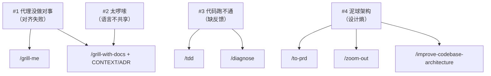

<details>
<summary>相关源文件</summary>

生成本页时使用的主要源文件：

- [README.md](../../../project-repos/skills/README.md)
- [CONTEXT.md](../../../project-repos/skills/CONTEXT.md)
- [docs/adr/0001-explicit-setup-pointer-only-for-hard-dependencies.md](../../../project-repos/skills/docs/adr/0001-explicit-setup-pointer-only-for-hard-dependencies.md)

</details>

# 失败模式与工程价值观

README 用四个「代理失效模式」组织技能目录，而不是按字母表堆放命令；这决定了读者应把本仓库当作 **行为矫正器** 来理解：每个 skill 都对应一种可观察的失败，以及一条可重复的纠偏路径。

**Insight**：作者把 `CONTEXT.md` 放在仓库根，并不是装饰，而是 `grill-with-docs`、若干 engineering 技能在运行时真正会检索的「领域压缩层」——它用 **Issue tracker / Issue / Triage role** 三条定义消掉「backlog」一词的多义性，让代理在跨会话表达时减少指代漂移。



第一条失败模式直接引用 *The Pragmatic Programmer*：没人一开始就知道自己要什么，因此需要 **grilling session** 把决策树走全。第二条借 DDD 的「通用语言」概念，指出代理被丢进代码库时会用 20 个词描述 1 个概念；解法是把语言沉淀成 `CONTEXT.md`，并在 `grill-with-docs` 里同步 ADR。第三条回到极限编程：小步、快反馈；`tdd` 与 `diagnose` 分别覆盖「写对」与「查错」。第四条引用 Kent Beck 与 John Ousterhout：代理加速编码也加速熵增，因此把 **设计** 写进技能（`to-prd` 先问清触及模块、`zoom-out` 强制拉远视角、`improve-codebase-architecture` 周期性去杠杆）。

ADR `0001` 把「是否要在技能里硬编码 `/setup` 提示」变成显式策略：`to-issues`、`to-prd`、`triage` 被归为 **hard dependency**——缺配置时输出会 **错**；`diagnose`、`tdd` 等则只在措辞上引用领域文档，缺了也能跑，只是更糊。这个分叉避免把 setup 提示宗教化地复制到每个文件里，也解释了为何 README 把 setup 技能放在工程技能列表的枢纽位置。

Sources: [README.md:40-138](../../../project-repos/skills/README.md#L40-L138), [CONTEXT.md:1-27](../../../project-repos/skills/CONTEXT.md#L1-L27), [docs/adr/0001-explicit-setup-pointer-only-for-hard-dependencies.md:1-11](../../../project-repos/skills/docs/adr/0001-explicit-setup-pointer-only-for-hard-dependencies.md#L1-L11)

<details class="source-snippets">
<summary>引用源码</summary>

<!-- source-snippets:start -->

#### `README.md:40-138`

```markdown
## Why These Skills Exist

I built these skills as a way to fix common failure modes I see with Claude Code, Codex, and other coding agents.

### #1: The Agent Didn't Do What I Want

> "No-one knows exactly what they want"
>
> David Thomas & Andrew Hunt, [The Pragmatic Programmer](https://www.amazon.co.uk/Pragmatic-Programmer-Anniversary-Journey-Mastery/dp/B0833F1T3V)

**The Problem**. The most common failure mode in software development is misalignment. You think the dev knows what you want. Then you see what they've built - and you realize it didn't understand you at all.

This is just the same in the AI age. There is a communication gap between you and the agent. The fix for this is a **grilling session** - getting the agent to ask you detailed questions about what you're building.

**The Fix** is to use:

- [`/grill-me`](./skills/productivity/grill-me/SKILL.md) - for non-code uses
- [`/grill-with-docs`](./skills/engineering/grill-with-docs/SKILL.md) - same as [`/grill-me`](./skills/productivity/grill-me/SKILL.md), but adds more goodies (see below)

These are my most popular skills. They help you align with the agent before you get started, and think deeply about the change you're making. Use them _every_ time you want to make a change.

### #2: The Agent Is Way Too Verbose

> With a ubiquitous language, conversations among developers and expressions of the code are all derived from the same domain model.
>
> Eric Evans, [Domain-Driven-Design](https://www.amazon.co.uk/Domain-Driven-Design-Tackling-Complexity-Software/dp/0321125215)

**The Problem**: At the start of a project, devs and the people they're building the software for (the domain experts) are usually speaking different languages.

I felt the same tension with my agents. Agents are usually dropped into a project and asked to figure out the jargon as they go. So they use 20 words where 1 will do.

**The Fix** for this is a shared language. It's a document that helps agents decode the jargon used in the project.

<details>
<summary>
Example
</summary>

Here's an example [`CONTEXT.md`](https://github.com/mattpocock/course-video-manager/blob/076a5a7a182db0fe1e62971dd7a68bcadf010f1c/CONTEXT.md), from my `course-video-manager` repo. Which one is easier to read?

- **BEFORE**: "There's a problem when a lesson inside a section of a course is made 'real' (i.e. given a spot in the file system)"
- **AFTER**: "There's a problem with the materialization cascade"

This concision pays off session after session.

</details>

This is built into [`/grill-with-docs`](./skills/engineering/grill-with-docs/SKILL.md). It's a grilling session, but that helps you build a shared language with the AI, and document hard-to-explain decisions in ADR's.

It's hard to explain how powerful this is. It might be the single coolest technique in this repo. Try it, and see.

> [!TIP]
> A shared language has many other benefits than reducing verbosity:
>
> - **Variables, functions and files are named consistently**, using the shared language
> - As a result, the **codebase is easier to navigate** for the agent
> - The agent also **spends fewer tokens on thinking**, because it has access to a more concise language

### #3: The Code Doesn't Work

> "Always take small, deliberate steps. The rate of feedback is your speed limit. Never take on a task that’s too big."
>
> David Thomas & Andrew Hunt, [The Pragmatic Programmer](https://www.amazon.co.uk/Pragmatic-Programmer-Anniversary-Journey-Mastery/dp/B0833F1T3V)

**The Problem**: Let's say that you and the agent are aligned on what to build. What happens when the agent _still_ produces crap?

It's time to look at your feedback loops. Without feedback on how the code it produces actually runs, the agent will be flying blind.

**The Fix**: You need the usual tranche of feedback loops: static types, browser access, and automated tests.

For automated tests, a red-green-refactor loop is critical. This is where the agent writes a failing test first, then fixes the test. This helps give the agent a consistent level of feedback that results in far better code.

I've built a **[`/tdd`](./skills/engineering/tdd/SKILL.md) skill** you can slot into any project. It encourages red-green-refactor and gives the agent plenty of guidance on what makes good and bad tests.

For debugging, I've also built a **[`/diagnose`](./skills/engineering/diagnose/SKILL.md)** skill that wraps best debugging practices into a simple loop.

### #4: We Built A Ball Of Mud

> "Invest in the design of the system _every day_."
>
> Kent Beck, [Extreme Programming Explained](https://www.amazon.co.uk/Extreme-Programming-Explained-Embrace-Change/dp/0321278658)

> "The best modules are deep. They allow a lot of functionality to be accessed through a simple interface."
>
> John Ousterhout, [A Philosophy Of Software Design](https://www.amazon.co.uk/Philosophy-Software-Design-2nd/dp/173210221X)

**The Problem**: Most apps built with agents are complex and hard to change. Because agents can radically speed up coding, they also accelerate software entropy. Codebases get more complex at an unprecedented rate.

**The Fix** for this is a radical new approach to AI-powered development: caring about the design of the code.

This is built in to every layer of these skills:

- [`/to-prd`](./skills/engineering/to-prd/SKILL.md) quizzes you about which modules you're touching before creating a PRD
- [`/zoom-out`](./skills/engineering/zoom-out/SKILL.md) tells the agent to explain code in the context of the whole system

And crucially, [`/improve-codebase-architecture`](./skills/engineering/improve-codebase-architecture/SKILL.md) helps you rescue a codebase that has become a ball of mud. I recommend running it on your codebase once every few days.

### Summary

```

#### `CONTEXT.md:1-27`

```markdown
# Matt Pocock Skills

A collection of agent skills (slash commands and behaviors) loaded by Claude Code. Skills are organized into buckets and consumed by per-repo configuration emitted by `/setup-matt-pocock-skills`.

## Language

**Issue tracker**:
The tool that hosts a repo's issues — GitHub Issues, Linear, a local `.scratch/` markdown convention, or similar. Skills like `to-issues`, `to-prd`, `triage`, and `qa` read from and write to it.
_Avoid_: backlog manager, backlog backend, issue host

**Issue**:
A single tracked unit of work inside an **Issue tracker** — a bug, task, PRD, or slice produced by `to-issues`.
_Avoid_: ticket (use only when quoting external systems that call them tickets)

**Triage role**:
A canonical state-machine label applied to an **Issue** during triage (e.g. `needs-triage`, `ready-for-afk`). Each role maps to a real label string in the **Issue tracker** via `docs/agents/triage-labels.md`.

## Relationships

- An **Issue tracker** holds many **Issues**
- An **Issue** carries one **Triage role** at a time

## Flagged ambiguities

- "backlog" was previously used to mean both the *tool* hosting issues and the *body of work* inside it — resolved: the tool is the **Issue tracker**; "backlog" is no longer used as a domain term.
- "backlog backend" / "backlog manager" — resolved: collapsed into **Issue tracker**.
```

#### `docs/adr/0001-explicit-setup-pointer-only-for-hard-dependencies.md:1-11`

```markdown
# Explicit `/setup-matt-pocock-skills` pointer only for hard dependencies

Engineering skills depend on per-repo config (issue tracker, triage label vocabulary, domain doc layout) seeded by `/setup-matt-pocock-skills`. Some skills cannot meaningfully function without that config — they have to publish to a specific issue tracker or apply a specific label string. Others only use it to sharpen output (vocabulary, ADR awareness) and degrade gracefully without it.

We split these into **hard-dependency** and **soft-dependency** skills:

- **Hard dependency** (`to-issues`, `to-prd`, `triage`) — include an explicit one-liner: _"… should have been provided to you — run `/setup-matt-pocock-skills` if not."_ Without the mapping, output is wrong, not just fuzzy.
- **Soft dependency** (`diagnose`, `tdd`, `improve-codebase-architecture`, `zoom-out`) — reference "the project's domain glossary" and "ADRs in the area you're touching" in vague prose only. If the docs aren't there, the skill still works; output is just less sharp.

The split keeps soft-dependency skills token-light and avoids cargo-culting the setup pointer into places where it isn't load-bearing.
```

<!-- source-snippets:end -->
</details>

## 相关页面

- [项目概览](overview.md) — 宏观结构与安装路径
- [Engineering 技能矩阵](engineering-skills-matrix.md) — 这些价值观如何落到具体 SKILL
- [Productivity 与 Misc 技能](productivity-and-tooling-skills.md) — 非代码向与工具向补充
