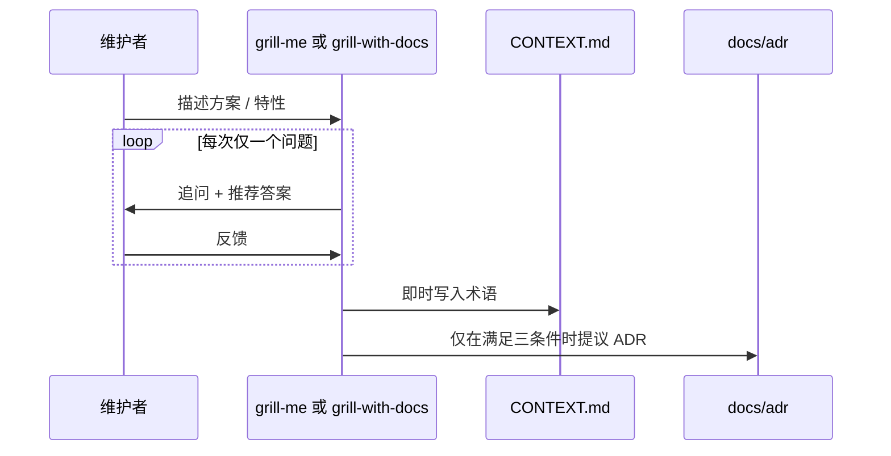

<details>
<summary>相关源文件</summary>

生成本页时使用的主要源文件：

- [skills/productivity/grill-me/SKILL.md](../../../project-repos/skills/skills/productivity/grill-me/SKILL.md)
- [skills/engineering/grill-with-docs/SKILL.md](../../../project-repos/skills/skills/engineering/grill-with-docs/SKILL.md)
- [CONTEXT.md](../../../project-repos/skills/CONTEXT.md)

</details>

# 对齐会话与共享语言

README 把 `/grill-me` 与 `/grill-with-docs` 描述为解决 misalignment 的主力：**前者是纯问答；后者在同一流程里把术语刻进 `CONTEXT.md`，必要时写入 ADR**。这与 Eric Evans 的 ubiquitous language 引用相呼应——Matt 关心的不是引用名人，而是让 Agent 停止用泛化的散文堆砌推断。



`grill-with-docs` 正文强调：**术语冲突必须当场点名**；遇到含糊词汇要把 canonical term 提出来；还要用具体场景压力测试边界。这与仓库根目录 `CONTEXT.md`（演示性质的 glossary）形成对照：`CONTEXT.md` 示例定义 Issue tracker / Issue / Triage role，并明确要避免的旧词（如 backlog 语义漂移）。

## ADR 触发门槛（防泛滥）

只有在「难以回滚」「缺乏上下文会惊讶」「确实有备选方案权衡」三者皆满足时才创建 ADR；否则保持口头结论或在 `CONTEXT.md` 记录即可——这是对 AI 文档膨胀的手术刀式约束。

Sources: [skills/productivity/grill-me/SKILL.md:6-11](../../../project-repos/skills/skills/productivity/grill-me/SKILL.md#L6-L11), [skills/engineering/grill-with-docs/SKILL.md:18-86](../../../project-repos/skills/skills/engineering/grill-with-docs/SKILL.md#L18-L86), [CONTEXT.md:5-26](../../../project-repos/skills/CONTEXT.md#L5-L26)

<details class="source-snippets">
<summary>引用源码</summary>

<!-- source-snippets:start -->

#### `skills/productivity/grill-me/SKILL.md:6-11`

```markdown
Interview me relentlessly about every aspect of this plan until we reach a shared understanding. Walk down each branch of the design tree, resolving dependencies between decisions one-by-one. For each question, provide your recommended answer.

Ask the questions one at a time.

If a question can be answered by exploring the codebase, explore the codebase instead.
```

#### `skills/engineering/grill-with-docs/SKILL.md:18-86`

````markdown
## Domain awareness

During codebase exploration, also look for existing documentation:

### File structure

Most repos have a single context:

```
/
├── CONTEXT.md
├── docs/
│   └── adr/
│       ├── 0001-event-sourced-orders.md
│       └── 0002-postgres-for-write-model.md
└── src/
```

If a `CONTEXT-MAP.md` exists at the root, the repo has multiple contexts. The map points to where each one lives:

```
/
├── CONTEXT-MAP.md
├── docs/
│   └── adr/                          ← system-wide decisions
├── src/
│   ├── ordering/
│   │   ├── CONTEXT.md
│   │   └── docs/adr/                 ← context-specific decisions
│   └── billing/
│       ├── CONTEXT.md
│       └── docs/adr/
```

Create files lazily — only when you have something to write. If no `CONTEXT.md` exists, create one when the first term is resolved. If no `docs/adr/` exists, create it when the first ADR is needed.

## During the session

### Challenge against the glossary

When the user uses a term that conflicts with the existing language in `CONTEXT.md`, call it out immediately. "Your glossary defines 'cancellation' as X, but you seem to mean Y — which is it?"

### Sharpen fuzzy language

When the user uses vague or overloaded terms, propose a precise canonical term. "You're saying 'account' — do you mean the Customer or the User? Those are different things."

### Discuss concrete scenarios

When domain relationships are being discussed, stress-test them with specific scenarios. Invent scenarios that probe edge cases and force the user to be precise about the boundaries between concepts.

### Cross-reference with code

When the user states how something works, check whether the code agrees. If you find a contradiction, surface it: "Your code cancels entire Orders, but you just said partial cancellation is possible — which is right?"

### Update CONTEXT.md inline

When a term is resolved, update `CONTEXT.md` right there. Don't batch these up — capture them as they happen. Use the format in [CONTEXT-FORMAT.md](./CONTEXT-FORMAT.md).

Don't couple `CONTEXT.md` to implementation details. Only include terms that are meaningful to domain experts.

### Offer ADRs sparingly

Only offer to create an ADR when all three are true:

1. **Hard to reverse** — the cost of changing your mind later is meaningful
2. **Surprising without context** — a future reader will wonder "why did they do it this way?"
3. **The result of a real trade-off** — there were genuine alternatives and you picked one for specific reasons

If any of the three is missing, skip the ADR. Use the format in [ADR-FORMAT.md](./ADR-FORMAT.md).
````

#### `CONTEXT.md:5-26`

```markdown
## Language

**Issue tracker**:
The tool that hosts a repo's issues — GitHub Issues, Linear, a local `.scratch/` markdown convention, or similar. Skills like `to-issues`, `to-prd`, `triage`, and `qa` read from and write to it.
_Avoid_: backlog manager, backlog backend, issue host

**Issue**:
A single tracked unit of work inside an **Issue tracker** — a bug, task, PRD, or slice produced by `to-issues`.
_Avoid_: ticket (use only when quoting external systems that call them tickets)

**Triage role**:
A canonical state-machine label applied to an **Issue** during triage (e.g. `needs-triage`, `ready-for-afk`). Each role maps to a real label string in the **Issue tracker** via `docs/agents/triage-labels.md`.

## Relationships

- An **Issue tracker** holds many **Issues**
- An **Issue** carries one **Triage role** at a time

## Flagged ambiguities

- "backlog" was previously used to mean both the *tool* hosting issues and the *body of work* inside it — resolved: the tool is the **Issue tracker**; "backlog" is no longer used as a domain term.
- "backlog backend" / "backlog manager" — resolved: collapsed into **Issue tracker**.
```

<!-- source-snippets:end -->
</details>

## 相关页面

- [项目概览](overview.md) — README 如何把这列为第一痛点  
- [质量回路、诊断与架构加深](quality-architecture-feedback.md) — glossary 如何反哺测试与架构 Skill  
