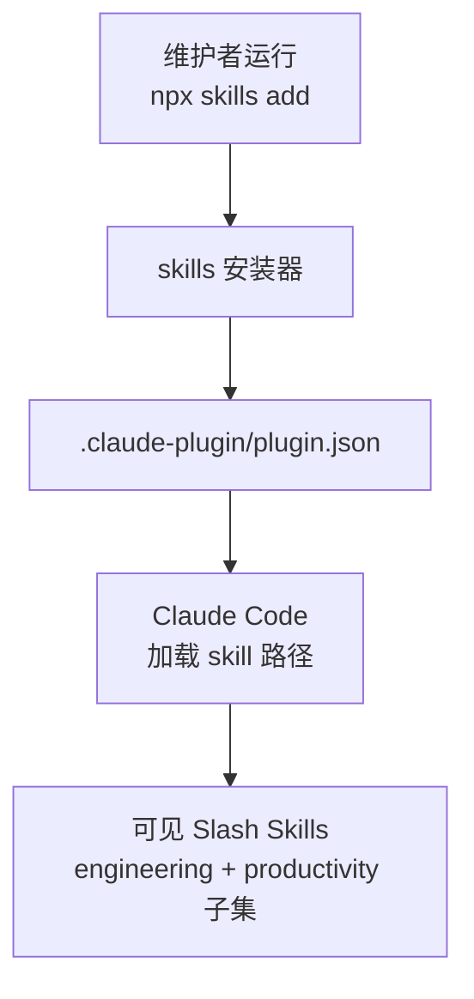

<details>
<summary>相关源文件</summary>

生成本页时使用的主要源文件：

- [README.md](../../../project-repos/skills/README.md)
- [.claude-plugin/plugin.json](../../../project-repos/skills/.claude-plugin/plugin.json)
- [CLAUDE.md](../../../project-repos/skills/CLAUDE.md)

</details>

# 安装与 Claude 插件清单

README 期望的安装心智模型只有两步：`npx skills@latest add mattpocock/skills` 选对 agent，然后务必勾选 `/setup-matt-pocock-skills`。插件清单 (`plugin.json`) 则进一步钉死「哪些 Skill 会在 Claude Code UI 里露出」——它是 curated surface area，而不是整个 `skills/` 目录的镜像。



Claude Code 通过插件声明 skills 数组；数组里的每一项指向 `./skills/...` 目录而非单个 Markdown。于是 manifest 成为事实上的「上架列表」，任何位于 `misc/`、`personal/`、`deprecated/` 的技能都不会出现在数组里——这与 `CLAUDE.md` 的约束一致。

## `plugin.json` 的上架集合

当前 manifest（提交 `b843cb5`）枚举 **11** 条路径：engineering 下 9 个（`diagnose`、`grill-with-docs`、`triage`、`improve-codebase-architecture`、`setup-matt-pocock-skills`、`tdd`、`to-issues`、`to-prd`、`zoom-out`），productivity 下 3 个（`caveman`、`grill-me`、`write-a-skill`）。这与 README 「Reference」段落公开的 curated list 对齐。

## Insight：上架列表 ≠ 仓库全集

**Insight**：README 仍会为 `misc/` skills（例如 git guardrails、pre-commit）撰写条目，但它们刻意缺席 `plugin.json`。这意味着「文档层面的可达」与「工具默认加载」被刻意拆开：`misc` 技能更像是可随时复制的 playbook，而不是 Matt 日常的 Claude Code 默认托盘。

Sources: [README.md:23-38](../../../project-repos/skills/README.md#L23-L38), [claude-plugin/plugin.json:1-17](../../../project-repos/skills/.claude-plugin/plugin.json#L1-L17), [CLAUDE.md:1-13](../../../project-repos/skills/CLAUDE.md#L1-L13)

<details class="source-snippets">
<summary>引用源码</summary>

<!-- source-snippets:start -->

#### `README.md:23-38`

````markdown
## Quickstart (30-second setup)

1. Run the skills.sh installer:

```bash
npx skills@latest add mattpocock/skills
```

2. Pick the skills you want, and which coding agents you want to install them on. **Make sure you select `/setup-matt-pocock-skills`**.

3. Run `/setup-matt-pocock-skills` in your agent. It will:
   - Ask you which issue tracker you want to use (GitHub, Linear, or local files)
   - Ask you what labels you apply to ticks when you triage them (`/triage` uses labels)
   - Ask you where you want to save any docs we create

4. Bam - you're ready to go.
````

#### `claude-plugin/plugin.json:1-17`

```json
{
  "name": "mattpocock-skills",
  "skills": [
    "./skills/engineering/diagnose",
    "./skills/engineering/grill-with-docs",
    "./skills/engineering/triage",
    "./skills/engineering/improve-codebase-architecture",
    "./skills/engineering/setup-matt-pocock-skills",
    "./skills/engineering/tdd",
    "./skills/engineering/to-issues",
    "./skills/engineering/to-prd",
    "./skills/engineering/zoom-out",
    "./skills/productivity/caveman",
    "./skills/productivity/grill-me",
    "./skills/productivity/write-a-skill"
  ]
}
```

#### `CLAUDE.md:1-13`

```markdown
Skills are organized into bucket folders under `skills/`:

- `engineering/` — daily code work
- `productivity/` — daily non-code workflow tools
- `misc/` — kept around but rarely used
- `personal/` — tied to my own setup, not promoted
- `deprecated/` — no longer used

Every skill in `engineering/`, `productivity/`, or `misc/` must have a reference in the top-level `README.md` and an entry in `.claude-plugin/plugin.json`. Skills in `personal/` and `deprecated/` must not appear in either.

Each skill entry in the top-level `README.md` must link the skill name to its `SKILL.md`.

Each bucket folder has a `README.md` that lists every skill in the bucket with a one-line description, with the skill name linked to its `SKILL.md`.
```

<!-- source-snippets:end -->
</details>

## 相关页面

- [项目概览](overview.md) — 为何要 curated composable skills  
- [每仓库配置与硬软依赖](per-repo-setup.md) — 安装后仍需写入 `docs/agents/`  
