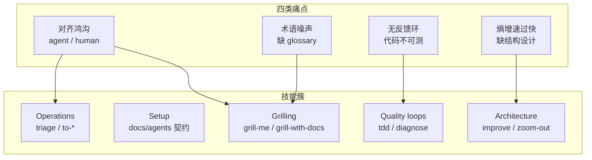

<details>
<summary>相关源文件</summary>

生成本页时使用的主要源文件：

- [README.md](../../../project-repos/skills/README.md)
- [CLAUDE.md](../../../project-repos/skills/CLAUDE.md)

</details>

# 项目概览

Coding Agent 最常见的翻车并不是模型笨，而是**对齐失败、术语漂移、缺少反馈环**，以及在超速产出代码的同时把系统设计当成可有可无的装饰。Matt Pocock 把这四类痛点写成四条叙事主线：用 grilling（拷问式访谈）消灭含糊需求；用 `CONTEXT.md`+ADR 把共享语言落到纸上；用测试 / 浏览器 / 类型构造稳定的 RED/GREEN 信号；再用专门的架构问诊技能对抗「泥球增速过快」。整套方案的措辞很明确：**这些是写给还在掌控交付的工程负责人的**，不是另一条包办全流程的对话脚本。

仓库把所有 Skill 丢进 `skills/` 下的几个 bucket：`engineering/` 绑定代码，`productivity/` 面向协作，`misc/` 低频，`personal/` 作者自用，`deprecated/` 弃用。`CLAUDE.md` 规定了上架边界：**凡是放进 engineering/productivity/misc 的技能都必须出现在顶层 README，并被 `.claude-plugin/plugin.json` 索引（personal 与 deprecated 除外）**。这解释了读者第一眼看到的是小而锋利的 curated list，而不是目录里的几十个子文件夹全集。



上图不是运行时拓扑，而是**心智地图**：左边四类痛点触发右边的若干 Skill 簇；同一问题往往需要 grilling（对齐）、setup（把 tracker label 映射写下来）、再通过质量或分流 Skill 收尾。

## 能力快照（面向 Maintainer）

| 能力簇 | 代表 Slash Skill | 价值一句话 |
|--------|------------------|-----------|
| 对齐 | `grill-me`, `grill-with-docs` | 在进入编码之前穷尽决策树，并让术语落到文档 |
| 运行契约 | `setup-matt-pocock-skills` | 为每台仓库生成 issue tracker、triage label、`CONTEXT`/ADR 消费约定 |
| 交付拆分 | `to-prd`, `to-issues` | PRD 进 backlog；再把方案切成 tracer-bullet Issue |
| 分流运营 | `triage` | 五阶段 label state machine + agent brief |
| 反馈回路 | `tdd`, `diagnose` | 垂直 RED/GREEN；强约束的诊断闭环 |
| 结构性 refactor | `improve-codebase-architecture`, `zoom-out` | 用语义一致的加深术语解剖 shallow module |

## 技术栈与规模事实

- **载体**：Markdown Skill（YAML frontmatter + 正文指令）；插件边界由一个 `.claude-plugin/plugin.json` 枚举对外 Skills。
- **规模**：盘点脚本登记 **57** 份追踪文件（顶层目录：`skills/`、`scripts/`、`docs/`、`.claude-plugin/`、`.out-of-scope/`）。
- **CI / 测试**：仓库不提供自动化测试或流水线——知识体系主要靠 Markdown 与实践可复制脚本 (`scripts/*.sh`)。

## 阅读路线

| 读者目标 | 推荐阅读顺序 |
|----------|----------------|
| 只想弄明白这套方法与 BMAD / Spec-Kit 的差别 | 本页 → [对齐会话与共享语言](grilling-and-domain-language.md) |
| 准备在自有仓库启用 Skills | [安装与 Claude 插件清单](installation-and-manifest.md) → [每仓库配置与硬软依赖](per-repo-setup.md) |
| 想把 backlog / PRD / Triage 串起来 | [规划、Issue 切片与分流](planning-issues-triage.md) |
| 想把工程质量拉回正轨 | [质量回路、诊断与架构加深](quality-architecture-feedback.md) |

Sources: [README.md:11-138](../../../project-repos/skills/README.md#L11-L138), [CLAUDE.md:1-13](../../../project-repos/skills/CLAUDE.md#L1-L13)

<details class="source-snippets">
<summary>引用源码</summary>

<!-- source-snippets:start -->

#### `README.md:11-138`

````markdown
# Skills For Real Engineers

My agent skills that I use every day to do real engineering - not vibe coding.

Developing real applications is hard. Approaches like GSD, BMAD, and Spec-Kit try to help by owning the process. But while doing so, they take away your control and make bugs in the process hard to resolve.

These skills are designed to be small, easy to adapt, and composable. They work with any model. They're based on decades of engineering experience. Hack around with them. Make them your own. Enjoy.

If you want to keep up with changes to these skills, and any new ones I create, you can join ~60,000 other devs on my newsletter:

[Sign Up To The Newsletter](https://www.aihero.dev/s/skills-newsletter)

## Quickstart (30-second setup)

1. Run the skills.sh installer:

```bash
npx skills@latest add mattpocock/skills
```

2. Pick the skills you want, and which coding agents you want to install them on. **Make sure you select `/setup-matt-pocock-skills`**.

3. Run `/setup-matt-pocock-skills` in your agent. It will:
   - Ask you which issue tracker you want to use (GitHub, Linear, or local files)
   - Ask you what labels you apply to ticks when you triage them (`/triage` uses labels)
   - Ask you where you want to save any docs we create

4. Bam - you're ready to go.

## Why These Skills Exist

I built these skills as a way to fix common failure modes I see with Claude Code, Codex, and other coding agents.

### #1: The Agent Didn't Do What I Want

> "No-one knows exactly what they want"
>
> David Thomas & Andrew Hunt, [The Pragmatic Programmer](https://www.amazon.co.uk/Pragmatic-Programmer-Anniversary-Journey-Mastery/dp/B0833F1T3V)

**The Problem**. The most common failure mode in software development is misalignment. You think the dev knows what you want. Then you see what they've built - and you realize it didn't understand you at all.

This is just the same in the AI age. There is a communication gap between you and the agent. The fix for this is a **grilling session** - getting the agent to ask you detailed questions about what you're building.

**The Fix** is to use:

- [`/grill-me`](./skills/productivity/grill-me/SKILL.md) - for non-code uses
- [`/grill-with-docs`](./skills/engineering/grill-with-docs/SKILL.md) - same as [`/grill-me`](./skills/productivity/grill-me/SKILL.md), but adds more goodies (see below)

These are my most popular skills. They help you align with the agent before you get started, and think deeply about the change you're making. Use them _every_ time you want to make a change.

### #2: The Agent Is Way Too Verbose

> With a ubiquitous language, conversations among developers and expressions of the code are all derived from the same domain model.
>
> Eric Evans, [Domain-Driven-Design](https://www.amazon.co.uk/Domain-Driven-Design-Tackling-Complexity-Software/dp/0321125215)

**The Problem**: At the start of a project, devs and the people they're building the software for (the domain experts) are usually speaking different languages.

I felt the same tension with my agents. Agents are usually dropped into a project and asked to figure out the jargon as they go. So they use 20 words where 1 will do.

**The Fix** for this is a shared language. It's a document that helps agents decode the jargon used in the project.

<details>
<summary>
Example
</summary>

Here's an example [`CONTEXT.md`](https://github.com/mattpocock/course-video-manager/blob/076a5a7a182db0fe1e62971dd7a68bcadf010f1c/CONTEXT.md), from my `course-video-manager` repo. Which one is easier to read?

- **BEFORE**: "There's a problem when a lesson inside a section of a course is made 'real' (i.e. given a spot in the file system)"
- **AFTER**: "There's a problem with the materialization cascade"

This concision pays off session after session.

</details>

This is built into [`/grill-with-docs`](./skills/engineering/grill-with-docs/SKILL.md). It's a grilling session, but that helps you build a shared language with the AI, and document hard-to-explain decisions in ADR's.

It's hard to explain how powerful this is. It might be the single coolest technique in this repo. Try it, and see.

> [!TIP]
> A shared language has many other benefits than reducing verbosity:
>
> - **Variables, functions and files are named consistently**, using the shared language
> - As a result, the **codebase is easier to navigate** for the agent
> - The agent also **spends fewer tokens on thinking**, because it has access to a more concise language

### #3: The Code Doesn't Work

> "Always take small, deliberate steps. The rate of feedback is your speed limit. Never take on a task that’s too big."
>
> David Thomas & Andrew Hunt, [The Pragmatic Programmer](https://www.amazon.co.uk/Pragmatic-Programmer-Anniversary-Journey-Mastery/dp/B0833F1T3V)

**The Problem**: Let's say that you and the agent are aligned on what to build. What happens when the agent _still_ produces crap?

It's time to look at your feedback loops. Without feedback on how the code it produces actually runs, the agent will be flying blind.

**The Fix**: You need the usual tranche of feedback loops: static types, browser access, and automated tests.

For automated tests, a red-green-refactor loop is critical. This is where the agent writes a failing test first, then fixes the test. This helps give the agent a consistent level of feedback that results in far better code.

I've built a **[`/tdd`](./skills/engineering/tdd/SKILL.md) skill** you can slot into any project. It encourages red-green-refactor and gives the agent plenty of guidance on what makes good and bad tests.

For debugging, I've also built a **[`/diagnose`](./skills/engineering/diagnose/SKILL.md)** skill that wraps best debugging practices into a simple loop.

### #4: We Built A Ball Of Mud

> "Invest in the design of the system _every day_."
>
> Kent Beck, [Extreme Programming Explained](https://www.amazon.co.uk/Extreme-Programming-Explained-Embrace-Change/dp/0321278658)

> "The best modules are deep. They allow a lot of functionality to be accessed through a simple interface."
>
> John Ousterhout, [A Philosophy Of Software Design](https://www.amazon.co.uk/Philosophy-Software-Design-2nd/dp/173210221X)

**The Problem**: Most apps built with agents are complex and hard to change. Because agents can radically speed up coding, they also accelerate software entropy. Codebases get more complex at an unprecedented rate.

**The Fix** for this is a radical new approach to AI-powered development: caring about the design of the code.

This is built in to every layer of these skills:
... snippet truncated ...
````

#### `CLAUDE.md:1-13`

```markdown
Skills are organized into bucket folders under `skills/`:

- `engineering/` — daily code work
- `productivity/` — daily non-code workflow tools
- `misc/` — kept around but rarely used
- `personal/` — tied to my own setup, not promoted
- `deprecated/` — no longer used

Every skill in `engineering/`, `productivity/`, or `misc/` must have a reference in the top-level `README.md` and an entry in `.claude-plugin/plugin.json`. Skills in `personal/` and `deprecated/` must not appear in either.

Each skill entry in the top-level `README.md` must link the skill name to its `SKILL.md`.

Each bucket folder has a `README.md` that lists every skill in the bucket with a one-line description, with the skill name linked to its `SKILL.md`.
```

<!-- source-snippets:end -->
</details>

## 相关页面

- [安装与 Claude 插件清单](installation-and-manifest.md) — 如何把 curated Skills 写入 Claude Code  
- [对齐会话与共享语言](grilling-and-domain-language.md) — README 宣称的首要武器  
