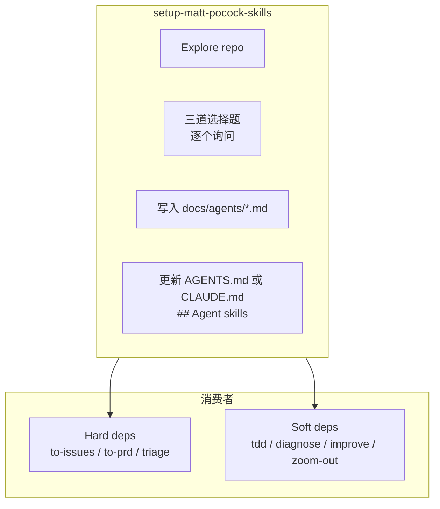

<details>
<summary>相关源文件</summary>

生成本页时使用的主要源文件：

- [skills/engineering/setup-matt-pocock-skills/SKILL.md](../../../project-repos/skills/skills/engineering/setup-matt-pocock-skills/SKILL.md)
- [docs/adr/0001-explicit-setup-pointer-only-for-hard-dependencies.md](../../../project-repos/skills/docs/adr/0001-explicit-setup-pointer-only-for-hard-dependencies.md)

</details>

# 每仓库配置与硬软依赖

`/setup-matt-pocock-skills` 是唯一真正「写文件」的 onboarding Skill：它读取远端信息（`git remote`）、既有 `AGENTS.md`/`CLAUDE.md`，然后在 `docs/agents/` 生成 issue tracker、triage label、domain layout 三份说明，并把摘要块嵌回单一入口 Markdown。ADR 0001 随后解释：**并非所有 engineering skill 都需要在同一句提示里绑架用户去 setup**——只有会把错误 label 写进真实 backlog 的技能才算硬依赖。



**硬依赖**三类：`to-issues`、`to-prd`、`triage`——它们直接把 canonical label 字符串映射到外部系统；缺映射会产生错误输出而不是含糊。**软依赖**四类：`diagnose`、`tdd`、`improve-codebase-architecture`、`zoom-out`——它们只在 prose 里提及 glossary / ADR，缺失时 Skill 仍可运行，只是少了锐利度。

## Setup 流程中的关键约束

- Skill 明确写成「prompt-driven」，即必须先 explore + 与用户确认，而不是幻想某个脚本一键写完。
- 写入 `## Agent skills` 时遵循：`CLAUDE.md` 优先于 `AGENTS.md`；二者不可并存新建。
- Issue tracker 选项覆盖 GitHub / GitLab / 本地 `.scratch/` markdown / 其它（自由文本 workflow）。

Sources: [skills/engineering/setup-matt-pocock-skills/SKILL.md:7-115](../../../project-repos/skills/skills/engineering/setup-matt-pocock-skills/SKILL.md#L7-L115), [docs/adr/0001-explicit-setup-pointer-only-for-hard-dependencies.md:1-11](../../../project-repos/skills/docs/adr/0001-explicit-setup-pointer-only-for-hard-dependencies.md#L1-L11)

<details class="source-snippets">
<summary>引用源码</summary>

<!-- source-snippets:start -->

#### `skills/engineering/setup-matt-pocock-skills/SKILL.md:7-115`

````markdown
# Setup Matt Pocock's Skills

Scaffold the per-repo configuration that the engineering skills assume:

- **Issue tracker** — where issues live (GitHub by default; local markdown is also supported out of the box)
- **Triage labels** — the strings used for the five canonical triage roles
- **Domain docs** — where `CONTEXT.md` and ADRs live, and the consumer rules for reading them

This is a prompt-driven skill, not a deterministic script. Explore, present what you found, confirm with the user, then write.

## Process

### 1. Explore

Look at the current repo to understand its starting state. Read whatever exists; don't assume:

- `git remote -v` and `.git/config` — is this a GitHub repo? Which one?
- `AGENTS.md` and `CLAUDE.md` at the repo root — does either exist? Is there already an `## Agent skills` section in either?
- `CONTEXT.md` and `CONTEXT-MAP.md` at the repo root
- `docs/adr/` and any `src/*/docs/adr/` directories
- `docs/agents/` — does this skill's prior output already exist?
- `.scratch/` — sign that a local-markdown issue tracker convention is already in use

### 2. Present findings and ask

Summarise what's present and what's missing. Then walk the user through the three decisions **one at a time** — present a section, get the user's answer, then move to the next. Don't dump all three at once.

Assume the user does not know what these terms mean. Each section starts with a short explainer (what it is, why these skills need it, what changes if they pick differently). Then show the choices and the default.

**Section A — Issue tracker.**

> Explainer: The "issue tracker" is where issues live for this repo. Skills like `to-issues`, `triage`, `to-prd`, and `qa` read from and write to it — they need to know whether to call `gh issue create`, write a markdown file under `.scratch/`, or follow some other workflow you describe. Pick the place you actually track work for this repo.

Default posture: these skills were designed for GitHub. If a `git remote` points at GitHub, propose that. If a `git remote` points at GitLab (`gitlab.com` or a self-hosted host), propose GitLab. Otherwise (or if the user prefers), offer:

- **GitHub** — issues live in the repo's GitHub Issues (uses the `gh` CLI)
- **GitLab** — issues live in the repo's GitLab Issues (uses the [`glab`](https://gitlab.com/gitlab-org/cli) CLI)
- **Local markdown** — issues live as files under `.scratch/<feature>/` in this repo (good for solo projects or repos without a remote)
- **Other** (Jira, Linear, etc.) — ask the user to describe the workflow in one paragraph; the skill will record it as freeform prose

**Section B — Triage label vocabulary.**

> Explainer: When the `triage` skill processes an incoming issue, it moves it through a state machine — needs evaluation, waiting on reporter, ready for an AFK agent to pick up, ready for a human, or won't fix. To do that, it needs to apply labels (or the equivalent in your issue tracker) that match strings *you've actually configured*. If your repo already uses different label names (e.g. `bug:triage` instead of `needs-triage`), map them here so the skill applies the right ones instead of creating duplicates.

The five canonical roles:

- `needs-triage` — maintainer needs to evaluate
- `needs-info` — waiting on reporter
- `ready-for-agent` — fully specified, AFK-ready (an agent can pick it up with no human context)
- `ready-for-human` — needs human implementation
- `wontfix` — will not be actioned

Default: each role's string equals its name. Ask the user if they want to override any. If their issue tracker has no existing labels, the defaults are fine.

**Section C — Domain docs.**

> Explainer: Some skills (`improve-codebase-architecture`, `diagnose`, `tdd`) read a `CONTEXT.md` file to learn the project's domain language, and `docs/adr/` for past architectural decisions. They need to know whether the repo has one global context or multiple (e.g. a monorepo with separate frontend/backend contexts) so they look in the right place.

Confirm the layout:

- **Single-context** — one `CONTEXT.md` + `docs/adr/` at the repo root. Most repos are this.
- **Multi-context** — `CONTEXT-MAP.md` at the root pointing to per-context `CONTEXT.md` files (typically a monorepo).

### 3. Confirm and edit

Show the user a draft of:

- The `## Agent skills` block to add to whichever of `CLAUDE.md` / `AGENTS.md` is being edited (see step 4 for selection rules)
- The contents of `docs/agents/issue-tracker.md`, `docs/agents/triage-labels.md`, `docs/agents/domain.md`

Let them edit before writing.

### 4. Write

**Pick the file to edit:**

- If `CLAUDE.md` exists, edit it.
- Else if `AGENTS.md` exists, edit it.
- If neither exists, ask the user which one to create — don't pick for them.

Never create `AGENTS.md` when `CLAUDE.md` already exists (or vice versa) — always edit the one that's already there.

If an `## Agent skills` block already exists in the chosen file, update its contents in-place rather than appending a duplicate. Don't overwrite user edits to the surrounding sections.

The block:

```markdown
## Agent skills

### Issue tracker

[one-line summary of where issues are tracked]. See `docs/agents/issue-tracker.md`.

### Triage labels

[one-line summary of the label vocabulary]. See `docs/agents/triage-labels.md`.

### Domain docs

[one-line summary of layout — "single-context" or "multi-context"]. See `docs/agents/domain.md`.
```

Then write the three docs files using the seed templates in this skill folder as a starting point:

- [issue-tracker-github.md](./issue-tracker-github.md) — GitHub issue tracker
- [issue-tracker-gitlab.md](./issue-tracker-gitlab.md) — GitLab issue tracker
- [issue-tracker-local.md](./issue-tracker-local.md) — local-markdown issue tracker
- [triage-labels.md](./triage-labels.md) — label mapping
- [domain.md](./domain.md) — domain doc consumer rules + layout
````

#### `docs/adr/0001-explicit-setup-pointer-only-for-hard-dependencies.md:1-11`

```markdown
# Explicit `/setup-matt-pocock-skills` pointer only for hard dependencies

Engineering skills depend on per-repo config (issue tracker, triage label vocabulary, domain doc layout) seeded by `/setup-matt-pocock-skills`. Some skills cannot meaningfully function without that config — they have to publish to a specific issue tracker or apply a specific label string. Others only use it to sharpen output (vocabulary, ADR awareness) and degrade gracefully without it.

We split these into **hard-dependency** and **soft-dependency** skills:

- **Hard dependency** (`to-issues`, `to-prd`, `triage`) — include an explicit one-liner: _"… should have been provided to you — run `/setup-matt-pocock-skills` if not."_ Without the mapping, output is wrong, not just fuzzy.
- **Soft dependency** (`diagnose`, `tdd`, `improve-codebase-architecture`, `zoom-out`) — reference "the project's domain glossary" and "ADRs in the area you're touching" in vague prose only. If the docs aren't there, the skill still works; output is just less sharp.

The split keeps soft-dependency skills token-light and avoids cargo-culting the setup pointer into places where it isn't load-bearing.
```

<!-- source-snippets:end -->
</details>

## 相关页面

- [安装与 Claude 插件清单](installation-and-manifest.md) — manifest 与 README 的分工  
- [规划、Issue 切片与分流](planning-issues-triage.md) — 硬依赖技能怎样消费 triage 映射  
