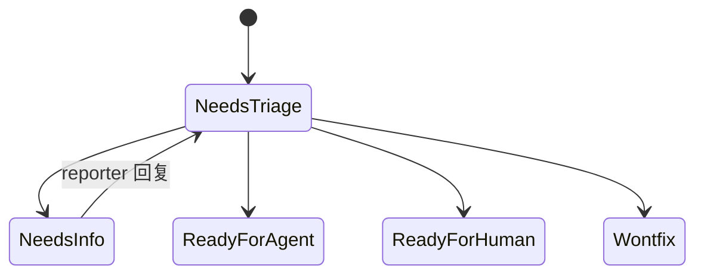

<details>
<summary>相关源文件</summary>

生成本页时使用的主要源文件：

- [skills/engineering/to-prd/SKILL.md](../../../project-repos/skills/skills/engineering/to-prd/SKILL.md)
- [skills/engineering/to-issues/SKILL.md](../../../project-repos/skills/skills/engineering/to-issues/SKILL.md)
- [skills/engineering/triage/SKILL.md](../../../project-repos/skills/skills/engineering/triage/SKILL.md)

</details>

# 规划、Issue 切片与分流

三条 Skill 共用同一个外部「Issue tracker」，但角色不同：`to-prd` 把会话上下文沉淀成 PRD Issue；`to-issues` 把任意规格拆成 tracer-bullet Issue；`triage` 则维持 category + state 双标签状态机，并在需要时调用 `/grill-with-docs`。**三者都被 ADR 0001 归为硬依赖**——若缺少 label 映射字符串，Agent 可能把标签写到错误字段。



上图简化自 `triage` Skill：`bug`/`enhancement` 描述类别，`needs-*`/`ready-*` 描述流程阶段；每条 Issue 必须恰好携带一个类别角色与一个状态角色——冲突时必须先停下询问 maintainer。

## `to-prd`：零访谈合成

与 grilling 相反，`to-prd` **禁止再访谈用户**：它假定上下文已在会话里展开，Agent 只需探索代码、对齐 glossary，然后一次性产出 PRD 模板并附带 `needs-triage` label，让条目进入正常 triage。

## `to-issues`：垂直切片 vs 水平切片

Skill 明确反对「按层拆 ticket」（horizontal）。每个 Issue 必须是 tracer bullet：贯通 schema/API/UI/tests 的窄切片，可演示或可验证；切片标记 `HITL`（需要人类介入）或 `AFK`（Agent 可独立完成）。

## Triage 的执行纪律

- 所有 triage 评论需带声明：`> *This was generated by AI during triage.*`
- 处理 bug 时要先尝试 repro，再决定是否进入 grilling。
- `wontfix` enhancement 需要写入 `.out-of-scope/` 并链接——避免 silent rejection。

Sources: [skills/engineering/to-prd/SKILL.md:6-21](../../../project-repos/skills/skills/engineering/to-prd/SKILL.md#L6-L21), [skills/engineering/to-issues/SKILL.md:8-54](../../../project-repos/skills/skills/engineering/to-issues/SKILL.md#L8-L54), [skills/engineering/triage/SKILL.md:8-77](../../../project-repos/skills/skills/engineering/triage/SKILL.md#L8-L77)

<details class="source-snippets">
<summary>引用源码</summary>

<!-- source-snippets:start -->

#### `skills/engineering/to-prd/SKILL.md:6-21`

```markdown
This skill takes the current conversation context and codebase understanding and produces a PRD. Do NOT interview the user — just synthesize what you already know.

The issue tracker and triage label vocabulary should have been provided to you — run `/setup-matt-pocock-skills` if not.

## Process

1. Explore the repo to understand the current state of the codebase, if you haven't already. Use the project's domain glossary vocabulary throughout the PRD, and respect any ADRs in the area you're touching.

2. Sketch out the major modules you will need to build or modify to complete the implementation. Actively look for opportunities to extract deep modules that can be tested in isolation.

A deep module (as opposed to a shallow module) is one which encapsulates a lot of functionality in a simple, testable interface which rarely changes.

Check with the user that these modules match their expectations. Check with the user which modules they want tests written for.

3. Write the PRD using the template below, then publish it to the project issue tracker. Apply the `needs-triage` triage label so it enters the normal triage flow.

```

#### `skills/engineering/to-issues/SKILL.md:8-54`

```markdown
Break a plan into independently-grabbable issues using vertical slices (tracer bullets).

The issue tracker and triage label vocabulary should have been provided to you — run `/setup-matt-pocock-skills` if not.

## Process

### 1. Gather context

Work from whatever is already in the conversation context. If the user passes an issue reference (issue number, URL, or path) as an argument, fetch it from the issue tracker and read its full body and comments.

### 2. Explore the codebase (optional)

If you have not already explored the codebase, do so to understand the current state of the code. Issue titles and descriptions should use the project's domain glossary vocabulary, and respect ADRs in the area you're touching.

### 3. Draft vertical slices

Break the plan into **tracer bullet** issues. Each issue is a thin vertical slice that cuts through ALL integration layers end-to-end, NOT a horizontal slice of one layer.

Slices may be 'HITL' or 'AFK'. HITL slices require human interaction, such as an architectural decision or a design review. AFK slices can be implemented and merged without human interaction. Prefer AFK over HITL where possible.

<vertical-slice-rules>
- Each slice delivers a narrow but COMPLETE path through every layer (schema, API, UI, tests)
- A completed slice is demoable or verifiable on its own
- Prefer many thin slices over few thick ones
</vertical-slice-rules>

### 4. Quiz the user

Present the proposed breakdown as a numbered list. For each slice, show:

- **Title**: short descriptive name
- **Type**: HITL / AFK
- **Blocked by**: which other slices (if any) must complete first
- **User stories covered**: which user stories this addresses (if the source material has them)

Ask the user:

- Does the granularity feel right? (too coarse / too fine)
- Are the dependency relationships correct?
- Should any slices be merged or split further?
- Are the correct slices marked as HITL and AFK?

Iterate until the user approves the breakdown.

### 5. Publish the issues to the issue tracker

For each approved slice, publish a new issue to the issue tracker. Use the issue body template below. Apply the `needs-triage` triage label so each issue enters the normal triage flow.
```

#### `skills/engineering/triage/SKILL.md:8-77`

````markdown
Move issues on the project issue tracker through a small state machine of triage roles.

Every comment or issue posted to the issue tracker during triage **must** start with this disclaimer:

```
> *This was generated by AI during triage.*
```

## Reference docs

- [AGENT-BRIEF.md](AGENT-BRIEF.md) — how to write durable agent briefs
- [OUT-OF-SCOPE.md](OUT-OF-SCOPE.md) — how the `.out-of-scope/` knowledge base works

## Roles

Two **category** roles:

- `bug` — something is broken
- `enhancement` — new feature or improvement

Five **state** roles:

- `needs-triage` — maintainer needs to evaluate
- `needs-info` — waiting on reporter for more information
- `ready-for-agent` — fully specified, ready for an AFK agent
- `ready-for-human` — needs human implementation
- `wontfix` — will not be actioned

Every triaged issue should carry exactly one category role and one state role. If state roles conflict, flag it and ask the maintainer before doing anything else.

These are canonical role names — the actual label strings used in the issue tracker may differ. The mapping should have been provided to you - run `/setup-matt-pocock-skills` if not.

State transitions: an unlabeled issue normally goes to `needs-triage` first; from there it moves to `needs-info`, `ready-for-agent`, `ready-for-human`, or `wontfix`. `needs-info` returns to `needs-triage` once the reporter replies. The maintainer can override at any time — flag transitions that look unusual and ask before proceeding.

## Invocation

The maintainer invokes `/triage` and describes what they want in natural language. Interpret the request and act. Examples:

- "Show me anything that needs my attention"
- "Let's look at #42"
- "Move #42 to ready-for-agent"
- "What's ready for agents to pick up?"

## Show what needs attention

Query the issue tracker and present three buckets, oldest first:

1. **Unlabeled** — never triaged.
2. **`needs-triage`** — evaluation in progress.
3. **`needs-info` with reporter activity since the last triage notes** — needs re-evaluation.

Show counts and a one-line summary per issue. Let the maintainer pick.

## Triage a specific issue

1. **Gather context.** Read the full issue (body, comments, labels, reporter, dates). Parse any prior triage notes so you don't re-ask resolved questions. Explore the codebase using the project's domain glossary, respecting ADRs in the area. Read `.out-of-scope/*.md` and surface any prior rejection that resembles this issue.

2. **Recommend.** Tell the maintainer your category and state recommendation with reasoning, plus a brief codebase summary relevant to the issue. Wait for direction.

3. **Reproduce (bugs only).** Before any grilling, attempt reproduction: read the reporter's steps, trace the relevant code, run tests or commands. Report what happened — successful repro with code path, failed repro, or insufficient detail (a strong `needs-info` signal). A confirmed repro makes a much stronger agent brief.

4. **Grill (if needed).** If the issue needs fleshing out, run a `/grill-with-docs` session.

5. **Apply the outcome:**
   - `ready-for-agent` — post an agent brief comment ([AGENT-BRIEF.md](AGENT-BRIEF.md)).
   - `ready-for-human` — same structure as an agent brief, but note why it can't be delegated (judgment calls, external access, design decisions, manual testing).
   - `needs-info` — post triage notes (template below).
   - `wontfix` (bug) — polite explanation, then close.
   - `wontfix` (enhancement) — write to `.out-of-scope/`, link to it from a comment, then close ([OUT-OF-SCOPE.md](OUT-OF-SCOPE.md)).
   - `needs-triage` — apply the role. Optional comment if there's partial progress.
````

<!-- source-snippets:end -->
</details>

## 相关页面

- [每仓库配置与硬软依赖](per-repo-setup.md) — label 映射从何而来  
- [质量回路、诊断与架构加深](quality-architecture-feedback.md) — agent brief 之后的实现纪律  
