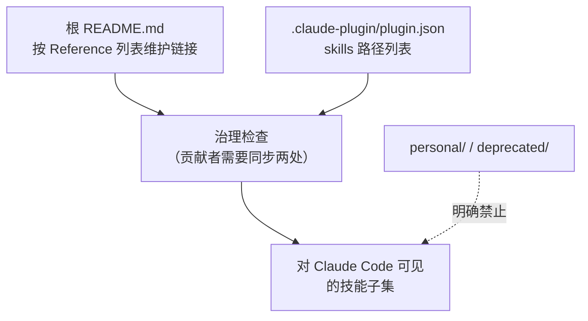

<details>
<summary>相关源文件</summary>

生成本页时使用的主要源文件：

- [.claude-plugin/plugin.json](../../../project-repos/skills/.claude-plugin/plugin.json)
- [README.md](../../../project-repos/skills/README.md)
- [CLAUDE.md](../../../project-repos/skills/CLAUDE.md)

</details>

# 发布面与插件清单

对外「哪些技能可见」由两层共同决定：根 `README.md` 的人类导航，以及 `.claude-plugin/plugin.json` 的机器可读枚举。作者把两者绑定成治理规则，避免插件市场与文档漂移。

`CLAUDE.md` 规定：`engineering/`、`productivity/`、`misc/` 下的每个技能必须同时出现在 **顶层 README** 与 **plugin.json**；`personal/` 与 `deprecated/` 则 **不得** 出现在这两处。结果是：你在 Marketplace 里安装到的，就是作者愿意承诺维护、且故事线完整的那一组；个人脚本与历史实验被物理隔离在别的桶里。



**Insight**：`plugin.json` 只列出 12 条相对路径，全部落在 `skills/engineering` 与 `skills/productivity`；`misc/` 虽然在 README 有引用，但 **未进入** 当前插件清单——这意味着「作者日常推荐」与「插件默认打包」可以刻意不同；读者若需要 `misc` 技能，需要自行复制或扩展本地插件配置。

根 README 还承载「新闻通讯」跳转与仓库横幅图等非代码资产；就与技能治理无关的安装体验而言，关键在于 `npx skills@latest add mattpocock/skills` 这一入口把远程仓库转成各工具链可用的技能骨架，随后由 `/setup-matt-pocock-skills` 写入消费侧配置详情。

Sources: [claude-plugin/plugin.json:1-17](../../../project-repos/skills/.claude-plugin/plugin.json#L1-L17), [CLAUDE.md:5-13](../../../project-repos/skills/CLAUDE.md#L5-L13), [README.md:143-173](../../../project-repos/skills/README.md#L143-L173)

<details class="source-snippets">
<summary>引用源码</summary>

<!-- source-snippets:start -->

#### `claude-plugin/plugin.json:1-17`

```json
{
  "name": "mattpocock-skills",
  "skills": [
    "./skills/engineering/diagnose",
    "./skills/engineering/grill-with-docs",
    "./skills/engineering/triage",
    "./skills/engineering/improve-codebase-architecture",
    "./skills/engineering/setup-matt-pocock-skills",
    "./skills/engineering/tdd",
    "./skills/engineering/to-issues",
    "./skills/engineering/to-prd",
    "./skills/engineering/zoom-out",
    "./skills/productivity/caveman",
    "./skills/productivity/grill-me",
    "./skills/productivity/write-a-skill"
  ]
}
```

#### `CLAUDE.md:5-13`

```markdown
- `misc/` — kept around but rarely used
- `personal/` — tied to my own setup, not promoted
- `deprecated/` — no longer used

Every skill in `engineering/`, `productivity/`, or `misc/` must have a reference in the top-level `README.md` and an entry in `.claude-plugin/plugin.json`. Skills in `personal/` and `deprecated/` must not appear in either.

Each skill entry in the top-level `README.md` must link the skill name to its `SKILL.md`.

Each bucket folder has a `README.md` that lists every skill in the bucket with a one-line description, with the skill name linked to its `SKILL.md`.
```

#### `README.md:143-173`

```markdown
### Engineering

Skills I use daily for code work.

- **[diagnose](./skills/engineering/diagnose/SKILL.md)** — Disciplined diagnosis loop for hard bugs and performance regressions: reproduce → minimise → hypothesise → instrument → fix → regression-test.
- **[grill-with-docs](./skills/engineering/grill-with-docs/SKILL.md)** — Grilling session that challenges your plan against the existing domain model, sharpens terminology, and updates `CONTEXT.md` and ADRs inline.
- **[triage](./skills/engineering/triage/SKILL.md)** — Triage issues through a state machine of triage roles.
- **[improve-codebase-architecture](./skills/engineering/improve-codebase-architecture/SKILL.md)** — Find deepening opportunities in a codebase, informed by the domain language in `CONTEXT.md` and the decisions in `docs/adr/`.
- **[setup-matt-pocock-skills](./skills/engineering/setup-matt-pocock-skills/SKILL.md)** — Scaffold the per-repo config (issue tracker, triage label vocabulary, domain doc layout) that the other engineering skills consume. Run once per repo before using `to-issues`, `to-prd`, `triage`, `diagnose`, `tdd`, `improve-codebase-architecture`, or `zoom-out`.
- **[tdd](./skills/engineering/tdd/SKILL.md)** — Test-driven development with a red-green-refactor loop. Builds features or fixes bugs one vertical slice at a time.
- **[to-issues](./skills/engineering/to-issues/SKILL.md)** — Break any plan, spec, or PRD into independently-grabbable GitHub issues using vertical slices.
- **[to-prd](./skills/engineering/to-prd/SKILL.md)** — Turn the current conversation context into a PRD and submit it as a GitHub issue. No interview — just synthesizes what you've already discussed.
- **[zoom-out](./skills/engineering/zoom-out/SKILL.md)** — Tell the agent to zoom out and give broader context or a higher-level perspective on an unfamiliar section of code.

### Productivity

General workflow tools, not code-specific.

- **[caveman](./skills/productivity/caveman/SKILL.md)** — Ultra-compressed communication mode. Cuts token usage ~75% by dropping filler while keeping full technical accuracy.
- **[grill-me](./skills/productivity/grill-me/SKILL.md)** — Get relentlessly interviewed about a plan or design until every branch of the decision tree is resolved.
- **[write-a-skill](./skills/productivity/write-a-skill/SKILL.md)** — Create new skills with proper structure, progressive disclosure, and bundled resources.

### Misc

Tools I keep around but rarely use.

- **[git-guardrails-claude-code](./skills/misc/git-guardrails-claude-code/SKILL.md)** — Set up Claude Code hooks to block dangerous git commands (push, reset --hard, clean, etc.) before they execute.
- **[migrate-to-shoehorn](./skills/misc/migrate-to-shoehorn/SKILL.md)** — Migrate test files from `as` type assertions to @total-typescript/shoehorn.
- **[scaffold-exercises](./skills/misc/scaffold-exercises/SKILL.md)** — Create exercise directory structures with sections, problems, solutions, and explainers.
- **[setup-pre-commit](./skills/misc/setup-pre-commit/SKILL.md)** — Set up Husky pre-commit hooks with lint-staged, Prettier, type checking, and tests.
```

<!-- source-snippets:end -->
</details>

## 相关页面

- [项目概览](overview.md) — Quickstart 与总体定位
- [每仓配置与领域契约](setup-and-domain-contract.md) — Marketplace 装上之后还要做什么
- [本地开发脚本](scripts-local-dev.md) — 开发者如何把全量 `skills/` symlink 到本机 Claude 目录
