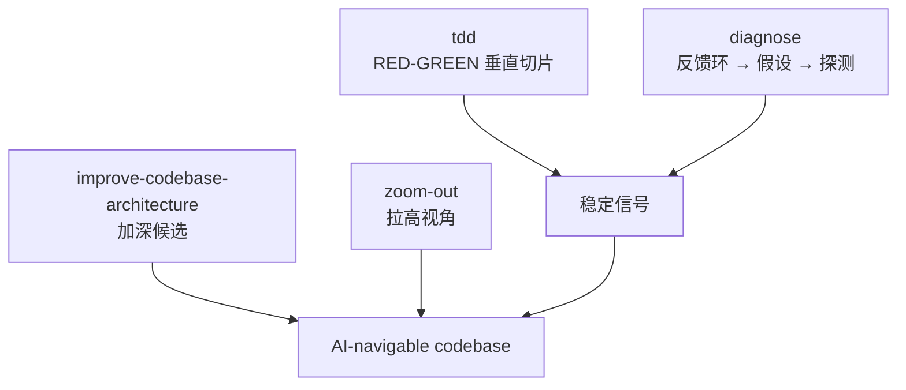

<details>
<summary>相关源文件</summary>

生成本页时使用的主要源文件：

- [skills/engineering/tdd/SKILL.md](../../../project-repos/skills/skills/engineering/tdd/SKILL.md)
- [skills/engineering/diagnose/SKILL.md](../../../project-repos/skills/skills/engineering/diagnose/SKILL.md)
- [skills/engineering/improve-codebase-architecture/SKILL.md](../../../project-repos/skills/skills/engineering/improve-codebase-architecture/SKILL.md)
- [skills/engineering/zoom-out/SKILL.md](../../../project-repos/skills/skills/engineering/zoom-out/SKILL.md)

</details>

# 质量回路、诊断与架构加深

README 把第三类痛点概括为「代码仍旧不行」——根因通常是反馈回路薄弱。`tdd` Skill 用「vertical tracer bullets」对抗一次性堆测试；`diagnose` 把 **构造可自动化 pass/fail signal** 当成 Phase 1 的全部意义；`improve-codebase-architecture` 则借用 John Ousterhout 式「deep module」语言，要求 Agent 统一使用 Module / Interface / Seam 等术语以免漂移。



## `tdd`：禁止 horizontal slicing

Skill 把「先写完全部测试再写实现」标记为反模式：批量想象的测试无法捕获真实行为，还会在 refactor 时误报。正确节奏是「一条测试 → 刚好让测试通过的实现 → 重复」，最后在 GREEN 全局时才 refactor。

## `diagnose`：信号优先于直觉

Phase 1 列出十种构造 loop 的手段（单测、curl、CLI、Playwright、回放 trace、临时 harness、fuzz、`git bisect` run、差分、最后才是 HITL 脚本模板）。若 loop 不存在，Skill 要求明确停下来索要更多外部线索，而不是「继续猜」。

## `improve-codebase-architecture`：统一术语的 refactor 评审

Skill 开头声明 glossary：`Module`、`Interface`（不仅是类型签名，还包含不变式）、`Depth`、`Seam`、`Adapter` 等；流程要求先读 domain glossary 与相关 ADR，再用 Explore subagent 记下摩擦点，并对 shallow module 运行 deletion test。

## `zoom-out`

文件极短：触发词是让 Agent **跳出局部 diff**，给出系统级上下文——适合 onboarding 陌生目录。

Sources: [skills/engineering/tdd/SKILL.md:8-88](../../../project-repos/skills/skills/engineering/tdd/SKILL.md#L8-L88), [skills/engineering/diagnose/SKILL.md:8-51](../../../project-repos/skills/skills/engineering/diagnose/SKILL.md#L8-L51), [skills/engineering/improve-codebase-architecture/SKILL.md:6-45](../../../project-repos/skills/skills/engineering/improve-codebase-architecture/SKILL.md#L6-L45), [skills/engineering/zoom-out/SKILL.md:1-7](../../../project-repos/skills/skills/engineering/zoom-out/SKILL.md#L1-L7)

<details class="source-snippets">
<summary>引用源码</summary>

<!-- source-snippets:start -->

#### `skills/engineering/tdd/SKILL.md:8-88`

````markdown
## Philosophy

**Core principle**: Tests should verify behavior through public interfaces, not implementation details. Code can change entirely; tests shouldn't.

**Good tests** are integration-style: they exercise real code paths through public APIs. They describe _what_ the system does, not _how_ it does it. A good test reads like a specification - "user can checkout with valid cart" tells you exactly what capability exists. These tests survive refactors because they don't care about internal structure.

**Bad tests** are coupled to implementation. They mock internal collaborators, test private methods, or verify through external means (like querying a database directly instead of using the interface). The warning sign: your test breaks when you refactor, but behavior hasn't changed. If you rename an internal function and tests fail, those tests were testing implementation, not behavior.

See [tests.md](tests.md) for examples and [mocking.md](mocking.md) for mocking guidelines.

## Anti-Pattern: Horizontal Slices

**DO NOT write all tests first, then all implementation.** This is "horizontal slicing" - treating RED as "write all tests" and GREEN as "write all code."

This produces **crap tests**:

- Tests written in bulk test _imagined_ behavior, not _actual_ behavior
- You end up testing the _shape_ of things (data structures, function signatures) rather than user-facing behavior
- Tests become insensitive to real changes - they pass when behavior breaks, fail when behavior is fine
- You outrun your headlights, committing to test structure before understanding the implementation

**Correct approach**: Vertical slices via tracer bullets. One test → one implementation → repeat. Each test responds to what you learned from the previous cycle. Because you just wrote the code, you know exactly what behavior matters and how to verify it.

```
WRONG (horizontal):
  RED:   test1, test2, test3, test4, test5
  GREEN: impl1, impl2, impl3, impl4, impl5

RIGHT (vertical):
  RED→GREEN: test1→impl1
  RED→GREEN: test2→impl2
  RED→GREEN: test3→impl3
  ...
```

## Workflow

### 1. Planning

When exploring the codebase, use the project's domain glossary so that test names and interface vocabulary match the project's language, and respect ADRs in the area you're touching.

Before writing any code:

- [ ] Confirm with user what interface changes are needed
- [ ] Confirm with user which behaviors to test (prioritize)
- [ ] Identify opportunities for [deep modules](deep-modules.md) (small interface, deep implementation)
- [ ] Design interfaces for [testability](interface-design.md)
- [ ] List the behaviors to test (not implementation steps)
- [ ] Get user approval on the plan

Ask: "What should the public interface look like? Which behaviors are most important to test?"

**You can't test everything.** Confirm with the user exactly which behaviors matter most. Focus testing effort on critical paths and complex logic, not every possible edge case.

### 2. Tracer Bullet

Write ONE test that confirms ONE thing about the system:

```
RED:   Write test for first behavior → test fails
GREEN: Write minimal code to pass → test passes
```

This is your tracer bullet - proves the path works end-to-end.

### 3. Incremental Loop

For each remaining behavior:

```
RED:   Write next test → fails
GREEN: Minimal code to pass → passes
```

Rules:

- One test at a time
- Only enough code to pass current test
- Don't anticipate future tests
- Keep tests focused on observable behavior

````

#### `skills/engineering/diagnose/SKILL.md:8-51`

```markdown
A discipline for hard bugs. Skip phases only when explicitly justified.

When exploring the codebase, use the project's domain glossary to get a clear mental model of the relevant modules, and check ADRs in the area you're touching.

## Phase 1 — Build a feedback loop

**This is the skill.** Everything else is mechanical. If you have a fast, deterministic, agent-runnable pass/fail signal for the bug, you will find the cause — bisection, hypothesis-testing, and instrumentation all just consume that signal. If you don't have one, no amount of staring at code will save you.

Spend disproportionate effort here. **Be aggressive. Be creative. Refuse to give up.**

### Ways to construct one — try them in roughly this order

1. **Failing test** at whatever seam reaches the bug — unit, integration, e2e.
2. **Curl / HTTP script** against a running dev server.
3. **CLI invocation** with a fixture input, diffing stdout against a known-good snapshot.
4. **Headless browser script** (Playwright / Puppeteer) — drives the UI, asserts on DOM/console/network.
5. **Replay a captured trace.** Save a real network request / payload / event log to disk; replay it through the code path in isolation.
6. **Throwaway harness.** Spin up a minimal subset of the system (one service, mocked deps) that exercises the bug code path with a single function call.
7. **Property / fuzz loop.** If the bug is "sometimes wrong output", run 1000 random inputs and look for the failure mode.
8. **Bisection harness.** If the bug appeared between two known states (commit, dataset, version), automate "boot at state X, check, repeat" so you can `git bisect run` it.
9. **Differential loop.** Run the same input through old-version vs new-version (or two configs) and diff outputs.
10. **HITL bash script.** Last resort. If a human must click, drive _them_ with `scripts/hitl-loop.template.sh` so the loop is still structured. Captured output feeds back to you.

Build the right feedback loop, and the bug is 90% fixed.

### Iterate on the loop itself

Treat the loop as a product. Once you have _a_ loop, ask:

- Can I make it faster? (Cache setup, skip unrelated init, narrow the test scope.)
- Can I make the signal sharper? (Assert on the specific symptom, not "didn't crash".)
- Can I make it more deterministic? (Pin time, seed RNG, isolate filesystem, freeze network.)

A 30-second flaky loop is barely better than no loop. A 2-second deterministic loop is a debugging superpower.

### Non-deterministic bugs

The goal is not a clean repro but a **higher reproduction rate**. Loop the trigger 100×, parallelise, add stress, narrow timing windows, inject sleeps. A 50%-flake bug is debuggable; 1% is not — keep raising the rate until it's debuggable.

### When you genuinely cannot build a loop

Stop and say so explicitly. List what you tried. Ask the user for: (a) access to whatever environment reproduces it, (b) a captured artifact (HAR file, log dump, core dump, screen recording with timestamps), or (c) permission to add temporary production instrumentation. Do **not** proceed to hypothesise without a loop.

Do not proceed to Phase 2 until you have a loop you believe in.
```

#### `skills/engineering/improve-codebase-architecture/SKILL.md:6-45`

```markdown
# Improve Codebase Architecture

Surface architectural friction and propose **deepening opportunities** — refactors that turn shallow modules into deep ones. The aim is testability and AI-navigability.

## Glossary

Use these terms exactly in every suggestion. Consistent language is the point — don't drift into "component," "service," "API," or "boundary." Full definitions in [LANGUAGE.md](LANGUAGE.md).

- **Module** — anything with an interface and an implementation (function, class, package, slice).
- **Interface** — everything a caller must know to use the module: types, invariants, error modes, ordering, config. Not just the type signature.
- **Implementation** — the code inside.
- **Depth** — leverage at the interface: a lot of behaviour behind a small interface. **Deep** = high leverage. **Shallow** = interface nearly as complex as the implementation.
- **Seam** — where an interface lives; a place behaviour can be altered without editing in place. (Use this, not "boundary.")
- **Adapter** — a concrete thing satisfying an interface at a seam.
- **Leverage** — what callers get from depth.
- **Locality** — what maintainers get from depth: change, bugs, knowledge concentrated in one place.

Key principles (see [LANGUAGE.md](LANGUAGE.md) for the full list):

- **Deletion test**: imagine deleting the module. If complexity vanishes, it was a pass-through. If complexity reappears across N callers, it was earning its keep.
- **The interface is the test surface.**
- **One adapter = hypothetical seam. Two adapters = real seam.**

This skill is _informed_ by the project's domain model. The domain language gives names to good seams; ADRs record decisions the skill should not re-litigate.

## Process

### 1. Explore

Read the project's domain glossary and any ADRs in the area you're touching first.

Then use the Agent tool with `subagent_type=Explore` to walk the codebase. Don't follow rigid heuristics — explore organically and note where you experience friction:

- Where does understanding one concept require bouncing between many small modules?
- Where are modules **shallow** — interface nearly as complex as the implementation?
- Where have pure functions been extracted just for testability, but the real bugs hide in how they're called (no **locality**)?
- Where do tightly-coupled modules leak across their seams?
- Which parts of the codebase are untested, or hard to test through their current interface?

Apply the **deletion test** to anything you suspect is shallow: would deleting it concentrate complexity, or just move it? A "yes, concentrates" is the signal you want.
```

#### `skills/engineering/zoom-out/SKILL.md:1-7`

```markdown
---
name: zoom-out
description: Tell the agent to zoom out and give broader context or a higher-level perspective. Use when you're unfamiliar with a section of code or need to understand how it fits into the bigger picture.
disable-model-invocation: true
---

I don't know this area of code well. Go up a layer of abstraction. Give me a map of all the relevant modules and callers, using the project's domain glossary vocabulary.
```

<!-- source-snippets:end -->
</details>

## 相关页面

- [对齐会话与共享语言](grilling-and-domain-language.md) — glossary 的来源  
- [规划、Issue 切片与分流](planning-issues-triage.md) — PRD / Issue 之后的执行入口  
