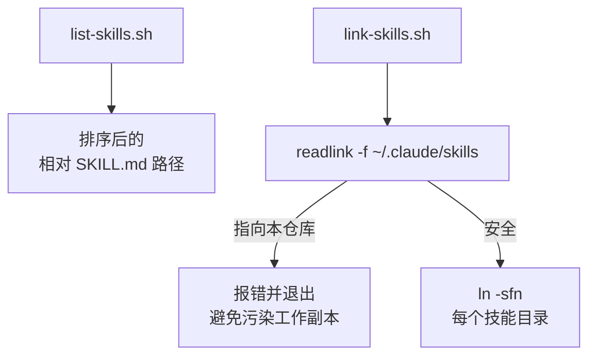

<details>
<summary>相关源文件</summary>

生成本页时使用的主要源文件：

- [scripts/link-skills.sh](../../../project-repos/skills/scripts/link-skills.sh)
- [scripts/list-skills.sh](../../../project-repos/skills/scripts/list-skills.sh)

</details>

# 本地开发脚本

仓库只提供两条与「开发体验」直接相关的 Bash 工具：`list-skills.sh` 递归列出所有 `SKILL.md` 的相对路径；`link-skills.sh` 则把这些技能目录 **符号链接** 到 `~/.claude/skills/<skillName>`，方便在本机 CLI 侧快速迭代。

`link-skills.sh` 的关键安全阀是 **检测 `~/.claude/skills` 是否是指回当前仓库的 symlink**：如果是，则继续链接会在仓库自己的 `skills/` 树里制造污染，因此脚本直接 `exit 1` 并要求用户删除该 symlink 后重跑。这是一个典型的「局部不变量」——它保护的是工作副本与全局技能目录之间的边界。



Sources: [scripts/link-skills.sh:1-38](../../../project-repos/skills/scripts/link-skills.sh#L1-L38), [scripts/list-skills.sh:1-8](../../../project-repos/skills/scripts/list-skills.sh#L1-L8)

<details class="source-snippets">
<summary>引用源码</summary>

<!-- source-snippets:start -->

#### `scripts/link-skills.sh:1-38`

```bash
#!/usr/bin/env bash
set -euo pipefail

# Links all skills in the repository to ~/.claude/skills, so that
# they can be used by the local Claude CLI.

REPO="$(cd "$(dirname "$0")/.." && pwd)"
DEST="$HOME/.claude/skills"

# If ~/.claude/skills is a symlink that resolves into this repo, we'd end up
# writing the per-skill symlinks back into the repo's own skills/ tree. Detect
# and bail out instead of polluting the working copy.
if [ -L "$DEST" ]; then
  resolved="$(readlink -f "$DEST")"
  case "$resolved" in
    "$REPO"|"$REPO"/*)
      echo "error: $DEST is a symlink into this repo ($resolved)." >&2
      echo "Remove it (rm \"$DEST\") and re-run; the script will recreate it as a real dir." >&2
      exit 1
      ;;
  esac
fi

mkdir -p "$DEST"

find "$REPO/skills" -name SKILL.md -not -path '*/node_modules/*' -print0 |
while IFS= read -r -d '' skill_md; do
  src="$(dirname "$skill_md")"
  name="$(basename "$src")"
  target="$DEST/$name"

  if [ -e "$target" ] && [ ! -L "$target" ]; then
    rm -rf "$target"
  fi

  ln -sfn "$src" "$target"
  echo "linked $name -> $src"
done
```

#### `scripts/list-skills.sh:1-8`

```bash
#!/usr/bin/env bash
set -euo pipefail

REPO="$(cd "$(dirname "$0")/.." && pwd)"

cd "$REPO"
find . -name SKILL.md -not -path '*/node_modules/*' | sed 's|^\./||' | sort
```

<!-- source-snippets:end -->
</details>

## 相关页面

- [发布面与插件清单](publishing-surface.md) — 与 Marketplace 安装的差异
- [项目概览](overview.md)
