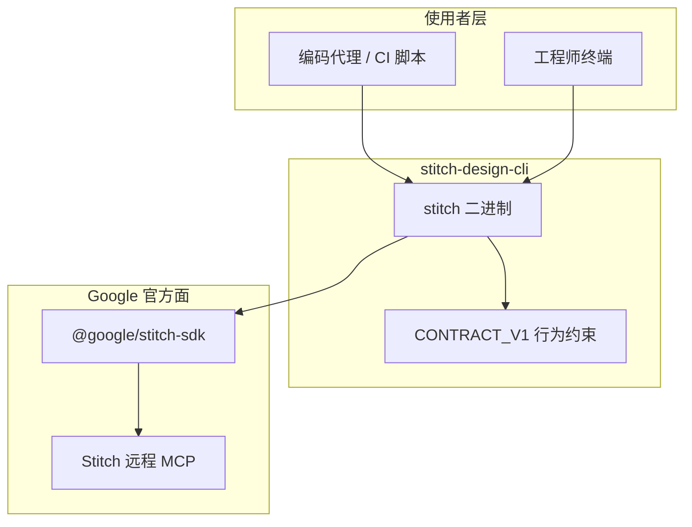
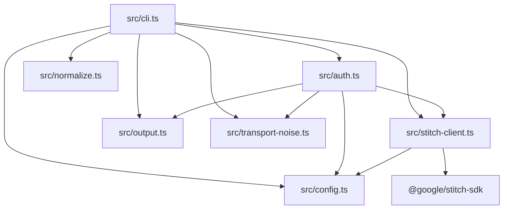
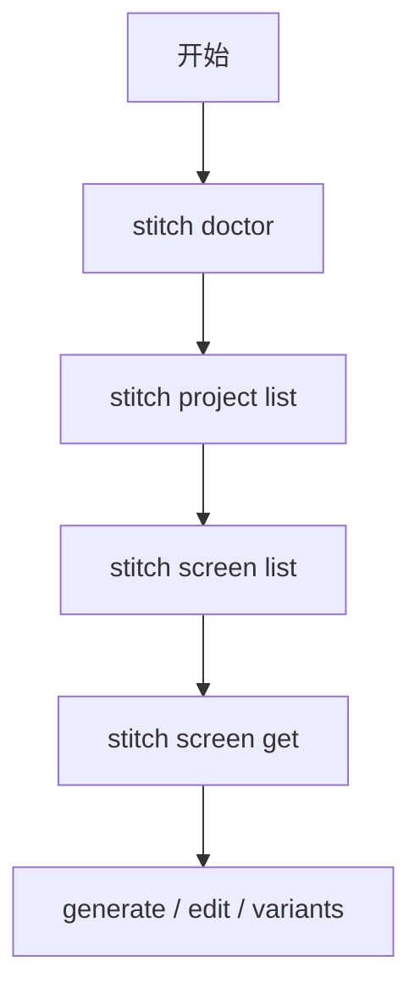
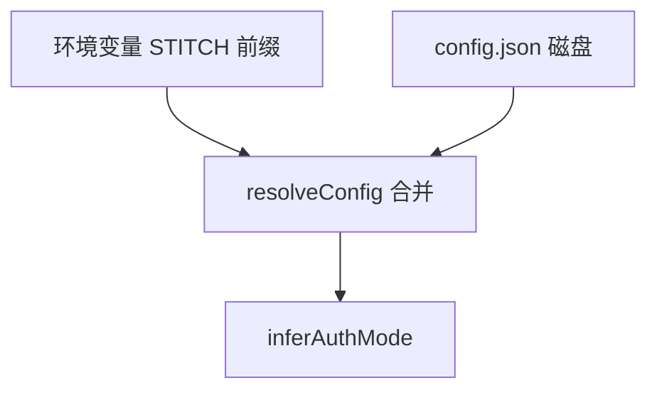
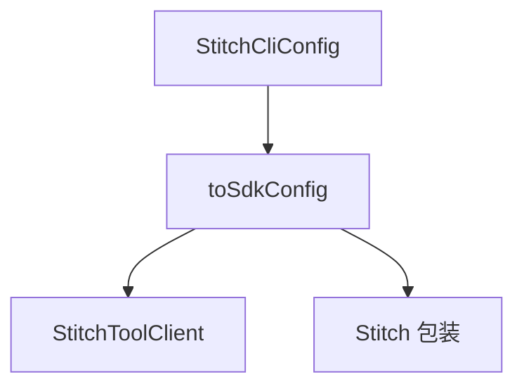
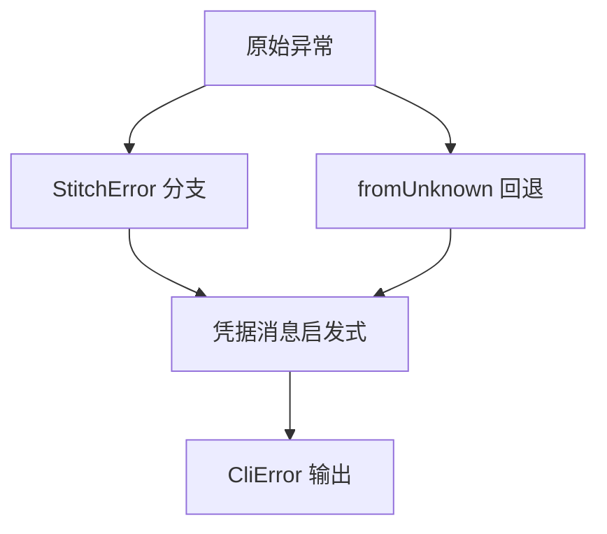
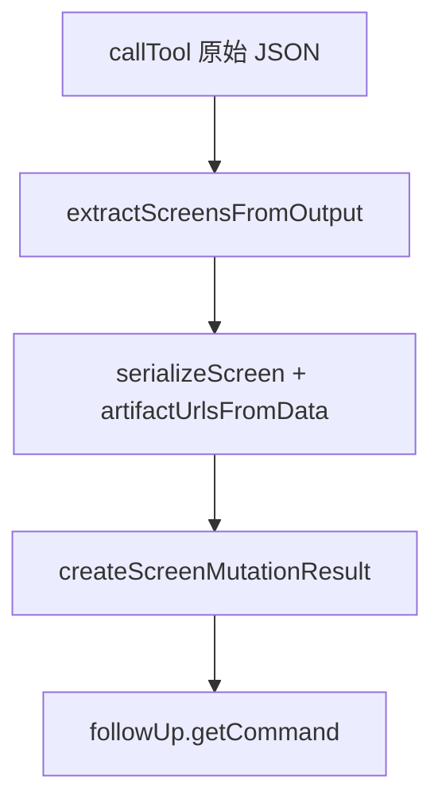
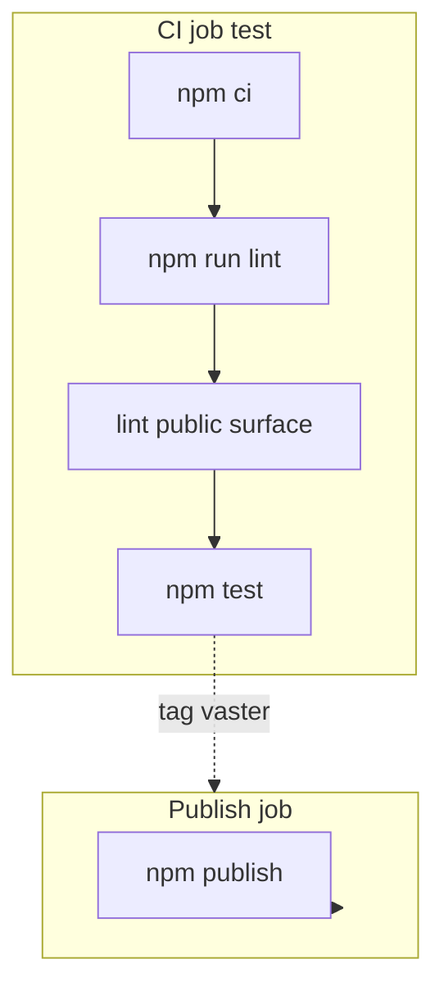
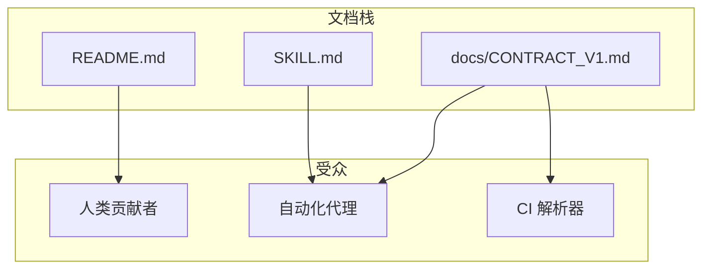

# stitch-design-cli DeepWiki 单文件导出

> 源仓库：https://github.com/danielgwilson/stitch-design-cli
> 提交：71e62a260313d7e3030f2d6a17067c455c7f4873

## 目录

- [项目概览](#项目概览)
- [系统架构与模块边界](#系统架构与模块边界)
- [CLI 命令面](#cli-命令面)
- [认证与配置解析](#认证与配置解析)
- [Stitch SDK 适配层](#stitch-sdk-适配层)
- [JSON 契约与错误模型](#json-契约与错误模型)
- [响应归一化与屏幕变更结果](#响应归一化与屏幕变更结果)
- [测试、CI 与发布](#测试ci-与发布)
- [Agent Skill 与运维提示](#agent-skill-与运维提示)

---

<details>
<summary>相关源文件</summary>

生成本页时使用的主要源文件：

- [README.md](../../../project-repos/stitch-design-cli/README.md)
- [package.json](../../../project-repos/stitch-design-cli/package.json)
- [docs/CONTRACT_V1.md](../../../project-repos/stitch-design-cli/docs/CONTRACT_V1.md)
- [LICENSE](../../../project-repos/stitch-design-cli/LICENSE)
- [SKILL.md](../../../project-repos/stitch-design-cli/SKILL.md)

</details>

# 项目概览

**stitch-design-cli** 是一个面向自动化代理（Agent）与运维人员的命令行工具：它在不脱离 Google 官方平台能力边界的前提下，为 **Google Stitch**（官方提供远程 MCP 与 `@google/stitch-sdk`）补齐「可脚本化、可预测 JSON 输出、明确鉴权与 stderr 纪律」的本地命令面。

仓库体量小、职责集中：TypeScript 实现单一 CLI 入口，依赖官方 SDK 调用 `https://stitch.googleapis.com/mcp` 等端点；通过 `docs/CONTRACT_V1.md` 固定机器可读输出契约，便于上层编排器稳定解析。

## 解决什么问题

README 将动机写得很直白：Stitch 官方已暴露 MCP 与 JS SDK，但缺少同时具备「显式 auth 配置」「稳定 JSON 信封」「stderr/stdout 分工」与「常见 project/screen 工作流小命令面」的通用本地 CLI；本包填补该缺口。



Sources: [README.md:1-21](../../../project-repos/stitch-design-cli/README.md#L1-L21), [package.json:1-35](../../../project-repos/stitch-design-cli/package.json#L1-L35)

<details class="source-snippets">
<summary>引用源码</summary>

<!-- source-snippets:start -->

#### `README.md:1-21`

```markdown
# stitch-design-cli

Agent-first CLI for Google's official Stitch SDK.

This package is meant for the workflow where active MCP wiring is overkill, but a stable local command surface is still useful for agents and operators.

## Why this exists

Google Stitch officially exposes:

- a remote MCP server
- an official JavaScript SDK, `@google/stitch-sdk`

What it does not currently expose is a standalone generic local CLI with:

- explicit auth setup
- predictable JSON envelopes
- stderr/stdout discipline for agents
- a small command surface for common project and screen workflows

This package fills that gap without leaving the official platform surface.
```

#### `package.json:1-35`

```json
{
  "name": "stitch-design-cli",
  "version": "0.1.3",
  "description": "Agent-first CLI + skill for Google's official Stitch SDK",
  "license": "MIT",
  "author": "Daniel G Wilson",
  "type": "module",
  "repository": {
    "type": "git",
    "url": "git+https://github.com/danielgwilson/stitch-design-cli.git"
  },
  "homepage": "https://github.com/danielgwilson/stitch-design-cli#readme",
  "bugs": {
    "url": "https://github.com/danielgwilson/stitch-design-cli/issues"
  },
  "bin": {
    "stitch": "dist/cli.js",
    "stitch-design-cli": "dist/cli.js"
  },
  "files": [
    "dist",
    "docs",
    "README.md",
    "SKILL.md",
    "LICENSE"
  ],
  "keywords": [
    "stitch",
    "google-stitch",
    "design",
    "cli",
    "agent-first",
    "mcp",
    "sdk"
  ],
```

<!-- source-snippets:end -->
</details>

## 分发形态与约束

- **npm 包名**：`stitch-design-cli`；**可执行名**：`stitch`（见 `package.json` 的 `bin` 字段）。
- **Node 引擎**：`>=22`，与 CI 矩阵一致。
- **v1 边界**：README 写明刻意不覆盖 design-system 与 upload 流程之前的能力范围。

Sources: [package.json:15-19](../../../project-repos/stitch-design-cli/package.json#L15-L19), [package.json:57-60](../../../project-repos/stitch-design-cli/package.json#L57-L60), [README.md:102-108](../../../project-repos/stitch-design-cli/README.md#L102-L108)

<details class="source-snippets">
<summary>引用源码</summary>

<!-- source-snippets:start -->

#### `package.json:15-19`

```json
  },
  "bin": {
    "stitch": "dist/cli.js",
    "stitch-design-cli": "dist/cli.js"
  },
```

#### `package.json:57-60`

```json
  },
  "engines": {
    "node": ">=22"
  },
```

#### `README.md:102-108`

```markdown
## Design notes

- `project get` calls the official `get_project` tool directly.
- `screen get` can optionally include HTML and screenshot artifact URLs, and accepts repeated `--screen-id` flags for batch retrieval.
- `screen edit` and `screen variants` accept repeated `--screen-id` flags or comma-separated values.
- `screen variants` now returns explicit follow-up screen IDs plus a ready-to-run `screen get` command, which is useful when project inventory lags behind fresh variants.
- v1 intentionally stops before design-system and upload flows.
```

<!-- source-snippets:end -->
</details>

## 推荐阅读顺序

1. [系统架构与模块边界](system-architecture.md) — 理解 `src/` 分层。
2. [CLI 命令面](cli-commands.md) — 对照子命令与官方工具映射。
3. [JSON 契约与错误模型](json-output-and-errors.md) — 解析 `--json` 输出与退出码。

## 相关页面

- [系统架构与模块边界](system-architecture.md)
- [CLI 命令面](cli-commands.md)

---

<details>
<summary>相关源文件</summary>

生成本页时使用的主要源文件：

- [src/cli.ts](../../../project-repos/stitch-design-cli/src/cli.ts)
- [src/config.ts](../../../project-repos/stitch-design-cli/src/config.ts)
- [src/stitch-client.ts](../../../project-repos/stitch-design-cli/src/stitch-client.ts)
- [src/output.ts](../../../project-repos/stitch-design-cli/src/output.ts)
- [src/normalize.ts](../../../project-repos/stitch-design-cli/src/normalize.ts)
- [src/auth.ts](../../../project-repos/stitch-design-cli/src/auth.ts)
- [src/transport-noise.ts](../../../project-repos/stitch-design-cli/src/transport-noise.ts)

</details>

# 系统架构与模块边界

本仓库采用「薄 CLI + 清晰横切关注点」结构：`cli.ts` 负责 Commander 路由与 I/O 策略；`config` / `auth` 负责凭据来源合并与校验；`stitch-client` 将 CLI 配置映射为官方 SDK 客户端；`normalize` 将 Stitch 返回的多形态对象压平为稳定 JSON；`output` 统一错误码与信封；`transport-noise` 抑制 SDK 传输层噪声日志。

## 模块依赖方向



Sources: [src/cli.ts:1-18](../../../project-repos/stitch-design-cli/src/cli.ts#L1-L18), [src/auth.ts:1-4](../../../project-repos/stitch-design-cli/src/auth.ts#L1-L4), [src/stitch-client.ts:1-26](../../../project-repos/stitch-design-cli/src/stitch-client.ts#L1-L26)

<details class="source-snippets">
<summary>引用源码</summary>

<!-- source-snippets:start -->

#### `src/cli.ts:1-18`

```typescript
#!/usr/bin/env node
import { createRequire } from "node:module";
import { createInterface } from "node:readline/promises";
import { Command } from "commander";
import { clearConfig, getConfigPath, redactSecret, resolveConfig, type ResolvedConfig } from "./config.js";
import { saveAndValidateConfig, validateAuth } from "./auth.js";
import {
  collectStrings,
  createScreenMutationResult,
  extractOutputMessages,
  extractScreensFromOutput,
  serializeProject,
  serializeScreen,
  splitCsv,
} from "./normalize.js";
import { createSdkContext, hasAuth, AUTH_HELP_TEXT } from "./stitch-client.js";
import { exitCodeFor, fail, makeError, ok, printJson } from "./output.js";
import { withSuppressedTransportNoise } from "./transport-noise.js";
```

#### `src/auth.ts:1-4`

```typescript
import { inferAuthMode, type ResolvedConfig, type StitchCliConfig, writeConfig } from "./config.js";
import { makeError } from "./output.js";
import { createSdkContext } from "./stitch-client.js";
import { withSuppressedTransportNoise } from "./transport-noise.js";
```

#### `src/stitch-client.ts:1-26`

```typescript
import { Stitch, StitchToolClient, type StitchConfigInput } from "@google/stitch-sdk";
import type { StitchCliConfig } from "./config.js";

export const AUTH_HELP_TEXT =
  "No Stitch credentials. Run `stitch auth set` to save an API key locally, `stitch auth set --stdin` to pipe one in, or export `STITCH_API_KEY`.";

export function hasAuth(config: StitchCliConfig): boolean {
  return Boolean(config.apiKey?.trim() || (config.accessToken?.trim() && config.projectId?.trim()));
}

function toSdkConfig(config: StitchCliConfig): Partial<StitchConfigInput> {
  return {
    apiKey: config.apiKey,
    accessToken: config.accessToken,
    projectId: config.projectId,
    baseUrl: config.baseUrl,
    timeout: config.timeoutMs,
  };
}

export function createSdkContext(config: StitchCliConfig): { client: StitchToolClient; sdk: Stitch } {
  const client = new StitchToolClient(toSdkConfig(config));
  return {
    client,
    sdk: new Stitch(client),
  };
```

<!-- source-snippets:end -->
</details>

## 核心执行路径：`runWithSdk`

多数需鉴权的子命令通过 `requireAuthConfig` 与 `runWithSdk` 包装：成功时 `--json` 走 `printJson(ok(data))`；失败走 `emitFailure`；`finally` 中关闭 `StitchToolClient`。

Sources: [src/cli.ts:86-112](../../../project-repos/stitch-design-cli/src/cli.ts#L86-L112)

<details class="source-snippets">
<summary>引用源码</summary>

<!-- source-snippets:start -->

#### `src/cli.ts:86-112`

```typescript
async function requireAuthConfig(json = false): Promise<ResolvedConfig | null> {
  const config = await resolveConfig();
  if (hasAuth(config)) return config;
  emitFailure({ code: "AUTH_MISSING", message: AUTH_HELP_TEXT }, json);
  return null;
}

async function runWithSdk<T>(
  options: CommonJsonOptions,
  task: (ctx: ReturnType<typeof createSdkContext> & { config: ResolvedConfig }) => Promise<T>,
  humanPrinter?: (data: T) => void,
): Promise<void> {
  const config = await requireAuthConfig(Boolean(options.json));
  if (!config) return;

  const ctx = createSdkContext(config);
  try {
    const data = await withSuppressedTransportNoise(() => task({ ...ctx, config }));
    if (options.json) printJson(ok(data));
    else if (humanPrinter) humanPrinter(data);
    else printHuman(data);
  } catch (error) {
    emitFailure(error, Boolean(options.json));
  } finally {
    await ctx.client.close();
  }
}
```

<!-- source-snippets:end -->
</details>

## 传输噪声抑制

`withSuppressedTransportNoise` 在任务执行期间临时替换 `console.error`，过滤以 `Stitch Transport Error:` 开头的行，避免污染代理解析 stdout/stderr 的假设。

Sources: [src/transport-noise.ts:1-12](../../../project-repos/stitch-design-cli/src/transport-noise.ts#L1-L12)

<details class="source-snippets">
<summary>引用源码</summary>

<!-- source-snippets:start -->

#### `src/transport-noise.ts:1-12`

```typescript
export async function withSuppressedTransportNoise<T>(task: () => Promise<T>): Promise<T> {
  const originalError = console.error;
  console.error = (...args: unknown[]) => {
    if (typeof args[0] === "string" && args[0].startsWith("Stitch Transport Error:")) return;
    originalError(...args);
  };
  try {
    return await task();
  } finally {
    console.error = originalError;
  }
}
```

<!-- source-snippets:end -->
</details>

## 相关页面

- [项目概览](overview.md)
- [CLI 命令面](cli-commands.md)

---

<details>
<summary>相关源文件</summary>

生成本页时使用的主要源文件：

- [src/cli.ts](../../../project-repos/stitch-design-cli/src/cli.ts)
- [README.md](../../../project-repos/stitch-design-cli/README.md)
- [docs/CONTRACT_V1.md](../../../project-repos/stitch-design-cli/docs/CONTRACT_V1.md)

</details>

# CLI 命令面

CLI 基于 **Commander** 构建，程序名为 `stitch`，子命令树分为 `auth`、`doctor`、`tool`、`project`、`screen` 五大组；其中 `screen generate|edit|variants` 在部分路径上直接 `callTool` 调用官方 MCP 工具名（如 `generate_screen_from_text`、`edit_screens`、`generate_variants`），而列表类能力优先走 SDK 高层 API（`sdk.projects()`、`project().screens()` 等）。

## 子命令总览

| 分组 | 子命令 | 主要职责 |
|------|--------|-----------|
| auth | set / status / clear | 写入或清理 `~/.config/stitch/config.json`，展示脱敏状态 |
| 根级 | doctor | 检查凭据、`listTools`、`projects` 列表是否可用 |
| tool | list | 列出 MCP 工具元数据（含 annotations 提示） |
| project | list / create / get | 列表与创建走 SDK；`get` 显式 `get_project` |
| screen | list / get / generate / edit / variants | 读屏走 SDK；变更类多走 `callTool` |

Sources: [src/cli.ts:153-661](../../../project-repos/stitch-design-cli/src/cli.ts#L153-L661), [docs/CONTRACT_V1.md:61-84](../../../project-repos/stitch-design-cli/docs/CONTRACT_V1.md#L61-L84)

<details class="source-snippets">
<summary>引用源码</summary>

<!-- source-snippets:start -->

#### `src/cli.ts:153-661`

```typescript
async function main(): Promise<void> {
  const program = new Command();

  program
    .name("stitch")
    .description("Agent-first CLI for Google's official Stitch SDK")
    .version(getCliVersion())
    .showHelpAfterError();

  const auth = program.command("auth").description("Manage Stitch credentials");

  auth
    .command("set")
    .description("Save Stitch credentials locally")
    .option("--api-key <value>", "API key to save")
    .option("--access-token <value>", "OAuth access token to save")
    .option("--project-id <value>", "Project id to pair with OAuth access token")
    .option("--stdin", "Read API key from stdin")
    .option("--base-url <url>", "Override Stitch MCP base URL")
    .option("--timeout-ms <ms>", "Override request timeout in milliseconds", parsePositiveInteger)
    .option("--json", "Print JSON output")
    .action(
      async (options: {
        apiKey?: string;
        accessToken?: string;
        projectId?: string;
        stdin?: boolean;
        baseUrl?: string;
        timeoutMs?: number;
        json?: boolean;
      }) => {
      try {
        const accessToken = options.accessToken?.trim();
        const projectId = options.projectId?.trim();
        const usingOauth = Boolean(accessToken || projectId);

        if (usingOauth && (!accessToken || !projectId)) {
          emitFailure(
            {
              code: "VALIDATION_ERROR",
              message: "OAuth auth requires both --access-token and --project-id",
            },
            Boolean(options.json),
          );
          return;
        }

        const apiKey = usingOauth
          ? undefined
          : options.stdin
            ? (await readStdin()).trim()
            : options.apiKey?.trim() || (await promptForApiKey());

        if (!usingOauth && !apiKey) {
          emitFailure({ code: "VALIDATION_ERROR", message: "Expected a non-empty API key" }, Boolean(options.json));
          return;
        }

        const { config, validation } = await withSuppressedTransportNoise(() =>
          saveAndValidateConfig({
            apiKey,
            accessToken,
            projectId,
            baseUrl: options.baseUrl,
            timeoutMs: options.timeoutMs,
          }),
        );

        const data = {
          saved: true,
          configPath: getConfigPath(),
          authMode: usingOauth ? "oauth" : "apiKey",
          apiKeyRedacted: redactSecret(config.apiKey),
          accessTokenRedacted: redactSecret(config.accessToken),
          projectId: config.projectId || null,
          baseUrl: config.baseUrl || null,
          timeoutMs: config.timeoutMs || null,
          validation,
        };

        if (options.json) printJson(ok(data));
        else printHuman(data);
      } catch (error) {
        emitFailure(error, Boolean(options.json));
      }
    });

  auth
    .command("status")
    .description("Show resolved Stitch auth state")
    .option("--json", "Print JSON output")
    .action(async (options: CommonJsonOptions) => {
      try {
        const config = await resolveConfig();
        const validation = hasAuth(config)
          ? await withSuppressedTransportNoise(() => validateAuth(config))
          : { ok: false, reason: "Missing Stitch credentials" };
        const data = {
          authMode: config.authMode,
          source: config.source,
          hasApiKey: Boolean(config.apiKey),
          hasAccessToken: Boolean(config.accessToken),
          hasProjectId: Boolean(config.projectId),
          apiKeyRedacted: redactSecret(config.apiKey),
          accessTokenRedacted: redactSecret(config.accessToken),
          projectId: config.projectId || null,
          baseUrl: config.baseUrl || null,
          timeoutMs: config.timeoutMs || null,
          validation,
        };
        if (options.json) printJson(ok(data));
        else printHuman(data);
      } catch (error) {
        emitFailure(error, Boolean(options.json));
      }
    });

  auth
    .command("clear")
    .description("Remove locally saved Stitch credentials")
... snippet truncated ...
```

#### `docs/CONTRACT_V1.md:61-84`

```markdown
## Coverage boundary

Direct official SDK coverage:

- `tool list`
- `project list`
- `project create`
- `screen list`
- `screen get`
- `screen generate`

Direct official Stitch tool coverage:

- `project get`
- `screen edit`
- `screen variants`

Derived helpers built on top of official Stitch coverage:

- `auth status`
- `doctor`
- `screen get --include-html`
- `screen get --include-image`

```

<!-- source-snippets:end -->
</details>

## `screen get` 的多屏隔离策略

当请求多个 `screen-id` 时，循环内可为每个屏幕创建独立 `createSdkContext`，以避免 SDK 并发或连接复用带来的交叉影响；单屏则复用外层上下文。

Sources: [src/cli.ts:464-480](../../../project-repos/stitch-design-cli/src/cli.ts#L464-L480)

<details class="source-snippets">
<summary>引用源码</summary>

<!-- source-snippets:start -->

#### `src/cli.ts:464-480`

```typescript
        await runWithSdk(options, async ({ config, sdk }) => {
          const requestedScreenIds = splitCsv(options.screenId);
          const items: Record<string, unknown>[] = [];
          for (const screenId of requestedScreenIds) {
            const isolated = requestedScreenIds.length > 1 ? createSdkContext(config) : null;
            const activeSdk = isolated?.sdk ?? sdk;
            try {
              const item = await activeSdk.project(options.projectId).getScreen(screenId);
              const [htmlUrl, imageUrl] = await Promise.all([
                options.includeHtml ? item.getHtml() : Promise.resolve(undefined),
                options.includeImage ? item.getImage() : Promise.resolve(undefined),
              ]);
              items.push(serializeScreen(item, { htmlUrl, imageUrl }));
            } finally {
              if (isolated) await isolated.client.close();
            }
          }
```

<!-- source-snippets:end -->
</details>

## 枚举校验

`device-type`、`model-id`、`creative-range`、`aspect` 在 `generate` / `edit` / `variants` 前由白名单校验，非法值抛出带 `VALIDATION_ERROR` 的错误码（经 `output.makeError` 归一化）。

Sources: [src/cli.ts:20-36](../../../project-repos/stitch-design-cli/src/cli.ts#L20-L36), [src/cli.ts:141-151](../../../project-repos/stitch-design-cli/src/cli.ts#L141-L151), [src/cli.ts:620-627](../../../project-repos/stitch-design-cli/src/cli.ts#L620-L627)

<details class="source-snippets">
<summary>引用源码</summary>

<!-- source-snippets:start -->

#### `src/cli.ts:20-36`

```typescript
type CommonJsonOptions = { json?: boolean };
type DeviceType = "DEVICE_TYPE_UNSPECIFIED" | "MOBILE" | "DESKTOP" | "TABLET" | "AGNOSTIC";
type ModelId = "MODEL_ID_UNSPECIFIED" | "GEMINI_3_PRO" | "GEMINI_3_FLASH";
type CreativeRange = "CREATIVE_RANGE_UNSPECIFIED" | "REFINE" | "EXPLORE" | "REIMAGINE";
type VariantAspect = "VARIANT_ASPECT_UNSPECIFIED" | "LAYOUT" | "COLOR_SCHEME" | "IMAGES" | "TEXT_FONT" | "TEXT_CONTENT";

const DEVICE_TYPES: DeviceType[] = ["DEVICE_TYPE_UNSPECIFIED", "MOBILE", "DESKTOP", "TABLET", "AGNOSTIC"];
const MODEL_IDS: ModelId[] = ["MODEL_ID_UNSPECIFIED", "GEMINI_3_PRO", "GEMINI_3_FLASH"];
const CREATIVE_RANGES: CreativeRange[] = ["CREATIVE_RANGE_UNSPECIFIED", "REFINE", "EXPLORE", "REIMAGINE"];
const VARIANT_ASPECTS: VariantAspect[] = [
  "VARIANT_ASPECT_UNSPECIFIED",
  "LAYOUT",
  "COLOR_SCHEME",
  "IMAGES",
  "TEXT_FONT",
  "TEXT_CONTENT",
];
```

#### `src/cli.ts:141-151`

```typescript
function validateEnum<T extends string>(value: string | undefined, allowed: readonly T[], label: string): void {
  if (value && !allowed.includes(value as T)) {
    const error = new Error(`Invalid ${label}: ${value}`);
    (error as Error & { code?: string }).code = "VALIDATION_ERROR";
    throw error;
  }
}

function validateVariantAspects(aspects: string[]): void {
  for (const aspect of aspects) validateEnum(aspect, VARIANT_ASPECTS, "aspect");
}
```

#### `src/cli.ts:620-627`

```typescript
        try {
          validateEnum(options.deviceType, DEVICE_TYPES, "device type");
          validateEnum(options.modelId, MODEL_IDS, "model id");
          validateEnum(options.creativeRange, CREATIVE_RANGES, "creative range");
          validateVariantAspects(splitCsv(options.aspect));
          if (typeof options.variantCount === "number" && (options.variantCount < 1 || options.variantCount > 5)) {
            throw Object.assign(new Error("variant count must be between 1 and 5"), { code: "VALIDATION_ERROR" });
          }
```

<!-- source-snippets:end -->
</details>

## 典型 Agent 流水线（来自 README）

`doctor` → `project list` → `screen list` → `screen get --include-image` → `edit` / `variants`，与仓库根 `SKILL.md` 推荐一致。

Sources: [README.md:85-100](../../../project-repos/stitch-design-cli/README.md#L85-L100)

<details class="source-snippets">
<summary>引用源码</summary>

<!-- source-snippets:start -->

#### `README.md:85-100`

````markdown
## Common commands

```bash
stitch auth status --json
stitch doctor --json
stitch tool list --json
stitch project list --json
stitch project create --title "Design Sandbox" --json
stitch project get <project-id> --json
stitch screen list --project-id <project-id> --json
stitch screen get --project-id <project-id> --screen-id <screen-id> --include-image --json
stitch screen get --project-id <project-id> --screen-id <screen-id-a> --screen-id <screen-id-b> --include-image --include-html --json
stitch screen generate --project-id <project-id> --prompt "A landing page for a healthcare startup" --device-type DESKTOP --include-image --json
stitch screen edit --project-id <project-id> --screen-id <screen-id> --prompt "Make the hero more editorial" --json
stitch screen variants --project-id <project-id> --screen-id <screen-id> --prompt "Explore three lighter brand directions" --variant-count 3 --creative-range EXPLORE --aspect COLOR_SCHEME --aspect LAYOUT --json
```
````

<!-- source-snippets:end -->
</details>



## 相关页面

- [系统架构与模块边界](system-architecture.md)
- [认证与配置解析](auth-and-config.md)

---

<details>
<summary>相关源文件</summary>

生成本页时使用的主要源文件：

- [src/config.ts](../../../project-repos/stitch-design-cli/src/config.ts)
- [src/auth.ts](../../../project-repos/stitch-design-cli/src/auth.ts)
- [src/cli.ts](../../../project-repos/stitch-design-cli/src/cli.ts)
- [README.md](../../../project-repos/stitch-design-cli/README.md)

</details>

# 认证与配置解析

凭据与端点配置遵循「环境变量覆盖文件配置」的合并模型；文件默认落在 `XDG_CONFIG_HOME` 或 `~/.config/stitch/config.json`，并以 `0o600` 权限写入，降低多用户主机上的泄露面。

## 解析优先级与来源标记

`resolveConfig` 将 `STITCH_API_KEY`、`STITCH_ACCESS_TOKEN`、`GOOGLE_CLOUD_PROJECT`、`STITCH_HOST`、`STITCH_TIMEOUT_MS` 与磁盘 JSON 合并，并计算 `source` 字段为 `env` / `config` / `mixed` / `none` 之一。

Sources: [src/config.ts:94-122](../../../project-repos/stitch-design-cli/src/config.ts#L94-L122)

<details class="source-snippets">
<summary>引用源码</summary>

<!-- source-snippets:start -->

#### `src/config.ts:94-122`

```typescript
export async function resolveConfig(): Promise<ResolvedConfig> {
  const fileConfig = await readConfig();

  const envApiKey = process.env.STITCH_API_KEY?.trim();
  const envAccessToken = process.env.STITCH_ACCESS_TOKEN?.trim();
  const envProjectId = process.env.GOOGLE_CLOUD_PROJECT?.trim();
  const envBaseUrl = process.env.STITCH_HOST?.trim();
  const envTimeoutMs = process.env.STITCH_TIMEOUT_MS?.trim();

  const resolved: StitchCliConfig = {
    apiKey: envApiKey || fileConfig.apiKey,
    accessToken: envAccessToken || fileConfig.accessToken,
    projectId: envProjectId || fileConfig.projectId,
    baseUrl: cleanBaseUrl(envBaseUrl || fileConfig.baseUrl),
    timeoutMs: cleanTimeoutMs(envTimeoutMs || fileConfig.timeoutMs),
  };

  const fromEnv = Boolean(envApiKey || envAccessToken || envProjectId || envBaseUrl || envTimeoutMs);
  const fromConfig = Boolean(
    fileConfig.apiKey || fileConfig.accessToken || fileConfig.projectId || fileConfig.baseUrl || fileConfig.timeoutMs,
  );

  const source: ResolvedConfig["source"] = fromEnv && fromConfig ? "mixed" : fromEnv ? "env" : fromConfig ? "config" : "none";

  return {
    ...resolved,
    source,
    authMode: inferAuthMode(resolved),
  };
```

<!-- source-snippets:end -->
</details>

## 认证模式推断

- 仅 API Key：`inferAuthMode` 返回 `apiKey`。
- Access Token 与 Project Id 同时存在：返回 `oauth`。
- 否则 `none`。

Sources: [src/config.ts:44-48](../../../project-repos/stitch-design-cli/src/config.ts#L44-L48)

<details class="source-snippets">
<summary>引用源码</summary>

<!-- source-snippets:start -->

#### `src/config.ts:44-48`

```typescript
export function inferAuthMode(config: StitchCliConfig): AuthMode {
  if (config.apiKey?.trim()) return "apiKey";
  if (config.accessToken?.trim() && config.projectId?.trim()) return "oauth";
  return "none";
}
```

<!-- source-snippets:end -->
</details>

## 默认端点与超时

未配置时 `baseUrl` 默认为 `https://stitch.googleapis.com/mcp`，超时默认 `300000` ms，与官方 SDK 文档常见默认值对齐。

Sources: [src/config.ts:20-21](../../../project-repos/stitch-design-cli/src/config.ts#L20-L21), [src/config.ts:32-41](../../../project-repos/stitch-design-cli/src/config.ts#L32-L41)

<details class="source-snippets">
<summary>引用源码</summary>

<!-- source-snippets:start -->

#### `src/config.ts:20-21`

```typescript
const DEFAULT_BASE_URL = "https://stitch.googleapis.com/mcp";
const DEFAULT_TIMEOUT_MS = 300_000;
```

#### `src/config.ts:32-41`

```typescript
function cleanBaseUrl(value: string | undefined): string {
  const raw = (value || "").trim();
  if (!raw) return DEFAULT_BASE_URL;
  return raw.replace(/\/+$/, "");
}

function cleanTimeoutMs(value: unknown): number {
  const raw = typeof value === "number" ? value : Number(String(value || "").trim());
  if (!Number.isFinite(raw) || raw <= 0) return DEFAULT_TIMEOUT_MS;
  return Math.round(raw);
```

<!-- source-snippets:end -->
</details>

## 保存后校验

`saveAndValidateConfig` 在写入磁盘后立即调用 `validateAuth`：通过 `sdk.projects()` 试拉项目列表，成功则返回 `sample.projectCount`；失败则携带归一化错误信息，便于区分「网络错误」与「凭据被拒」。

Sources: [src/auth.ts:48-54](../../../project-repos/stitch-design-cli/src/auth.ts#L48-L54), [src/auth.ts:24-45](../../../project-repos/stitch-design-cli/src/auth.ts#L24-L45)

<details class="source-snippets">
<summary>引用源码</summary>

<!-- source-snippets:start -->

#### `src/auth.ts:48-54`

```typescript
export async function saveAndValidateConfig(
  config: StitchCliConfig,
): Promise<{ config: StitchCliConfig; validation: AuthValidation }> {
  await writeConfig(config);
  const validation = await validateAuth(config);
  return { config, validation };
}
```

#### `src/auth.ts:24-45`

```typescript
export async function validateAuth(config: StitchCliConfig | ResolvedConfig): Promise<AuthValidation> {
  const normalized = normalizeConfig(config);
  if (inferAuthMode(normalized) === "none") return { ok: false, reason: "Missing Stitch credentials" };

  const { client, sdk } = createSdkContext(normalized);
  try {
    const projects = await withSuppressedTransportNoise(() => sdk.projects());
    return {
      ok: true,
      sample: {
        projectCount: projects.length,
      },
    };
  } catch (error: any) {
    const normalizedError = makeError(error);
    return {
      ok: false,
      reason: normalizedError.detail || normalizedError.message || "Validation failed",
    };
  } finally {
    await client.close();
  }
```

<!-- source-snippets:end -->
</details>

## `auth set` 的 OAuth 约束

若传入 access token 或 project id 之一但未成对提供，CLI 在 `auth set` 阶段直接报 `VALIDATION_ERROR`，避免写出半套 OAuth 配置。

Sources: [src/cli.ts:184-198](../../../project-repos/stitch-design-cli/src/cli.ts#L184-L198)

<details class="source-snippets">
<summary>引用源码</summary>

<!-- source-snippets:start -->

#### `src/cli.ts:184-198`

```typescript
      try {
        const accessToken = options.accessToken?.trim();
        const projectId = options.projectId?.trim();
        const usingOauth = Boolean(accessToken || projectId);

        if (usingOauth && (!accessToken || !projectId)) {
          emitFailure(
            {
              code: "VALIDATION_ERROR",
              message: "OAuth auth requires both --access-token and --project-id",
            },
            Boolean(options.json),
          );
          return;
        }
```

<!-- source-snippets:end -->
</details>



## 相关页面

- [CLI 命令面](cli-commands.md)
- [Stitch SDK 适配层](stitch-sdk-layer.md)

---

<details>
<summary>相关源文件</summary>

生成本页时使用的主要源文件：

- [src/stitch-client.ts](../../../project-repos/stitch-design-cli/src/stitch-client.ts)
- [package.json](../../../project-repos/stitch-design-cli/package.json)
- [src/cli.ts](../../../project-repos/stitch-design-cli/src/cli.ts)

</details>

# Stitch SDK 适配层

`stitch-client.ts` 是 CLI 与 `@google/stitch-sdk` 之间的唯一适配点：把 `StitchCliConfig` 映射为 `StitchConfigInput` 子集，并同时构造低层 `StitchToolClient` 与高层 `Stitch` 封装，供「直接 callTool」与「SDK 语义化 API」两种调用风格复用。

## 配置映射

`toSdkConfig` 传递 `apiKey`、`accessToken`、`projectId`、`baseUrl` 与 `timeout`（毫秒），未在 CLI 层引入额外字段，保持与官方 SDK 选项一一对应。

Sources: [src/stitch-client.ts:11-26](../../../project-repos/stitch-design-cli/src/stitch-client.ts#L11-L26)

<details class="source-snippets">
<summary>引用源码</summary>

<!-- source-snippets:start -->

#### `src/stitch-client.ts:11-26`

```typescript
function toSdkConfig(config: StitchCliConfig): Partial<StitchConfigInput> {
  return {
    apiKey: config.apiKey,
    accessToken: config.accessToken,
    projectId: config.projectId,
    baseUrl: config.baseUrl,
    timeout: config.timeoutMs,
  };
}

export function createSdkContext(config: StitchCliConfig): { client: StitchToolClient; sdk: Stitch } {
  const client = new StitchToolClient(toSdkConfig(config));
  return {
    client,
    sdk: new Stitch(client),
  };
```

<!-- source-snippets:end -->
</details>

## 鉴权存在性判断

`hasAuth` 仅在「非空 API Key」或「Access Token 与 Project Id 同时非空」时返回真；与 `inferAuthMode` 逻辑一致，供 `doctor`、`runWithSdk` 快速短路。

Sources: [src/stitch-client.ts:7-9](../../../project-repos/stitch-design-cli/src/stitch-client.ts#L7-L9)

<details class="source-snippets">
<summary>引用源码</summary>

<!-- source-snippets:start -->

#### `src/stitch-client.ts:7-9`

```typescript
export function hasAuth(config: StitchCliConfig): boolean {
  return Boolean(config.apiKey?.trim() || (config.accessToken?.trim() && config.projectId?.trim()));
}
```

<!-- source-snippets:end -->
</details>

## 依赖版本

`package.json` 将 `@google/stitch-sdk` 固定为 `^0.0.3`（发布时范围），CLI 行为随 SDK 工具名与返回结构演进需要同步回归测试。

Sources: [package.json:49-51](../../../project-repos/stitch-design-cli/package.json#L49-L51)

<details class="source-snippets">
<summary>引用源码</summary>

<!-- source-snippets:start -->

#### `package.json:49-51`

```json
  "dependencies": {
    "@google/stitch-sdk": "^0.0.3",
    "commander": "^14.0.3"
```

<!-- source-snippets:end -->
</details>



## 相关页面

- [认证与配置解析](auth-and-config.md)
- [响应归一化与屏幕变更结果](normalization-pipeline.md)

---

<details>
<summary>相关源文件</summary>

生成本页时使用的主要源文件：

- [docs/CONTRACT_V1.md](../../../project-repos/stitch-design-cli/docs/CONTRACT_V1.md)
- [src/output.ts](../../../project-repos/stitch-design-cli/src/output.ts)
- [src/cli.ts](../../../project-repos/stitch-design-cli/src/cli.ts)

</details>

# JSON 契约与错误模型

`docs/CONTRACT_V1.md` 定义 v1 的稳定机器可读行为：`--json` 时 stdout **恰好一个** JSON 对象；进度与检查信息走 stderr；成功与失败分别使用 `ok` 信封与 `FailEnvelope`。

## 成功与失败信封

成功：`{ "ok": true, "data": {}, "meta": {} }`，`meta` 可选。失败：`{ "ok": false, "error": { "code", "message", "retryable" }, "meta": {} }`。

Sources: [docs/CONTRACT_V1.md:15-38](../../../project-repos/stitch-design-cli/docs/CONTRACT_V1.md#L15-L38)

<details class="source-snippets">
<summary>引用源码</summary>

<!-- source-snippets:start -->

#### `docs/CONTRACT_V1.md:15-38`

````markdown
## JSON envelope

Success:

```json
{
  "ok": true,
  "data": {},
  "meta": {}
}
```

Failure:

```json
{
  "ok": false,
  "error": {
    "code": "AUTH_MISSING",
    "message": "No Stitch credentials. Run `stitch auth set` to save an API key locally, `stitch auth set --stdin` to pipe one in, or export `STITCH_API_KEY`.",
    "retryable": false
  },
  "meta": {}
}
````

<!-- source-snippets:end -->
</details>

## 退出码映射

`exitCodeFor` 将 `AUTH_MISSING`、`VALIDATION_ERROR`、`AUTH_FAILED` 映射为退出码 **2**（需要用户动作或输入非法）；其余错误码为 **1**；成功为 **0**。与 CONTRACT 中「用户动作或无效输入为 2」一致。

Sources: [src/output.ts:94-96](../../../project-repos/stitch-design-cli/src/output.ts#L94-L96), [docs/CONTRACT_V1.md:43-47](../../../project-repos/stitch-design-cli/docs/CONTRACT_V1.md#L43-L47)

<details class="source-snippets">
<summary>引用源码</summary>

<!-- source-snippets:start -->

#### `src/output.ts:94-96`

```typescript
export function exitCodeFor(code: string): number {
  return code === "AUTH_MISSING" || code === "VALIDATION_ERROR" || code === "AUTH_FAILED" ? 2 : 1;
}
```

#### `docs/CONTRACT_V1.md:43-47`

```markdown
## Exit codes

- `0`: success
- `1`: request failure, upstream failure, failed checks, or not found
- `2`: user action required or invalid input
```

<!-- source-snippets:end -->
</details>

## 错误归一化与凭据启发式

`makeError` 优先识别 `StitchError`；否则尝试 `StitchError.fromUnknown`；再回退到消息中的超时检测等。若消息匹配「invalid authentication credentials」或「expected oauth 2 access token」类文案，则升级为 `AUTH_FAILED` 并附带解释性 `detail`，对应 README 中「tool list 可用但 project list 失败」场景。

Sources: [src/output.ts:39-76](../../../project-repos/stitch-design-cli/src/output.ts#L39-L76)

<details class="source-snippets">
<summary>引用源码</summary>

<!-- source-snippets:start -->

#### `src/output.ts:39-76`

```typescript
export function makeError(error: unknown, { code, message }: { code?: string; message?: string } = {}): CliError {
  const explicitCode = isObject(error) && typeof error.code === "string" ? error.code : "";
  const explicitMessage = isObject(error) && typeof error.message === "string" ? error.message : "";
  const stitchError =
    error instanceof StitchError
      ? error
      : (() => {
          try {
            return StitchError.fromUnknown(error);
          } catch {
            return null;
          }
        })();

  const resolvedCode = code || explicitCode || stitchError?.code || toErrorCode(error);
  const resolvedMessage = message || explicitMessage || stitchError?.message || "Request failed";

  if (isInvalidCredentialMessage(resolvedMessage)) {
    return {
      code: "AUTH_FAILED",
      message: "Stitch rejected the configured credentials",
      retryable: false,
      detail:
        "The saved credentials can reach Stitch but are not authorized for project access. Use a valid Stitch API key or save OAuth credentials with an access token plus project id.",
    };
  }

  const result: CliError = {
    code: resolvedCode,
    message: resolvedMessage,
    retryable: stitchError ? stitchError.recoverable : isRetryable(error),
  };

  if (stitchError?.suggestion) result.suggestion = stitchError.suggestion;
  if (result.suggestion && result.suggestion !== result.message) result.detail = result.suggestion;

  return result;
}
```

<!-- source-snippets:end -->
</details>

## 可重试性

`isRetryable` 对 `StitchError` 尊重 `recoverable`；对非 SDK 错误则依据错误码集合 `RATE_LIMITED`、`NETWORK_ERROR`。

Sources: [src/output.ts:22-37](../../../project-repos/stitch-design-cli/src/output.ts#L22-L37)

<details class="source-snippets">
<summary>引用源码</summary>

<!-- source-snippets:start -->

#### `src/output.ts:22-37`

```typescript
export function toErrorCode(error: unknown): string {
  if (error instanceof StitchError) return error.code;

  const code = isObject(error) && typeof error.code === "string" ? error.code : "";
  if (code) return code;

  const message = isObject(error) && typeof error.message === "string" ? error.message : "";
  if (message.toLowerCase().includes("timed out")) return "NETWORK_ERROR";

  return "UNKNOWN_ERROR";
}

export function isRetryable(error: unknown): boolean {
  if (error instanceof StitchError) return error.recoverable;
  return RETRYABLE_CODES.has(toErrorCode(error));
}
```

<!-- source-snippets:end -->
</details>



## 相关页面

- [CLI 命令面](cli-commands.md)
- [响应归一化与屏幕变更结果](normalization-pipeline.md)

---

<details>
<summary>相关源文件</summary>

生成本页时使用的主要源文件：

- [src/normalize.ts](../../../project-repos/stitch-design-cli/src/normalize.ts)
- [src/cli.ts](../../../project-repos/stitch-design-cli/src/cli.ts)
- [docs/CONTRACT_V1.md](../../../project-repos/stitch-design-cli/docs/CONTRACT_V1.md)

</details>

# 响应归一化与屏幕变更结果

Stitch MCP 返回体结构复杂（嵌套 `outputComponents`、`design.screens` 等）。`normalize.ts` 提供一组纯函数：从原始 `callTool` 结果抽取屏幕数组与提示文案，序列化为稳定的 `projectId` / `screenId` / `title` / 可选 `htmlUrl` / `imageUrl` 字段，并在 `variants` 场景附加 `followUp` 建议命令。

## 屏幕与项目 ID 提取

`toProjectId` / `toScreenId` 同时兼容 `projectId` 字段、`id` 字段以及 `name` 形如 `projects/...` 或包含 `/screens/` 的资源名，降低 Agent 因 ID 形态不一致导致的失败率。

Sources: [src/normalize.ts:28-44](../../../project-repos/stitch-design-cli/src/normalize.ts#L28-L44)

<details class="source-snippets">
<summary>引用源码</summary>

<!-- source-snippets:start -->

#### `src/normalize.ts:28-44`

```typescript
export function toProjectId(data: any): string | null {
  if (!data) return null;
  if (typeof data.projectId === "string" && data.projectId) return data.projectId;
  if (typeof data.id === "string" && data.id) return data.id;
  if (typeof data.name === "string" && data.name.startsWith("projects/")) return data.name.slice("projects/".length);
  return null;
}

export function toScreenId(data: any): string | null {
  if (!data) return null;
  if (typeof data.screenId === "string" && data.screenId) return data.screenId;
  if (typeof data.id === "string" && data.id) return data.id;
  if (typeof data.name === "string" && data.name.includes("/screens/")) {
    return data.name.split("/screens/")[1] || null;
  }
  return null;
}
```

<!-- source-snippets:end -->
</details>

## 从输出组件抽取屏幕

`extractScreensFromOutput` 遍历 `raw.outputComponents`，收集每个组件 `design.screens` 数组成员，并注入调用方已知的 `projectId`。

Sources: [src/normalize.ts:101-111](../../../project-repos/stitch-design-cli/src/normalize.ts#L101-L111)

<details class="source-snippets">
<summary>引用源码</summary>

<!-- source-snippets:start -->

#### `src/normalize.ts:101-111`

```typescript
export function extractScreensFromOutput(raw: any, projectId: string): any[] {
  if (!Array.isArray(raw?.outputComponents)) return [];
  const screens: any[] = [];
  for (const component of raw.outputComponents) {
    const candidates = component?.design?.screens;
    if (!Array.isArray(candidates)) continue;
    for (const item of candidates) {
      screens.push({ ...item, projectId });
    }
  }
  return screens;
```

<!-- source-snippets:end -->
</details>

## 制品 URL 的两种来源

`artifactUrlsFromData` 在变更类命令里直接从屏幕数据对象的 `htmlCode.downloadUrl` 与 `screenshot.downloadUrl` 读取；而 `screen get` 路径则通过 SDK 的 `getHtml()` / `getImage()` 异步拉取（见 `cli.ts` 中 `screen get` 动作块）。

Sources: [src/normalize.ts:77-85](../../../project-repos/stitch-design-cli/src/normalize.ts#L77-L85), [src/cli.ts:471-476](../../../project-repos/stitch-design-cli/src/cli.ts#L471-L476)

<details class="source-snippets">
<summary>引用源码</summary>

<!-- source-snippets:start -->

#### `src/normalize.ts:77-85`

```typescript
export function artifactUrlsFromData(
  data: any,
  options: { includeHtml?: boolean; includeImage?: boolean },
): { htmlUrl?: string; imageUrl?: string } {
  return {
    htmlUrl: options.includeHtml ? data?.htmlCode?.downloadUrl || undefined : undefined,
    imageUrl: options.includeImage ? data?.screenshot?.downloadUrl || undefined : undefined,
  };
}
```

#### `src/cli.ts:471-476`

```typescript
              const item = await activeSdk.project(options.projectId).getScreen(screenId);
              const [htmlUrl, imageUrl] = await Promise.all([
                options.includeHtml ? item.getHtml() : Promise.resolve(undefined),
                options.includeImage ? item.getImage() : Promise.resolve(undefined),
              ]);
              items.push(serializeScreen(item, { htmlUrl, imageUrl }));
```

<!-- source-snippets:end -->
</details>

## `createScreenMutationResult` 与 follow-up

对 `generate` / `edit` / `variants` 三类操作统一封装：包含 `kind`、`count`、`messages`、`items`（带 `resultIndex`，`variants` 还带 `variantIndex` 与 `sourceScreenId`），并在有返回屏幕 id 时生成 `followUp.getCommand`，预填 `--include-html --include-image --json`，解决「列表尚未刷新但 id 已可用」的竞态。

Sources: [src/normalize.ts:114-156](../../../project-repos/stitch-design-cli/src/normalize.ts#L114-L156), [docs/CONTRACT_V1.md:221-317](../../../project-repos/stitch-design-cli/docs/CONTRACT_V1.md#L221-L317)

<details class="source-snippets">
<summary>引用源码</summary>

<!-- source-snippets:start -->

#### `src/normalize.ts:114-156`

```typescript
export function createScreenMutationResult(
  projectId: string,
  selectedScreenIds: string[] | undefined,
  screens: any[],
  messages: string[],
  options: { includeHtml?: boolean; includeImage?: boolean },
  meta: { kind?: "generate" | "edit" | "variants" } = {},
): Record<string, unknown> {
  const items = screens.map((item, index) => {
    const serialized = serializeScreen(item, artifactUrlsFromData(item, options)) as Record<string, unknown>;
    serialized.resultIndex = index + 1;
    if (meta.kind === "variants") serialized.variantIndex = index + 1;
    if (meta.kind === "variants" && selectedScreenIds?.length === 1) {
      serialized.sourceScreenId = selectedScreenIds[0];
    }
    return serialized;
  });
  const returnedScreenIds = items
    .map((item) => (typeof item.screenId === "string" ? item.screenId : null))
    .filter((value): value is string => Boolean(value));
  return {
    kind: meta.kind || null,
    projectId,
    selectedScreenIds: selectedScreenIds && selectedScreenIds.length ? selectedScreenIds : undefined,
    count: items.length,
    messages,
    items,
    notes:
      meta.kind === "variants"
        ? ["Returned screen IDs are authoritative even if project or screen listings lag behind."]
        : [],
    followUp: returnedScreenIds.length
      ? {
          screenIds: returnedScreenIds,
          getCommand: buildScreenGetCommand(projectId, returnedScreenIds, {
            includeHtml: true,
            includeImage: true,
            json: true,
          }),
        }
      : null,
  };
}
```

#### `docs/CONTRACT_V1.md:221-317`

````markdown
### `stitch screen generate --project-id <project-id> --prompt ... --include-image --json`

```json
{
  "ok": true,
  "data": {
    "kind": "generate",
    "projectId": "4044680601076201931",
    "count": 1,
    "messages": [],
    "items": [
      {
        "id": "5386498029230965127",
        "screenId": "5386498029230965127",
        "projectId": "4044680601076201931",
        "title": "Landing Page",
        "htmlUrl": null,
        "imageUrl": "https://...",
        "resultIndex": 1,
        "data": {}
      }
    ],
    "notes": [],
    "followUp": {
      "screenIds": ["5386498029230965127"],
      "getCommand": "stitch screen get --project-id 4044680601076201931 --screen-id 5386498029230965127 --include-html --include-image --json"
    }
  }
}
```

### `stitch screen edit --project-id <project-id> --screen-id <screen-id> --prompt ... --json`

```json
{
  "ok": true,
  "data": {
    "kind": "edit",
    "projectId": "4044680601076201931",
    "selectedScreenIds": ["5386498029230965127"],
    "count": 1,
    "messages": [],
    "items": [
      {
        "id": "654321",
        "screenId": "654321",
        "projectId": "4044680601076201931",
        "title": "Landing Page v2",
        "htmlUrl": null,
        "imageUrl": null,
        "resultIndex": 1,
        "data": {}
      }
    ],
    "notes": [],
    "followUp": {
      "screenIds": ["654321"],
      "getCommand": "stitch screen get --project-id 4044680601076201931 --screen-id 654321 --include-html --include-image --json"
    }
  }
}
```

### `stitch screen variants --project-id <project-id> --screen-id <screen-id> --prompt ... --variant-count 3 --json`

```json
{
  "ok": true,
  "data": {
    "kind": "variants",
    "projectId": "4044680601076201931",
    "selectedScreenIds": ["5386498029230965127"],
    "count": 3,
    "messages": [],
    "items": [
      {
        "id": "variant-1",
        "screenId": "variant-1",
        "projectId": "4044680601076201931",
        "title": "Landing Page Variant 1",
        "htmlUrl": null,
        "imageUrl": null,
        "resultIndex": 1,
        "variantIndex": 1,
        "sourceScreenId": "5386498029230965127",
        "data": {}
      }
    ],
    "notes": [
      "Returned screen IDs are authoritative even if project or screen listings lag behind."
    ],
    "followUp": {
      "screenIds": ["variant-1", "variant-2", "variant-3"],
      "getCommand": "stitch screen get --project-id 4044680601076201931 --screen-id variant-1 --screen-id variant-2 --screen-id variant-3 --include-html --include-image --json"
    }
  }
}
````

<!-- source-snippets:end -->
</details>



## 相关页面

- [Stitch SDK 适配层](stitch-sdk-layer.md)
- [JSON 契约与错误模型](json-output-and-errors.md)

---

<details>
<summary>相关源文件</summary>

生成本页时使用的主要源文件：

- [.github/workflows/ci.yml](../../../project-repos/stitch-design-cli/.github/workflows/ci.yml)
- [.github/workflows/publish.yml](../../../project-repos/stitch-design-cli/.github/workflows/publish.yml)
- [package.json](../../../project-repos/stitch-design-cli/package.json)
- [scripts/public-surface-check.mjs](../../../project-repos/stitch-design-cli/scripts/public-surface-check.mjs)
- [test/config.test.ts](../../../project-repos/stitch-design-cli/test/config.test.ts)
- [test/normalize.test.ts](../../../project-repos/stitch-design-cli/test/normalize.test.ts)
- [test/output.test.ts](../../../project-repos/stitch-design-cli/test/output.test.ts)

</details>

# 测试、CI 与发布

工程质量由 **Node 内置测试运行器**（`tsx --test`）、类型检查、以及自定义 **npm pack 公共面审计** 共同把关；CI 在 push/PR 与标签发布两条流水线上复用相同门槛。

## CI 工作流

`ci.yml` 包含：

1. **secret-scan**：拒绝将 `.har`、浏览器 trace、cookies 等原始捕获物纳入版本控制，并运行 **gitleaks**。
2. **test**：在 Node **22 与 24** 矩阵上执行 `npm ci`、`npm run lint`（实为 `tsc --noEmit`）、`lint:public-surface` 与 `npm test`。

Sources: [github/workflows/ci.yml:16-49](../../../project-repos/stitch-design-cli/.github/workflows/ci.yml#L16-L49), [package.json:36-49](../../../project-repos/stitch-design-cli/package.json#L36-L49)

<details class="source-snippets">
<summary>引用源码</summary>

<!-- source-snippets:start -->

#### `github/workflows/ci.yml:16-49`

```yaml
  secret-scan:
    runs-on: ubuntu-latest
    steps:
      - uses: actions/checkout@v6
        with:
          fetch-depth: 0
      - name: Fail on tracked raw captures
        run: |
          if git ls-files | grep -E '(^|/)\.firecrawl/|\.har$|\.har\.gz$|\.trace$|\.trace\.json$|(^|/)storage-state\.json$|(^|/)cookies\.(txt|json)$|\.session\.json$'; then
            echo "Remove raw browser capture artifacts before merging." >&2
            exit 1
          fi
      - uses: gitleaks/gitleaks-action@v2
        env:
          GITHUB_TOKEN: ${{ secrets.GITHUB_TOKEN }}
          GITLEAKS_ENABLE_COMMENTS: false
          GITLEAKS_CONFIG: .gitleaks.toml

  test:
    runs-on: ubuntu-latest
    strategy:
      fail-fast: false
      matrix:
        node: [22, 24]
    steps:
      - uses: actions/checkout@v6
      - uses: actions/setup-node@v6
        with:
          node-version: ${{ matrix.node }}
          cache: npm
      - run: npm ci
      - run: npm run lint
      - run: npm run lint:public-surface
      - run: npm test
```

#### `package.json:36-49`

```json
  "scripts": {
    "clean": "node -e \"require('node:fs').rmSync('dist',{recursive:true,force:true})\"",
    "build": "npm run clean && tsc -p tsconfig.build.json && node -e \"require('node:fs').chmodSync('dist/cli.js',0o755)\"",
    "dev": "tsx src/cli.ts",
    "typecheck": "tsc -p tsconfig.json --noEmit",
    "lint": "npm run typecheck",
    "lint:public-surface": "node scripts/public-surface-check.mjs",
    "pretest": "npm run build",
    "test": "tsx --test test/**/*.test.ts",
    "start": "node dist/cli.js",
    "prepublishOnly": "npm run lint && npm run lint:public-surface && npm test",
    "prepare": "npm run build"
  },
  "dependencies": {
```

<!-- source-snippets:end -->
</details>

## 发布工作流

`publish.yml` 在推送 `v*` 标签或手动 `workflow_dispatch` 时运行：Node 24、`npm publish --access public`，且具备 `id-token: write` 以支持 **npm trusted publishing**（与 `stitch-trusted-publishing-notes.md` 描述一致）。

Sources: [github/workflows/publish.yml:1-33](../../../project-repos/stitch-design-cli/.github/workflows/publish.yml#L1-L33)

<details class="source-snippets">
<summary>引用源码</summary>

<!-- source-snippets:start -->

#### `github/workflows/publish.yml:1-33`

```yaml
name: Publish

on:
  push:
    tags:
      - "v*"
  workflow_dispatch:

permissions:
  id-token: write
  contents: read

concurrency:
  group: publish-${{ github.ref }}
  cancel-in-progress: false

jobs:
  publish:
    runs-on: ubuntu-latest
    steps:
      - uses: actions/checkout@v6

      - uses: actions/setup-node@v6
        with:
          node-version: "24"
          registry-url: "https://registry.npmjs.org"
          cache: npm

      - run: npm ci
      - run: npm run lint
      - run: npm run lint:public-surface
      - run: npm test
      - run: npm publish --access public
```

<!-- source-snippets:end -->
</details>

## `prepublishOnly` 门槛

发布前自动执行 `lint`、`lint:public-surface` 与 `test`，与 CI 主路径对齐，减少「本地未跑脚本但 tag 已推送」的失误。

Sources: [package.json:51-52](../../../project-repos/stitch-design-cli/package.json#L51-L52)

<details class="source-snippets">
<summary>引用源码</summary>

<!-- source-snippets:start -->

#### `package.json:51-52`

```json
    "commander": "^14.0.3"
  },
```

<!-- source-snippets:end -->
</details>

## public-surface-check 脚本职责（摘要）

脚本对仓库进行 **敏感模式扫描**、阻止将测试目录打入 npm 包、并检查 `npm pack` 结果树中是否出现可疑路径或密钥样例；具体规则见 `public-surface-check.mjs` 顶部常量数组。

Sources: [scripts/public-surface-check.mjs:1-30](../../../project-repos/stitch-design-cli/scripts/public-surface-check.mjs#L1-L30)

<details class="source-snippets">
<summary>引用源码</summary>

<!-- source-snippets:start -->

#### `scripts/public-surface-check.mjs:1-30`

```javascript
import { execFileSync } from "node:child_process";
import { mkdtempSync, readFileSync, readdirSync, rmSync, statSync } from "node:fs";
import { tmpdir } from "node:os";
import { extname, join, relative } from "node:path";
import { fileURLToPath } from "node:url";

const repoRoot = process.cwd();
const selfPath = relative(repoRoot, fileURLToPath(import.meta.url)).replace(/\\/g, "/");

const trackedArtifactChecks = [
  { pattern: /(^|\/)\.firecrawl\//, reason: "tracked Firecrawl artifact" },
  { pattern: /(^|\/)\.claude\/(logs|projects)\//, reason: "tracked Claude runtime artifact" },
  { pattern: /(^|\/)\.codex\//, reason: "tracked Codex runtime artifact" },
  { pattern: /\.har(?:\.gz)?$/, reason: "tracked browser capture" },
  { pattern: /\.trace(?:\.json)?$/, reason: "tracked browser trace" },
  { pattern: /(^|\/)storage-state\.json$/, reason: "tracked browser storage state" },
  { pattern: /(^|\/)cookies\.(txt|json)$/, reason: "tracked browser cookies" },
  { pattern: /\.session\.json$/, reason: "tracked session artifact" },
];

const packArtifactChecks = [
  ...trackedArtifactChecks,
  { pattern: /^(test|tests)\//, reason: "tests included in npm package" },
];

const absolutePathPattern =
  /(?:\/Users\/[^\s"'`<>()]+|\/home\/[^\s"'`<>()]+|[A-Za-z]:\\\\Users\\\\[^\s"'`<>()]+)/;

const secretPattern =
  /(AQ\.[A-Za-z0-9._-]{20,}|eyJ[A-Za-z0-9_-]{10,}\.[A-Za-z0-9_-]{10,}\.[A-Za-z0-9_-]{10,}|AKIA[0-9A-Z]{16}|AIza[0-9A-Za-z\-_]{20,}|gh[pousr]_[A-Za-z0-9]{20,}|github_pat_[A-Za-z0-9_]{20,}|sk_(?:live|test|proj)_[A-Za-z0-9]{16,}|xox[baporsc]-[A-Za-z0-9-]{10,}|ya29\.[A-Za-z0-9\-_]+|-----BEGIN [A-Z ]*PRIVATE KEY-----)/;
```

<!-- source-snippets:end -->
</details>



## 相关页面

- [项目概览](overview.md)
- [Agent Skill 与运维提示](agent-skill.md)

---

<details>
<summary>相关源文件</summary>

生成本页时使用的主要源文件：

- [SKILL.md](../../../project-repos/stitch-design-cli/SKILL.md)
- [README.md](../../../project-repos/stitch-design-cli/README.md)
- [docs/CONTRACT_V1.md](../../../project-repos/stitch-design-cli/docs/CONTRACT_V1.md)
- [stitch-trusted-publishing-notes.md](../../../project-repos/stitch-design-cli/stitch-trusted-publishing-notes.md)

</details>

# Agent Skill 与运维提示

仓库根目录提供带 YAML frontmatter 的 **SKILL.md**：`name: stitch`，明确 npm 包名 `stitch-design-cli` 与 CLI 二进制名 `stitch` 的区分，并规定代理在 PATH 中找不到时应使用 `npx -y stitch-design-cli <args>`。

## 推荐工作流与约束

Skill 文档强调：优先 CLI 而非浏览器自动化；默认 `--json`；先只读巡检再执行生成/编辑；仅在需要常驻 MCP 或更低层能力时改用 Stitch MCP 直连。

Sources: [SKILL.md:24-29](../../../project-repos/stitch-design-cli/SKILL.md#L24-L29), [SKILL.md:31-52](../../../project-repos/stitch-design-cli/SKILL.md#L31-L52)

<details class="source-snippets">
<summary>引用源码</summary>

<!-- source-snippets:start -->

#### `SKILL.md:24-29`

```markdown
Default stance:

- Prefer the official SDK-backed `stitch` CLI, not browser automation.
- Prefer `--json` for machine-readable output.
- Prefer read-only inspection before generating or editing screens.
- Use Stitch MCP directly only when a task specifically needs always-on tool use or lower-level surface area than this CLI exposes.
```

#### `SKILL.md:31-52`

```markdown
## Default workflow

- If auth is missing, run `stitch auth set`
- Sanity check auth: `stitch doctor --json`
- Inspect auth state: `stitch auth status --json`
- List tools: `stitch tool list --json`
- List projects: `stitch project list --json`
- Create a project: `stitch project create --title "Design Sandbox" --json`
- List screens: `stitch screen list --project-id <project-id> --json`
- Inspect a screen: `stitch screen get --project-id <project-id> --screen-id <screen-id> --include-image --json`
- Generate a screen: `stitch screen generate --project-id <project-id> --prompt "..." --device-type DESKTOP --json`
- Edit a screen: `stitch screen edit --project-id <project-id> --screen-id <screen-id> --prompt "..." --json`
- Generate variants: `stitch screen variants --project-id <project-id> --screen-id <screen-id> --prompt "..." --variant-count 3 --creative-range EXPLORE --json`

For the common design-iteration flow, the default sequence is:

1. `stitch doctor --json`
2. `stitch project list --json`
3. `stitch screen list --project-id <project-id> --json`
4. `stitch screen get --project-id <project-id> --screen-id <screen-id> --include-image --json`
5. `stitch screen edit --project-id <project-id> --screen-id <screen-id> --prompt "..." --json`
6. `stitch screen variants --project-id <project-id> --screen-id <screen-id> --prompt "..." --variant-count 3 --json`
```

<!-- source-snippets:end -->
</details>

## v1 能力边界

明确写出：不包含 design-system 操作与截图上传种子流程；`project get` 绑定官方 `get_project`；`screen edit` 与 `variants` 支持多 `--screen-id`。

Sources: [SKILL.md:79-86](../../../project-repos/stitch-design-cli/SKILL.md#L79-L86)

<details class="source-snippets">
<summary>引用源码</summary>

<!-- source-snippets:start -->

#### `SKILL.md:79-86`

```markdown
## Important constraints

- v1 covers project and screen flows only.
- Do not assume design-system operations are exposed yet.
- Do not assume screenshot-upload seeding is exposed yet.
- `project get` is wired to the official `get_project` tool.
- `screen edit` and `screen variants` both support multiple `--screen-id` values.
- Before editing a screen, confirm the project id and screen id.
```

<!-- source-snippets:end -->
</details>

## 与契约文档的关系

Skill 将稳定 JSON 行为指向 `docs/CONTRACT_V1.md`，与 README「Contract」章节一致，形成「人类 README + 机器 CONTRACT + Agent SKILL」三层文档。

Sources: [SKILL.md:88-90](../../../project-repos/stitch-design-cli/SKILL.md#L88-L90), [README.md:110-112](../../../project-repos/stitch-design-cli/README.md#L110-L112)

<details class="source-snippets">
<summary>引用源码</summary>

<!-- source-snippets:start -->

#### `SKILL.md:88-90`

```markdown
## Contract

Stable JSON behavior is documented in `docs/CONTRACT_V1.md`.
```

#### `README.md:110-112`

```markdown
## Contract

Stable machine-readable behavior is documented in [docs/CONTRACT_V1.md](./docs/CONTRACT_V1.md).
```

<!-- source-snippets:end -->
</details>

## npm Trusted Publishing 备注

`stitch-trusted-publishing-notes.md` 记录与 GitHub Actions OIDC 对接 npm Trusted Publisher 的期望字段（仓库 owner/name、工作流文件名、包名等），属于运维侧非代码契约。

Sources: [stitch-trusted-publishing-notes.md:1-37](../../../project-repos/stitch-design-cli/stitch-trusted-publishing-notes.md#L1-L37)

<details class="source-snippets">
<summary>引用源码</summary>

<!-- source-snippets:start -->

#### `stitch-trusted-publishing-notes.md:1-37`

```markdown
# Stitch trusted publishing notes

This package is set up for npm trusted publishing from GitHub Actions, matching the other public adapter CLIs.

## Expected repository assets

- `.github/workflows/ci.yml`
- `.github/workflows/publish.yml`

## npm trusted publisher setup

In npm, configure a Trusted Publisher for the GitHub repository that will own this package.

Expected settings:

- provider: GitHub Actions
- repository owner: `danielgwilson`
- repository name: `stitch-design-cli`
- workflow filename: `publish.yml`
- package name: `stitch-design-cli`
- registry: npm public registry

## Release flow

Bootstrap:

1. create the GitHub repo
2. add `repository`, `homepage`, and `bugs` metadata to `package.json`
3. do a one-time manual npm publish so the package page exists
4. add the trusted publisher on npm

After bootstrap:

1. bump version
2. push commit
3. push tag `vX.Y.Z`
4. let GitHub Actions publish
```

<!-- source-snippets:end -->
</details>



## 相关页面

- [项目概览](overview.md)
- [测试、CI 与发布](testing-ci-release.md)

