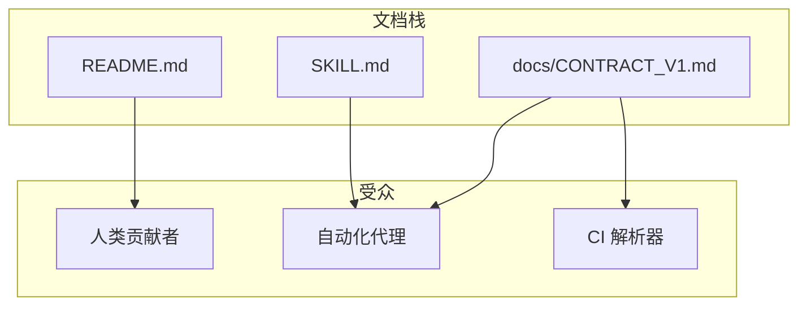

<details>
<summary>相关源文件</summary>

生成本页时使用的主要源文件：

- [SKILL.md](https://github.com/danielgwilson/stitch-design-cli/blob/71e62a260313d7e3030f2d6a17067c455c7f4873/SKILL.md)
- [README.md](https://github.com/danielgwilson/stitch-design-cli/blob/71e62a260313d7e3030f2d6a17067c455c7f4873/README.md)
- [docs/CONTRACT_V1.md](https://github.com/danielgwilson/stitch-design-cli/blob/71e62a260313d7e3030f2d6a17067c455c7f4873/docs/CONTRACT_V1.md)
- [stitch-trusted-publishing-notes.md](https://github.com/danielgwilson/stitch-design-cli/blob/71e62a260313d7e3030f2d6a17067c455c7f4873/stitch-trusted-publishing-notes.md)

</details>

# Agent Skill 与运维提示

仓库根目录提供带 YAML frontmatter 的 **SKILL.md**：`name: stitch`，明确 npm 包名 `stitch-design-cli` 与 CLI 二进制名 `stitch` 的区分，并规定代理在 PATH 中找不到时应使用 `npx -y stitch-design-cli <args>`。

## 推荐工作流与约束

Skill 文档强调：优先 CLI 而非浏览器自动化；默认 `--json`；先只读巡检再执行生成/编辑；仅在需要常驻 MCP 或更低层能力时改用 Stitch MCP 直连。

Sources: [SKILL.md:24-29](../../../project-repos/stitch-design-cli/SKILL.md#L24-L29), [SKILL.md:31-52](../../../project-repos/stitch-design-cli/SKILL.md#L31-L52)

<details class="source-snippets">
<summary>引用源码</summary>

<!-- source-snippets:start -->

#### `SKILL.md:24-29`

```markdown
Default stance:

- Prefer the official SDK-backed `stitch` CLI, not browser automation.
- Prefer `--json` for machine-readable output.
- Prefer read-only inspection before generating or editing screens.
- Use Stitch MCP directly only when a task specifically needs always-on tool use or lower-level surface area than this CLI exposes.
```

#### `SKILL.md:31-52`

```markdown
## Default workflow

- If auth is missing, run `stitch auth set`
- Sanity check auth: `stitch doctor --json`
- Inspect auth state: `stitch auth status --json`
- List tools: `stitch tool list --json`
- List projects: `stitch project list --json`
- Create a project: `stitch project create --title "Design Sandbox" --json`
- List screens: `stitch screen list --project-id <project-id> --json`
- Inspect a screen: `stitch screen get --project-id <project-id> --screen-id <screen-id> --include-image --json`
- Generate a screen: `stitch screen generate --project-id <project-id> --prompt "..." --device-type DESKTOP --json`
- Edit a screen: `stitch screen edit --project-id <project-id> --screen-id <screen-id> --prompt "..." --json`
- Generate variants: `stitch screen variants --project-id <project-id> --screen-id <screen-id> --prompt "..." --variant-count 3 --creative-range EXPLORE --json`

For the common design-iteration flow, the default sequence is:

1. `stitch doctor --json`
2. `stitch project list --json`
3. `stitch screen list --project-id <project-id> --json`
4. `stitch screen get --project-id <project-id> --screen-id <screen-id> --include-image --json`
5. `stitch screen edit --project-id <project-id> --screen-id <screen-id> --prompt "..." --json`
6. `stitch screen variants --project-id <project-id> --screen-id <screen-id> --prompt "..." --variant-count 3 --json`
```

<!-- source-snippets:end -->
</details>
## v1 能力边界

明确写出：不包含 design-system 操作与截图上传种子流程；`project get` 绑定官方 `get_project`；`screen edit` 与 `variants` 支持多 `--screen-id`。

Sources: [SKILL.md:79-86](../../../project-repos/stitch-design-cli/SKILL.md#L79-L86)

<details class="source-snippets">
<summary>引用源码</summary>

<!-- source-snippets:start -->

#### `SKILL.md:79-86`

```markdown
## Important constraints

- v1 covers project and screen flows only.
- Do not assume design-system operations are exposed yet.
- Do not assume screenshot-upload seeding is exposed yet.
- `project get` is wired to the official `get_project` tool.
- `screen edit` and `screen variants` both support multiple `--screen-id` values.
- Before editing a screen, confirm the project id and screen id.
```

<!-- source-snippets:end -->
</details>
## 与契约文档的关系

Skill 将稳定 JSON 行为指向 `docs/CONTRACT_V1.md`，与 README「Contract」章节一致，形成「人类 README + 机器 CONTRACT + Agent SKILL」三层文档。

Sources: [SKILL.md:88-90](../../../project-repos/stitch-design-cli/SKILL.md#L88-L90), [README.md:110-112](../../../project-repos/stitch-design-cli/README.md#L110-L112)

<details class="source-snippets">
<summary>引用源码</summary>

<!-- source-snippets:start -->

#### `SKILL.md:88-90`

```markdown
## Contract

Stable JSON behavior is documented in `docs/CONTRACT_V1.md`.
```

#### `README.md:110-112`

```markdown
## Contract

Stable machine-readable behavior is documented in [docs/CONTRACT_V1.md](./docs/CONTRACT_V1.md).
```

<!-- source-snippets:end -->
</details>
## npm Trusted Publishing 备注

`stitch-trusted-publishing-notes.md` 记录与 GitHub Actions OIDC 对接 npm Trusted Publisher 的期望字段（仓库 owner/name、工作流文件名、包名等），属于运维侧非代码契约。

Sources: [stitch-trusted-publishing-notes.md:1-37](../../../project-repos/stitch-design-cli/stitch-trusted-publishing-notes.md#L1-L37)

<details class="source-snippets">
<summary>引用源码</summary>

<!-- source-snippets:start -->

#### `stitch-trusted-publishing-notes.md:1-37`

```markdown
# Stitch trusted publishing notes

This package is set up for npm trusted publishing from GitHub Actions, matching the other public adapter CLIs.

## Expected repository assets

- `.github/workflows/ci.yml`
- `.github/workflows/publish.yml`

## npm trusted publisher setup

In npm, configure a Trusted Publisher for the GitHub repository that will own this package.

Expected settings:

- provider: GitHub Actions
- repository owner: `danielgwilson`
- repository name: `stitch-design-cli`
- workflow filename: `publish.yml`
- package name: `stitch-design-cli`
- registry: npm public registry

## Release flow

Bootstrap:

1. create the GitHub repo
2. add `repository`, `homepage`, and `bugs` metadata to `package.json`
3. do a one-time manual npm publish so the package page exists
4. add the trusted publisher on npm

After bootstrap:

1. bump version
2. push commit
3. push tag `vX.Y.Z`
4. let GitHub Actions publish
```

<!-- source-snippets:end -->
</details>


## 相关页面

- [项目概览](overview.md)
- [测试、CI 与发布](testing-ci-release.md)
