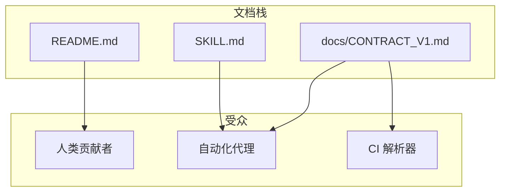

相关源文件

生成本页时使用的主要源文件：

- [SKILL.md](../../../project-repos/stitch-design-cli/SKILL.md)
- [README.md](../../../project-repos/stitch-design-cli/README.md)
- [docs/CONTRACT_V1.md](../../../project-repos/stitch-design-cli/docs/CONTRACT_V1.md)
- [stitch-trusted-publishing-notes.md](../../../project-repos/stitch-design-cli/stitch-trusted-publishing-notes.md)

# Agent Skill 与运维提示

仓库根目录提供带 YAML frontmatter 的 **SKILL.md**：`name: stitch`，明确 npm 包名 `stitch-design-cli` 与 CLI 二进制名 `stitch` 的区分，并规定代理在 PATH 中找不到时应使用 `npx -y stitch-design-cli <args>`。

## 推荐工作流与约束

Skill 文档强调：优先 CLI 而非浏览器自动化；默认 `--json`；先只读巡检再执行生成/编辑；仅在需要常驻 MCP 或更低层能力时改用 Stitch MCP 直连。

Sources: [SKILL.md:24-29](../../../project-repos/stitch-design-cli/SKILL.md#L24-L29), [SKILL.md:31-52](../../../project-repos/stitch-design-cli/SKILL.md#L31-L52)

## v1 能力边界

明确写出：不包含 design-system 操作与截图上传种子流程；`project get` 绑定官方 `get_project`；`screen edit` 与 `variants` 支持多 `--screen-id`。

Sources: [SKILL.md:79-86](../../../project-repos/stitch-design-cli/SKILL.md#L79-L86)

## 与契约文档的关系

Skill 将稳定 JSON 行为指向 `docs/CONTRACT_V1.md`，与 README「Contract」章节一致，形成「人类 README + 机器 CONTRACT + Agent SKILL」三层文档。

Sources: [SKILL.md:88-90](../../../project-repos/stitch-design-cli/SKILL.md#L88-L90), [README.md:110-112](../../../project-repos/stitch-design-cli/README.md#L110-L112)

## npm Trusted Publishing 备注

`stitch-trusted-publishing-notes.md` 记录与 GitHub Actions OIDC 对接 npm Trusted Publisher 的期望字段（仓库 owner/name、工作流文件名、包名等），属于运维侧非代码契约。

Sources: [stitch-trusted-publishing-notes.md:1-37](../../../project-repos/stitch-design-cli/stitch-trusted-publishing-notes.md#L1-L37)

## 相关页面

- [项目概览](overview.md)
- [测试、CI 与发布](testing-ci-release.md)
