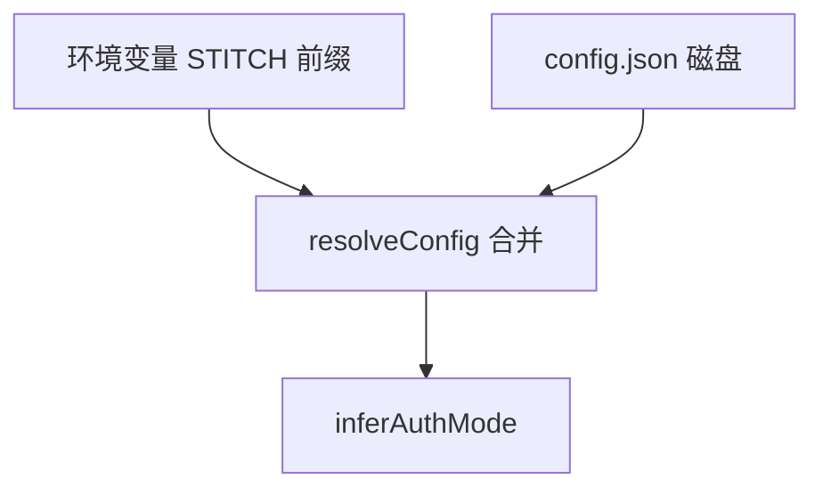

<details>
<summary>相关源文件</summary>

生成本页时使用的主要源文件：

- [src/config.ts](https://github.com/danielgwilson/stitch-design-cli/blob/71e62a260313d7e3030f2d6a17067c455c7f4873/src/config.ts)
- [src/auth.ts](https://github.com/danielgwilson/stitch-design-cli/blob/71e62a260313d7e3030f2d6a17067c455c7f4873/src/auth.ts)
- [src/cli.ts](https://github.com/danielgwilson/stitch-design-cli/blob/71e62a260313d7e3030f2d6a17067c455c7f4873/src/cli.ts)
- [README.md](https://github.com/danielgwilson/stitch-design-cli/blob/71e62a260313d7e3030f2d6a17067c455c7f4873/README.md)

</details>

# 认证与配置解析

凭据与端点配置遵循「环境变量覆盖文件配置」的合并模型；文件默认落在 `XDG_CONFIG_HOME` 或 `~/.config/stitch/config.json`，并以 `0o600` 权限写入，降低多用户主机上的泄露面。

## 解析优先级与来源标记

`resolveConfig` 将 `STITCH_API_KEY`、`STITCH_ACCESS_TOKEN`、`GOOGLE_CLOUD_PROJECT`、`STITCH_HOST`、`STITCH_TIMEOUT_MS` 与磁盘 JSON 合并，并计算 `source` 字段为 `env` / `config` / `mixed` / `none` 之一。

Sources: [src/config.ts:94-122](../../../project-repos/stitch-design-cli/src/config.ts#L94-L122)

<details class="source-snippets">
<summary>引用源码</summary>

<!-- source-snippets:start -->

#### `src/config.ts:94-122`

```typescript
export async function resolveConfig(): Promise<ResolvedConfig> {
  const fileConfig = await readConfig();

  const envApiKey = process.env.STITCH_API_KEY?.trim();
  const envAccessToken = process.env.STITCH_ACCESS_TOKEN?.trim();
  const envProjectId = process.env.GOOGLE_CLOUD_PROJECT?.trim();
  const envBaseUrl = process.env.STITCH_HOST?.trim();
  const envTimeoutMs = process.env.STITCH_TIMEOUT_MS?.trim();

  const resolved: StitchCliConfig = {
    apiKey: envApiKey || fileConfig.apiKey,
    accessToken: envAccessToken || fileConfig.accessToken,
    projectId: envProjectId || fileConfig.projectId,
    baseUrl: cleanBaseUrl(envBaseUrl || fileConfig.baseUrl),
    timeoutMs: cleanTimeoutMs(envTimeoutMs || fileConfig.timeoutMs),
  };

  const fromEnv = Boolean(envApiKey || envAccessToken || envProjectId || envBaseUrl || envTimeoutMs);
  const fromConfig = Boolean(
    fileConfig.apiKey || fileConfig.accessToken || fileConfig.projectId || fileConfig.baseUrl || fileConfig.timeoutMs,
  );

  const source: ResolvedConfig["source"] = fromEnv && fromConfig ? "mixed" : fromEnv ? "env" : fromConfig ? "config" : "none";

  return {
    ...resolved,
    source,
    authMode: inferAuthMode(resolved),
  };
```

<!-- source-snippets:end -->
</details>
## 认证模式推断

- 仅 API Key：`inferAuthMode` 返回 `apiKey`。
- Access Token 与 Project Id 同时存在：返回 `oauth`。
- 否则 `none`。

Sources: [src/config.ts:44-48](../../../project-repos/stitch-design-cli/src/config.ts#L44-L48)

<details class="source-snippets">
<summary>引用源码</summary>

<!-- source-snippets:start -->

#### `src/config.ts:44-48`

```typescript
export function inferAuthMode(config: StitchCliConfig): AuthMode {
  if (config.apiKey?.trim()) return "apiKey";
  if (config.accessToken?.trim() && config.projectId?.trim()) return "oauth";
  return "none";
}
```

<!-- source-snippets:end -->
</details>
## 默认端点与超时

未配置时 `baseUrl` 默认为 `https://stitch.googleapis.com/mcp`，超时默认 `300000` ms，与官方 SDK 文档常见默认值对齐。

Sources: [src/config.ts:20-21](../../../project-repos/stitch-design-cli/src/config.ts#L20-L21), [src/config.ts:32-41](../../../project-repos/stitch-design-cli/src/config.ts#L32-L41)

<details class="source-snippets">
<summary>引用源码</summary>

<!-- source-snippets:start -->

#### `src/config.ts:20-21`

```typescript
const DEFAULT_BASE_URL = "https://stitch.googleapis.com/mcp";
const DEFAULT_TIMEOUT_MS = 300_000;
```

#### `src/config.ts:32-41`

```typescript
function cleanBaseUrl(value: string | undefined): string {
  const raw = (value || "").trim();
  if (!raw) return DEFAULT_BASE_URL;
  return raw.replace(/\/+$/, "");
}

function cleanTimeoutMs(value: unknown): number {
  const raw = typeof value === "number" ? value : Number(String(value || "").trim());
  if (!Number.isFinite(raw) || raw <= 0) return DEFAULT_TIMEOUT_MS;
  return Math.round(raw);
```

<!-- source-snippets:end -->
</details>
## 保存后校验

`saveAndValidateConfig` 在写入磁盘后立即调用 `validateAuth`：通过 `sdk.projects()` 试拉项目列表，成功则返回 `sample.projectCount`；失败则携带归一化错误信息，便于区分「网络错误」与「凭据被拒」。

Sources: [src/auth.ts:48-54](../../../project-repos/stitch-design-cli/src/auth.ts#L48-L54), [src/auth.ts:24-45](../../../project-repos/stitch-design-cli/src/auth.ts#L24-L45)

<details class="source-snippets">
<summary>引用源码</summary>

<!-- source-snippets:start -->

#### `src/auth.ts:48-54`

```typescript
export async function saveAndValidateConfig(
  config: StitchCliConfig,
): Promise<{ config: StitchCliConfig; validation: AuthValidation }> {
  await writeConfig(config);
  const validation = await validateAuth(config);
  return { config, validation };
}
```

#### `src/auth.ts:24-45`

```typescript
export async function validateAuth(config: StitchCliConfig | ResolvedConfig): Promise<AuthValidation> {
  const normalized = normalizeConfig(config);
  if (inferAuthMode(normalized) === "none") return { ok: false, reason: "Missing Stitch credentials" };

  const { client, sdk } = createSdkContext(normalized);
  try {
    const projects = await withSuppressedTransportNoise(() => sdk.projects());
    return {
      ok: true,
      sample: {
        projectCount: projects.length,
      },
    };
  } catch (error: any) {
    const normalizedError = makeError(error);
    return {
      ok: false,
      reason: normalizedError.detail || normalizedError.message || "Validation failed",
    };
  } finally {
    await client.close();
  }
```

<!-- source-snippets:end -->
</details>
## `auth set` 的 OAuth 约束

若传入 access token 或 project id 之一但未成对提供，CLI 在 `auth set` 阶段直接报 `VALIDATION_ERROR`，避免写出半套 OAuth 配置。

Sources: [src/cli.ts:184-198](../../../project-repos/stitch-design-cli/src/cli.ts#L184-L198)

<details class="source-snippets">
<summary>引用源码</summary>

<!-- source-snippets:start -->

#### `src/cli.ts:184-198`

```typescript
      try {
        const accessToken = options.accessToken?.trim();
        const projectId = options.projectId?.trim();
        const usingOauth = Boolean(accessToken || projectId);

        if (usingOauth && (!accessToken || !projectId)) {
          emitFailure(
            {
              code: "VALIDATION_ERROR",
              message: "OAuth auth requires both --access-token and --project-id",
            },
            Boolean(options.json),
          );
          return;
        }
```

<!-- source-snippets:end -->
</details>


## 相关页面

- [CLI 命令面](cli-commands.md)
- [Stitch SDK 适配层](stitch-sdk-layer.md)
