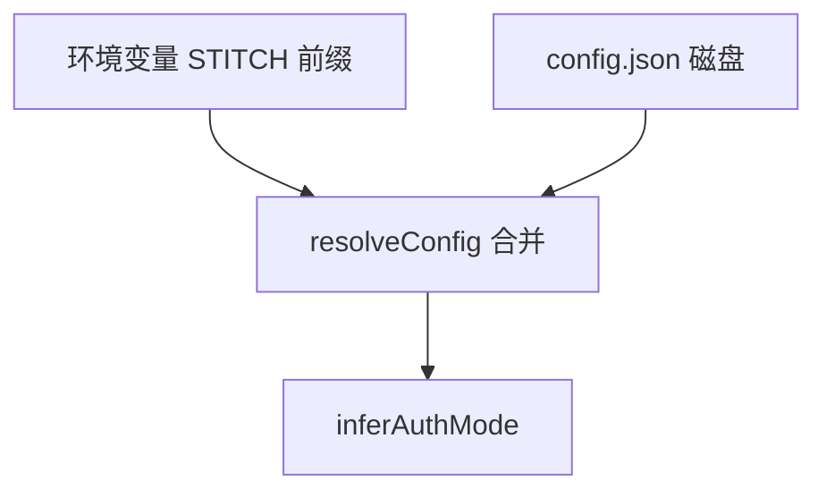

相关源文件

生成本页时使用的主要源文件：

- [src/config.ts](../../../project-repos/stitch-design-cli/src/config.ts)
- [src/auth.ts](../../../project-repos/stitch-design-cli/src/auth.ts)
- [src/cli.ts](../../../project-repos/stitch-design-cli/src/cli.ts)
- [README.md](../../../project-repos/stitch-design-cli/README.md)

# 认证与配置解析

凭据与端点配置遵循「环境变量覆盖文件配置」的合并模型；文件默认落在 `XDG_CONFIG_HOME` 或 `~/.config/stitch/config.json`，并以 `0o600` 权限写入，降低多用户主机上的泄露面。

## 解析优先级与来源标记

`resolveConfig` 将 `STITCH_API_KEY`、`STITCH_ACCESS_TOKEN`、`GOOGLE_CLOUD_PROJECT`、`STITCH_HOST`、`STITCH_TIMEOUT_MS` 与磁盘 JSON 合并，并计算 `source` 字段为 `env` / `config` / `mixed` / `none` 之一。

Sources: [src/config.ts:94-122](../../../project-repos/stitch-design-cli/src/config.ts#L94-L122)

## 认证模式推断

- 仅 API Key：`inferAuthMode` 返回 `apiKey`。
- Access Token 与 Project Id 同时存在：返回 `oauth`。
- 否则 `none`。

Sources: [src/config.ts:44-48](../../../project-repos/stitch-design-cli/src/config.ts#L44-L48)

## 默认端点与超时

未配置时 `baseUrl` 默认为 `https://stitch.googleapis.com/mcp`，超时默认 `300000` ms，与官方 SDK 文档常见默认值对齐。

Sources: [src/config.ts:20-21](../../../project-repos/stitch-design-cli/src/config.ts#L20-L21), [src/config.ts:32-41](../../../project-repos/stitch-design-cli/src/config.ts#L32-L41)

## 保存后校验

`saveAndValidateConfig` 在写入磁盘后立即调用 `validateAuth`：通过 `sdk.projects()` 试拉项目列表，成功则返回 `sample.projectCount`；失败则携带归一化错误信息，便于区分「网络错误」与「凭据被拒」。

Sources: [src/auth.ts:48-54](../../../project-repos/stitch-design-cli/src/auth.ts#L48-L54), [src/auth.ts:24-45](../../../project-repos/stitch-design-cli/src/auth.ts#L24-L45)

## `auth set` 的 OAuth 约束

若传入 access token 或 project id 之一但未成对提供，CLI 在 `auth set` 阶段直接报 `VALIDATION_ERROR`，避免写出半套 OAuth 配置。

Sources: [src/cli.ts:184-198](../../../project-repos/stitch-design-cli/src/cli.ts#L184-L198)

## 相关页面

- [CLI 命令面](cli-commands.md)
- [Stitch SDK 适配层](stitch-sdk-layer.md)
