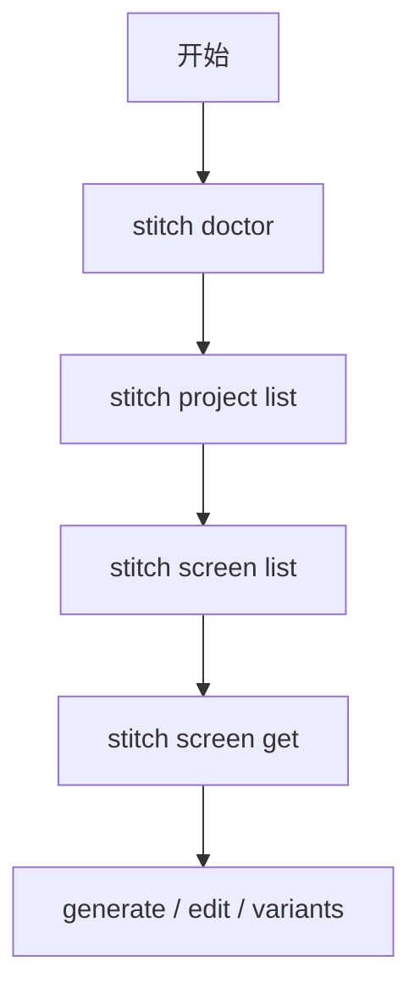

相关源文件

生成本页时使用的主要源文件：

- [src/cli.ts](../../../project-repos/stitch-design-cli/src/cli.ts)
- [README.md](../../../project-repos/stitch-design-cli/README.md)
- [docs/CONTRACT_V1.md](../../../project-repos/stitch-design-cli/docs/CONTRACT_V1.md)

# CLI 命令面

CLI 基于 **Commander** 构建，程序名为 `stitch`，子命令树分为 `auth`、`doctor`、`tool`、`project`、`screen` 五大组；其中 `screen generate|edit|variants` 在部分路径上直接 `callTool` 调用官方 MCP 工具名（如 `generate_screen_from_text`、`edit_screens`、`generate_variants`），而列表类能力优先走 SDK 高层 API（`sdk.projects()`、`project().screens()` 等）。

## 子命令总览

| 分组 | 子命令 | 主要职责 |
|------|--------|-----------|
| auth | set / status / clear | 写入或清理 `~/.config/stitch/config.json`，展示脱敏状态 |
| 根级 | doctor | 检查凭据、`listTools`、`projects` 列表是否可用 |
| tool | list | 列出 MCP 工具元数据（含 annotations 提示） |
| project | list / create / get | 列表与创建走 SDK；`get` 显式 `get_project` |
| screen | list / get / generate / edit / variants | 读屏走 SDK；变更类多走 `callTool` |

Sources: [src/cli.ts:153-661](../../../project-repos/stitch-design-cli/src/cli.ts#L153-L661), [docs/CONTRACT_V1.md:61-84](../../../project-repos/stitch-design-cli/docs/CONTRACT_V1.md#L61-L84)

## `screen get` 的多屏隔离策略

当请求多个 `screen-id` 时，循环内可为每个屏幕创建独立 `createSdkContext`，以避免 SDK 并发或连接复用带来的交叉影响；单屏则复用外层上下文。

Sources: [src/cli.ts:464-480](../../../project-repos/stitch-design-cli/src/cli.ts#L464-L480)

## 枚举校验

`device-type`、`model-id`、`creative-range`、`aspect` 在 `generate` / `edit` / `variants` 前由白名单校验，非法值抛出带 `VALIDATION_ERROR` 的错误码（经 `output.makeError` 归一化）。

Sources: [src/cli.ts:20-36](../../../project-repos/stitch-design-cli/src/cli.ts#L20-L36), [src/cli.ts:141-151](../../../project-repos/stitch-design-cli/src/cli.ts#L141-L151), [src/cli.ts:620-627](../../../project-repos/stitch-design-cli/src/cli.ts#L620-L627)

## 典型 Agent 流水线（来自 README）

`doctor` → `project list` → `screen list` → `screen get --include-image` → `edit` / `variants`，与仓库根 `SKILL.md` 推荐一致。

Sources: [README.md:85-100](../../../project-repos/stitch-design-cli/README.md#L85-L100)

## 相关页面

- [系统架构与模块边界](system-architecture.md)
- [认证与配置解析](auth-and-config.md)
