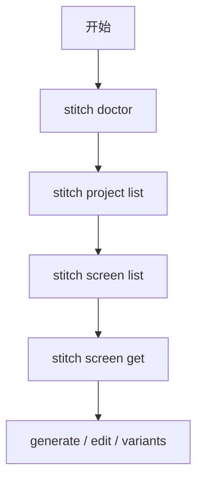

<details>
<summary>相关源文件</summary>

生成本页时使用的主要源文件：

- [src/cli.ts](https://github.com/danielgwilson/stitch-design-cli/blob/71e62a260313d7e3030f2d6a17067c455c7f4873/src/cli.ts)
- [README.md](https://github.com/danielgwilson/stitch-design-cli/blob/71e62a260313d7e3030f2d6a17067c455c7f4873/README.md)
- [docs/CONTRACT_V1.md](https://github.com/danielgwilson/stitch-design-cli/blob/71e62a260313d7e3030f2d6a17067c455c7f4873/docs/CONTRACT_V1.md)

</details>

# CLI 命令面

CLI 基于 **Commander** 构建，程序名为 `stitch`，子命令树分为 `auth`、`doctor`、`tool`、`project`、`screen` 五大组；其中 `screen generate|edit|variants` 在部分路径上直接 `callTool` 调用官方 MCP 工具名（如 `generate_screen_from_text`、`edit_screens`、`generate_variants`），而列表类能力优先走 SDK 高层 API（`sdk.projects()`、`project().screens()` 等）。

## 子命令总览

| 分组 | 子命令 | 主要职责 |
|------|--------|-----------|
| auth | set / status / clear | 写入或清理 `~/.config/stitch/config.json`，展示脱敏状态 |
| 根级 | doctor | 检查凭据、`listTools`、`projects` 列表是否可用 |
| tool | list | 列出 MCP 工具元数据（含 annotations 提示） |
| project | list / create / get | 列表与创建走 SDK；`get` 显式 `get_project` |
| screen | list / get / generate / edit / variants | 读屏走 SDK；变更类多走 `callTool` |

Sources: [src/cli.ts:153-661](../../../project-repos/stitch-design-cli/src/cli.ts#L153-L661), [docs/CONTRACT_V1.md:61-84](../../../project-repos/stitch-design-cli/docs/CONTRACT_V1.md#L61-L84)

<details class="source-snippets">
<summary>引用源码</summary>

<!-- source-snippets:start -->

#### `src/cli.ts:153-661`

```typescript
async function main(): Promise<void> {
  const program = new Command();

  program
    .name("stitch")
    .description("Agent-first CLI for Google's official Stitch SDK")
    .version(getCliVersion())
    .showHelpAfterError();

  const auth = program.command("auth").description("Manage Stitch credentials");

  auth
    .command("set")
    .description("Save Stitch credentials locally")
    .option("--api-key <value>", "API key to save")
    .option("--access-token <value>", "OAuth access token to save")
    .option("--project-id <value>", "Project id to pair with OAuth access token")
    .option("--stdin", "Read API key from stdin")
    .option("--base-url <url>", "Override Stitch MCP base URL")
    .option("--timeout-ms <ms>", "Override request timeout in milliseconds", parsePositiveInteger)
    .option("--json", "Print JSON output")
    .action(
      async (options: {
        apiKey?: string;
        accessToken?: string;
        projectId?: string;
        stdin?: boolean;
        baseUrl?: string;
        timeoutMs?: number;
        json?: boolean;
      }) => {
      try {
        const accessToken = options.accessToken?.trim();
        const projectId = options.projectId?.trim();
        const usingOauth = Boolean(accessToken || projectId);

        if (usingOauth && (!accessToken || !projectId)) {
          emitFailure(
            {
              code: "VALIDATION_ERROR",
              message: "OAuth auth requires both --access-token and --project-id",
            },
            Boolean(options.json),
          );
          return;
        }

        const apiKey = usingOauth
          ? undefined
          : options.stdin
            ? (await readStdin()).trim()
            : options.apiKey?.trim() || (await promptForApiKey());

        if (!usingOauth && !apiKey) {
          emitFailure({ code: "VALIDATION_ERROR", message: "Expected a non-empty API key" }, Boolean(options.json));
          return;
        }

        const { config, validation } = await withSuppressedTransportNoise(() =>
          saveAndValidateConfig({
            apiKey,
            accessToken,
            projectId,
            baseUrl: options.baseUrl,
            timeoutMs: options.timeoutMs,
          }),
        );

        const data = {
          saved: true,
          configPath: getConfigPath(),
          authMode: usingOauth ? "oauth" : "apiKey",
          apiKeyRedacted: redactSecret(config.apiKey),
          accessTokenRedacted: redactSecret(config.accessToken),
          projectId: config.projectId || null,
          baseUrl: config.baseUrl || null,
          timeoutMs: config.timeoutMs || null,
          validation,
        };

        if (options.json) printJson(ok(data));
        else printHuman(data);
      } catch (error) {
        emitFailure(error, Boolean(options.json));
      }
    });

  auth
    .command("status")
    .description("Show resolved Stitch auth state")
    .option("--json", "Print JSON output")
    .action(async (options: CommonJsonOptions) => {
      try {
        const config = await resolveConfig();
        const validation = hasAuth(config)
          ? await withSuppressedTransportNoise(() => validateAuth(config))
          : { ok: false, reason: "Missing Stitch credentials" };
        const data = {
          authMode: config.authMode,
          source: config.source,
          hasApiKey: Boolean(config.apiKey),
          hasAccessToken: Boolean(config.accessToken),
          hasProjectId: Boolean(config.projectId),
          apiKeyRedacted: redactSecret(config.apiKey),
          accessTokenRedacted: redactSecret(config.accessToken),
          projectId: config.projectId || null,
          baseUrl: config.baseUrl || null,
          timeoutMs: config.timeoutMs || null,
          validation,
        };
        if (options.json) printJson(ok(data));
        else printHuman(data);
      } catch (error) {
        emitFailure(error, Boolean(options.json));
      }
    });

  auth
    .command("clear")
    .description("Remove locally saved Stitch credentials")
... snippet truncated ...
```

#### `docs/CONTRACT_V1.md:61-84`

```markdown
## Coverage boundary

Direct official SDK coverage:

- `tool list`
- `project list`
- `project create`
- `screen list`
- `screen get`
- `screen generate`

Direct official Stitch tool coverage:

- `project get`
- `screen edit`
- `screen variants`

Derived helpers built on top of official Stitch coverage:

- `auth status`
- `doctor`
- `screen get --include-html`
- `screen get --include-image`

```

<!-- source-snippets:end -->
</details>
## `screen get` 的多屏隔离策略

当请求多个 `screen-id` 时，循环内可为每个屏幕创建独立 `createSdkContext`，以避免 SDK 并发或连接复用带来的交叉影响；单屏则复用外层上下文。

Sources: [src/cli.ts:464-480](../../../project-repos/stitch-design-cli/src/cli.ts#L464-L480)

<details class="source-snippets">
<summary>引用源码</summary>

<!-- source-snippets:start -->

#### `src/cli.ts:464-480`

```typescript
        await runWithSdk(options, async ({ config, sdk }) => {
          const requestedScreenIds = splitCsv(options.screenId);
          const items: Record<string, unknown>[] = [];
          for (const screenId of requestedScreenIds) {
            const isolated = requestedScreenIds.length > 1 ? createSdkContext(config) : null;
            const activeSdk = isolated?.sdk ?? sdk;
            try {
              const item = await activeSdk.project(options.projectId).getScreen(screenId);
              const [htmlUrl, imageUrl] = await Promise.all([
                options.includeHtml ? item.getHtml() : Promise.resolve(undefined),
                options.includeImage ? item.getImage() : Promise.resolve(undefined),
              ]);
              items.push(serializeScreen(item, { htmlUrl, imageUrl }));
            } finally {
              if (isolated) await isolated.client.close();
            }
          }
```

<!-- source-snippets:end -->
</details>
## 枚举校验

`device-type`、`model-id`、`creative-range`、`aspect` 在 `generate` / `edit` / `variants` 前由白名单校验，非法值抛出带 `VALIDATION_ERROR` 的错误码（经 `output.makeError` 归一化）。

Sources: [src/cli.ts:20-36](../../../project-repos/stitch-design-cli/src/cli.ts#L20-L36), [src/cli.ts:141-151](../../../project-repos/stitch-design-cli/src/cli.ts#L141-L151), [src/cli.ts:620-627](../../../project-repos/stitch-design-cli/src/cli.ts#L620-L627)

<details class="source-snippets">
<summary>引用源码</summary>

<!-- source-snippets:start -->

#### `src/cli.ts:20-36`

```typescript
type CommonJsonOptions = { json?: boolean };
type DeviceType = "DEVICE_TYPE_UNSPECIFIED" | "MOBILE" | "DESKTOP" | "TABLET" | "AGNOSTIC";
type ModelId = "MODEL_ID_UNSPECIFIED" | "GEMINI_3_PRO" | "GEMINI_3_FLASH";
type CreativeRange = "CREATIVE_RANGE_UNSPECIFIED" | "REFINE" | "EXPLORE" | "REIMAGINE";
type VariantAspect = "VARIANT_ASPECT_UNSPECIFIED" | "LAYOUT" | "COLOR_SCHEME" | "IMAGES" | "TEXT_FONT" | "TEXT_CONTENT";

const DEVICE_TYPES: DeviceType[] = ["DEVICE_TYPE_UNSPECIFIED", "MOBILE", "DESKTOP", "TABLET", "AGNOSTIC"];
const MODEL_IDS: ModelId[] = ["MODEL_ID_UNSPECIFIED", "GEMINI_3_PRO", "GEMINI_3_FLASH"];
const CREATIVE_RANGES: CreativeRange[] = ["CREATIVE_RANGE_UNSPECIFIED", "REFINE", "EXPLORE", "REIMAGINE"];
const VARIANT_ASPECTS: VariantAspect[] = [
  "VARIANT_ASPECT_UNSPECIFIED",
  "LAYOUT",
  "COLOR_SCHEME",
  "IMAGES",
  "TEXT_FONT",
  "TEXT_CONTENT",
];
```

#### `src/cli.ts:141-151`

```typescript
function validateEnum<T extends string>(value: string | undefined, allowed: readonly T[], label: string): void {
  if (value && !allowed.includes(value as T)) {
    const error = new Error(`Invalid ${label}: ${value}`);
    (error as Error & { code?: string }).code = "VALIDATION_ERROR";
    throw error;
  }
}

function validateVariantAspects(aspects: string[]): void {
  for (const aspect of aspects) validateEnum(aspect, VARIANT_ASPECTS, "aspect");
}
```

#### `src/cli.ts:620-627`

```typescript
        try {
          validateEnum(options.deviceType, DEVICE_TYPES, "device type");
          validateEnum(options.modelId, MODEL_IDS, "model id");
          validateEnum(options.creativeRange, CREATIVE_RANGES, "creative range");
          validateVariantAspects(splitCsv(options.aspect));
          if (typeof options.variantCount === "number" && (options.variantCount < 1 || options.variantCount > 5)) {
            throw Object.assign(new Error("variant count must be between 1 and 5"), { code: "VALIDATION_ERROR" });
          }
```

<!-- source-snippets:end -->
</details>
## 典型 Agent 流水线（来自 README）

`doctor` → `project list` → `screen list` → `screen get --include-image` → `edit` / `variants`，与仓库根 `SKILL.md` 推荐一致。

Sources: [README.md:85-100](../../../project-repos/stitch-design-cli/README.md#L85-L100)

<details class="source-snippets">
<summary>引用源码</summary>

<!-- source-snippets:start -->

#### `README.md:85-100`

````markdown
## Common commands

```bash
stitch auth status --json
stitch doctor --json
stitch tool list --json
stitch project list --json
stitch project create --title "Design Sandbox" --json
stitch project get <project-id> --json
stitch screen list --project-id <project-id> --json
stitch screen get --project-id <project-id> --screen-id <screen-id> --include-image --json
stitch screen get --project-id <project-id> --screen-id <screen-id-a> --screen-id <screen-id-b> --include-image --include-html --json
stitch screen generate --project-id <project-id> --prompt "A landing page for a healthcare startup" --device-type DESKTOP --include-image --json
stitch screen edit --project-id <project-id> --screen-id <screen-id> --prompt "Make the hero more editorial" --json
stitch screen variants --project-id <project-id> --screen-id <screen-id> --prompt "Explore three lighter brand directions" --variant-count 3 --creative-range EXPLORE --aspect COLOR_SCHEME --aspect LAYOUT --json
```
````

<!-- source-snippets:end -->
</details>


## 相关页面

- [系统架构与模块边界](system-architecture.md)
- [认证与配置解析](auth-and-config.md)
