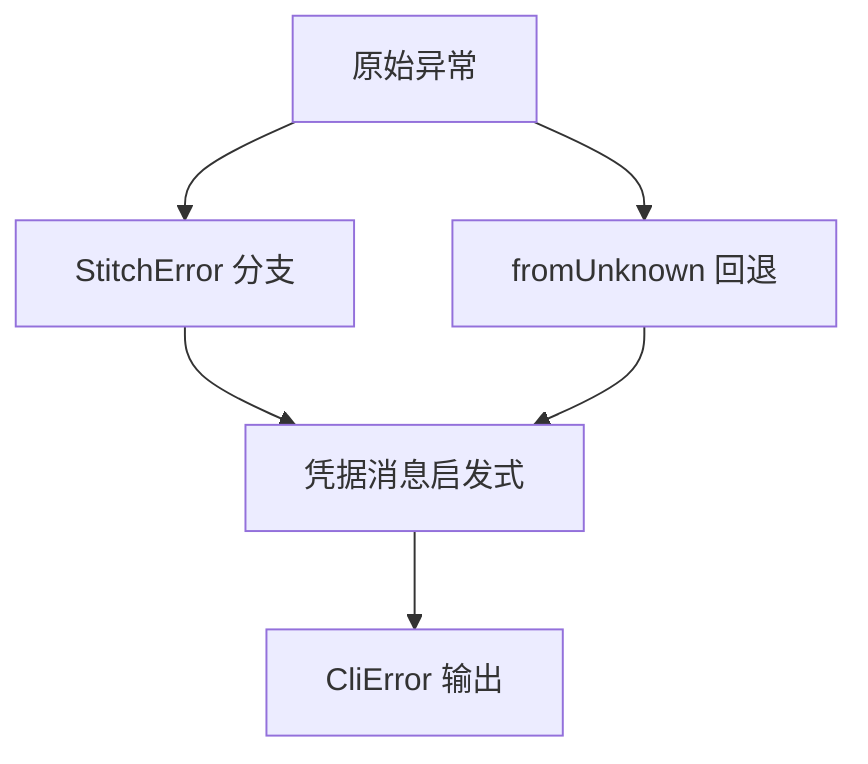

<details>
<summary>相关源文件</summary>

生成本页时使用的主要源文件：

- [docs/CONTRACT_V1.md](https://github.com/danielgwilson/stitch-design-cli/blob/71e62a260313d7e3030f2d6a17067c455c7f4873/docs/CONTRACT_V1.md)
- [src/output.ts](https://github.com/danielgwilson/stitch-design-cli/blob/71e62a260313d7e3030f2d6a17067c455c7f4873/src/output.ts)
- [src/cli.ts](https://github.com/danielgwilson/stitch-design-cli/blob/71e62a260313d7e3030f2d6a17067c455c7f4873/src/cli.ts)

</details>

# JSON 契约与错误模型

`docs/CONTRACT_V1.md` 定义 v1 的稳定机器可读行为：`--json` 时 stdout **恰好一个** JSON 对象；进度与检查信息走 stderr；成功与失败分别使用 `ok` 信封与 `FailEnvelope`。

## 成功与失败信封

成功：`{ "ok": true, "data": {}, "meta": {} }`，`meta` 可选。失败：`{ "ok": false, "error": { "code", "message", "retryable" }, "meta": {} }`。

Sources: [docs/CONTRACT_V1.md:15-38](../../../project-repos/stitch-design-cli/docs/CONTRACT_V1.md#L15-L38)

<details class="source-snippets">
<summary>引用源码</summary>

<!-- source-snippets:start -->

#### `docs/CONTRACT_V1.md:15-38`

````markdown
## JSON envelope

Success:

```json
{
  "ok": true,
  "data": {},
  "meta": {}
}
```

Failure:

```json
{
  "ok": false,
  "error": {
    "code": "AUTH_MISSING",
    "message": "No Stitch credentials. Run `stitch auth set` to save an API key locally, `stitch auth set --stdin` to pipe one in, or export `STITCH_API_KEY`.",
    "retryable": false
  },
  "meta": {}
}
````

<!-- source-snippets:end -->
</details>
## 退出码映射

`exitCodeFor` 将 `AUTH_MISSING`、`VALIDATION_ERROR`、`AUTH_FAILED` 映射为退出码 **2**（需要用户动作或输入非法）；其余错误码为 **1**；成功为 **0**。与 CONTRACT 中「用户动作或无效输入为 2」一致。

Sources: [src/output.ts:94-96](../../../project-repos/stitch-design-cli/src/output.ts#L94-L96), [docs/CONTRACT_V1.md:43-47](../../../project-repos/stitch-design-cli/docs/CONTRACT_V1.md#L43-L47)

<details class="source-snippets">
<summary>引用源码</summary>

<!-- source-snippets:start -->

#### `src/output.ts:94-96`

```typescript
export function exitCodeFor(code: string): number {
  return code === "AUTH_MISSING" || code === "VALIDATION_ERROR" || code === "AUTH_FAILED" ? 2 : 1;
}
```

#### `docs/CONTRACT_V1.md:43-47`

```markdown
## Exit codes

- `0`: success
- `1`: request failure, upstream failure, failed checks, or not found
- `2`: user action required or invalid input
```

<!-- source-snippets:end -->
</details>
## 错误归一化与凭据启发式

`makeError` 优先识别 `StitchError`；否则尝试 `StitchError.fromUnknown`；再回退到消息中的超时检测等。若消息匹配「invalid authentication credentials」或「expected oauth 2 access token」类文案，则升级为 `AUTH_FAILED` 并附带解释性 `detail`，对应 README 中「tool list 可用但 project list 失败」场景。

Sources: [src/output.ts:39-76](../../../project-repos/stitch-design-cli/src/output.ts#L39-L76)

<details class="source-snippets">
<summary>引用源码</summary>

<!-- source-snippets:start -->

#### `src/output.ts:39-76`

```typescript
export function makeError(error: unknown, { code, message }: { code?: string; message?: string } = {}): CliError {
  const explicitCode = isObject(error) && typeof error.code === "string" ? error.code : "";
  const explicitMessage = isObject(error) && typeof error.message === "string" ? error.message : "";
  const stitchError =
    error instanceof StitchError
      ? error
      : (() => {
          try {
            return StitchError.fromUnknown(error);
          } catch {
            return null;
          }
        })();

  const resolvedCode = code || explicitCode || stitchError?.code || toErrorCode(error);
  const resolvedMessage = message || explicitMessage || stitchError?.message || "Request failed";

  if (isInvalidCredentialMessage(resolvedMessage)) {
    return {
      code: "AUTH_FAILED",
      message: "Stitch rejected the configured credentials",
      retryable: false,
      detail:
        "The saved credentials can reach Stitch but are not authorized for project access. Use a valid Stitch API key or save OAuth credentials with an access token plus project id.",
    };
  }

  const result: CliError = {
    code: resolvedCode,
    message: resolvedMessage,
    retryable: stitchError ? stitchError.recoverable : isRetryable(error),
  };

  if (stitchError?.suggestion) result.suggestion = stitchError.suggestion;
  if (result.suggestion && result.suggestion !== result.message) result.detail = result.suggestion;

  return result;
}
```

<!-- source-snippets:end -->
</details>
## 可重试性

`isRetryable` 对 `StitchError` 尊重 `recoverable`；对非 SDK 错误则依据错误码集合 `RATE_LIMITED`、`NETWORK_ERROR`。

Sources: [src/output.ts:22-37](../../../project-repos/stitch-design-cli/src/output.ts#L22-L37)

<details class="source-snippets">
<summary>引用源码</summary>

<!-- source-snippets:start -->

#### `src/output.ts:22-37`

```typescript
export function toErrorCode(error: unknown): string {
  if (error instanceof StitchError) return error.code;

  const code = isObject(error) && typeof error.code === "string" ? error.code : "";
  if (code) return code;

  const message = isObject(error) && typeof error.message === "string" ? error.message : "";
  if (message.toLowerCase().includes("timed out")) return "NETWORK_ERROR";

  return "UNKNOWN_ERROR";
}

export function isRetryable(error: unknown): boolean {
  if (error instanceof StitchError) return error.recoverable;
  return RETRYABLE_CODES.has(toErrorCode(error));
}
```

<!-- source-snippets:end -->
</details>


## 相关页面

- [CLI 命令面](cli-commands.md)
- [响应归一化与屏幕变更结果](normalization-pipeline.md)
