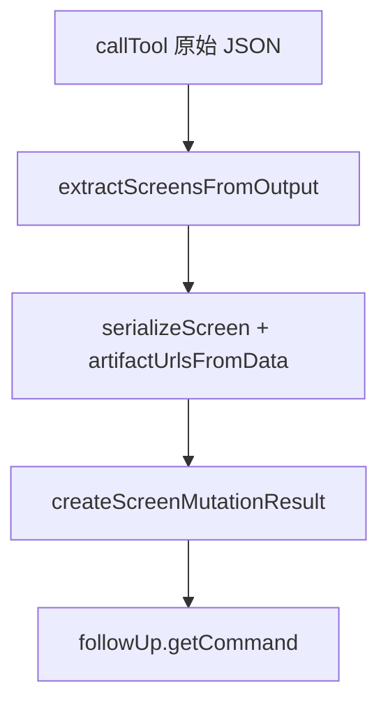

相关源文件

生成本页时使用的主要源文件：

- [src/normalize.ts](../../../project-repos/stitch-design-cli/src/normalize.ts)
- [src/cli.ts](../../../project-repos/stitch-design-cli/src/cli.ts)
- [docs/CONTRACT_V1.md](../../../project-repos/stitch-design-cli/docs/CONTRACT_V1.md)

# 响应归一化与屏幕变更结果

Stitch MCP 返回体结构复杂（嵌套 `outputComponents`、`design.screens` 等）。`normalize.ts` 提供一组纯函数：从原始 `callTool` 结果抽取屏幕数组与提示文案，序列化为稳定的 `projectId` / `screenId` / `title` / 可选 `htmlUrl` / `imageUrl` 字段，并在 `variants` 场景附加 `followUp` 建议命令。

## 屏幕与项目 ID 提取

`toProjectId` / `toScreenId` 同时兼容 `projectId` 字段、`id` 字段以及 `name` 形如 `projects/...` 或包含 `/screens/` 的资源名，降低 Agent 因 ID 形态不一致导致的失败率。

Sources: [src/normalize.ts:28-44](../../../project-repos/stitch-design-cli/src/normalize.ts#L28-L44)

## 从输出组件抽取屏幕

`extractScreensFromOutput` 遍历 `raw.outputComponents`，收集每个组件 `design.screens` 数组成员，并注入调用方已知的 `projectId`。

Sources: [src/normalize.ts:101-111](../../../project-repos/stitch-design-cli/src/normalize.ts#L101-L111)

## 制品 URL 的两种来源

`artifactUrlsFromData` 在变更类命令里直接从屏幕数据对象的 `htmlCode.downloadUrl` 与 `screenshot.downloadUrl` 读取；而 `screen get` 路径则通过 SDK 的 `getHtml()` / `getImage()` 异步拉取（见 `cli.ts` 中 `screen get` 动作块）。

Sources: [src/normalize.ts:77-85](../../../project-repos/stitch-design-cli/src/normalize.ts#L77-L85), [src/cli.ts:471-476](../../../project-repos/stitch-design-cli/src/cli.ts#L471-L476)

## `createScreenMutationResult` 与 follow-up

对 `generate` / `edit` / `variants` 三类操作统一封装：包含 `kind`、`count`、`messages`、`items`（带 `resultIndex`，`variants` 还带 `variantIndex` 与 `sourceScreenId`），并在有返回屏幕 id 时生成 `followUp.getCommand`，预填 `--include-html --include-image --json`，解决「列表尚未刷新但 id 已可用」的竞态。

Sources: [src/normalize.ts:114-156](../../../project-repos/stitch-design-cli/src/normalize.ts#L114-L156), [docs/CONTRACT_V1.md:221-317](../../../project-repos/stitch-design-cli/docs/CONTRACT_V1.md#L221-L317)

## 相关页面

- [Stitch SDK 适配层](stitch-sdk-layer.md)
- [JSON 契约与错误模型](json-output-and-errors.md)
