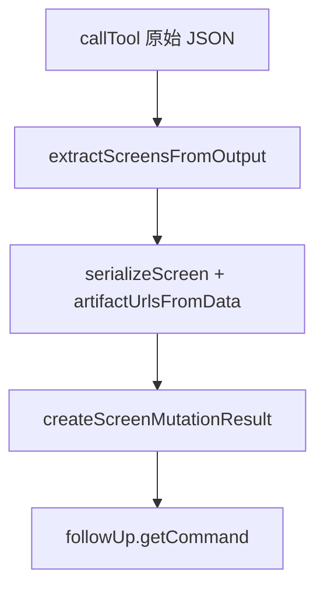

<details>
<summary>相关源文件</summary>

生成本页时使用的主要源文件：

- [src/normalize.ts](https://github.com/danielgwilson/stitch-design-cli/blob/71e62a260313d7e3030f2d6a17067c455c7f4873/src/normalize.ts)
- [src/cli.ts](https://github.com/danielgwilson/stitch-design-cli/blob/71e62a260313d7e3030f2d6a17067c455c7f4873/src/cli.ts)
- [docs/CONTRACT_V1.md](https://github.com/danielgwilson/stitch-design-cli/blob/71e62a260313d7e3030f2d6a17067c455c7f4873/docs/CONTRACT_V1.md)

</details>

# 响应归一化与屏幕变更结果

Stitch MCP 返回体结构复杂（嵌套 `outputComponents`、`design.screens` 等）。`normalize.ts` 提供一组纯函数：从原始 `callTool` 结果抽取屏幕数组与提示文案，序列化为稳定的 `projectId` / `screenId` / `title` / 可选 `htmlUrl` / `imageUrl` 字段，并在 `variants` 场景附加 `followUp` 建议命令。

## 屏幕与项目 ID 提取

`toProjectId` / `toScreenId` 同时兼容 `projectId` 字段、`id` 字段以及 `name` 形如 `projects/...` 或包含 `/screens/` 的资源名，降低 Agent 因 ID 形态不一致导致的失败率。

Sources: [src/normalize.ts:28-44](../../../project-repos/stitch-design-cli/src/normalize.ts#L28-L44)

<details class="source-snippets">
<summary>引用源码</summary>

<!-- source-snippets:start -->

#### `src/normalize.ts:28-44`

```typescript
export function toProjectId(data: any): string | null {
  if (!data) return null;
  if (typeof data.projectId === "string" && data.projectId) return data.projectId;
  if (typeof data.id === "string" && data.id) return data.id;
  if (typeof data.name === "string" && data.name.startsWith("projects/")) return data.name.slice("projects/".length);
  return null;
}

export function toScreenId(data: any): string | null {
  if (!data) return null;
  if (typeof data.screenId === "string" && data.screenId) return data.screenId;
  if (typeof data.id === "string" && data.id) return data.id;
  if (typeof data.name === "string" && data.name.includes("/screens/")) {
    return data.name.split("/screens/")[1] || null;
  }
  return null;
}
```

<!-- source-snippets:end -->
</details>
## 从输出组件抽取屏幕

`extractScreensFromOutput` 遍历 `raw.outputComponents`，收集每个组件 `design.screens` 数组成员，并注入调用方已知的 `projectId`。

Sources: [src/normalize.ts:101-111](../../../project-repos/stitch-design-cli/src/normalize.ts#L101-L111)

<details class="source-snippets">
<summary>引用源码</summary>

<!-- source-snippets:start -->

#### `src/normalize.ts:101-111`

```typescript
export function extractScreensFromOutput(raw: any, projectId: string): any[] {
  if (!Array.isArray(raw?.outputComponents)) return [];
  const screens: any[] = [];
  for (const component of raw.outputComponents) {
    const candidates = component?.design?.screens;
    if (!Array.isArray(candidates)) continue;
    for (const item of candidates) {
      screens.push({ ...item, projectId });
    }
  }
  return screens;
```

<!-- source-snippets:end -->
</details>
## 制品 URL 的两种来源

`artifactUrlsFromData` 在变更类命令里直接从屏幕数据对象的 `htmlCode.downloadUrl` 与 `screenshot.downloadUrl` 读取；而 `screen get` 路径则通过 SDK 的 `getHtml()` / `getImage()` 异步拉取（见 `cli.ts` 中 `screen get` 动作块）。

Sources: [src/normalize.ts:77-85](../../../project-repos/stitch-design-cli/src/normalize.ts#L77-L85), [src/cli.ts:471-476](../../../project-repos/stitch-design-cli/src/cli.ts#L471-L476)

<details class="source-snippets">
<summary>引用源码</summary>

<!-- source-snippets:start -->

#### `src/normalize.ts:77-85`

```typescript
export function artifactUrlsFromData(
  data: any,
  options: { includeHtml?: boolean; includeImage?: boolean },
): { htmlUrl?: string; imageUrl?: string } {
  return {
    htmlUrl: options.includeHtml ? data?.htmlCode?.downloadUrl || undefined : undefined,
    imageUrl: options.includeImage ? data?.screenshot?.downloadUrl || undefined : undefined,
  };
}
```

#### `src/cli.ts:471-476`

```typescript
              const item = await activeSdk.project(options.projectId).getScreen(screenId);
              const [htmlUrl, imageUrl] = await Promise.all([
                options.includeHtml ? item.getHtml() : Promise.resolve(undefined),
                options.includeImage ? item.getImage() : Promise.resolve(undefined),
              ]);
              items.push(serializeScreen(item, { htmlUrl, imageUrl }));
```

<!-- source-snippets:end -->
</details>
## `createScreenMutationResult` 与 follow-up

对 `generate` / `edit` / `variants` 三类操作统一封装：包含 `kind`、`count`、`messages`、`items`（带 `resultIndex`，`variants` 还带 `variantIndex` 与 `sourceScreenId`），并在有返回屏幕 id 时生成 `followUp.getCommand`，预填 `--include-html --include-image --json`，解决「列表尚未刷新但 id 已可用」的竞态。

Sources: [src/normalize.ts:114-156](../../../project-repos/stitch-design-cli/src/normalize.ts#L114-L156), [docs/CONTRACT_V1.md:221-317](../../../project-repos/stitch-design-cli/docs/CONTRACT_V1.md#L221-L317)

<details class="source-snippets">
<summary>引用源码</summary>

<!-- source-snippets:start -->

#### `src/normalize.ts:114-156`

```typescript
export function createScreenMutationResult(
  projectId: string,
  selectedScreenIds: string[] | undefined,
  screens: any[],
  messages: string[],
  options: { includeHtml?: boolean; includeImage?: boolean },
  meta: { kind?: "generate" | "edit" | "variants" } = {},
): Record<string, unknown> {
  const items = screens.map((item, index) => {
    const serialized = serializeScreen(item, artifactUrlsFromData(item, options)) as Record<string, unknown>;
    serialized.resultIndex = index + 1;
    if (meta.kind === "variants") serialized.variantIndex = index + 1;
    if (meta.kind === "variants" && selectedScreenIds?.length === 1) {
      serialized.sourceScreenId = selectedScreenIds[0];
    }
    return serialized;
  });
  const returnedScreenIds = items
    .map((item) => (typeof item.screenId === "string" ? item.screenId : null))
    .filter((value): value is string => Boolean(value));
  return {
    kind: meta.kind || null,
    projectId,
    selectedScreenIds: selectedScreenIds && selectedScreenIds.length ? selectedScreenIds : undefined,
    count: items.length,
    messages,
    items,
    notes:
      meta.kind === "variants"
        ? ["Returned screen IDs are authoritative even if project or screen listings lag behind."]
        : [],
    followUp: returnedScreenIds.length
      ? {
          screenIds: returnedScreenIds,
          getCommand: buildScreenGetCommand(projectId, returnedScreenIds, {
            includeHtml: true,
            includeImage: true,
            json: true,
          }),
        }
      : null,
  };
}
```

#### `docs/CONTRACT_V1.md:221-317`

````markdown
### `stitch screen generate --project-id <project-id> --prompt ... --include-image --json`

```json
{
  "ok": true,
  "data": {
    "kind": "generate",
    "projectId": "4044680601076201931",
    "count": 1,
    "messages": [],
    "items": [
      {
        "id": "5386498029230965127",
        "screenId": "5386498029230965127",
        "projectId": "4044680601076201931",
        "title": "Landing Page",
        "htmlUrl": null,
        "imageUrl": "https://...",
        "resultIndex": 1,
        "data": {}
      }
    ],
    "notes": [],
    "followUp": {
      "screenIds": ["5386498029230965127"],
      "getCommand": "stitch screen get --project-id 4044680601076201931 --screen-id 5386498029230965127 --include-html --include-image --json"
    }
  }
}
```

### `stitch screen edit --project-id <project-id> --screen-id <screen-id> --prompt ... --json`

```json
{
  "ok": true,
  "data": {
    "kind": "edit",
    "projectId": "4044680601076201931",
    "selectedScreenIds": ["5386498029230965127"],
    "count": 1,
    "messages": [],
    "items": [
      {
        "id": "654321",
        "screenId": "654321",
        "projectId": "4044680601076201931",
        "title": "Landing Page v2",
        "htmlUrl": null,
        "imageUrl": null,
        "resultIndex": 1,
        "data": {}
      }
    ],
    "notes": [],
    "followUp": {
      "screenIds": ["654321"],
      "getCommand": "stitch screen get --project-id 4044680601076201931 --screen-id 654321 --include-html --include-image --json"
    }
  }
}
```

### `stitch screen variants --project-id <project-id> --screen-id <screen-id> --prompt ... --variant-count 3 --json`

```json
{
  "ok": true,
  "data": {
    "kind": "variants",
    "projectId": "4044680601076201931",
    "selectedScreenIds": ["5386498029230965127"],
    "count": 3,
    "messages": [],
    "items": [
      {
        "id": "variant-1",
        "screenId": "variant-1",
        "projectId": "4044680601076201931",
        "title": "Landing Page Variant 1",
        "htmlUrl": null,
        "imageUrl": null,
        "resultIndex": 1,
        "variantIndex": 1,
        "sourceScreenId": "5386498029230965127",
        "data": {}
      }
    ],
    "notes": [
      "Returned screen IDs are authoritative even if project or screen listings lag behind."
    ],
    "followUp": {
      "screenIds": ["variant-1", "variant-2", "variant-3"],
      "getCommand": "stitch screen get --project-id 4044680601076201931 --screen-id variant-1 --screen-id variant-2 --screen-id variant-3 --include-html --include-image --json"
    }
  }
}
````

<!-- source-snippets:end -->
</details>


## 相关页面

- [Stitch SDK 适配层](stitch-sdk-layer.md)
- [JSON 契约与错误模型](json-output-and-errors.md)
