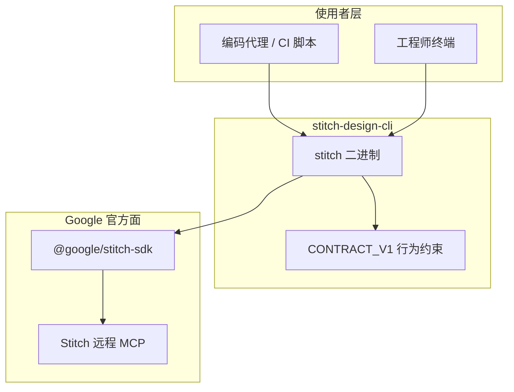

相关源文件

生成本页时使用的主要源文件：

- [README.md](../../../project-repos/stitch-design-cli/README.md)
- [package.json](../../../project-repos/stitch-design-cli/package.json)
- [docs/CONTRACT_V1.md](../../../project-repos/stitch-design-cli/docs/CONTRACT_V1.md)
- [LICENSE](../../../project-repos/stitch-design-cli/LICENSE)
- [SKILL.md](../../../project-repos/stitch-design-cli/SKILL.md)

# 项目概览

**stitch-design-cli** 是一个面向自动化代理（Agent）与运维人员的命令行工具：它在不脱离 Google 官方平台能力边界的前提下，为 **Google Stitch**（官方提供远程 MCP 与 `@google/stitch-sdk`）补齐「可脚本化、可预测 JSON 输出、明确鉴权与 stderr 纪律」的本地命令面。

仓库体量小、职责集中：TypeScript 实现单一 CLI 入口，依赖官方 SDK 调用 `https://stitch.googleapis.com/mcp` 等端点；通过 `docs/CONTRACT_V1.md` 固定机器可读输出契约，便于上层编排器稳定解析。

## 解决什么问题

README 将动机写得很直白：Stitch 官方已暴露 MCP 与 JS SDK，但缺少同时具备「显式 auth 配置」「稳定 JSON 信封」「stderr/stdout 分工」与「常见 project/screen 工作流小命令面」的通用本地 CLI；本包填补该缺口。

Sources: [README.md:1-21](../../../project-repos/stitch-design-cli/README.md#L1-L21), [package.json:1-35](../../../project-repos/stitch-design-cli/package.json#L1-L35)

## 分发形态与约束

- **npm 包名**：`stitch-design-cli`；**可执行名**：`stitch`（见 `package.json` 的 `bin` 字段）。
- **Node 引擎**：`>=22`，与 CI 矩阵一致。
- **v1 边界**：README 写明刻意不覆盖 design-system 与 upload 流程之前的能力范围。

Sources: [package.json:15-19](../../../project-repos/stitch-design-cli/package.json#L15-L19), [package.json:57-60](../../../project-repos/stitch-design-cli/package.json#L57-L60), [README.md:102-108](../../../project-repos/stitch-design-cli/README.md#L102-L108)

## 推荐阅读顺序

1. [系统架构与模块边界](system-architecture.md) — 理解 `src/` 分层。
2. [CLI 命令面](cli-commands.md) — 对照子命令与官方工具映射。
3. [JSON 契约与错误模型](json-output-and-errors.md) — 解析 `--json` 输出与退出码。

## 相关页面

- [系统架构与模块边界](system-architecture.md)
- [CLI 命令面](cli-commands.md)
